# 修复昨天的“明天的计算机系统”——与策展人&施乐阿尔托修复师艾尔·科斯索的对话

> 原文：<https://medium.com/hackernoon/how-the-center-for-software-history-is-restoring-yesterdays-computer-system-of-tomorrow-a-a7058b1086ca>

## *作者:Paula Jabloner*

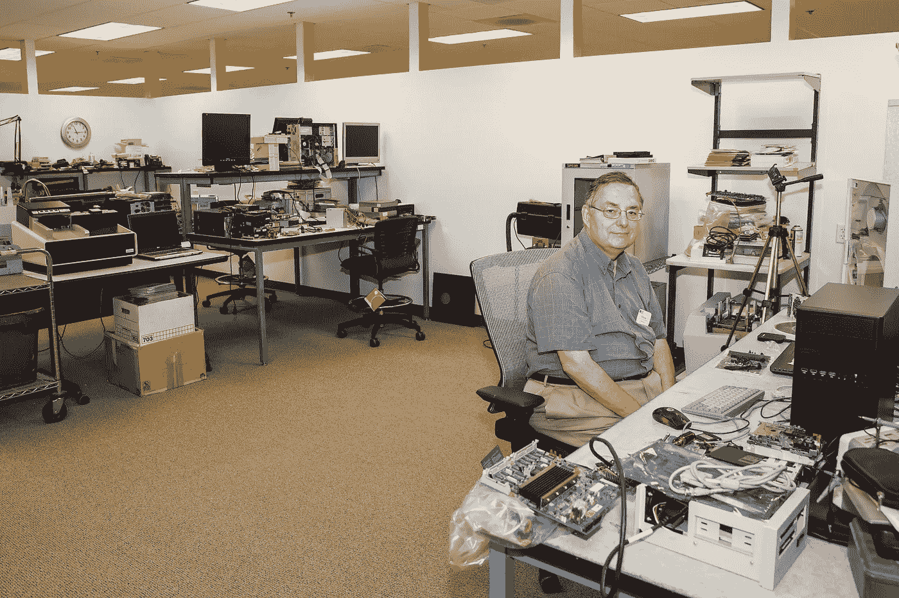

Software Curator Al Kossow in the Shustek Center’s Bernard L. Peuto Software Laboratory.

> “一只老鼠。可移动数据存储。网络。视觉用户界面。易于使用的图形软件。”您看到的就是您得到的”(所见即所得)打印，打印的文档与用户在屏幕上看到的相匹配。电子邮件。Alto 第一次将这些和其他现在人们熟悉的元素结合在一台小型电脑中。”
> 
> ——“革命:计算的第一个 2000 年”，在计算机历史博物馆

过去的计算创新可以为新一代创新者提供新的视角和灵感。位于[计算机历史博物馆](http://www.computerhistory.org/)的[软件历史中心](http://www.computerhistory.org/softwarehistory/)正在修复两台施乐 Alto 计算机，这是该中心 Alto 系统项目的一部分。阿尔托电脑于 1973 年推出，由施乐帕洛阿尔托研究中心(PARC)创建，结合了当时罕见的功能，包括面向页面的显示器、鼠标、网络和用于个人用户数据的可互换磁盘存储包。Alto 是第一台让人们专注于使用电脑作为完成任务的工具的[电脑](https://hackernoon.com/tagged/computer)，而不是专注于学习[电脑的技术细节。今天的电脑和联网设备是阿尔托早期创新的直接产物。更多关于革命性的 Alto 电脑的信息可以在我们的永久性展览中找到:](https://hackernoon.com/tagged/learning) [*革命:计算的第一个 2000 年*](http://www.computerhistory.org/revolution/input-output/14/347) 。

*以下对话发生在 5 月 10 日，软件策展人兼修复人*[*Al kosow*](http://www.computerhistory.org/staff/al-kossow)*和数字收藏总监*[*Paula Jabloner*](http://www.computerhistory.org/staff/paula-jabloner)*之间。对话提供了一个深入了解历史计算机修复的成功、挑战和过程的窗口。在我们 2017 年版* [*核心杂志*](http://s3.computerhistory.org/core/core-2017.pdf) *上了解更多关于 Alto 系统项目的信息。*

Paula Jabloner: 这些中音是什么时候造的？

20 世纪 70 年代末。

**宝拉:**你认为恢复女低音最重要的原因是什么？

艾尔:能够拍摄他们的视频。这些机器有一些独特的特征。就像在仿真中很难复制的屏幕一样。

宝拉:那是屏幕的方向和大小吗？

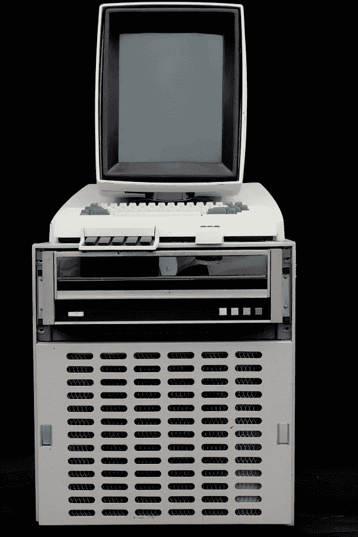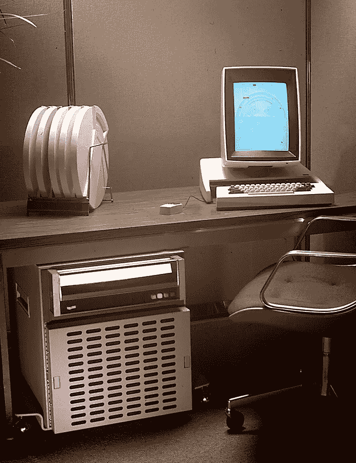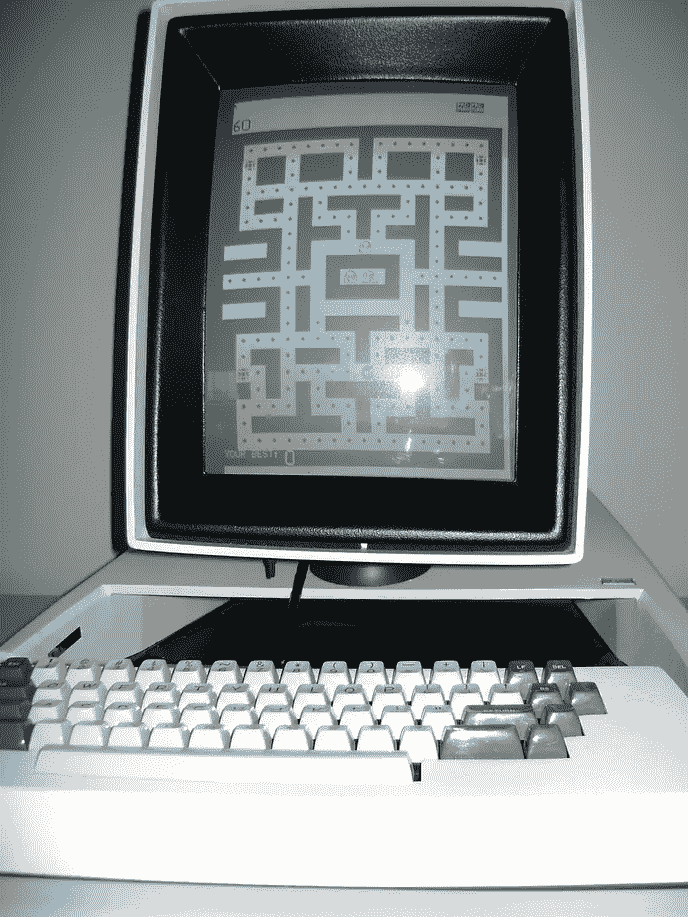

**Left**: Alto I CPU with monitor, mouse, keyboard and 5-key chording keyset, 1973\. **Center**: Marketing photo of an operating Alto workstation, ca. 1975\. **Right**: A restored screen and keyboard showing a Pac-Man program. The screen measures 8 ½ x 11 inches.

艾尔:是的，还有他们用的荧光粉的种类。这是一种长余辉荧光粉。屏幕有一种独特的外观，这并不常见。当前的仿真实际上以机器的真实速度运行。所以你可以感受一下机器在模拟中有多快。

宝拉:但不是他们的观感？

**Al:** 所以你注意到当机器运行的时候你能听到寻道的声音。当它实际运行时，会产生一些独特的噪音。

宝拉:许多创作者仍然健在。这是一个独特的机会，能够采访他们并与他们谈论奥拓的发展吗？

艾尔:是的。有些事情没有太多的文档。比如拉里·特斯勒的吉普赛文档程序。我们有能跑的吉普赛复制品。如果能让拉里演示一下就太好了。还有其他的事情，如果创作者能够展示它并解释他们的思维过程，那将是非常棒的。

> 2013 年，艾尔采访了拉里·特斯勒。阅读 [*抄本*](http://archive.computerhistory.org/resources/access/text/2014/08/102746675-05-01-acc.pdf) *。*

宝拉:我与电脑互动的方式是我的第二天性。但是，这在很大程度上是因为中音创新者在 40 多年前就构思了许多这些直观的功能。

**艾尔:**对。当时，创造者们的想法非常不同。在过去的几周里，我只能在机器上使用以太网。他们在计算机联网方面做的许多有趣的事情真的很有趣。因此，到目前为止，我主要是把它作为一台独立的计算机来使用，但是一旦你有了连接，你就可以用它做所有这些事情，比如电子邮件、聊天等等，这真的很有趣。他们在 70 年代末就有了所有这些东西。

因此，当[史蒂夫]乔布斯得到这个演示时，他评论说，当他得到演示时，他错过或忽略了一件事是网络。我不确定这是不是因为只有一台机器在运行，他没有意识到这些东西是如何连接在一起的，但我认为他可以立即看到这些东西的用途。

他对窗户和鼠标如此着迷，甚至没有机会去思考联网的可能性？

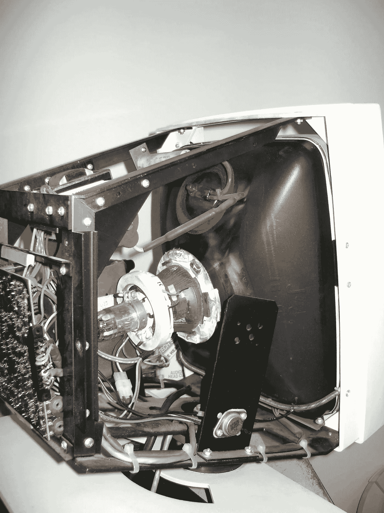

An open CRT case. Al estimates an additional month to clean and read the Museum’s disk pack collection. This doesn’t include cataloging and other activities to make the software accessible to others.

**艾尔:**是的。有趣的是，Lisa 有网络，但从未发货。所以他们有一个叫做 Applenet 的局域网。它唯一的用途是在工厂里做老化测试。但有趣的是，苹果在 DEC、英特尔和施乐发布以太网的同时拥有了网络。

**宝拉:**它有播放音乐或发出声音的能力吗？

一般来说，艾伦·凯的小组连接的是风琴键盘。他们有一个合成程序，是泰德·凯勒写的。大多数机器没有声音。在 80 年代早期就有将电话功能集成到机器中的研究，这发展成了 PARC 的以太电话项目。

Paula: 你花了多长时间恢复这两个中音，包括磁盘包？

艾尔:从三月初开始，我就一直在做这件事，所以这已经是两个月稳定的工作了。机器中的泡沫大量变质。所有的过滤器都损坏了。所以我不得不制作新的过滤器，然后用真空吸尘器清理机器中所有分解的过滤器。然后检查所有的卡，清洁接触和东西，是必要的。最复杂的任务可能是修复监视器。因为磷光体是长余辉的，所以它们易于老化。所以很难找到完好的阴极射线管，因为几乎没有用过的阴极射线管。奥拓 CRT 已经有 15 年没有生产了。所以不能买新的 CRT。所以我最后在博物馆的机器上做的是修复我自己的两台 CRT 显示器，这是我 15 年前买的。然后我把我最好的用过的阴极射线管放在博物馆的展示中，这就是为什么一个比另一个暗，因为有一些烧坏了。

Deflection coils.

**Paula:** 解释有关 CRT 的一些其他问题。先前你提到电线是如何被腐蚀的。

艾尔:当然可以。其中一个问题是显示器存放在潮湿的环境中。因此，水平和垂直偏转线圈是由铜线制成的，在轭上弯曲一个角的地方，它们因暴露在水中而变成绿色。我最后不得不清洁轭的边缘，然后重新绝缘。

**宝拉:**仅仅是清理 CRT 上有腐蚀电线的那部分就花了多长时间？

**艾尔:**大约两天。

有趣的是，仅仅一小片就花了两天时间。

艾尔:是的，然后，显示器开始发热。所以有很多组件，尤其是显示器内部的电容需要更换。仅仅因为它们变成了棕色，改变了价值。所以我最后换了板上的一堆电容。

宝拉:你需要制作电容器吗？

艾尔:不，你还可以买。里面有一个线圈运行非常热，我需要更换它们。我能够从一家公司找到替代品，这家公司从最初生产显示器的鲍尔兄弟研究公司购买了库存。

**宝拉:**所以你主要是从原始公司或在 70 年代最初制造奥拓时购买了原始公司的其他公司那里获得零件？

艾尔:有相当多的零件你可以找到现代的对等物，所以我用了它们。在没有现代对等物的情况下，我要么试图寻找替代品，要么匹配相近的东西。

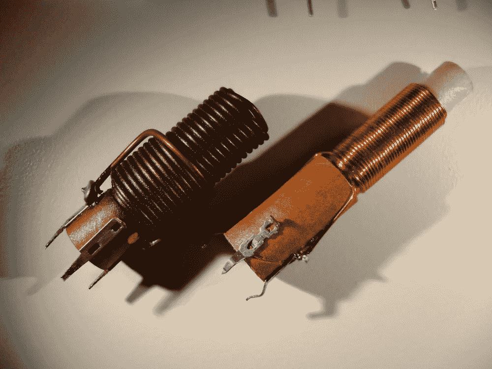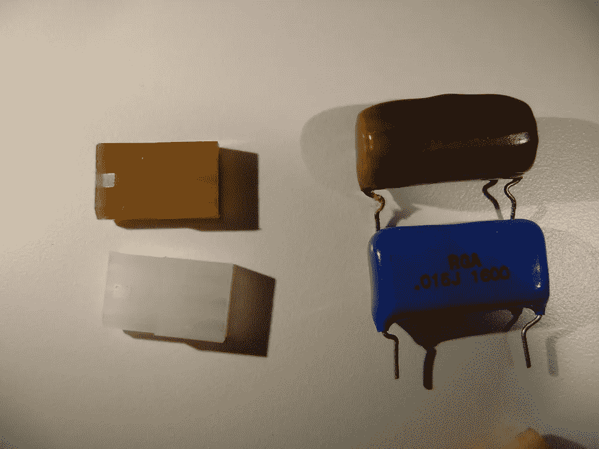

**Left:** Overheated and good inductors. **Right:** Overheated (top) and replacement components (bottom).

宝拉:找到供应商花了时间吗？

艾尔:如果有些东西在网上，很容易找到。大多数零部件公司现在都有某种形式的网络存在。

宝拉:告诉我一些关于清洁屏幕的事情？你在清理它们的边缘。

艾尔:显像管本身没问题。我对人们所说的“屏幕腐烂”没有任何问题，这是指 CRT 前面的安全玻璃的粘合剂看起来像是发霉了，但实际上并不是发霉。这些没有这个问题。

宝拉:布线和电源供应怎么样？我知道它们会随着时间而分解。

艾尔:电源是个问题，所以我必须为它们找到替换的滤波电容器，然后仔细检查里面的所有部件，然后在电脑外面的电子测试负载上烧一会儿。然后，我一次让机器运行几天，以确保机器运行时没有任何组件故障。有一两个星期它们不可靠，随着我更换边缘部件，它们慢慢变好了。

Paula: 找出边缘组件需要多少检测工作？

**艾尔:**这还不算太糟糕，因为你通常可以将它隔离到某个特定的电路板上。由于我们有多台机器在运行，我可以交换主板，看看问题是否会移动。所以我知道如何隔离问题。事实证明，我已经修复这些东西大约 30 年了，但在我能够从 LCM+L[Living Computer:Museum+lab，前身为 Living Computer Museum]获得电路板之前，我无法访问任何以太网连接。原来整个机器中最有问题的部分是磁盘驱动器。所以我遇到过开机却无法启动的问题。结果发现只是磁盘驱动器有问题。

**宝拉:**那就简单多了？

**Al:** 它从等式中排除了磁盘驱动器。我发现，当机器在寒冷的时候无法启动，实际上是磁盘驱动器的问题。如果您通过以太网启动，它将正常启动。这是一个有趣的发现。

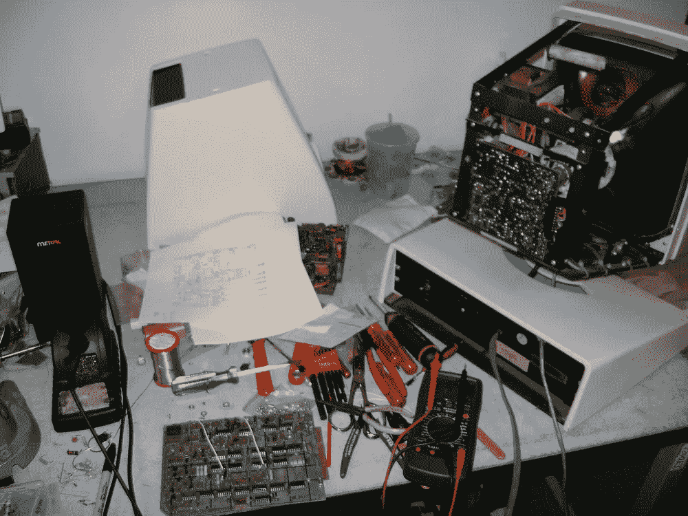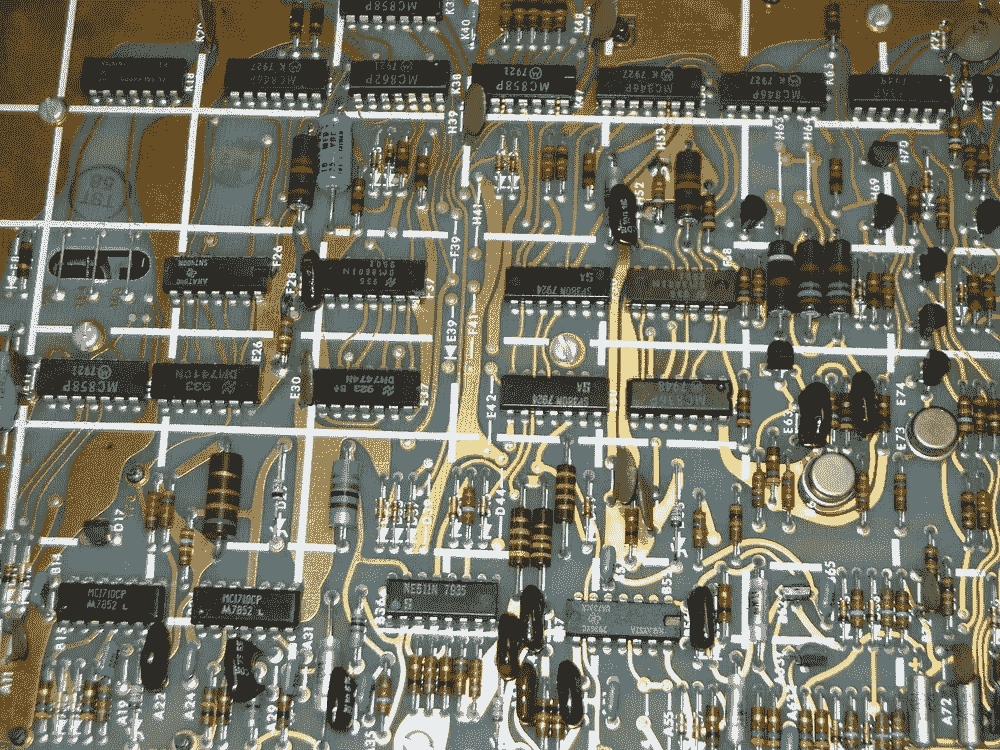

**Left:** Al’s workspace. There’s always something being fixed! **Right:** A sample circuit board.

宝拉:那么目前还有多少人在恢复奥拓呢？

艾尔:考虑到剩下的机器这么少，有不少。我知道英国有人正在试图修复剑桥大学的一台机器。我最近没有收到他们的来信。有一个小组修复了 Y 组合机。现在他们正在研究布鲁斯·达默的机器。然后 Josh Dersch 和 LCM 的人修复了机器，他们这些年做了很多工作。

> *其他修复|* [*女低音*](http://www.livingcomputers.org/Discover/News/ContrAlto-A-Xerox-Alto-Emulator.aspx.) *，生活电脑上的中音模拟器:博物馆+实验室|布鲁斯·达默的* [*数码仓收藏*](http://www.digibarn.com/)*|*[*Y 组合器修复*](http://www.righto.com/2016/06/y-combinators-xerox-alto-restoring.html)

你认为这是社区的努力，而不仅仅是 CHM 的努力吗？

**艾尔:**肯定。有人在做 Y 组合子，我和 Josh 在 LCM 做了很多工作。

宝拉:这是一堂有趣的修复旧电脑的课。那就是如果你做得对，需要很多人。

艾尔:然后是我在过去 30 年里收集的零件数量。Y Combinator 和 Bruce Damer 的机器都缺少电路板，所以我可以给他们提供备用电路板。否则，他们将完全被丢失的电路板所困。

**宝拉:**我知道让软件运行起来有很多问题。这是磁盘驱动器问题还是其他问题？

**艾尔:**LCM 开发的以太网接口板有一个问题，它可以读取以太网数据包，但不能正确发送出去。因此，当我们试图找出原因时，这可能导致了大约三周的延迟。我最终把我的硬件送回了 LCM，然后他们更新了主板上的固件。所以我们在一周半前就开始工作了。所以一旦我开始工作，我就取得了很大的进步。所以我现在正在制作 CHM 机器将要使用的电缆。连接以太网，然后运行另一个服务器，为 CHM 机器提供以太网文件。[我]开始检查博物馆的磁盘包。大约一周前，我一直在使用我的一个磁盘包。现在我已经开始检查我的磁盘包和 CHM 的包，看看哪些是实际可用的。需要对它们进行检查，如果它们有不好的地方，要识别出来。这都是直观的，如果你相对确定磁盘组是干净的，你可以放入一个磁盘驱动器，扫描整个表面，看看是否有任何缺陷检测。但是这些包装中的大多数已经有 30 年或更长的历史了。有些没有储存在非常好的条件下，所以包装上有一些氧化和腐蚀，这是不好的。

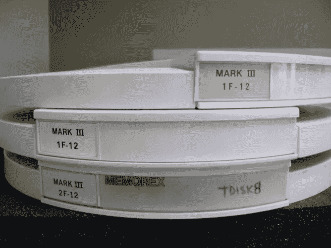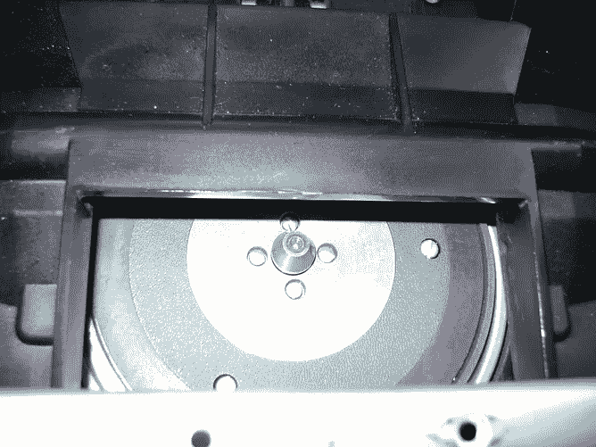

**Left:**Two Alto disk drives. **Center:** Interior shot of the disk. **Right:** Disk packs.

宝拉:我想你对包装上的腐蚀无能为力吧？

**艾尔:**对。诀窍是找到仍然干净的介质。因此，其中一件相当耗时的事情就是仔细检查每个包装，用光纤灯检查，有时还要用眼环。所以每包大约需要半个小时。还有一种方法可以通过以太网传输磁盘组上的数据。因此，如果我遇到任何我还没有归档的包，一旦我检查了它们，我会尝试阅读它们。

宝拉:所以你要通过以太网传输它，并把它存储在现代硬盘上？

**艾尔:**对。这些图像可以与 Josh 的女低音模拟器一起使用。我有一些程序可以制作目录之类的东西。

你是否通过目录保持某种结构？

**Al:**2001 年大量的包被读回。所以我需要仔细检查标签并拍下照片，然后制作一份目录清单，然后将所有内容收集起来，放入博物馆的[数字仓库](http://www.computerhistory.org/atchm/the-digital-repository-at-chm/)。

**宝拉:**这是确保软件得以保存的下一个阶段？

**艾尔:**对

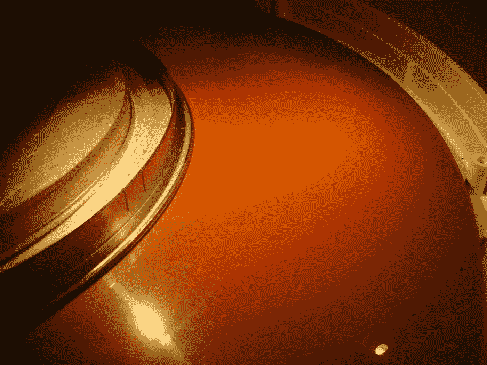

Inspecting the disk.

你认为有什么方法可以让外界容易地接触到它吗？

Al: 很多人可以用 Josh 的女低音模拟器来使用它。所以人们对寻找更多的软件很感兴趣。乔希正在开发一些不能在现代中音上使用的非常旧的软件。在过去的几周里，他一直致力于让 Ted Kaehler 的音乐程序模拟运行。

**Paula:** 所以阅读各种收藏的磁盘包并使之可用可以开启很多探索和研究？

**艾尔:**我主要关心的是确保发布的磁盘包里没有个人信息。

**Paula:** 在你使用磁盘包或其他软件时，有没有什么特别的软件让你感到惊讶？

艾尔:有些东西我已经 30 年没有真正看过，也已经忘记了。因此，回到这一点，然后拥有一台状态良好、屏幕清晰明亮、鼠标和键盘正常工作的机器是很有趣的。然后就像是把我想玩的东西或者我记得看过的东西列了一个清单，但是没有时间或者机器来做这件事。然后是 Josh 所做的所有工作，能够在我的办公桌前工作，回顾所有已经收集但尚未访问或查看的资料。

宝拉:如果不保存所有的电路板、文档和 CRT，你能完成这些修复工作吗？

艾尔:当然没有我跑得快。没有文件，很难进行任何修复，因为它们是相当复杂的机器。拥有仿真器也很有帮助。因为您可以在让实际的硬件工作之前测试软件是否工作。然后是保罗·麦克琼斯所做的所有工作，使从 PARC 中音 CD 中恢复出来的东西成为实际上可用的形式。

> ***阅读****[*施乐奥拓源代码*](http://www.computerhistory.org/atchm/xerox-alto-source-code/) *，【琼斯】* *|* ***下载****[*源代码*](http://www.computerhistory.org/atchm/xerox-alto-source-code/)**

**Paula: 你从整个体验中学到了什么？**

**艾尔:当你开始的时候，它比你想象的要长得多。一旦我开始工作，机器基本上在头几周内就开始运行，然后就是一周又一周地等待零件或完成诸如制作电缆和检查磁盘组等琐事的清单。只是需要很多时间。这是一个相当快的过程，但是你需要做很多小事情。我倾向于选择需要做的事情，花一两个小时去做，然后去做下一件事情。**

**你对其他修复者有什么最终的想法吗？**

**艾尔:主要是关心所有的机电部分。这几乎是旧电子产品的常见问题，东西被腐蚀或连接器断断续续，然后在清洁时小心不要损坏任何东西。然后慢慢地、耐心地、有条不紊地完成工作。我唯一不擅长的就是记笔记。所以我在做这个的时候没有写日志，主要是因为我同时在四台机器上工作。有点像是在为机器的这一部分做这些东西，然后继续做下一部分。然后不得不等待零件或跑到五金店或其他地方去买清洁用品或其他东西。所以所有这些零碎的事情都是同时发生的。**

**宝拉:你还有什么要补充的吗？**

**艾尔:不，我认为那些才是主要的。博物馆的政策是不修复我们只有一件的东西，这是个好主意，因为如果它是旧的和机械的，就很容易损坏。如果你真的不小心，你可以剥离或打破一些东西。如果你只有一个，你就没有另一个可以比较。**

**宝拉:所以，如果你真的只有一个(某样东西)，你想保留它的完整性以供研究而不是修复？这在博物馆环境中非常有意义。**

**艾尔:是的。还是来评价一下这两个东西的状况。大部分是机械的东西，有些东西会磨损，橡胶会变形，或者有时你不知道原来应该是什么样子。所以如果你还有另一个没被碰过的例子，你就有更好的机会复制它。假设某个地方没有物理文档。**

****宝拉:**艾尔，听说你在修复女低音时表现出的奉献精神和耐心，真是令人着迷。我同样欣赏真正非凡的奥拓电脑。谢谢你抽出时间。**

**********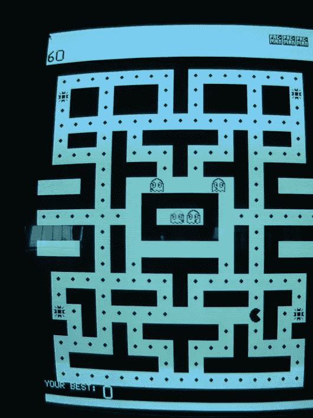**

**Screenshots running on a restored Alto. **Left** to **right:** Kaleidoscope, Puzzle, and Pac-Man.**

**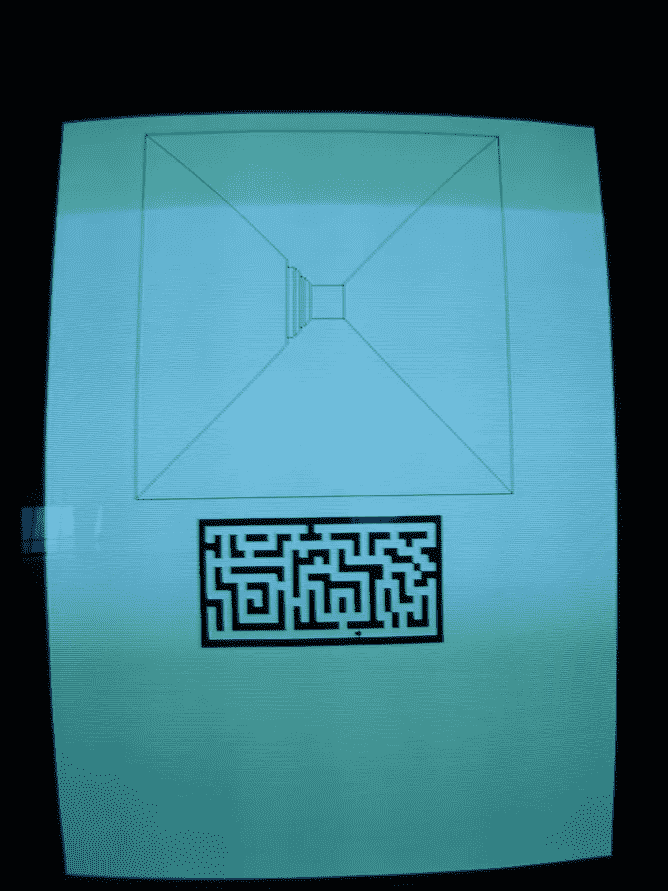********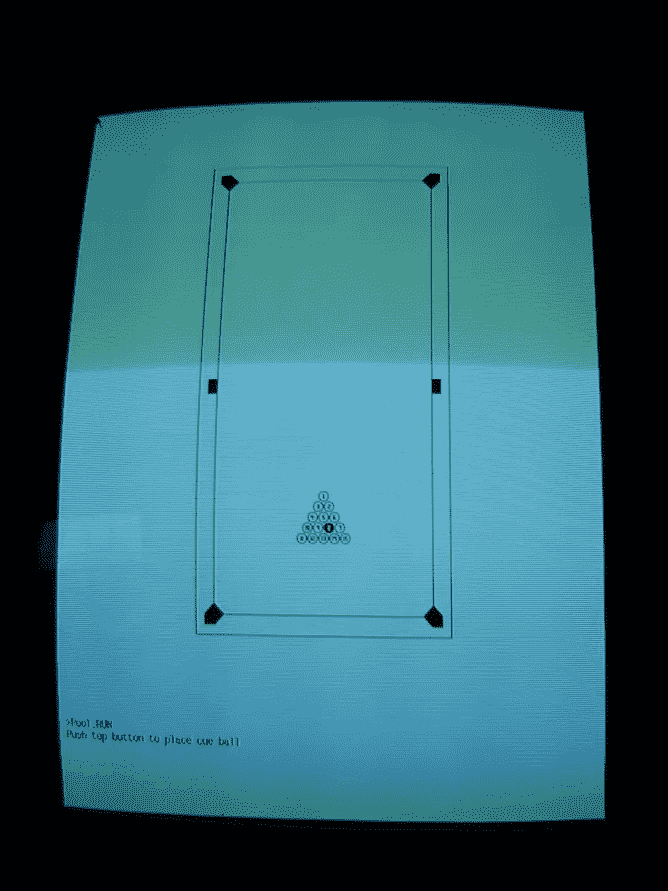**

****Left** to **right:** Maze, Pinball, and Billiards.**

# **相关施乐 PARC 口述历史和收藏**

*   **[阿黛尔·戈德堡口述历史](https://www.youtube.com/watch?v=IGNiH85PLVg)(视频)，采访于 2010 年 5 月 5 日**
*   **阿黛尔·戈德堡文集，1973-2010**
*   **[查尔斯·泰克口述历史](http://archive.computerhistory.org/resources/access/text/2013/05/102658126-05-01-acc.pdf)(文字记录)，采访于 2007 年 8 月 29 日**
*   **[巴特勒·兰普森口述历史](http://archive.computerhistory.org/resources/access/text/2013/05/102658024-05-01-acc.pdf)，采访于 2006 年 8 月 22 日**
*   **[鲍勃·麦卡夫口述历史](https://www.youtube.com/watch?v=zKz07DdaKzw)，第一部分(视频)采访于 2006 年 11 月 29 日**
*   **[鲍勃·麦卡夫口述历史](http://archive.computerhistory.org/resources/access/text/2013/05/102657995-05-01-acc.pdf)，第一部分&第二部分(文字记录)，采访于 2006 年 11 月 29 日和 2007 年 1 月 31 日**
*   **[艾伦·凯口述历史](http://archive.computerhistory.org/resources/access/text/2016/08/102658340-05-01-acc.pdf)(文字记录)，采访于 2008 年 11 月 5 日**

****关于作者****

**作为计算机历史博物馆的数字馆藏主任，[保拉·贾博洛纳](http://www.computerhistory.org/staff/paula-jabloner/)领导创建、实施和维护馆藏范围的数字战略和基础设施。Paula 继续指导博物馆和思科系统公司之间的创新合作关系，并于 2013 年建立了思科公司档案馆。**

***最初发表于*[*【www.computerhistory.org】*](http://www.computerhistory.org/atchm/how-the-center-for-software-history-is-restoring-yesterdays-computer-system-of-tomorrow-a-conversation-with-curator-alto-restorer-al-kossow/)*。***