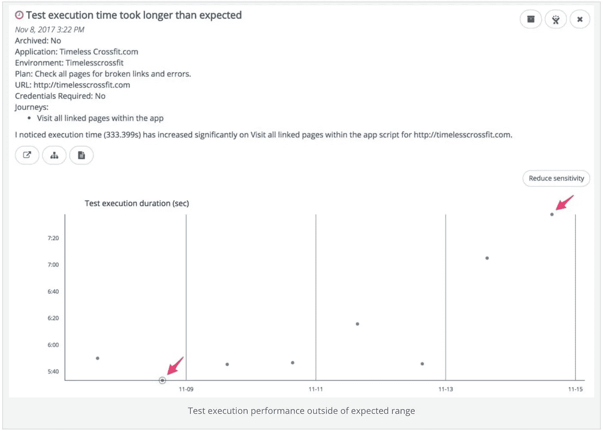

# 如何将脸书设计原则应用于回归测试

> 原文：<https://medium.com/hackernoon/how-to-apply-facebook-design-principles-to-regression-testing-1d5e64dfe2c2>

> 披露: [mabl](https://goo.gl/7ZKSvU) **，**ML 驱动的测试自动化服务，之前赞助过黑客 Noon。

对于开发人员来说，在应用程序中发现回归是最令人沮丧的事情。你正在构建一个新的特性，你有一个 CI/CD 管道，你只是想快速地发布代码。不幸的是，你刚刚发布的新特性破坏了之前的工作。现在是时候去大海捞针找出是什么导致了这个问题，去修复它，并确保这个修复不会破坏你刚刚建立的新功能。回归测试是一个痛苦的过程。

也就是说，[回归测试](https://en.wikipedia.org/wiki/Regression_testing)是一个非常重要的步骤，尤其是在现代开发人员的工作流程中，变更每天都要被推送几次。软件开发中最重要的是客户是否能成功地使用你的产品。我们称之为 [mabl](https://www.mabl.com/) 的端到端客户之旅。回归测试确保开发人员继续发布特性，同时不会对端到端用户的旅程产生负面影响。

这个用户旅程的一部分围绕着性能，因为即使一个特性可以工作，如果它导致性能退化，那就是一个问题。在所有性能会影响用户的公司中，脸书是一个典型的例子。他们有[20 亿月活跃用户(MAU 的)](https://techcrunch.com/2017/06/27/facebook-2-billion-users/)，轻微的性能衰退会产生巨大的影响。2013 年，脸书启动了一个项目，将代码更改与性能回归测试联系起来。他们称这个系统为 CT 扫描系统。

CT 扫描集中在两个部分:

*   模式检测——捕获指标，执行统计分析，并使用机器学习来预测代码更改的性能结果
*   诊断—当出现回归时，收集足够的细节以提供给工程师，帮助理解回归的根本原因

脸书 CT 扫描系统

正如脸书的博客中所描述的，CT-Scan 是专门为检测和帮助修复性能退化而设计的。然而，有几个设计原则，脸书用于 CT 扫描，可适用于一般回归测试。我们将在下面重点介绍其中一些。

# 所有环境中的回归测试

通常情况下，很难设计出足够相似的 QA 或测试环境来检测代码变更中可能出现的所有问题，尤其是当它与性能特征相关时。脸书选择的设计架构之一是在所有阶段运行回归，包括生产阶段。生产回归对他们来说不太理想，因为它需要从用户设备收集数据，但是这一缺点对脸书来说可能不是问题，因为他们不需要收集最终用户数据。我们 mabl 采用这种设计方法的一种方式是能够轻松地在任何和所有环境中重新调整或扩展测试计划，并持续运行这些测试。通过设计具有简单可移植性的测试计划，开发和运营团队可以得出相同的预测，或者回归分析的预期测试结果。例如，开发人员可以在 QA 环境中对页面加载、登录能力或完整的端到端测试运行一系列回归测试，而运营团队可以在生产环境中运行这些相同的测试，这些测试在两种环境中花费的时间应该是相同的。两个团队很容易就完成了相同的测试，并以完全相同的方式衡量结果，就像脸书正在做的那样。最终，这种可移植性确保了您在生产前体验的性能与用户在生产中实际体验的性能相匹配，这实际上是最重要的衡量标准。

# 回归不仅仅是关于特征

脸书开发 CT 扫描最重要的原因是因为回归会影响性能，而不仅仅是功能。例如，以在脸书上张贴图片的客户旅程为例。想象一下，你只需要 15 秒钟就可以上传一张照片，添加评论，并在照片上给朋友添加标签。现在想象在一次代码推送之后，一次回归测试运行并且测试成功。然而，再次查看性能细节显示，同样的旅程花费了 3 倍的时间。作为顾客，我可以说我不会高兴。这就是 CT 扫描如此重要的原因，它不仅关乎功能，还关乎性能。Mabl 通过使用机器学习技术采用了类似的方法。正如脸书所做的那样，我们为每一次不同的旅程本身建立了特定的机器学习模型，用于预测旅程未来试运行的预期范围。如果任何测试运行不在预期范围内，我们会提醒用户，就像脸书提醒开发人员一样。

下面是一个测试运行的例子，它比基于以前运行的预期范围要长得多。

# 回归更容易用数据来诊断

除了使用 CT-Scan 实际检测回归，脸书还收集尽可能多的数据来帮助诊断导致回归的原因，以便开发人员能够解决问题。他们指出的一个例子是，在某次代码更改后，内存可能会增加。将它链接回某个调用堆栈中的某个对象类型，这样工程师就有了诊断和修复内存增加所需的数据，这将非常有用。这种收集和使用几种不同的诊断指标来帮助解决回归问题的方法也是我们对 mabl 采用的方法。一个例子是自动检测和记录 javascript 错误和对我们的回归的可视化更改，并截取它们在测试运行中发生的地方的截图。在大多数开发中，这些类型的诊断通常由人在事后收集并追溯到回归(如果跟踪的话)。然而，在测试中收集这种类型的数据允许系统自动进行关联，并提高解决问题的速度。

# 包扎

回归测试不是我们可以应用机器学习的唯一测试类型。我们可以尝试自动化的还有很多，像脸书、 [mabl](https://www.mabl.com/) 和其他公司都在努力让开发者的生活更轻松。

> 原载于 2017 年 11 月 19 日 www.mabl.com[。](https://www.mabl.com/regression-testing-using-facebook-design-principles/)