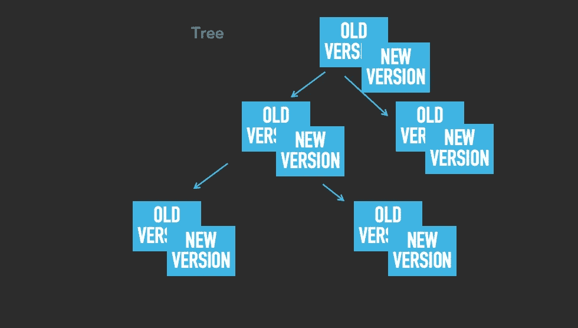
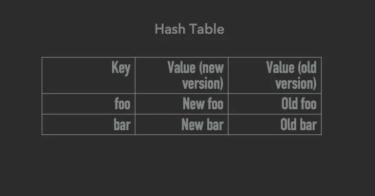

# 如何避免在内存数据库中拍摄快照时出现延迟峰值和内存消耗峰值

> 原文：<https://medium.com/hackernoon/how-to-avoid-latency-spikes-and-memory-consumption-spikes-during-snapshotting-in-an-in-memory-40e82abde51d>

还记得我最近的文章[“什么是内存数据库，它如何高效地持久存储数据”](/@denisanikin/what-an-in-memory-database-is-and-how-it-persists-data-efficiently-f43868cff4c1#.tf47ddtu7)？

在那篇文章中，我总结了内存中的[数据库](https://hackernoon.com/tagged/database)保存数据的机制。我谈到了两种机制:事务日志和快照。我介绍了事务日志记录(虽然只是大体上的)，并稍微涉及了快照。因此，在这篇文章中，我将详细阐述快照。我将从一个简单、快速的&内存数据库快照实现开始，指出其中的一些问题，然后深入研究 [Tarantool](https://en.wikipedia.org/wiki/Tarantool) 中快照的实现。

好的。我们有一个内存数据库。一切都在记忆里。对吗？正如我在之前的[文章](/@denisanikin/what-an-in-memory-database-is-and-how-it-persists-data-efficiently-f43868cff4c1#.tf47ddtu7)中提到的，要对其进行快照，我们只需要将所有内容写入一个文件。这意味着我们需要遍历所有表和所有表的所有行，并通过“write”syscall 将所有内容转储到磁盘的一个文件中。听起来很简单。但是这里的问题是数据库正在被改变。即使我们在进行中锁定数据结构，我们也可能在磁盘上以不一致的状态结束。

如何做到一致？最简单(也是最肮脏)的方法是提前锁定整个数据库，将其转储到一个文件中并解锁。嗯，这个能行。数据库可以被锁定很长时间。例如，如果数据集的大小为 256Gb，那么对于 HDD 磁盘及其每秒 100Mb 的峰值性能，快照将持续 256Gb/100Mb，相当于(大约)2560 秒或(大约)40 分钟。数据库仍将响应查询，但它将被锁定 40 分钟以进行更新操作。伙计，你是认真的吗？(你现在说的)。嗯，比如说，每天 40 分钟的数据库更新停机时间意味着在最好的情况下 97%的正常运行时间(坦白地说，这永远不会发生，因为有许多其他条件会使您的数据库停机)。

有什么想法吗？让我们仔细看看这里发生了什么。我们锁定了整个数据集，只是因为我们必须将它复制到一个较慢的设备上。如果我们牺牲内存来提高速度呢？我的意思是，如果我们将整个数据集复制到内存中的一个单独的位置，然后将其转储到一个慢速磁盘，会怎么样？嗯，这听起来更好，但至少会带来三个问题(大问题和小问题):

1.我们仍然需要锁定整个数据集。假设我们能够以每秒 1Gb 的速度在内存中复制数据集(这听起来仍然很乐观，因为在实践中，对于更多不太复杂的内存数据结构，该速度可能是每秒 200-500 MB)。256Gb/1Gb == 256 ==(大致)4 分钟。每天 4 分钟的更新停机时间或 99.7%的正常运行时间，这肯定比 97%好，但仍然不够好。

2.在我们将整个数据集复制到 RAM 中的一个单独的缓冲区之后，我们需要将它转储到磁盘。当我们转储它时，数据库的原始副本正在发生变化。我们需要以某种方式处理它，例如将事务 id 与快照一起保存，以跟踪快照中最后考虑的事务。其实没什么大不了的，但还是要做。

3.我们加倍赌拉姆赢。我的意思是，我们确实需要两倍于数据集所需的内存。不只是在拍摄快照期间，而是永远，因为你不能只在拍摄快照期间给机器增加内存，然后再收回。

修复这个问题的方法之一是使用由 [fork](https://en.wikipedia.org/wiki/Fork_%28system_call%29) 提供的 use system [copy-on-write 机制](https://en.wikipedia.org/wiki/Copy-on-write)。当您进行 fork 时，会创建一个单独的进程，它有自己的虚拟地址空间，其中有整个数据集的只读副本。只读，因为所有更改都发生在父进程中。因此，我们分叉一个进程，然后花时间将数据集转储到磁盘。这里唯一的问题是——它和之前的算法有什么不同？答案在于 Linux 的[牛](https://en.wikipedia.org/wiki/Copy-on-write)机制。COW 是“写入时复制”的首字母缩写。那是什么意思？这意味着子进程最初与其父进程共享所有的[内存页面](https://en.wikipedia.org/wiki/Page_%28computer_memory%29)。然后，只要父母或孩子改变了内存中的某些内容，就会创建一个页面的副本。

当然，这种复制会导致一些响应延迟，因为我们需要复制页面甚至更多。一页的大小通常是 4Kb。例如，如果您更改了数据库中的一个小值，那么将首先引发一个[页面错误异常](https://en.wikipedia.org/wiki/Page_fault)(因为 fork 之后父页面和子页面的所有页面都被标记为只读)，然后系统将切换到内核模式，然后分配一个新页面，将 4Kb 从旧页面复制到新页面，并返回到用户模式。这仍然是对正在发生的事情的一个非常简单的描述。更多详情，从这里开始:【https://en.wikipedia.org/wiki/Kernel_same-page_merging[。如果这种变化涉及许多页面(对于像树这样的大数据结构来说，这是非常可能的)，那么同样的事情会发生很多次。因此，由于 COW 机制，您真的可以降低数据库的速度。对于繁重的工作负载，这种延迟可能会导致严重的延迟高峰，甚至是短暂的停机时间。此外，对于繁重的工作负载，父进程中会有大量随机的页面更新，这可能会复制几乎整个数据库，从而导致 RAM 加倍。因此，如果幸运的话，不会出现延迟峰值，也不会停机。如果不是，那么延迟峰值是肯定的，停机是肯定的，对了，RAM 加倍。](https://en.wikipedia.org/wiki/Kernel_same-page_merging)

fork 的另一个问题是它复制了页面描述符的[表。如果您使用 256Gb 的内存，那么这个表的大小可能是数百兆字节，您的进程可能会冻结一秒左右，这必然会导致延迟高峰。](https://en.wikipedia.org/wiki/Global_Descriptor_Table)

Fork 不是理想的解决方案。对吗？但这是目前为止我们能想到的最好的了。实际上，一些流行的内存数据库仍然在使用 fork 进行快照。比如 [Redis](http://redis.io/topics/persistence) 。

如何制定更好的解决方案？让我们仔细看看奶牛机制。它“牛”了 4Kb。所以，你只改变了一个字节，但仍然“牛”了整个页面(事实上，当涉及到树时，很多页面，即使你不需要重新平衡)。如果我们只实现我们自己的 COW，只写复制实际上被改变的内存片段，会怎么样？更具体地说，只有被改变的**值**。当然，我们不会把它作为系统机制的替代品，而只是为了我们的拍摄需要。

这里的主要思想是用存储每个数据项的许多版本的能力来扩充我们所有的数据结构(树、散列、表空间)。也就是说非常接近[多版本并发控制(MVCC)](https://en.wikipedia.org/wiki/Multiversion_concurrency_control) 。不同之处在于，它在这里不是用于一般的并发控制，而是仅用于快照。当快照开始时，现在和以后的所有更改操作都会创建数据项的较新版本，而所有较旧版本仍然有效，并在快照中使用。看看这些照片。这个逻辑适用于树、散列和表空间:

你看到数据项可以有旧版本和新版本。例如，在最后一张图中，您可以看到表空间的值 3、4、5 和 8 有旧版本和新版本，而值 1、2、6、7、9 只有单一版本。

只有较新的版本被更改。旧的用于拍摄快照期间的读取操作。这种类似 MVCC 的奶牛和系统奶牛之间的主要区别在于，我们“奶牛”的不是整个 4Kb 页面，而是实际上正在变化的一小部分数据。比方说，如果您更新一个 4 字节的整数，那么这将创建这个 4 字节整数的新版本，并且只有这 4 个字节将被复制(加上一些字节作为版本控制的开销)。相比之下，在系统写入时复制期间复制了 4096 个字节，加上页面错误和上下文切换(每次上下文切换实际上需要复制 1Kb 左右的内存)，再加上重复几次所有这些操作。很多工作？仅在快照期间更改 4 字节整数。

从 1.6.6 版本开始，我们在 [Tarantool](https://hackernoon.com/tagged/tarantool) 中采用了这种手动 COW 技术进行快照(在此之前我们使用 fork)。

邮件中会有更多的文章，更多的细节和图表。Ru 集团的生产服务器。敬请关注。

> [黑客中午](http://bit.ly/Hackernoon)是黑客如何开始他们的下午。我们是 [@AMI](http://bit.ly/atAMIatAMI) 家庭的一员。我们现在[接受投稿](http://bit.ly/hackernoonsubmission)并乐意[讨论广告&赞助](mailto:partners@amipublications.com)机会。
> 
> 如果你喜欢这个故事，我们推荐你阅读我们的[最新科技故事](http://bit.ly/hackernoonlatestt)和[趋势科技故事](https://hackernoon.com/trending)。直到下一次，不要把世界的现实想当然！

