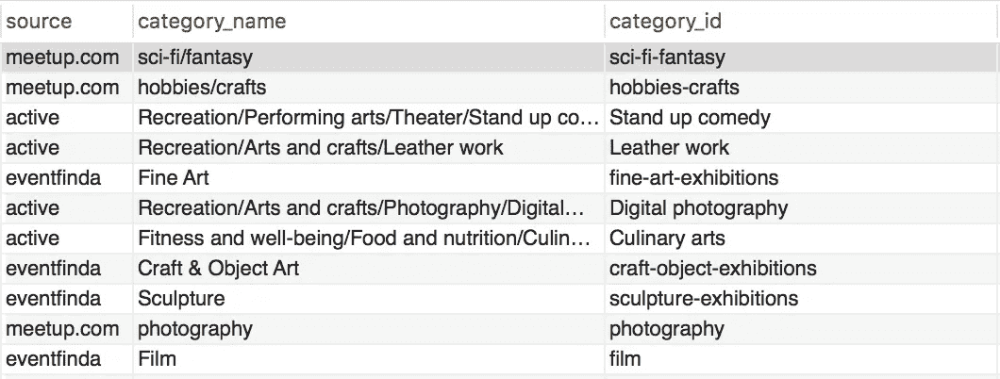
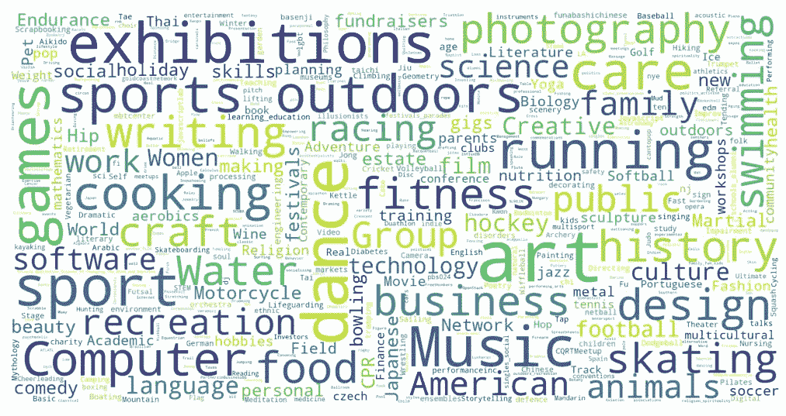
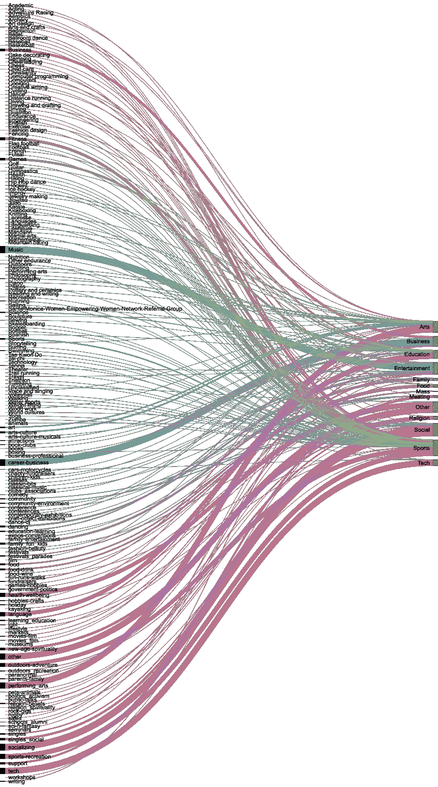
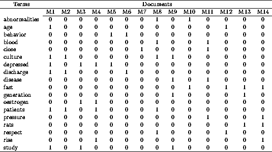

# 如何用机器学习更好地对 Coachella 进行分类(下)

> 原文：<https://medium.com/hackernoon/how-to-better-classify-coachella-with-machine-learning-part-2-27912be5b12>


Bassnectar Live at Coachella source: [https://upload.wikimedia.org/wikipedia/commons/c/ca/Bassnectar_Live_at_Coachella_Wknd_2.jpg](https://upload.wikimedia.org/wikipedia/commons/c/ca/Bassnectar_Live_at_Coachella_Wknd_2.jpg)

经常有人问我如何开始机器学习。但我认为自己是一个创造者。我真的相信经验是关键，解决真实世界的应用是解开谜团的关键。一旦你第一次成功地构建并理解了解决问题的解决方案，你就可以更深入地挖掘并提炼构建模块。

我们面临的问题(参见[第 1 部分](https://hackernoon.com/how-to-better-classify-coachella-with-machine-learning-part-1-dc84c53d1a9c))是，我们有大量的数据供应商为我们提供事件信息。所有这些供应商对他们的事件数据使用不同的分类和分类系统。数据质量不是很好，在某些情况下，来自同一供应商的同一事件甚至有不同的分类。我相信世界上许多公司都以这样或那样的方式经历过同样的问题。问题是，我们如何维护高质量的数据集，以确保我们的应用程序用户获得良好的体验？



在没有雇佣的情况下，手动和每日改进新类别的映射表是不可行的。由于我们仍然是一个小团队，无法手动维护全局映射表，因此我们选择应用数据科学、统计学和通常称为机器学习的算法的组合，以全局、可靠、快速和自动地为我们解决问题。

在这篇文章中，我们将涵盖以下步骤，引导我们通过我们的旅程。

1.  了解您的数据
2.  什么是向量空间模型(VSM)？
3.  为 TFIDF 矢量器准备数据
4.  使用 TFDIF 矢量器
5.  应用多项式朴素贝叶斯
6.  存储模型供生产使用

## 了解您的数据

我们的数据存储在一个公共的 MySQL 数据库中。可能会很无聊，但 MySQL 是一项经过验证的技术，伸缩性很好。数据库中的表被填充一次！在应用程序中，用户请求给定城市的数据。如果我们在缓存的表中找不到数据集，或者数据集过期，我们会重新向数据供应商查询更新。我们获取的数据通常只包括接下来的 48 小时，以尽量减少搜索量，从而减少请求时间。

由于有许多数据供应商，我们从这些供应商那里获得了各种各样的数据格式。对于此分析，我们将重点关注从数据供应商处收到的事件描述和分类，以及我们如何从中获得意义。我们将使用 Python MySQL 连接器从 MySQL 服务器中提取数据。

首先，我们必须连接到数据库并设置一个游标。

```
import MySQLdb
import MySQLdb as Database
import MySQLdb.cursorsdb = MySQLdb.connect(host=”localhost”, port=3306, user=”***”, passwd=”*****”, db=”****”)try:
cursor = db.cursor(**MySQLdb.cursors.DictCursor**)
```

将游标定义为 DictCursor 会返回一个字典。这很重要，因为我们不会使用元组来准备数据。

此外，我们将使用日语、中文、德语、法语、西班牙语、英语和其他几种语言的 UTF 8 编码字符串。这就是为什么我们需要确保连接和字符集与数据相匹配。

```
cursor.execute(‘SET NAMES utf8;’)
cursor.execute(“SET CHARACTER SET utf8;”)
cursor.execute(“SET character_set_connection=utf8;”)
```

你不希望算法破坏不规则编码的
信息。这两个问题看起来都不重要，但是当你遇到它们时，会抛出严重的错误信息，可能会占用你几个小时的开发时间。

接下来，你需要定义你的样本量应该有多大，这有助于你在开始在整个数据集上运行你的算法之前测试细节，这可能会花费你几个小时的时间。

```
**sampleSize = 10000000**cursor.execute(“””SELECT distinct id, title,description,    category_id, category_name FROM databasename.tblname
 limit %s “”” , **(sampleSize,)**)result =cursor.fetchall()except MySQLdb.Error, e:
 print “MySQL Error: %s” % str(e)
 db.rollback()
```

这里，样本大小后面的小逗号很容易被忽略。你可能会问为什么是元组？[因为 DB API 需要它](http://mysql-python.sourceforge.net/MySQLdb.html)。这就是原因。此外，在使用 MySQL 游标时，应该始终使用 try/except 块，以确保以正确的方式处理 MySQL 错误。

现在，我们可以从数据库接收数据，我们可以更详细地查看我们从供应商那里获得的分类数据，我们很快就会注意到单词和类别的美丽混乱。在我们的样本中，我们观察到大约 500 个不同的事件类别。自降！在这个星球上，每天都有成千上万的人在使用，我们现在如何确保所有人都能获得一致且易于使用的事件映射？



word cloud from all global events in the sample (500K+ events)

因此，我们需要将 500 个事件类别映射到预定义数量的类别。我们选择了 12 个类别，因为根据我们在信息密度方面的数据研究，12 是在移动应用程序中呈现的最佳类别数量。

因此，对于应用程序和最初的专家绘图，我们定义了 12 个有意义的类别和一个“其他”类别，这是为了捕捉后备。在数据上，类似于会计准则的‘其他’从来都不是一件好事，因为它没有真正的意义。我们仍然可以观察到大量人口以“其他”告终。不是什么好事。



为了创建预测模型，我们将从分析中排除这个“其他”部分。最终，我们不希望“其他”部分存在。所以预测模型应该能够将其绑定到真实片段中。此外，我们将排除描述少于 15 个字符的所有事件，以确保算法有足够的单词可供选择。

既然我们现在有了一个有用的样本，我们如何从文本中得到预测模型呢？

机器学习模型和我们的分类问题之间的缺失环节是数据不是数字的。所以统计方法对它们不起作用。因此，我们要解决的下一个问题是，如何将我们的文本转换成有意义并且能够区分的数字？向量空间模型是这个问题的解决方案。

## 什么是向量空间模型(VSM)？

VSM 是一种将文本信息表示为向量的代数模型。一个简单的解释可能是这样。假设您有一个给定的分类字典(“艺术”、“娱乐”、“体育”、“技术”)，那么您可以将这 4 个事件编码为向量:

```
Arts          = (0,0,0,1)
Entertainment = (0,0,1,0)
Sports        = (0,1,0,0)
Technology    = (1,0,0,0)
```

然而，向量的这种分配对分类问题没有太大帮助，因为这些向量都不代表术语的重要性。此外，去除已经存在的分类也没有帮助，因为我们不能从这些短词中提取足够的区别。这就是事件描述的来源。数据集中的每个事件都有一个描述性元素，最长可达 2048 个字符。从这个文档语料库中我们得到句子。这些句子可以转换成我们需要的向量。

我们从样本中得到的一个随机例子可能是这样的:

> 她的首张专辑《奔跑》在科切拉的美国现场演出中首次亮相，在美国电子公告牌排行榜上首次亮相，在纽约、迈阿密和芝加哥与 EDC·拉斯韦加斯、罗拉帕洛扎一起进行美国巡演，以及即将到来的巨大的售罄澳大利亚仓库巡演，2015 年是艾莉森仙境值得纪念的一年。从你听她讲述的方式来看，艾莉森·仙境在她知道如何演奏乐器之前就想给她的第一张专辑命名为 Run。

我们使用的是已经引入的词频—逆文档词频(TF-IDF)方法。

如[第 1 部分](https://hackernoon.com/how-to-better-classify-coachella-with-machine-learning-part-1-dc84c53d1a9c)所述，TF-IDF 是一种众所周知的评估文档语料库中单词相对重要性的方法。

在 Python 中，一个很棒的 TF-IDF 矢量器很方便地作为 sklearn 包的一部分。因此，对于我们的 Python 实现，我们首先导入相关的包，加上 TF-IFD 矢量器。除了 sklearn 包之外，我们还将导入 *cPickle* ，这将帮助我们将完成的模型存储回 db (LongBlob)中，并导入 *model_selection* ，以将我们的原始数据集分成训练数据集和测试数据集。NumPy 是 Python 中科学计算的基础包。

```
import sklearn
import cPickle
import numpy as np
from sklearn import model_selectionfrom sklearn.feature_extraction.text import TfidfVectorizer
```

## 为 TF-IDF 矢量器准备数据

在开始使用 TF-IDF 矢量器之前，我们需要准备数据，以便算法能够正确运行。TF-IDF 期望获得一个列表作为输入。因为我们在监督学习的领域中，所以我们需要为算法提供 X(具有特征的数据集)和 Y(具有标签的数据集)。每个列表必须是从数据库的样本数据集中找到的观测值的精确长度。

因此，在我们将整个样本放入字典结果集之后，第一件事就是初始化 X 和 Y 列表变量。此外，我们用计数器变量“I”跟踪光标状态。

```
result =cursor.fetchall()
i=0
X = [None] * cursor.rowcount
Y = [None] * cursor.rowcount
```

一旦完成，我们只需在结果集上循环，并从列表中的变量传递数据。这里需要注意一些事情。我们花了一些努力才把正确的描述性数据组合在一起。最后我们保留了“描述”,因为它有相关的术语“科契拉”或“EDM”。其次，我们通过了最高粒度级别的供应商分类。

```
**for row in result:**
 X[i]=row[‘**description**’] +” “ +row[‘**category_name**’].replace(“/”, “ “)
 Y[i]=row[‘**cat**’]
 i=i+1
```

如果你从上面的例子中抽取‘娱乐/艺术和手工艺/皮革作品’。这一步从列表中创建三个不同的项目“娱乐”、“艺术和手工艺”和“皮革制品”。“cat”列包含我们之前确认的正确工作的映射。

在下一步中，我们将特征集随机分为训练和验证(测试)样本。

```
test_size = 0.5
seed = 7
X_train, X_test, Y_train, Y_test = model_selection.train_test_split(X, Y, test_size=test_size, random_state=seed)
```

Test_size 应该是一个介于 0.0 和 1.0 之间的数字，表示要包含在测试拆分中的数据集的比例。种子变量用于从数据集中随机取样。在第一个镜头中，我们将 test_size 设置为 0.5，这样我们可以均匀地分割数据集。train_test_split 函数返回 4 个数据集 X_train(训练特征数据)、X_test(测试特征数据)、Y_train(训练标签)和 Y_test(测试标签)

## 使用 TF-DIF 矢量器

现在我们已经准备好数据集来训练我们的第一个模型。首先，我们创建一个 TF-IDF 矢量器对象。这个对象的总体任务是将我们的事件描述列表转换成 TF-IDF 特性矩阵。我们没有传递编码，因为默认的编码是“UTF-8”，幸运的是，我们已经准备好了上述数据的编码。strip_accents 从事件描述中删除所有重音，因此“Montréal”变成了“Montreal”。

```
vectorizer = TfidfVectorizer(strip_accents=’unicode’)X_vectors = vectorizer.fit_transform(X_train)
```

这里的第二行使用定义的 TF-IDF 矢量器，并对训练特征数据集进行 fit_transforms。即，该算法学习词汇表和 idf，然后返回术语-文档矩阵。术语文档矩阵描述了样本中的哪个文档中存在哪些单词，并且具有计算的 IF-IDF 分数作为值。



source : [http://web.eecs.utk.edu/~mberry/sc95/gif/berry_table402.gif](http://web.eecs.utk.edu/~mberry/sc95/gif/berry_table402.gif)

现在我们项目的主要部分已经完成。我们已经成功地从文本数据中创建了数字表达式。下一步，我们必须使用这些文本的数字表达式来建立我们的预测模型。在这个例子中，我们将使用多项式朴素贝叶斯(MNB)分类器。

MNB 是一个简单的概率分类器，它应用了贝叶斯定理。贝叶斯定理帮助我们预测导致给定分类的单词序列。使用 Bayes 的好处是这种方法假设特征之间有很强的独立性。

```
**classifier** = **MultinomialNB**().fit(X_vectors, Y_train)
train_score = classifier.score(X_vectors, Y_train)print “Scored an accuracy of %s “ % (train_score)
> Scored an accuracy of 0.93206467363
```

训练函数使用先前创建的向量加上相关标签来创建分类。一旦这样做了，我们可以得分的结果。评分函数返回给定测试数据和标签的平均准确度。

在我们的例子中，准确率达到 93.2%，这比我们所希望的要好。

```
pickledModel = cPickle.dumps(classifier)
filename = ‘finalized_model.sav’
cPickle.dump(classifier, open(filename, ‘wb’))
```

因为我们对结果感到满意，所以我们可以存储模型以备后用。

谢谢你一路读到这里。在第 3 部分(即将推出)中，我们将展示如何将它应用到现实世界的生产中。


*本文由* [*tenqyu*](http://tenqyu.com) *为您带来，这是一家利用大数据、机器学习和大量创意让城市生活变得更加有趣、健康、包容和繁荣的初创公司。*

[](http://bit.ly/HackernoonFB)[](https://goo.gl/k7XYbx)[](https://goo.gl/4ofytp)

> [黑客中午](http://bit.ly/Hackernoon)是黑客如何开始他们的下午。我们是 [@AMI](http://bit.ly/atAMIatAMI) 家庭的一员。我们现在[接受投稿](http://bit.ly/hackernoonsubmission)并乐意[讨论广告&赞助](mailto:partners@amipublications.com)机会。
> 
> 如果你喜欢这个故事，我们推荐你阅读我们的[最新科技故事](http://bit.ly/hackernoonlatestt)和[趋势科技故事](https://hackernoon.com/trending)。直到下一次，不要把世界的现实想当然！

