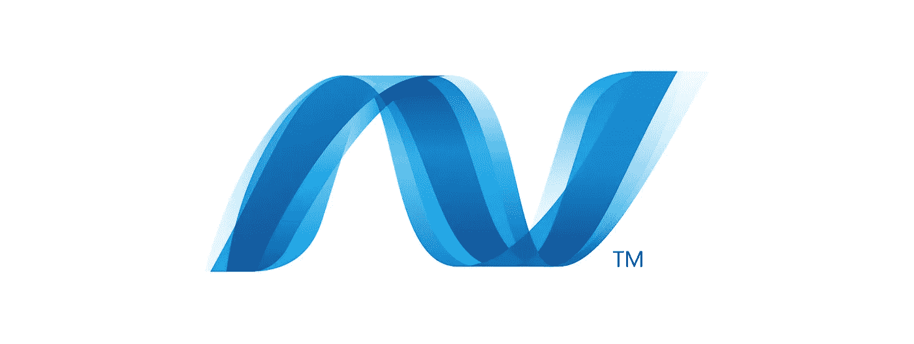

# 如何构建和部署。净项目

> 原文：<https://medium.com/hackernoon/how-to-build-and-deploy-net-projects-2523e8dd2e88>

**本文将向您解释将持续部署方法引入您的。NET projects 和 Buddy 一起帮助您自动化** [**构建**](https://hackernoon.com/tagged/build) **和交付活动。**

# 本指南的目标

借助本指南，您将能够:

*   熟悉好友的工作流程。
*   建立一个新的[好友](https://hackernoon.com/tagged/buddy)项目。
*   为项目设置 Git 版本控制。
*   理解管道的概念。
*   建立一个管道，在每次推送到存储库时:
*   构建并测试 C#应用程序。
*   将应用程序部署到服务器。

# 你为什么要读这篇文章？

首先:这需要五分钟，指南是免费的，我们有机会为您当前的 CI/CD 工作流做出贡献，我们喜欢分享经验。

其次:如果你不熟悉 CI/CD，我们强烈建议你仔细看看这个概念。你肯定知道敏捷方法，它的目标是将开发周期时间缩短到最小。原因是显而易见的:软件越快进入开发过程的下一个阶段，您就越快得到反馈，并能够开发和交付改进和增强的版本。

听起来很酷，但如果你想尝试 CI/CD，你必须自动化你的工作，这就是本指南的内容——它显示了如何放弃每个人都讨厌的无聊、耗时、产生错误的手动任务，并允许 Buddy 为你完成它们。

# 喜欢你读的吗？[此处跟随全文](https://buddy.works/guides/how-build-dotnet-projects?utm_source=medium&utm_medium=post&utm_campaign=how-to-build-and-deploy-net-projects&utm_content=link)。

> [黑客中午](http://bit.ly/Hackernoon)是黑客如何开始他们的下午。我们是 AMI 家庭的一员。我们现在[接受投稿](http://bit.ly/hackernoonsubmission)并乐意[讨论广告&赞助](mailto:partners@amipublications.com)机会。
> 
> 如果你喜欢这个故事，我们推荐你阅读我们的[最新科技故事](http://bit.ly/hackernoonlatestt)和[趋势科技故事](https://hackernoon.com/trending)。直到下一次，不要把世界的现实想当然！

