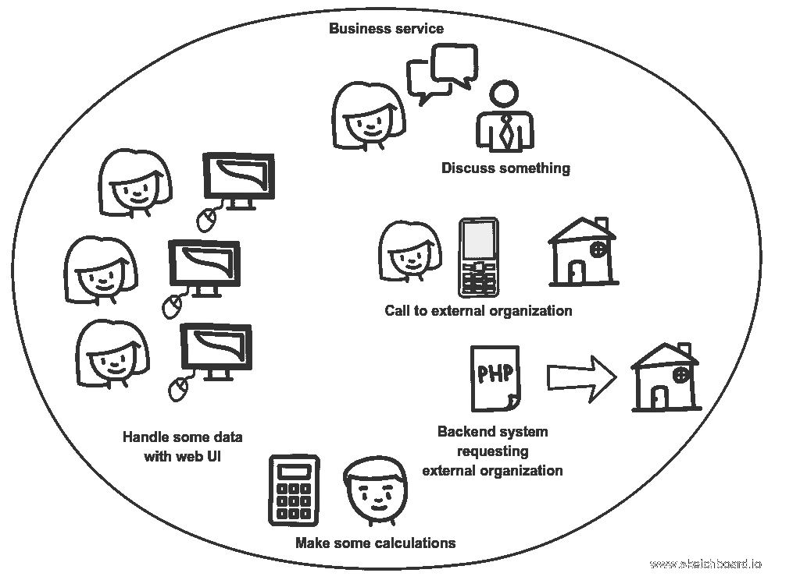

# 如何定义服务边界

> 原文：<https://medium.com/hackernoon/how-to-define-service-boundaries-251c4fc0f205>

这是我写的关于我希望我的服务具备的特征的最后一篇文章。现在，我将讨论指定服务边界的具体方法。

如今，网站、互联网应用和企业软件之间的区别变得模糊不清。基于 web 的应用程序的复杂性越来越高，而企业则上线，与外部服务集成。用“站点”和“管理面板”的方法来划分 web 应用程序的时代已经一去不复返了。我们都需要一种新的方法来识别服务边界。这对于业务与 IT 的结合是至关重要的，因此对于整个业务的繁荣也是如此。

## 业务能力

业务能力是组织为保持其运行，保持其能够运作而做的事情。这是对整个企业功能的特殊贡献。它是组织为实现其目标而拥有的特定功能或能力。采购经理获得货物，仓库保管货物，卖方出售货物，金融家计算利润。因此，对于从事相同业务的不同公司来说，业务能力几乎是相同的。它们的实现是不同的。有人有更高效的实现，有人有效率较低的实现。有人会兴旺，有人会退出。因此，不同之处在于业务流程、员工、自动化水平和所涉及的技术。但是特定业务能力提供的价值和它的责任是相同的。业务能力不关心其他能力是如何实现的。它们可以是手动的，可以是外包的，可以是通过 UI 操作的内部开发产品的部分自动化，或者可以是完全自动化的，其中软件负责每一个决策。它只是某个业务功能的实现细节，而它的契约不会改变，所以它与之交互的其他功能不会知道该功能的实现是否会改变。因此，本章开头的业务实现示例可能会以另一种方式出现。比如这样:采购经理取得货物，存放在*租用的*仓库，由*自动售货机*或*自动收银机*出售，财务部分有专门的*软件*。

## 商业服务

***什么是业务服务***
业务服务是业务能力实现所在的逻辑边界。那里面有什么？有[业务政策](http://www.brsolutions.com/business-policies-vs-business-rules-whats-the-big-difference-anyway/)、业务规则、业务流程、参与其中并做出具体决策的人员，以及这些人员使用的应用程序。所有这些都是业务服务的实现细节。

考虑一家处理卡支付的公司。它有一个负责欺诈风险评估的业务服务。假设这种评估是手工进行的。当该服务被请求进行欺诈风险评估时，该服务的工作人员选择它，启动风险评估流程，并在完成后以某种方式回复。在某个时候，公司决定自动化整个业务服务，包括所有的流程等。因此，它开发了自己做所有事情的软件:它通过特定的端点接收入站请求，进行所有的评估，并用异步回调进行回复。但是仍然有可能出现软件错误，这在如此敏感的业务中是不可接受的。因此，该公司决定保留人工评估的可能性:例如，软件不能绝对确定地处理请求——在这种情况下，就需要人工干预。所以具体的询问是由工作人员完成的。
这个故事的要点是，业务服务内部发生的所有事情都是它的实现细节，其他服务都不知道。

我们中的一些人是更生动的视觉思考者，一些人不是，一些人是语言思考者。但是视觉思维[被证明](http://news.harvard.edu/gazette/story/2017/05/visual-images-often-intrude-on-verbal-thinking-study-says/)甚至对后者也有重大影响。当我想到商业服务时，我脑海中会有这样一幅画面:

Inside the business service

***业务-服务和业务-能力***
任何组织都有一套业务-能力，不管它是否意识到它们。如果一个组织做了某件事，如果它创造了价值，那么它肯定具有业务能力。如果一个组织从来没有考虑过它们——没关系，不需要识别业务能力。他们就是这样。如果你想使一个组织自动化或进行一些重构，你肯定应该定义它的能力，实现它的实现，它们如何相互通信，它们的操作发生了什么业务过程。该活动产生了一组更高级别的业务服务。因此，业务能力是来自问题空间的概念，而业务服务来自解决方案空间。业务服务是根据相应的业务能力定义的。而且，它们之间应该总是有[双射](https://en.wikipedia.org/wiki/Bijection)关系。

***作为接口的业务-服务边界***
我认为比较业务-服务边界和接口非常具有描述性。这种比较甚至比乍看上去更接近现实。服务边界是由服务提供的功能的声明性描述定义的:它不告诉*它将如何做它的工作，但是它告诉*他能做什么。比如说，软件开发部门可以开发一些特性，但是他们不会告诉你他们要写什么类，他们要用什么库或者什么语言。没关系。但重要的是他们写的软件工作正常。QA 部门测试功能，但是对于 QA 之外的任何人来说，他们具体是如何做的并不重要:手动点击、自动测试或其他任何事情。但这是接口的本质——隐藏实现并明确说明它能做什么。业务服务的内容可以比作一个类，因为它们都是其契约的实现:特定的业务服务实现其契约，就像类实现其表示为接口的契约一样。换句话说，业务-服务边界和业务-能力是非常声明性的概念，很少改变。至少，比任何组织中的其他任何东西都要多。**

***业务-服务和组织结构***
组织结构的边界和业务-服务的边界并不总是重合的。

比方说，你有一个离线商店和一个网上商店。后者接受在线卡支付。您也可以在交货时或提货点接受现金。单一的高级业务服务参与这些活动——支付接受服务。从事在线卡支付的商业服务位于支付接受服务内部。姑且称之为在线支付服务吧。它是一个内部开发产品，不是很成功。所以有一天 CEO 决定用 PayPal 取而代之。这家公司和你的公司没有任何关系。但是在线支付服务的界限保持不变。其他服务实现也可能改变:您的企业可能停止交付订单或外包 it。新的线下商店可能会出现，提货点可能会关闭。但不影响支付受理服务及其所有内部服务。它们只是保持不变。

因此，业务-服务边界和组织结构边界并不严格地相互依赖。他们有不同的改变动机，不同的进化力量。事实上，PayPal 有一个我们集成的远程 API，这并不能使它成为一个有竞争力的商业服务。实际上，web 服务的边界和业务服务的边界不必重合。web 服务存在的事实本身并不能使它成为一种商业服务。它只是一个具有异步请求-回复通信的集成端点。这种沟通方式可以改变，PayPal 本身可以被取代，但 business-service 的合同将保持不变。任何实现细节都不应该影响整个企业。因此，我们需要的是抽象出业务服务契约背后的外部系统的 API。

***业务-服务如何相互交互*** 业务-服务的通信，或者更具体地说，这些业务-服务的业务流程的交互，是根据业务操作的领域的事件来定义的。业务服务之间相互交换的一组事件构成了它们的接口或契约。业务服务不需要包含提供其合同的 It 基础设施，或者任何 IT 基础设施。这些事件可以通过电话、电子邮件或简单的对话来实现。
现在让我们考虑包含 IT 基础设施的业务服务，IT 基础设施实现了业务服务的契约。如果您使用 [EDA](http://udidahan.com/2008/11/01/soa-eda-and-cep-a-winning-combo/) 方法，事件交换是通过在服务总线中发布事件消息来实现的。这条消息是用商业术语定义的，所以它有明确而具体的含义。如果我们没有服务总线，没有任何 IT 基础设施，同样的信息将会以我已经提到的更老式的方式实现:电子邮件、电话或对话。

服务之间交换的事件不应包含大量数据。事件的关键不在于通过它获取数据。这是一个通知，表示发生了一些事情。此外，如果您的事件包含大量数据，那么您的[服务边界可能是错误的](/@wrong.about/wrong-ways-of-defining-service-boundaries-d9e313007bcc)，这些有大量数据交换的服务实际上应该是一个服务。
另一方面这些事件应该有足够的数据，也就是说它们应该[完全独立](http://soa-eda.blogspot.com/2008/11/architectural-principle-of-fully-self.html)。它们不应该有任何引用，因为这意味着引入紧耦合的共享数据库。

不过，我有一个观察。考虑的业务服务级别越深，该级别的服务之间发生的数据交换就越多。这很容易解释:高嵌套层次服务不可避免地更加紧密地相互耦合，尽管仍然参与不同的业务功能。

因此，从非 IT 和 IT 管理人员到初级开发人员，每个人都了解企业是如何运作的，它的活动部分是如何通信的。最重要的是，这种理解是由公司中每个人的相同概念形成的。这一整套概念形成了一种无处不在的语言。

***商业服务和技术服务***
随后商业服务将用于构建技术服务。合同、事件、协议将基于业务服务来定义，这些业务服务对实现一无所知，但是即使没有技术背景也很容易理解。一般来说，我们的技术服务边界位于业务服务边界之内，因为我们的业务服务不仅包含软件。
围绕业务能力形成的业务服务是整个企业中最稳定的东西。人们来来去去，改变着业务流程。新董事重塑组织结构。企业所有者将被取代，购买或出售部分业务，外包其他部分。但是由业务能力定义的业务流程的边界将保持不变。因此，围绕这些边界构建技术服务是非常有意义的，这是任何企业中最稳定的部分。
这就是为什么在商业服务和技术服务之间应该有一个[双射关系。](https://en.wikipedia.org/wiki/Bijection)

业务服务包含一组具体的业务流程，并通知其工作结果，负责发布事件和事件的内容。此外，在技术服务中，应该有一个单一的逻辑位置，更准确地说，应该有一行发布特定事件的代码。所以这就是我所说的真理的唯一来源。同时，可以有一个以上的实体出版商。
[SOA](http://udidahan.com/2010/11/15/the-known-unknowns-of-soa/) 总结得非常准确:

> 服务是特定业务功能的技术权威。
> 任何数据或规则都只能由一个服务拥有。

这是[业务-it 一致性](http://www.cio.com/article/3040867/it-industry/what-do-we-mean-when-we-say-business-it-alignment.html)的真实体现。

除此之外，通过遵循这种方法，我们获得了服务契约的稳定性:业务服务很少改变，相应的实现契约的技术权威也很少改变。

最后，我想提一下，物理和逻辑架构不需要相同。如果有一个我们集成的网络服务，它不一定是一个独立的商业服务。如果确定了一些独立的逻辑部分，它们不一定需要单独部署。反之亦然:不同服务的部分可以部署在同一个物理系统中。嗯，除了前面提到的逻辑和物理视角，还有更多视角。综上所述，我可以说物理过程是服务边界的一个糟糕指标。

***与基于角色的接口相似***
服务执行特定的角色。它们的具体实现并不重要。仓库储存东西。支付提供商处理支付。销售服务与客户沟通。但是服务不是独立存在的，它们是相互作用的。因此它们可以被认为是粗粒度的[基于角色的接口](https://www.infoq.com/presentations/Making-Roles-Explicit-Udi-Dahan)，每个接口都遵循[单一责任原则](https://hackernoon.com/the-secret-behind-the-single-responsibility-principle-e2f3692bae25)。因此，在尝试确定服务边界时，除了常见的问题之外，您还应该问问自己，比如“这个企业是做什么的？”，“它的不同部分有什么相似之处？”，“是偶然的巧合还是问题的核心？”“鉴别出来的部分有什么不同？这种差别不就是一个实现细节吗？”，你可以试着从一个稍微不同的角度来看这个问题:在这个行业中有哪些粗粒度的角色？

不去深究[不同的](https://en.wikipedia.org/wiki/Zachman_Framework) [框架](https://en.wikipedia.org/wiki/The_Open_Group_Architecture_Framework)和[工作组](https://en.wikipedia.org/wiki/OMG_Business_Architecture_Special_Interest_Group)之间的细节和差异(并且不是其中任何一个的专家)，我认为可以肯定地说一组业务服务及其相互之间的交互是[业务架构](https://en.wikipedia.org/wiki/Business_architecture)的一部分。

## 业务能力映射

我使用[业务-能力映射](https://msdn.microsoft.com/en-us/library/bb402954.aspx)技术来识别业务-服务边界以及它们之间的通信。它非常直观，并且形式化了我在这篇文章中谈到的概念。它归结为几个步骤。

**高层服务识别** 我们先来定义高层服务。这就是整件事的意义所在。这些是它的核心功能，没有它们，企业就会失去自己的身份，不再是自己。这种服务可以是独立的业务。因此，这些职能可以外包或作为一个独立的企业收购。将这些更高层次的能力视为通向最终目标——向客户交付价值——的中间步骤也是有用的。

你应该只问*什么*，而不是*如何*定义这种更高层次的服务。*问题如何根据定义得到答案，这是一个实现细节。同时，您应该非常警惕，不要将这些高层服务与组织结构混淆。组织结构倾向于变化。公司被收购，被出售，功能被外包，再次切割出一个组织结构。但是什么问题的答案保持不变。*

为了理解*什么*，你需要与了解商业运作方式和发展方向的人交流。我应该说，交流很多。尽管如果你问他们商业是如何运作的，你很可能会得到错误的答案。你实际上没有问过的问题的答案。但是这些回答可以给你一些线索。

您将得到答案的第一个问题是“*它是如何*运作的”，即业务流程。它不符合我们的需求，因为业务流程是某些业务能力的实现细节。没有人会为你提供一个完全抽象的业务描述——这实际上是服务边界识别的主要挑战。您应该对现有的业务流程进行抽象，直到您得到问题"*业务做什么*"的答案，而不是*如何做*。它应该是由一个名词和一个动词、主语和谓语组成的一组短语，告诉企业做什么。为了确保您获得事物的本质，而不仅仅是实现，它可以帮助您回忆一百年前，在没有计算机的时代，这项业务是如何操作的(或者想象它可能是如何操作的)。什么保持不变？有什么变化？毫无疑问，实现发生了变化——这里有技术。因此，如果您用纯技术名称定义一个服务，比如“集成一个客户端”，这至少是一种味道，但很可能您的界限是错误的。一百年前还没有客户端集成这种东西。这很可能是某个更高层次和抽象过程的实现细节。但是基本原则，基本概念保持不变。这些是我们正在寻找的最稳定的概念，技术实现将围绕这些概念来构建。

第二个问题，你还没有问，但很可能得到答案是“什么是组织结构”。因此，我们将得到它的高级描述，它的主要部门。嗯，反正这个有用。你可以从一些东西开始。所以在这种情况下，我要做的是尝试平均得到三到五个短语，用前面提到的形式，名词和动词。当然也可以是一些衍生格式，比如“ <doing><something>”。所以这些短语应该讲述特定部门所扮演的角色。因此，最后您会得到一组角色列表，其中每个列表反映了该部门的所有角色。现在你应该仔细看看它们。属于同一个部门的角色是否有凝聚力？这个角色列表是松散耦合的吗？每个列表项都在正确的列表中吗？这些角色中的任何一个只是实现细节吗？这些列表中的每一个都是独立的胜任的服务吗？所以沿着这些列表移动这些项目。和他们一起玩，你什么也不会失去。当你完成后，比较你的活动和最初的列表所产生的服务。它们很可能不一致。这里有两个选择:要么你比负责组织结构的人(例如，CEO)聪明，要么不聪明。一方面，一个组织有可能无序发展，或者只是没有时间跟上新的商业现实。另一方面，特别是如果企业已经存在了几年，并且没有发生任何根本性的变化(你也可以顺便问一下)，你可能没有全面地完成你的工作，只是错过了一些东西。</something></doing>

询问企业如何赚钱也是一个好的开始。以下简单而简短的对话一开始就能给你很多启发:

> —你是怎么赚钱的？
> —我们卖家具。
> —你从哪里得到它？你是在哪里买的还是自己制造的？
> —我们制造它。我们在米兰有一家工厂。
> —你从哪里获得原材料？
> —我们的家具都是自己种的木材，紧固件都是购买的。你给顾客送家具吗？
> —没有。

在本次对话中，我们从最后一步开始——交付客户价值，销售家具。一步一步，我们走到了起点——购买紧固件和种植树木。我省略了“商店家具”、“市场营销”，但主要功能已经确定。它们可以是“种树”、“购买紧固件和其他原材料”、“制造家具”、“出售家具”。如果这家工厂交付他们的家具，这将是一个独立的功能——“交付家具”。

此外，尝试确定哪些部分可以外包，哪些部分可以用电脑替代，这有助于我找到服务的界限。它帮助我远离具体的业务流程，寻找抽象概念——一些更高层次的概念，这些概念集合了执行相同工作的所有方式。

我想再一次提到，用物理学的语言来说，宏观层面上的定律在微观层面上也适用。任何阶级的基本原则之一就是[单一责任原则](https://hackernoon.com/the-secret-behind-the-single-responsibility-principle-e2f3692bae25)。这同样适用于服务——它应该是内聚的。任何对象都要适当封装，检查自己的不变量，结合数据和行为，防止其他对象任意更改其数据。同样的原则也适用于服务，这就是众所周知的服务自治。

**更高级别的服务交互**
在确定了更高级别的服务边界之后，我寻找它们相互通信的方式。实际上很难完全区分这些活动，这很正常。如果不考虑它们的通信路径，我很难想象服务标识。所以，所有的方式都很重要:电话、电子邮件、信使、普通对话，包括非正式的。如果服务边界与组织结构一致，就不难确定它们之间的交流。

进一步地，我递归地重复这个过程，在每个商业服务中变得更深。没什么可分的时候就该停了。嗯，事情没有看起来那么简单。“无分”是一个相当模糊的概念。你应该经常跟随你的直觉。但是我用了几个信标。

分割一个[有界上下文](http://blog.sapiensworks.com/post/2012/04/17/DDD-The-Bounded-Context-Explained.aspx)是没有意义的。但是也有一个难题:有时候你不能明确地判断它是否真的是整体有界环境。你可以大致假设一下。例如，进一步的拆分会导致服务成为某个内聚业务流程的实现细节，其中每个步骤都暂时与其相邻步骤相耦合。或者这些服务过于细粒度。是的，这个“太”也是模棱两可的。但是我没有更具体的标准。例如，“执行支付”是一个声明性的、描述性的概念。你可以带着你的钱步行去银行付款。你可以用某种支付系统进行电子支付。这两种方式都是内聚业务流程——支付执行的实现细节。我们可以在该业务流程所属的服务内部交换事件，这些内部事件对于另一个更高级别的服务没有任何意义。这些事件仅供内部使用，它们是“处理支付”服务的实现细节。

**获得大图**
所以，我脑海中的高级图像，即我用作心智模型和业务-服务识别模板的图像，大致如下所示(点击放大):

Business-capability mapping for defining service boundaries

首先，我试图直观地指出任何实现都可以驻留在业务-服务边界之后，但是它的工作会导致相同的事件。这些事件定义了服务边界或服务契约的概念。
其次，内部事件是服务的实现细节。还有外部事件，即识别服务契约的事件。

## 价值链分析

有更多的方法来识别服务边界，以补充业务功能映射。我发现它们也很有帮助。

[价值链分析](https://www.strategicmanagementinsight.com/tools/value-chain-analysis.html)归结为两点。第一点是我在这篇文章中谈论最多的一点——将您的组织视为从“如何”中抽象出来的一组业务功能。第二点是，您应该将这些功能视为您的企业创造需求和交付客户价值的步骤，就像上面的家具示例一样。这只是你业务中业务职能的自然顺序。其中一部分是供应链:你购买的材料，你生产的产品以及你分配它们的方式。而另一部分是[需求链](https://en.wikipedia.org/wiki/Demand_chain)，从营销开始，接着是销售，接着是服务。这真的很直观，如果你已经使用了业务能力映射，那么你可能已经提出了价值链分析。

[能力链](https://ashridgeonoperatingmodels.com/2015/03/12/capability-chain-a-combination-of-value-chain-and-capability-map/)基本上意味着您识别较低层次的服务——就像我对业务能力映射所做的那样——但是围绕价值链分析期间定义的活动形成了较高层次的服务。没什么特别的，这里的就是一个很好的例子。

再次强调:确保您的服务不是实现细节——相反，它们应该代表业务功能的本质。记住这一点，你使用什么正式的技术并不重要。这个简单的声明性方法非常强大。

在下一篇文章中，我将给出一个识别服务边界的例子。敬请期待！