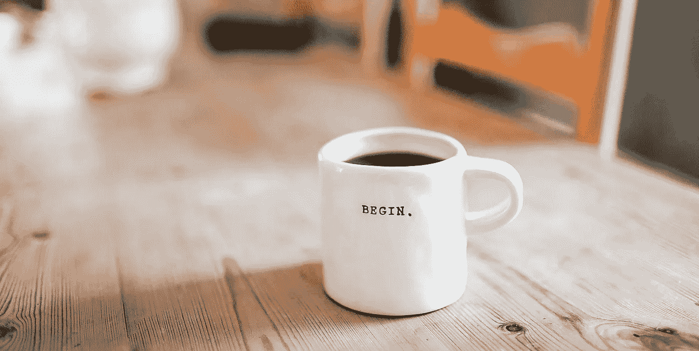

# 如何获得大三暑期产品设计实习

> 原文：<https://medium.com/hackernoon/how-to-land-your-junior-summer-product-design-internship-5d18479fdc00>

By Danielle MacInnes from Unsplash

首先，找实习工作并不容易。成为一名优秀的设计师并不意味着你会很容易得到实习机会。正如许多人所说，你必须在正确的时间出现在正确的地点。

但在我为寻找实习机会与 18 家公司进行了近 30 轮面试后，我意识到我学到的一些经验教训可以帮助其他人增加获得工作的机会。

# **早点开始，多申请**

我看到人们犯的一个常见错误是推迟建立投资组合。**你的作品集本身就是一个产品设计项目**。等待回音通常至少需要一个月。你将有足够的时间来迭代你的投资组合，所以不要等待推出你的“完美”投资组合。相反，尽早将一些东西放在一起，并获得反馈和迭代。

我发现**在线申请是**获得面试机会的最有效方式。原因很简单。大多数校园招聘会不会让你接触到设计招聘人员。你的信息被传递的机会可能低于设计招聘人员从人才库中看到你简历的机会。

人际关系确实有帮助，但没有你想象的那么多。在一天结束的时候，设计师被他们的作品所评判。如果你的工作根本达不到要求，你的关系就帮不了你。最重要的是，大多数公司都雇佣特定类型的设计师(这很可悲)。例如，谷歌更喜欢在设计中有长期结构化流程的设计师，而脸书更喜欢视觉技能更强的设计师。如果你不是公司寻找的设计师，你也会被裁掉。

# 手机屏幕

第一轮面试通常是电话筛选。有些公司会让设计师直接与你交谈。那样的话，你很幸运。通常招聘人员会进行筛选。

**说说你自己**。在任何面试中最常见的问题。回答这个问题的最好方法是分两部分来讲。

1.  你过去与工作相关的经历
2.  能让面试官记住你的东西

作为一名初级设计师，你执行设计的能力是最重要的，你的经验证明了这一点。所以先谈谈你的经历，但不要局限于简历中的内容。

然后告诉他们你独特的一面。它可以是你进入设计的方式。可以是你正在做的课外。它可以是你的一个爱好。注意面试官对此的反应。如果他们保持沉默，就把这部分剪短。如果他们看起来感兴趣，你可以多谈谈。这一部分只是为了留下好印象而添加的，所以不需要完成你头脑中所有的剧本。

下面我还列出了我从手机屏幕上得到的一些常见问题。如果下面每个问题你都有答案，那你就准备好了！

1.  你是如何进入设计行业的？
2.  你的设计职业目标是什么？
3.  作为设计师，你的优势和劣势是什么？
4.  你想从这次实习中得到什么？
5.  你对什么样的设计项目感兴趣？
6.  你为什么想在这里工作？

当轮到你提问时，一般的建议是**问一些关于面试官的事情**。随意在社交媒体上跟踪他或她，看看你是否有什么有趣的发现和问题。

电话面试有时包括一个项目**的预演。**我学到的一个技巧是**在打电话之前把你文件夹里的一个项目单独寄给面试官**。这样你就能确定他们是否会邀请你完成一个项目。此外，你的演示会更加清晰，因为招聘人员不会迷失在你网站的上下滚动中。

# 投资组合评论

我强烈推荐你和几个朋友一起做这一轮的模拟面试。准备 3 个要谈论的项目，但大多数公司可能会让你只看一个项目。

产品设计包括用户研究、交互设计、视觉设计，可能还有动作设计。你要确保你展示的项目涵盖了所有这些。所以你想谈谈你的研究和你在交互设计和视觉设计方面的**迭代**。

如果你与工程团队合作发布设计，提及它并**谈论你做出了什么妥协**。大多数公司都在寻找一个不仅仅在爱乐之城从事设计的设计师。他们希望看到候选人了解设计的整个过程，以及与其他利益相关者的斗争。

总的来说，有三大秘诀:

1.  不要过多谈论你的研究。我认为对于很多强调设计过程的人机交互项目来说，人们倾向于过多地谈论他们的研究方式。面试官不会评论你的研究。你是一名设计师，所以你应该花大部分时间谈论你是如何设计的。你研究的目标是将模糊的大问题转化为问题陈述，你可以在此基础上发展概念。因此，提及研究，但尽量将其编织在整个演示中，而不是花 5 分钟谈论它。
2.  **谈论“为什么”s** 。你想想，一个人很容易就能翻看你的作品集，看到你采取的所有步骤。他们为什么要采访你？因为他们想知道你是如何从 A 点到达 b 点的。解释一下。如果你有故事板，谈谈为什么你用故事板来探索概念，而不是体验图或人物角色或网站地图。如果你有人物角色和故事板，谈谈你从人物角色中发现了什么让你决定做一个故事板。如果你有一堆线框，谈谈你为什么用线框 A 而不是线框 b。即使这只是一个课堂项目，“我的教授告诉我这样做”永远不是一个足够好的答案。
3.  **确保你把事情联系起来**。10 分钟对于一个演示来说是很长的时间。人们开始变得疲惫，他们的思想四处游荡。这就是为什么你需要一根中心线把所有的部分编织在一起。我建议你在演讲开始时关注一些问题陈述，并解释你的设计如何解决你最后提出的问题。其他方法包括沿着路线图规划您的设计，或者将功能与价值主张联系起来。如果有时间，谈谈你学到了什么，下次可以做得更好。

# 设计练习

设计练习主要可以分为两种类型:一种是带回家的练习，一种是现场练习。有趣的是，我从未去过我面试过的任何一家公司的现场。因此，如果我不能给你更多的见解，我道歉。

## **带回家的设计练习**

如果公司建议花 3-4 个小时进行锻炼，花 6-8 个小时甚至更长时间是很常见的。通常一家公司在设计实践中会灵活处理你的可交付成果的格式。如果你没有提出你的解决方案就有可能被裁掉，我会推荐你使用**一个中等大小的帖子**。如果保证会打电话讨论你的设计练习，你会有更多的灵活性。我用的是带视觉链接的 PDF。

提示通常是模糊的，你的工作就是分解它，这样你就可以开始设计了。因此，**定义你的问题陈述**是整个过程中最重要的部分。尽你所能帮助你到达那里。你可能需要进行一些用户访谈，或者做一个竞争分析，画一个体验图等等。每个练习的过程通常是不同的，但是一旦你有了问题陈述，你就可以在不失去焦点的情况下投入想法的产生。

你要确保你花了一定的时间来勾画很多想法。问题陈述通常有助于你产生想法。当然，还有其他方法来帮助实现这一点，比如思维导图、故事板或属性列表。

然后你需要**比较不同的选项和** **专注一个方向进一步探索**。我处理它的方法是从我的草图中过滤出高层次的想法。然后我会比较每个想法的好处和利弊，并在此基础上做出决定。这是该进程的另一个重要时刻。面试官想知道你为什么选择想法 A 而不是想法 b。

根据要求，你可能会也可能不会仅仅为了展示你的视觉技能而把一两个屏幕变得逼真。

类似于你在投资组合回顾中的陈述，你想在整个过程中谈论“为什么”,并在最后将点连接起来。如果你关心这家公司的提议，确保你练习向朋友展示你的设计方案。

## 现场设计练习

现场设计练习比带回家的设计练习难多了，因为你必须在一定的时间内完成任务。好处是你可以提问。

除了你主要在白板或纸上工作之外，过程与带回家的相似。我想我能给人们的最大警告是**不要认为视觉无关紧要，因为它只是一个草图**。事实上，我被一家公司拒绝了，因为我在草图中过度复杂的层次和视觉设计。

# 最后

还是那句话，实习找工作不容易。这在身体上、情感上和精神上都令人疲惫不堪。但好消息是，**这也是一次令人谦卑、自省并最终有益的经历**。你不仅会学到面试技巧，还会了解到作为一名设计师和一个人的你。

不要让拒绝让你气馁！我深信任何事情的发生都是有原因的，我们只需要吸取教训。感谢所有推动你前进的人，包括拒绝你的人。

最后，**不要拿自己的报价和别人的**做比较。实习和你大学毕业后的第一份工作只是你职业生涯的开始。大品牌当然很好，但它们最终只能让你走这么远。作为一名设计师，实习可以让你成长，这才是你真正应该追求的！

> [黑客中午](http://bit.ly/Hackernoon)是黑客如何开始他们的下午。我们是 AMI 家庭的一员。我们现在[接受投稿](http://bit.ly/hackernoonsubmission)并乐意[讨论广告&赞助](mailto:partners@amipublications.com)机会。
> 
> 如果你喜欢这个故事，我们推荐你阅读我们的[最新科技故事](http://bit.ly/hackernoonlatestt)和[趋势科技故事](https://hackernoon.com/trending)。直到下一次，不要把世界的现实想当然！

