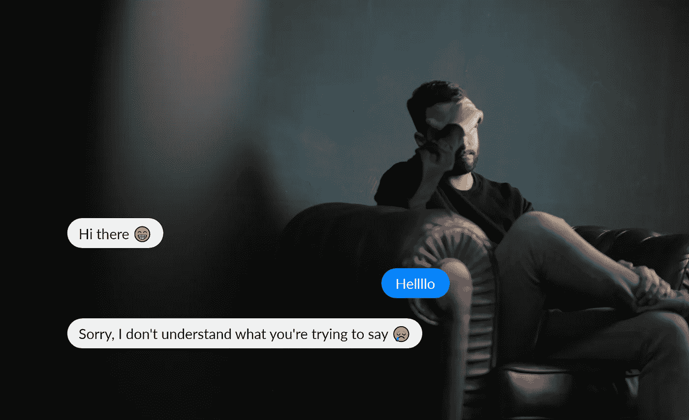
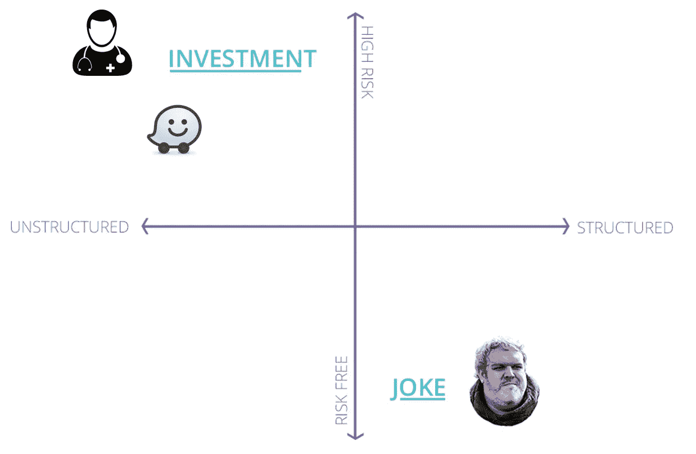
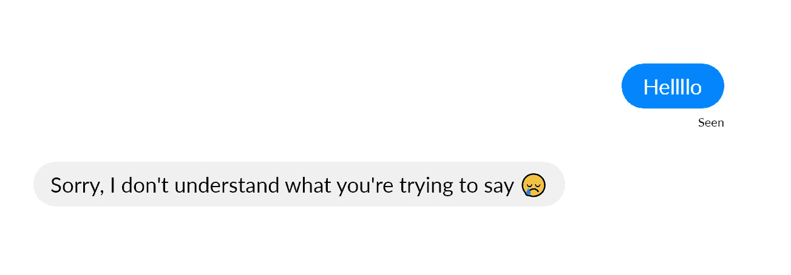
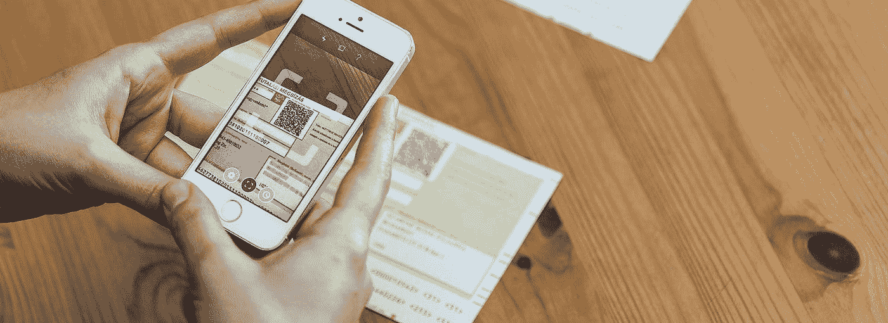

# 如何在几秒或几天内失去用户对你的人工智能产品的信任

> 原文：<https://medium.com/hackernoon/how-to-lose-user-trust-in-your-ai-product-in-seconds-or-days-56377d41f141>

# 人工智能产品的本质

机器学习(ML)的定义是这样的，它将成为人工智能产品的一部分:

> 机器学习(ML)是帮助计算机发现数据中的模式和关系，而不是人工编程的科学。这是创造个性化和动态体验的强大工具。

然而，这意味着不同于程序化的体验，这种产品的结果总是可变的。你可以对它进行优化，[我写了一整篇文章，集中讨论人工智能特性中的精确度和召回率，](/@matyas_82059/recall-vs-precision-in-an-ai-product-or-feature-cc3f1f97175a)但是它永远不会万无一失。

根据产品应用的风险，用户信任可能是最重要的。

The risk matrix for chatbots where a medical bot on the top left will be high risk while a bot that only says Hodor will be very low risk. [(source)](https://chatbotnewsdaily.com/trusting-bots-f1b036c64b11)

在当今世界，拥有一个好看的、专业设计的应用程序是获得用户信任的必要条件。聊天机器人的 GUI 非常有限，所以你的信任将建立在你的副本的质量上。然而，任何一种依赖人工智能的产品，无论是具有 NLP 算法的聊天机器人，图像识别和搜索，语音到文本，你能想到的，都将面临上述可变性的问题。这意味着你无法完全控制用户体验。这反过来会导致用户对你的产品失去信任，并很快失去信任。

我认为有两种方法可以让你失去用户的信任，一种方法你不会失去它，但是你仍然应该关注用例。

# 当用户知道时

这里有一个很好的例子，当一个现成的 NLP 算法没有对打字错误进行标准化时。

这直接告诉用户你不知道你在做什么，他们不应该在你的产品上浪费时间。我想说的另一个例子是 OTP(匈牙利的一家领先银行)的银行应用程序中的公用事业账单读取和支付功能。该功能承诺读取公用事业账单的信息。

然而，这个功能在我尝试使用的 10 次中有 9 次对我不起作用。诚然，这里有很多变量，照明、打印质量等等，但当一个银行应用程序出现如此严重的故障时，这不是一个好兆头。难怪当地邮局通过让公用事业公司在账单上打印二维码，转向了基于二维码的系统。

这也强化了许多人([包括我](https://hackernoon.com/3-things-i-learned-working-at-an-ai-startup-in-y-combinator-5ed5265c6547))关于人工智能技术的观点。不要为了使用它而使用它，如果有更简单的解决方案，选择它。使用神经网络或可靠的二维码识别照片上的字符？猜猜哪个会给出更好的用户体验。

# 当用户不知道时(立即)

有一些更棘手的情况会引起用户更大的反弹。我说的是当用户没有立即意识到他们没有得到他们期望的东西时的缺陷。

这方面的一个例子是当你向人工智能助手询问伯明翰的天气时。世界上有多个伯明罕。一个在英国，一个在阿拉巴马，另一个在澳大利亚，但我相信还有更多。现在一个人工智能系统可以要求你指定，但不是所有的系统都这样做。一些默认为阿拉巴马州的伯明翰，因为他们是美国的焦点。这可能导致你在英国伯明翰不带雨伞，因为人工智能说天气会晴朗。等到用户发现的时候，已经来不及做任何事情了。用户体验被破坏，用户信任将不复存在。

# 当用户完全不知道时

以 Google Photos 图片搜索为例，当[讨论精确度和召回率时，我写了很多。](/p/recall-vs-precision-in-an-ai-product-or-feature-cc3f1f97175a)假设我想找到一种我拍了照片的特定食物。至少我认为我做到了。我会输入食物，浏览结果，最终要么找到它，要么放弃。或者我可以试着搜索食物的种类，比如圣代。谷歌也许能找到，也许找不到。然而，由于我不确定我是否在第一时间拍了这张照片，我不太可能责怪算法。

当涉及到人工智能驱动的产品或功能时，您如何看待用户信任？大家讨论一下。