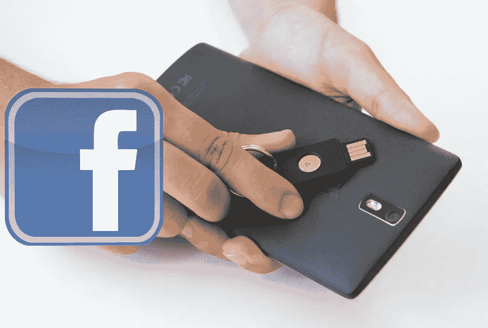

# 如何通过脸书让物联网更加安全

> 原文：<https://medium.com/hackernoon/how-to-make-the-iot-more-secure-with-facebook-87f679f7e5e5>

几周前，我写了一篇关于使用[双因素认证](http://bit.ly/2kr6ozT)来保护物联网终端的文章，而[提到脸书](http://www.slideshare.net/haystacktech/a-new-solution-to-the-iot-security-problem)是一个使用短信、电子邮件或语音实现的好例子。

This is what I posted a few weeks ago …

双因素认证*是*物联网的一个选项，您可以在此[了解它如何使用低功耗无线通信，或者点击本文左侧的演示文稿。](http://bit.ly/iotkillswitch)

但是本周的双因素新闻是脸书宣布使用… [低功耗无线](http://bit.ly/2FAIoTFacebook)通信的双因素认证的附加选项！你可以在这里查看脸书的声明但基本上认证技术是 [NFC](http://bit.ly/2NFCdef) (近场通信)，一种越来越多地用于包括 Apple Pay 在内的移动支付的短距离技术。当登录脸书时，你被要求将支持 NFC 的硬件设备(如智能手机)或像这样的第三方设备(如放在你的桌面或手机旁边，从而使 3000 英里外的黑客更难冒充你，因为他们没有这一额外的物理层安全。

NFC 并不新鲜，双因素认证也不新鲜，但脸书支持两者的结合是一个重要的里程碑。对于物联网来说，它仍在从 Mirai 未来组合灾难中挖掘出来，并且大多缺乏令人信服的安全故事，脸书的声明来得正是时候。以下是我认为这对于物联网如此重要的几个(实际上是七个)原因:

1.  **“常规”双因素身份认证是不够的。**脸书正处于推广这一技术的早期阶段，但他们传达的信息是显而易见的:我们正在超越短信和电子邮件，实现双重身份认证。NIST [不再支持 SMS](http://bit.ly/2jx9vb7) 作为双重认证的安全手段，寻找更好的方法正在进行中。**要点:**很少有物联网解决方案甚至使用双因素，但对于那些考虑它的人来说，脸书只是提供了一个超越昨天的双因素方法的愿景，用更好的，也许更容易使用的东西。
2.  **低功耗无线作为第二个身份认证因素正式成为主流。**对我来说，互联网连接设备的身份验证作为 NFC 的一个杀手级非支付用例一直是如此显而易见，但是……也许需要像脸书这样的消费者应用供应商先做这件显而易见的事情。**外卖:**如果对日常脸书用户足够好，对大多数物联网开发者也足够好。
3.  **脸书刚刚给了 NFC 一个巨大的认可，但他们也将支持其他无线技术。**脸书的同一个团队正在研究蓝牙，可以肯定它将成为他们的下一个无线身份认证选项。**要点:**这些是短距离技术，将使低功耗无线认证的使用正常化，但随着用户和物联网等用例要求更大的灵活性或功能，更长距离的认证选项将被添加到产品组合中。
4.  对脸书来说，选择 NFC 而不是蓝牙是一个明智的起点。 NFC 价格低廉，已经在智能手机上使用，并且不需要外围设备供电。不少硬件供应商将遵循脸书的暗示，选择将 NFC 集成到他们的“智能”物联网设备中，作为一种安全预防措施(例如，“我们今天的安全故事充满漏洞，所以我们至少要复制脸书，我们的客户反正都在使用……”)这种集成不需要局限于像 Dropcam 这样的消费设备，而是可以扩展到任何数量的企业和工业物联网设备。
5.  **NFC 将启动对无线双因素认证更好选项的探索。** NFC 范围非常有限，通过 NFC 对工业设备进行定期认证可能会成为物联网安全的基本预防措施。但更实际的途径是遵循[下一代“NFC+”](http://bit.ly/2NFCDASH7)方法，该方法对现有的 NFC 芯片进行简单的修改，并重新使用 NFC 天线来实现更长的范围(如果需要，可以达到数百米甚至数公里)。例如，有人试图从 500 码外的位置向 WiFi 摄像头发送命令，只有当他们的 NFC+腕带验证他们确实在 500 码外时，才能这样做。如果每次有人试图访问摄像头时都调用这一额外的物理层保护，那么远程执行的 Mirai 未来组合式僵尸网络攻击将更加困难。**要点:** NFC 有可能成为物联网中第二因素身份认证的基础，同时也是一种更长距离、低功耗的连接选项。
6.  **脸书还认可了用于身份认证的“新”外形。**脸书聪明地推荐了[第三方小工具](https://www.yubico.com/products/yubikey-hardware/yubikey-neo/)，它们可以在我的安卓手机上无线认证我的脸书应用。**要点:**钥匙扣、手表、健身追踪器、门禁徽章等都是这一新身份认证角色的候选对象，其中许多产品，如 FitBit，已经支持 NFC。
7.  **苹果将会继续合作，但会使用蓝牙技术。**苹果在 Apple Pay 安全方面面临的挑战是其不幸不愿在 iPhone 上开放 NFC API 的原因。因此，除非苹果决定开放他们的 NFC API，否则他们会支持脸书(以及许多追随脸书的银行、亚马逊等)使用蓝牙。**导读:**苹果最终将在 iPhone 上支持带蓝牙的无线双因素认证，但出于安全和电池寿命的原因，蓝牙将是独立认证小工具的糟糕选择。

好消息:**已经有人在解决物联网双因素身份认证。**你可以在这里看到我的公司 Haystack 如何看待这个机会的技术整合方面[。几年前，我们开始考虑 NFC 和物联网**，并将其融入我们的产品战略。例如，NFC 的数据格式**](http://bit.ly/2nfctech) **[NDEF](http://members.nfc-forum.org/specs/spec_list/) ，是我们的软件在 OSI 层之间交换数据的核心部分。**

我不认为脸书是一家物联网公司，但有趣的是，不感兴趣的公司无意中推动甚至解决了物联网等非相邻行业的行业规范或标准。物联网的安全是一件大事，政府监管似乎为期不远，但鉴于我们现在所说的“物联网”的分散性和异构性，脸书帮助解决物联网安全问题而不是“感兴趣的”物联网参与者可能并不令人惊讶。

你可以通过@patdash7 或电子邮件 pat @[*haystacktechnologies*](http://www.haystacktechnologies.com)*dot com 联系我。*

***另外，如果你喜欢这篇文章，请考虑向下滚动，点击左下方的心形图标，在 Medium 上推荐这篇文章。***

> 黑客中午是黑客如何开始他们的下午。我们是这个家庭的一员。我们现在[接受投稿](http://bit.ly/hackernoonsubmission)并乐意[讨论广告&赞助](mailto:partners@amipublications.com)机会。
> 
> 如果你喜欢这个故事，我们推荐你阅读我们的[最新科技故事](http://bit.ly/hackernoonlatestt)和[趋势科技故事](https://hackernoon.com/trending)。直到下一次，不要把世界的现实想当然！

