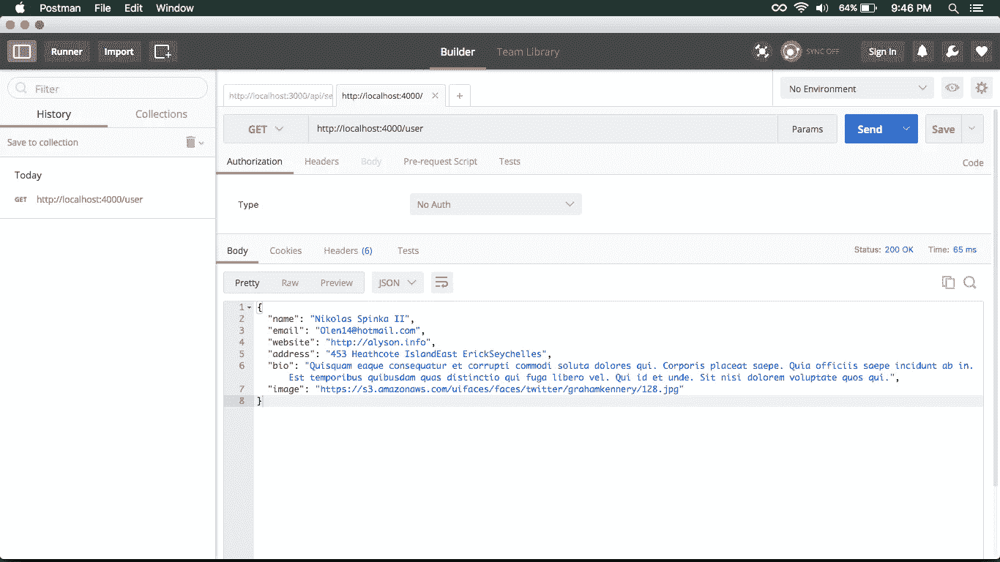

# 如何使用 faker.js 模拟 Node.js 应用程序的数据

> 原文：<https://medium.com/hackernoon/how-to-mock-data-for-node-js-applications-using-faker-js-b1f4c0e78102>


当我们开始构建一个应用程序时，我们通常不希望太担心数据。对我个人来说，创建一个数据库并用样本数据填充它似乎是一件很麻烦的事情。当我做原型时，我更关注于创建 RESTful API 和应用程序的前端。

但是，这并不意味着我不关注数据库中的数据组织。拥有集合和文档的模式或者以任何其他方式组织数据是很重要的。这个方面完成后，它使*在创建 API 时*和*如何*提出的问题变得清晰。在最近的一个场景中，在为客户构建电子商务 web 应用程序的原型时，我发现自己处于类似的情况。我有一个截止日期来交付客户要求的最大数量的功能检查的原型。在决定如何构建数据库的模式后，我继续搜索并找到了解决这个问题的法宝: **faker.js.**

# 输入 faker.js

当你面临和我类似的情况时，这是一个很好的节点模块来创建假/模拟数据。fakerjs 有自己的 API，而且很庞大。所有的荣誉都归于建造它的人。它有一个适用于几乎所有用例的庞大 API，以及一个优秀的 [*文档*，可以帮助你在几分钟内熟悉 Github。](https://github.com/marak/Faker.js/)

让我们考虑一个测试案例，其中我希望某个用户*拥有以下数量的字段:*

*   名字
*   电子邮件
*   网站
*   地址
*   个人简历
*   图像/头像



就是这样。这就是你如何使用 faker.js 模拟数据。它快速，设置简单，一点也不麻烦。您只需将它添加到您的`npm`依赖关系中:

```
npm install faker --save
```

## faker.js 数据

可以生成 faker.js 的数据列表:

*   地址
*   贸易
*   公司
*   日期
*   金融
*   黑客
*   助手
*   图像
*   因特网
*   洛雷姆
*   名字
*   电话
*   随意
*   系统

每个元素都有很多子项，你可以在文档中的 这里查看 [*。*](https://github.com/Marak/faker.js)

我喜欢 Faker 的另一个好处是，它不仅仅局限于服务器端 JavaScript。您也可以为浏览器 JavaScript 模拟数据。文档中的一小段说明了如何做到这一点:

```
<script src = "faker.js" type = "text/javascript"></script>
<script>
  var randomName = faker.name.findName(); // Caitlyn Kerluke
  var randomEmail = faker.internet.email(); // Rusty@arne.info
  var randomCard = faker.helpers.createCard(); // random contact card containing many properties
</script>
```

这个 API 将帮助您以更快的速度构建 JavaScript/Node.js 应用程序的原型。不仅如此，在利用这个库创建 RESTful API 时，您可以很容易地模仿您的 TDD/BDD 测试。

*获取* [*的完整源代码在本 Github 资源库*](https://github.com/amandeepmittal/fakerjs)

想收到更多像这样的文章吗？订阅我 [**这里**](https://patreon.us17.list-manage.com/subscribe?u=ad4c168a6d5bb975f2f282d54&id=39e959cecd) **。有时，我会向我的订户发送“从未见过”的内容。**

***感谢阅读。如果你觉得这篇文章有用，请点击*** 💚 ***按钮，这样这个故事就能接触到更多的*读者*。如果你想谈论它，请在***[**Twitter**](https://twitter.com/amanhimself)***或*** [**查看我在 Node.js**](/@amanhimself) ***上的其他文章。***

[](http://bit.ly/HackernoonFB)[](https://goo.gl/k7XYbx)[](https://goo.gl/4ofytp)

> [黑客中午](http://bit.ly/Hackernoon)是黑客如何开始他们的下午。我们是 [@AMI](http://bit.ly/atAMIatAMI) 家庭的一员。我们现在[接受投稿](http://bit.ly/hackernoonsubmission)并乐意[讨论广告&赞助](mailto:partners@amipublications.com)机会。
> 
> 如果你喜欢这个故事，我们推荐你阅读我们的[最新科技故事](http://bit.ly/hackernoonlatestt)和[趋势科技故事](https://hackernoon.com/trending)。直到下一次，不要把世界的现实想当然！

