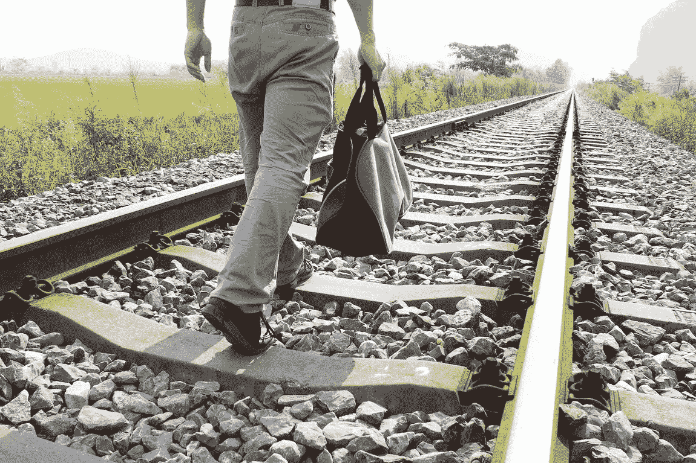
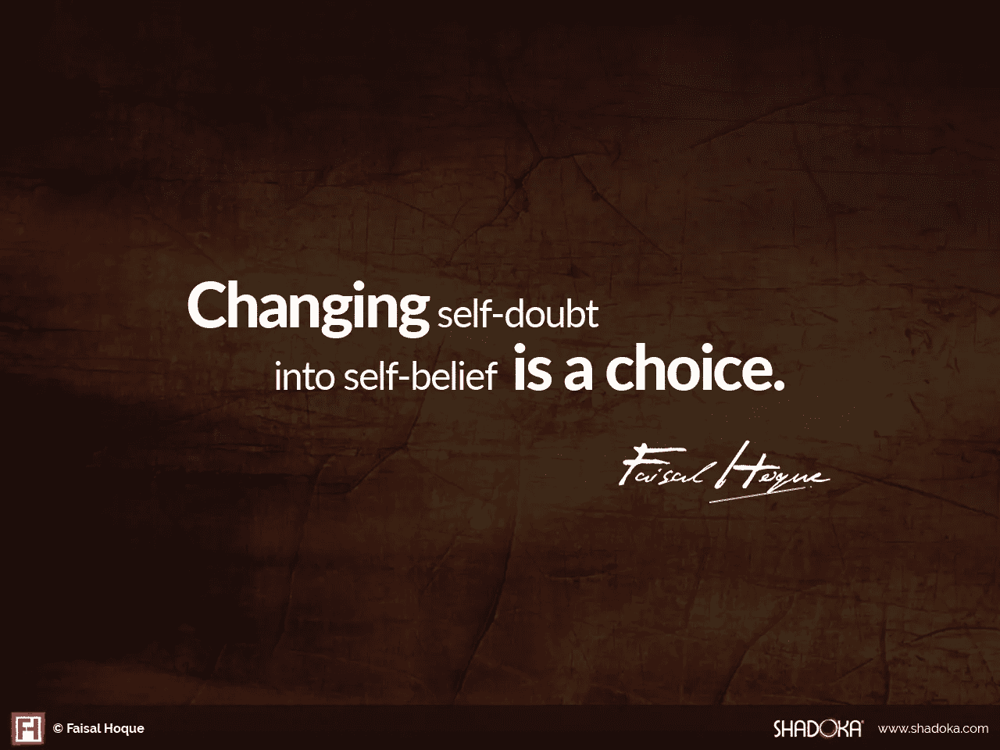
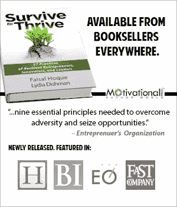

# 如何克服对失败的恐惧

> 原文：<https://medium.com/hackernoon/how-to-overcome-your-fear-of-failure-2383da0dfa48>

[Image: Shutterstock]

## ***把自我怀疑变成自我相信是一种选择。***

我相信我们都有梦想去做我们最喜欢的事情——以各种可能的方式感受活着和满足。我们在这里寻找赋予我们存在意义的任务，让这个平凡的生活变得宜居。哲学家理查德·泰勒说我们的生活毫无意义——赋予它意义的是一种目的感:生存的意志。

我们当中有多少人真正实现了这些梦想？问题是，在开始实现梦想之前，我们中的许多人都怀疑自己是否有能力做自己喜欢的事情。我们对尝试不同的东西感到忧虑和犹豫。

我们脑海中的声音经常说:“我没有时间也没有钱。。."

自我破坏是任何一种让我们远离生活中最渴望的东西的行为或想法。我们不愿意接受新的挑战是自毁行为的一个典型特征。存在于我们有意识的欲望和无意识的需求之间的冲突——或者如西格蒙德·弗洛伊德所描述的，我们的身份与自我——在自我破坏模式中表现出来。

这种自毁行为源于我们对失败的恐惧。我们内心越来越强烈的情绪，折磨着我们，说，“你不能这样做”，这是阻止我们实现我们生来就要做的伟大目标的原因。

我们能做些什么来停止破坏我们自己？

## 记住，后悔比失败更糟糕

当我开始害怕失败时，有一样东西可以阻止我的恐惧。我只是想到那种可怕的，可怕的后悔感。

> “当晚上躺在床上，白天的遗憾偷走了你的睡眠:
> ‘我应该’
> ‘要是我就好了’
> ‘我希望我能’
> 。。。抓住其中的一个，把它变成‘我愿意’，然后安心睡觉，知道明天会更好。”L.R .克诺斯特

有一种感觉比恐惧持续的时间更长，也更有力量，那就是后悔。

## 确定根本原因

我们对失败的恐惧源自哪里？找出根本原因是承认我们的恐惧并克服它的第一步。我坐下来，闭上眼睛，放松，深呼吸，试着理解我的恐惧。直面我们的焦虑是克服恐惧的最好方法。

## 把你的眼睛放在目标上

一旦我确定了恐惧的原因，我会努力把注意力集中在我的目标上。每当我想到“我不能这么做是因为。。."接下来，我试着重新调整自己，把注意力放在那些能让我朝着总体目标前进的小任务上。为了克服对失败的恐惧，我们必须完全专注于我们想要创造的结果。我们越是关注我们的最终目标，我们就越能从头脑中抹去悲观情绪。

## 4.承认回避并专注于前进

一旦我们从受害者转变为想要实现自己命运的勇敢者，我们就必须采取行动。当我们害怕时，我们经常用繁忙的工作来填满我们的日子，以逃避真正的问题。这种通过忙碌的逃避证明了我们缺乏进步。为了前进，我们必须停止把宝贵的时间花在世俗的活动上。

## 绝不放弃

“我们梦想给自己希望。停止做梦——嗯，这就像说你永远无法改变你的命运。”—谭恩美，*百种秘密感官*

我们需要问自己“我有多需要完成这件事。。。?"在一天结束的时候，我们是我们最好的激励者。失败是生活的一部分；正是失败让我们更加坚强，更加执着地去实现我们的目标。

## 相信你内心的指引

赖内·马利亚·里尔克在*给一位年轻的*诗人的信中写道:

“艺术作品是无限孤独的，没有比批评更无用的方法了。只有爱能感动他们，拥抱他们，公平对待他们。永远相信你自己和你自己的感觉，而不是争论、讨论或诸如此类的介绍；如果事实证明你是错的，那么你内心生活的自然成长最终会引导你走向其他的洞见。允许你的判断有它们自己无声的、不受干扰的发展，就像所有的进步一样，它必须来自内心深处，不能强迫或催促。”

这说明了一切。在怀疑和恐惧的时刻，我现在相信我内心的向导。我相信它能解决我所有的问题。这种内在的指引比任何外在的影响都更强大，有能力驱散我对目标的恐惧。我的许多失败都来自于对自己的不信任。

## 耐心和信念是我们最好的朋友

没有人能决定我们人生旅程的最终目的地。因此，下一个最好的办法是保持冷静，对自己有信心。每当我觉得我偏离了我的命运，我就试着提醒自己，我的旅程就是我的道路。这是一个充满高峰和低谷、阳光和雨水的旅程。这种信念让我充满信心地探索未知的领域。我安心向前失败。因为即使我们失败了，我们也没有失去一切——我们可以学到宝贵的经验，为我们的下一章打下基础。

保持乐观的态度有助于我们永远不要放弃自己。它让我们通过消除恐惧来充电、再投资和重塑自我。

## 改变我们的认知

我们都有看待生活的维度；有些人会看到半空的杯子，有些人会看到半满的杯子。当我们总是看到半空的杯子时，我们最终会扼杀我们的信心和自信。

错误的观念对我们的成长和幸福有害无益。

正如我们在书中所写的那样，“[生存繁衍](http://survivetothrive.pub/)；我们从同情中获得力量——对他人和自己的同情。我们大多数人每天都在与一些生活事件作斗争。我们越了解别人如何挣扎，就越容易处理自己的问题。

更好的是，如果不管我们的个人情况如何，我们都能唤起别人脸上的微笑，这会让我们自我感觉良好。这给了我们前进的力量。

## 自信是一种选择

在我的桌子上有一本由科尔曼·巴克斯和约翰·莫因一起翻译的《*鲁米精粹》。当我有疑问的时候，我经常发现自己沉浸在鲁米的教导中。贾拉尔·阿德·丁·巴尔克，又名鲁米，是一位 13 世纪的苏菲派神秘主义诗人，他写下了一些有史以来最深刻、最鼓舞人心的文字。*

鲁米写道，

> “我太小了，几乎看不见。
> 这伟大的爱怎么会在我心中？
> 看眼睛。他们很小，但是他们能看到巨大的东西。”

当我们试图成为另一个人的版本时，就会引发我们内心的不满。独一无二包括做我们自己；拥抱我们自己；培养我们将成为的人。

我们比我们通常认为的更强大。当我们专注于我们的弱点时，我们最终会窒息我们的潜力，阻止它的显现。为了生存，最终为了繁荣，我们有责任一次又一次地崛起。

***版权所有 2015 年，作者 Faisal Hoque。保留所有权利。***

*我是一名* [*创业者，作者*](http://faisalhoque.com/speaking/) *。创办* [*沙多卡*](http://shadoka.com/) *等公司。Shadoka 促进企业家精神、增长和社会影响。著有《* [*万物互联——如何在创意、创新和可持续发展的时代进行变革和领导》》(麦格劳·希尔，2014 年)和《*](http://www.amazon.com/Everything-Connects-Creativity-Innovation-Sustainability/dp/0071830758/ref=sr_1_1?ie=UTF8&qid=1376488798&sr=8-1&keywords=everything+connects%2Bfaisal+hoque) [*生存并茁壮成长:有韧性的企业家、创新者和领导者的 27 种实践*](http://survivetothrive.pub/) *》(励志出版社，2015 年)。在推特上关注我*[*@ fais al _ hoque*](https://twitter.com/faisal_hoque)*。*