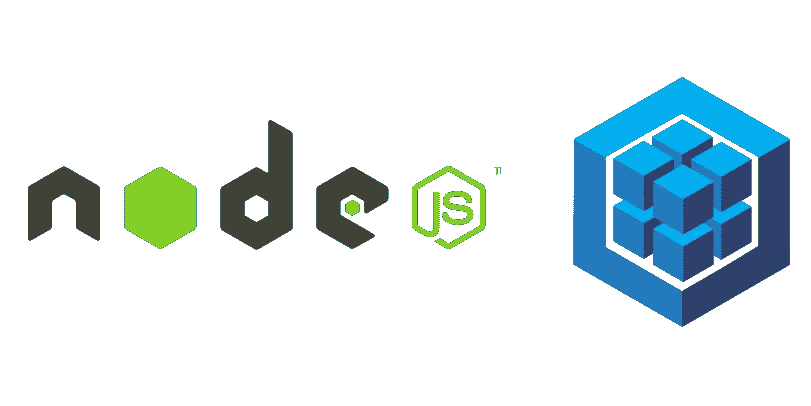

# 如何使用 Sequelize 和 Nodejs 对 MySQL 中的记录进行分页

> 原文：<https://medium.com/hackernoon/how-to-paginate-records-in-mysql-using-sequelize-and-nodejs-a3465d12aad5>

有时，我发现自己在为我的问题寻找一个直接的答案而纠结。最近，我一直在做一个 fullstack 应用程序，其中有一个从后端(REST API)到前端分页结果的基本要求。我挣扎有两个原因。首先，来自 NoSQL 的背景很难掌握 SQL 数据库。第二个原因是，顺序化文档没有为这个非常基本的抽象提供一个清晰和直接的解决方案。很多人在 SQL 数据库的世界里做假设。

因此，在这篇文章中，我们将讨论一个使用 Sequelize、MySQL 和 Node.js 的基本分页模块。要设置一个新的应用程序并建立数据库连接，请阅读我在[**Sequelize**](https://hackernoon.com/getting-started-with-sequelize-for-nodejs-applications-2854c58ffb8c)**上的帖子。**

# 定义模型

我直接跳到`user`模型定义:

我使用的是一个包含数百条用户记录的表，我们希望在一个 web 应用程序上显示这些记录，比如在管理面板中，我们希望一次只显示 50 条记录。

在`api/user.js`中，我定义了一个端点`/:page`，它将从数据库中获取我们需要的一些结果。

`findAndCountAll`是在数据库中搜索多条记录的模型，它返回所需的数据和表中元素的计数。上面的查询将一次获取 50 条用户记录，直到调用下一个页面来获取下 50 条记录。在与分页相关的查询中需要`limit`和`offset`，其中`limit`根据查询获取行数，而`offset`用于跳过数据库表中的行数。

***感谢阅读。*** *如果你觉得这个帖子有用，请点击* **💚*按钮*** *这样这个故事就能接触到更多的*读者*。如果想多说一点，****ping me on***[***Twitter***](https://twitter.com/amanhimself)***。***

> [黑客中午](http://bit.ly/Hackernoon)是黑客如何开始他们的下午。我们是 [@AMI](http://bit.ly/atAMIatAMI) 家庭的一员。我们现在[接受投稿](http://bit.ly/hackernoonsubmission)，并乐意[讨论广告&赞助](mailto:partners@amipublications.com)机会。
> 
> 如果你喜欢这个故事，我们推荐你阅读我们的[最新科技故事](http://bit.ly/hackernoonlatestt)和[趋势科技故事](https://hackernoon.com/trending)。直到下一次，不要把世界的现实想当然！

