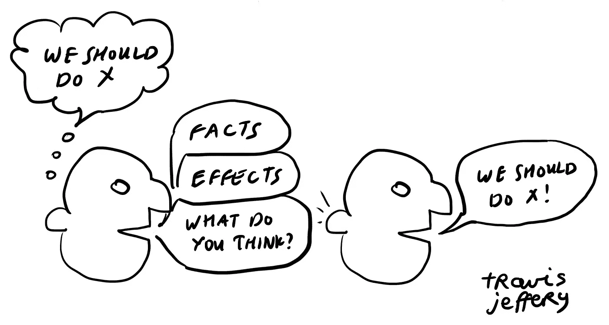

# 如何在网上讨论中说服他人

> 原文：<https://medium.com/hackernoon/how-to-persuade-in-online-discussions-d91ce321c947>

## 你的团队正在讨论一个项目计划，你对该做什么有自己的看法，知道自己想说什么，但就是不知道怎么说。

有一种写作和说话的技巧可以帮助你解释事情，教人们你如何看待事情，让人们接受你的思维方式，并且这样做不会引起冒犯或怨恨。

## 1.用事实说话。

*从一系列与你正在解决的问题相关的客观事实开始。描述一下这种情况。让细节说话。坚持事实，保持中立的语气，这样读者就没有理由停止阅读。*

我过去常常在讨论中用“我们应该做 X…”或“那不会起作用，因为…”来开始表明我的[不同意](https://hackernoon.com/tagged/disagreement)，换句话说:“我是对的，你是错的；我比你聪明”——我还不如以一声呐喊开始。

如果以前我是战士，今天我是老师。通过回顾上周和暗示未解决的问题来建立本周的材料。说服就是销售，销售就是[教](https://hackernoon.com/tagged/teaching)，教就是把学生从他们知道的东西移到他们不知道的东西；所以这就是我们开始的地方，从读者知道/同意的地方开始。

## 2.解释影响。

向各方解释其影响:你自己、顾客，最重要的是读者。澄清问题，增强解决问题的愿望。*迎合他们所关心的。*

我曾经认为事实的重要性是不言而喻的；今天我更明白了。例如，正如我们在气候变化问题上所看到的，即使是事实也可以被合理化、最小化或否认。

读者所缺少的是他们和他们所关心的事情将会受到怎样的影响。所以，倾听他们，学习他们的语言，观察他们，学习对他们来说什么是重要的，直到你从他们的角度看到他们所看到的。最后，你会知道他们想听什么，或者你需要说什么来影响他们。

> 知道他们想听什么或者如何影响他们，和知道你想说什么一样重要。

要想出效果，试着问这些问题:如果你的结论没有实现，这个人会面临什么损失？如果你的结论被采纳，这个人会得到什么？

如果你是在为一个团体写作，为有最终决定权的人量身定做。

## 3.以“他们的”结论结尾。

*最强结论不用多说。让这个人认为这个想法是他或她的。*

我曾经认为，想出答案会给我的老板或任何人留下深刻印象，从而产生快感和利润，让我觉得自己很重要；今天我知道那些都是失去的机会——每一次都是让我的老板或同事感到重要并让他们给出答案的机会。或者至少让他们认为他们做到了。

“你怎么看？”可能是我在 Slack 里打的最多的短语了。如果你已经让读者接受了你的思维方式，他们会得出和你一样的结论，你不必大声说出来。让对方认为结论是他或她的，说“好主意！”，让他们感觉良好，偷偷拍拍自己的背。

## 言辞不能代替行动

我希望这能帮助你说服人们相信你要说的事实，并提高你演讲的质量。

我把我的读者描绘成一个好读者，一个知道他们的狗屎并把狗屎做好的人，这不应该改变。这种技巧只是一种补充，因为言辞不能代替行动。多说一点，但要行动起来。

–

请在 [@travisjeffery](https://twitter.com/travisjeffery) 打个招呼。

点击❤️，如果你觉得这有用，并随时分享。

感谢阅读。