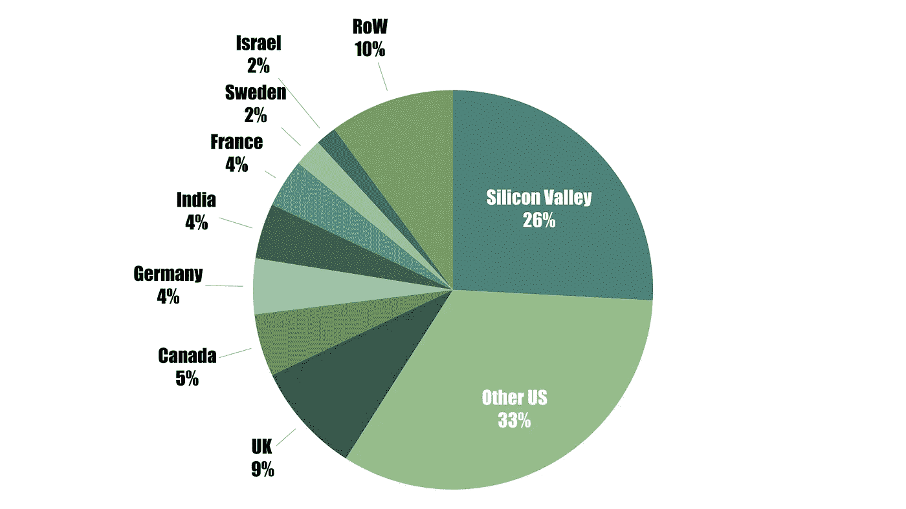
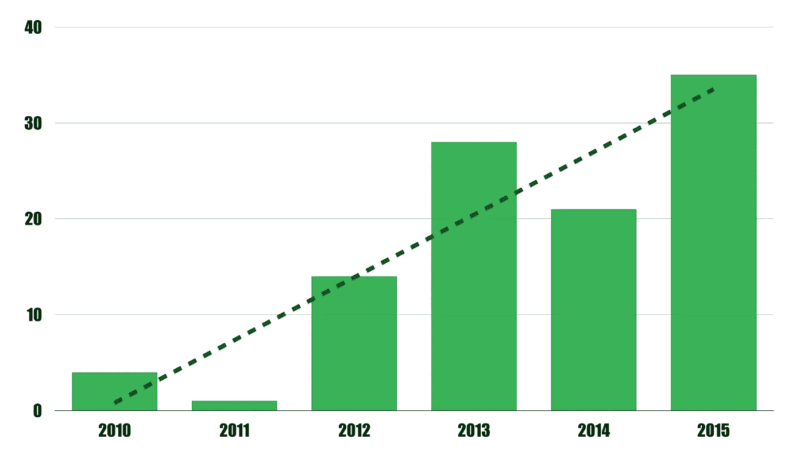
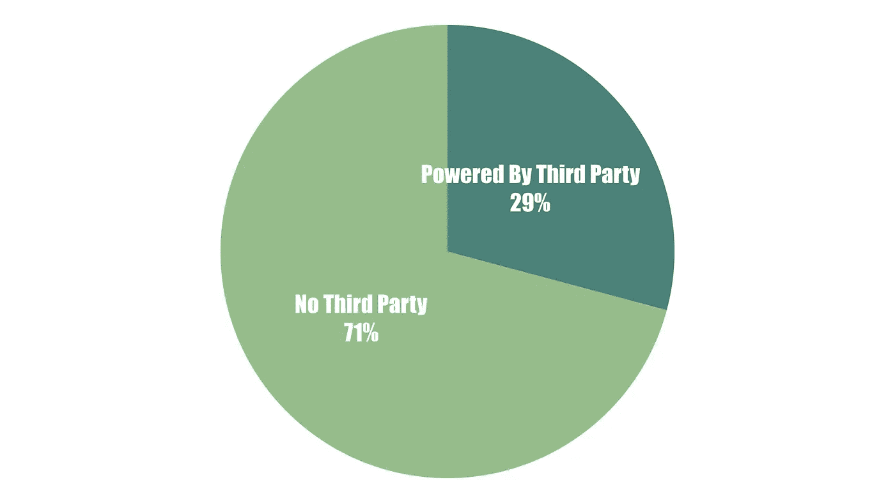
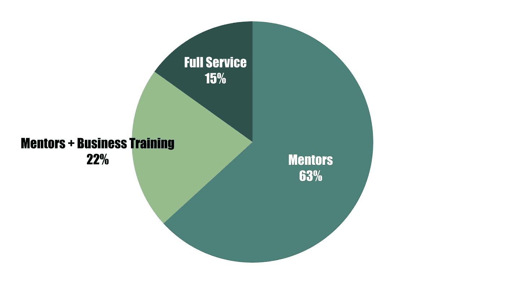
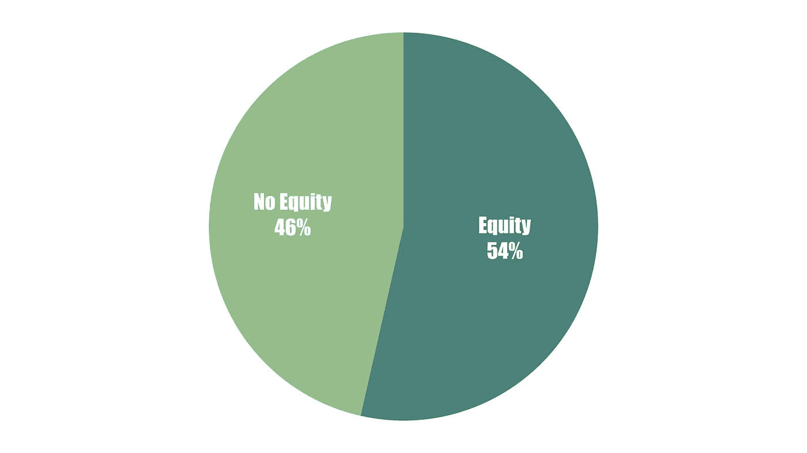

# 自动化怎么准备？或者说，为什么我们现在需要更多的“人工智能生态系统”！

> 原文：<https://medium.com/hackernoon/how-to-prepare-for-automation-or-why-we-need-more-artificial-intelligence-ecosystems-now-4a4a767e733b>

HBO’s Westworld

人工智能正在改变日常生活的方方面面。在最近的[采访](https://bothsidesofthetable.com/mark-cuban-on-why-you-need-to-study-artificial-intelligence-or-youll-be-a-dinosaur-in-3-years-db3447bea1b4)中，美国商人和投资者马克·库班——也许是作为*美国广播公司*的真人秀*鲨鱼池*中的“鲨鱼”投资者之一而闻名——甚至说，如果你不学习人工智能，你将是一只面临 3 年内灭绝的“恐龙”。

越来越多的企业巨头正在遵循这一建议。据数据分析公司 *CB Insights* ，涉及 AI 公司的 M & A 活动正在迅速增加。

M&A Activity Involving “AI” Companies — Source: CB Insights

被收购的公司通常是“硅谷”创业公司。但这并不一定让它成为“世界的 AI 中心”。即使粗略浏览一下现有数据，也能看出其他地区正在迅速“赶上”。AI 创业者无处不在。

Location of Acquired “AI” Companies — Source: PitchBook

然而，也许更令人惊讶的是，大多数“退出”发生在美国，尤其是硅谷。在与人工智能相关的 M&A 活动方面，硅谷的老牌公司胜过了世界其他地区的竞争对手。通常的嫌疑人，*谷歌*，*苹果*和*脸书*领先一步。

Location of “AI” Acquirers — Source: PitchBook

那么，为了将平衡转移到其他地区，需要做些什么呢？

答案很简单。我们需要建立更多的“人工智能生态系统”。

如果有更多专注于人工智能的生态系统，那么每个人都将为研究人员、商业界、分析师和投资者确定的“下一件大事”做好更好的准备。此外，创建更多此类生态系统将有助于决策者更好地应对实施人工智能所带来的挑战、机遇甚至威胁。

但是，在追求这一目标的过程中，我们需要认识到，我们不需要任何类型的生态系统，而是“合适的”生态系统。理解将导致以人工智能为中心的生态系统“正确类型”的“特殊调料”意味着重新审视我们关于创新生态系统工作原理的一些基本想法。

## **问题:如何建立“合适的”人工智能生态系统？**

国家和地方政府认为创业生态系统是为未来做准备的必要条件。建立必要的基础设施以刺激新的和创新性企业的创建、增长和扩大，现在被视为各级政府的一个重要和合法的政策目标。

那么，政府可以做些什么来建立一个有效的创新生态系统，不管是不是以人工智能为中心的？

传统上，寻求创造创新生态系统的政策制定者的重点一直是为初创公司和扩大规模的公司提供更多的风险资本。

以欧洲为例。我们看到，在初创企业发展的所有阶段，风险投资活动都在减少。这追踪了世界范围的趋势(根据数据提供商和分析师*的宣传手册*)。似乎更令人担忧的是，目前首次风险投资活动处于 7 年来的最低水平。

VC Activity and First-time Venture Financing Activity in Europe — Source: PitchBook

为了刺激风险资本投资，政府采用了几种策略。

***首先是*** ，长期以来有证据表明，政府支持在鼓励创业和启动创业公司方面发挥了至关重要的作用。比如，政府在努力建立可持续生态系统的过程中，已经成为欧洲初创企业领域的主要“后金融危机”投资者。

其次，政府经常推出旨在激活私人投资的计划。欧洲最近的一个例子是欧洲委员会和欧洲投资基金联合倡议建立泛欧洲的"风险投资基金的基金"。总基金规模的 25%的投资必须鼓励私人投资者，特别是机构投资者，投资于下一代创新公司。

***第三*** ，可以实施监管措施，使风险投资更容易接近投资者。对欧洲风险资本基金( *EuVECA* )和欧洲社会企业家基金( *EuSEF* )的拟议修正案旨在推动欧洲的风险资本行业。此外，还通过财政激励和税收减免鼓励投资者进行风险资本投资。

但是，即使这些措施显著增加了可用的风险资本，企业家也不总是过得更好。

就像任何享受繁荣的行业一样，非专业人士会涌现出来，希望从这块不断增长的蛋糕中分一杯羹。有太多“新”风险资本投资者在没有做好功课或不了解游戏规则的情况下就开始投资创新公司的例子。

对放弃股权、失去所有权并最终被不那么优秀的风险资本投资者控制的担忧，只会让企业家对吸引风险资本或其他风险资本来源越来越怀疑。

我从非正式讨论中了解到，企业家更喜欢自力更生，或许辅以政府拨款或来自家人、朋友和傻瓜的私人贷款(“3f”)。

虽然在某些情况下，这可能是一种有效的模式，但它无疑使创始人面临更大程度的财务风险和不确定性。赠款可以填补这一空白，但起草和提交提案可能需要很长时间。竞争总是很激烈，管理和实施资助可能会很麻烦、昂贵且耗时。

结论呢？具有讽刺意味的是，对于大多数创新生态系统来说，风险投资不是缺失的成分。总的来说，我们看到有更多的企业被创建，更多的资金可用于创新和创新企业，而且通常有广泛的基础设施支持企业家创办新企业。回想一下，大多数被收购的人工智能公司都来自硅谷以外。

然而，在大多数生态系统中，显然缺少了一些东西。首先，退出机会似乎集中在硅谷或其周围。其次，由于难以找到最合适的替代资金来源，初创公司往往难以扩大规模。在这方面值得注意的是，根据 *CB Insights* 的数据，“只有”46%被收购的人工智能公司吸引并获得了风险投资。

那么，如今创新生态系统中缺少的“特殊调料”是什么？为了确保一个以人工智能为中心的社区的成功，我们需要做些什么？

## **答案？老牌公司。。。**

大型“老牌”公司认识到，他们必须参与人工智能、机器人和自动化。他们有发挥关键作用的动机和资源。

然而，现有的企业文化和治理结构往往意味着老牌公司难以适应新的现实。20 世纪的公司过于依赖等级森严、正式和封闭的组织。因此，他们没有做好准备，无法做出在不断颠覆性创新的世界中取得成功所必需的大胆而敏捷的决策。

为了生存，老牌企业必须重新发明他们的创新战略。特别是，这意味着从硅谷的经验中吸取宝贵的教训，尤其是在如何“为创新而组织”方面。

至关重要的是，创新部门的年轻公司通常围绕三个治理原则组织起来，这三个原则为他们提供了不断创新的能量和想法，即“扁平”组织、“开放沟通”和“最佳创意胜文化”。

由于这些治理原则更有可能在初创公司的组织中找到，大公司试图通过与创新领域的企业家、创始人和初创公司建立开放和包容性的伙伴关系，来获得这种——埃隆·马斯克所称的——“硅谷操作系统”。

当多个已建立的公司建立这种关系时，人工智能生态系统“正确类型”的基础就可以到位了。

但是，要围绕这种新型的伙伴关系建立一个网络、社区或生态系统，需要理解和采纳两个策略。通过这种方式，大公司可以成为建立人工智能生态系统的关键环节。

## **为意外收获创造真正的机会**

第一个策略是，老牌企业利用“企业孵化器和加速器计划”提供一个开放的架构，为初创企业创始人员工提供与企业员工进行日常交流的机会。这类节目近年来变得流行起来。2017 年，亚马逊、苹果、脸书、通用电气和西班牙电信宣布在法国、印度、英国和美国开设新的加速器项目。

Launch of Corporate Incubators/Accelerators — Source: Corporate Accelerator DB/TechCrunch

毕竟，优势似乎显而易见:

***①为老牌企业。*** 企业孵化器和加速器项目允许大公司与初创公司及其创始人一起工作。这些合作让他们看到了许多潜在的“下一件大事”,这些事情已经或可能在不久的将来变得相关。事实上，数据显示，许多老牌公司使用孵化器和加速器项目与初创公司合作，作为一种专注于理解人工智能的外部研发形式。

***②针对创业公司。企业孵化器和加速器项目在许多方面都很诱人。他们可以为初创企业提供必要的资本，并以知识共享的形式提供大量资源，为看似无穷无尽的通讯录提供分销渠道。***

尽管如此，一切都取决于程序的结构。例如，有些项目由孵化器-加速器服务提供商提供支持，如 *TechStars* 和*即插即用*。然而，大多数项目是由公司主持人自己直接建立的。

Structure of Corporate Incubators/Accelerators (2010–2016) — Source: Corporate Accelerator DB/TechCrunch

此外，我们可以区分大公司收购初创公司少数股权的项目和“非股权”项目。

还有更多结构上的差异。大多数项目提供临时办公场所、导师和一般商业技能培训。然而，最赚钱的孵化器/加速器也提供了获取巨大资源的途径，这对任何刚刚起步的公司都有很大好处。

特别是，通过以这种方式将行动者聚集在一起，企业和初创企业之间的界限可以变得模糊，并为积极的接触和互动创造新的机会。

Support Offered By Corporate Incubators/Accelerators (2010–2016) — Source: Corporate Accelerator DB/TechCrunch

大公司已经建立了分销渠道、战略合作伙伴、深度领域智能，更不用说经验丰富的营销和销售队伍，当然还有全球影响力。如果一家初创公司能够获得这些资源中的一小部分，它的发展就会大不相同。

孵化器和加速器项目对于确保大型企业和初创企业的长期成功至关重要，但这种成功取决于企业也认识到自己在生态系统中可以发挥的重要作用。

## **调整激励措施&“发信号”**

围绕已建立的企业巨头建立人工智能生态系统的第二套重要策略是保持事情简单，避免创业公司的利益和公司的利益之间的任何不一致。

公司的主要焦点应该是通过将他们与潜在的有趣的网络、客户等联系起来来帮助和加速创业。企业合作伙伴可能获得的战略回报是与初创公司合作的次要效果或副产品。例如，通过与初创公司创始人“亲密无间”地工作，公司员工能够更好地为特定的商业问题找到“开箱即用”的解决方案。在人工智能这样的“蓝天”领域，技术复杂，“解决方案”不明显，潜在的好处尤其多。

从这个角度来说，非股权方案是首选。避免少数股权有助于确保关系的连续性。不需要太多的解释就可以看出，财务利益往往会使初创企业和公司之间的安排变得复杂。例如，赚钱(而不是加速创业)很容易成为“公司项目”的第一目标。

此外，从法律和会计的角度来看，管理投资组合公司的少数股权往往令人望而生畏。更重要的是，许多创业公司担心接受公司的直接或间接投资会限制他们未来的融资机会，并带来“负面信号”的风险，如果公司决定未来不支持或继续投资，

Equity versus Non-Equity Based Corporate Incubators/Accelerators (2010–2016) — Source: Corporate Accelerator DB/TechCrunch

你可能会问:为什么企业巨头必须调整他们的工作方式、期望或目标？

答案相当简单。成熟的公司和创业公司本质上是不同的生物。虽然从行业合作伙伴关系中为初创公司提供广泛的战略利益，分销机会和产品开发见解都是出于好意，但公司必须向生态系统发出信号，表明他们是初创公司的*真正的*合作伙伴，他们不会为了财务利益的唯一公司战略而牺牲创始人。通过这种方式，双方都有动力继续致力于维持和深化关系。

## **还有更多…**

有趣的是，人工智能领域最活跃的公司似乎已经非常了解自己的角色。即使在他们收购了一家初创公司(他们可能已经“孵化”或“加速”，也可能没有)，他们也会寻求保留该初创公司的独特身份(通常是通过让创始人继续担任首席执行官)，而不会寻求同化它(这是 M&A 的传统做法)。

如果要有效，这种开放和包容的合作关系恰恰需要处于人工智能生态系统的中心。这样的关系是“特殊的调料”。

The “Right Kind” of AI Ecosystem

毕竟，一个运转良好的人工智能生态系统对整个社会有多重好处。特别是，它可以在风险融资的互补来源之间建立必要的联系。此外，它有助于培养企业家的能力，以确定最适合的未来合作伙伴——不仅提供资金，而且提供有意义的长期关系，以填补专业知识的不足(并通过这样做增加真正的价值，给年轻的公司最好的发展机会)。

最后，这样的生态系统可以帮助政策制定者制定更有活力、反应更灵敏的监管。在“正确的”人工智能生态系统环境中，显然有机会采取建立在灵活和包容性流程基础上的监管措施，这些流程涉及初创公司和老牌公司、监管机构、专家和公众。可以预期的是，这一趋势将带来更好、更智能的监管结果，帮助每个人在为时已晚之前为自动化(和人工智能)做好准备。

***请按下“心脏按钮”或留下评论。每周三都有一个新故事。因此，如果你关注我，你不会错过我关于颠覆性技术的指数增长如何改变我们生活和工作方式的最新想法。***

> [黑客中午](http://bit.ly/Hackernoon)是黑客如何开始他们的下午。我们是 [@AMI](http://bit.ly/atAMIatAMI) 家庭的一员。我们现在[接受投稿](http://bit.ly/hackernoonsubmission)并乐意[讨论广告&赞助](mailto:partners@amipublications.com)机会。
> 
> 如果你喜欢这个故事，我们推荐你阅读我们的[最新科技故事](http://bit.ly/hackernoonlatestt)和[趋势科技故事](https://hackernoon.com/trending)。直到下一次，不要把世界的现实想当然！

