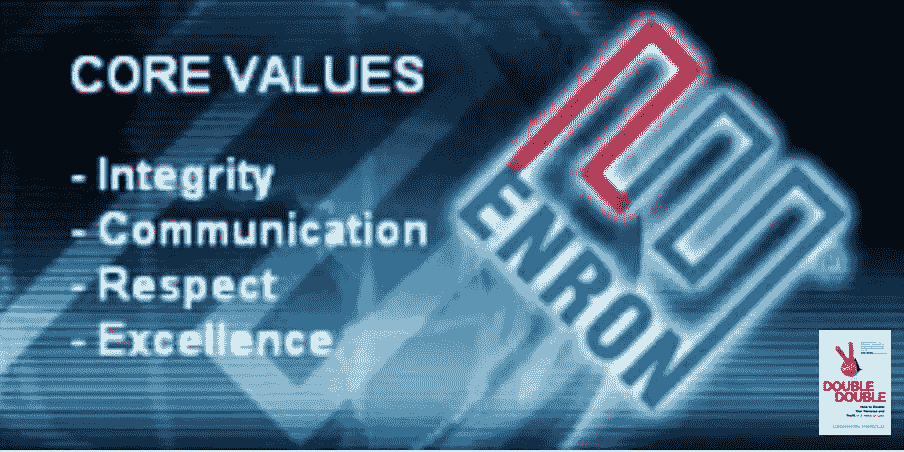

# 如何扩大你的创业规模:第三部分——组织结构

> 原文：<https://medium.com/hackernoon/how-to-scale-your-startup-part-3-organizational-structure-1e3c8736e33c>

这是 4 篇系列文章中的第 3 篇。你可以在这里找到 [*介绍帖*](/@chriseyin/how-to-scale-your-startup-an-intro-219185513449#.u6vb4kcue) *和* [*第二帖*](/@chriseyin/how-to-scale-your-startup-part-2-people-6bee26696ae8#.pll03ofed) *。*

作为复习——我们使用安迪·格罗夫[的](https://en.wikipedia.org/wiki/Andrew_Grove)高产出管理[中的“黑盒”比喻来帮助我们思考扩展。](https://www.amazon.com/High-Output-Management-Andrew-Grove/dp/0679762884)

via [High Output Management](https://www.amazon.com/High-Output-Management-Andrew-Grove/dp/0679762884)

黑盒由 3 部分组成——输入、机器本身和输出。如果我们将此转化为如何看待你的创业，我们可以说:

*   输入→人员
*   机器→组织结构
*   输出→结果

在这篇文章中，我们将关注第二部分——机器或组织结构。对于更早的帖子，你可以在这里找到[介绍](/@chriseyin/how-to-scale-your-startup-an-intro-219185513449#.u6vb4kcue)和[第二个关于这里的人](https://42hire.com/how-to-scale-your-startup-part-2-people-6bee26696ae8#.pll03ofed)。

一旦你有了优秀的员工，你需要确保他们正在产生你的业务需要的结果。这意味着创造一个环境，让人们能够尽最大努力工作。你要做的是制造一台机器，它接受输入，并持续产生想要的输出。

随着像 Zappos 这样的公司尝试 holacracy，初创公司很容易认为他们应该雇佣聪明人，让他们自由发展。然而，无管理的梦想并不总是成功的，在任何合理的规模下，你都可能需要开始考虑实现实际的结构管理。

因此，要制造这台机器，你必须首先设计它，确定它是如何工作的，然后确保它继续良好地工作。对于初创公司，这转化为组织设计，定义你的文化/价值观，然后保持效率。

**组织设计**

和任何机器一样，你要做的第一件事就是设计它。这意味着定义期望的输出，然后反向工作，找出如何持续实现它。绘制和展示这一点的常见方式是通过组织结构图。

创建组织结构图的最重要的原因之一是透明度。不是传统意义上的透明(公开/诚实等)，而是更多的是确保团队中的每个人都清楚工作是如何在组织中流动并完成的。

没有一个清晰的画面，你的员工将无法看到他们的工作对最终结果的贡献。然后，团队很容易变得孤立，只关注自己的部分，而不是全球产出。当你只是把屎扔过墙，扔进黑洞的时候，为什么要担心最终的结果呢？

然而，如果每个人都能看到工作是如何在组织中流动的，他们就能看到他们的工作是如何融入大局的。更重要的是，它将关注点从个人转移到集体产出上。它把群体产出的责任放在整个公司身上。当公司的管道透明时，就更容易发现效率低下的地方，并使事情变得更好。

The 1st org chart (via [Wikipedia](https://en.wikipedia.org/wiki/Daniel_McCallum#/media/File:Organizational_diagram_of_the_New_York_and_Erie_Railroad,_1855.jpg))

组织结构图来自一个名叫[的人，丹尼尔·麦卡勒姆](https://en.wikipedia.org/wiki/Daniel_McCallum)。作为一名自学成才的工程师，他在 19 世纪晚期成为了纽约州[伊利铁路](https://en.wikipedia.org/wiki/Erie_Railroad)的总负责人。这是一个拥有 5000 多名员工的庞大组织，几条铁路跨越了 2300 多英里(另一个例子来自 [Harrison Metal](https://www.harrisonmetal.com/) 的优秀[综合管理](https://www.harrisonmetal.com/courses/foundations-general-management)课程)。

当时，经营一家大型铁路公司是一件无利可图的事情。人数、规模和复杂性使其几乎无法管理。[正如麦卡勒姆所言](https://en.wikipedia.org/wiki/Daniel_McCallum#Large-scale_management_problems_at_New_York_.26_Erie_Railroad.2C_1850s):

> “一个 50 英里长的道路的管理者可以给它的业务他的专业注意力，并可能经常在线路上从事细节的方向；每个人都是他自己认识的，所有与他的业务有关的问题都会立刻提出来并采取行动。
> 
> 在 500 英里长的政府存在一个非常不同的状态。任何可能适用于短路的业务和范围的系统将被发现完全不足以满足长路的需要。"

因此，麦卡勒姆创建了第一个组织结构图，详细说明了一切将如何一起工作。其目的是在整个公司范围内建立透明度和问责制。虽然你可能不会经营一条大规模的铁路，但是这些创造组织透明度的工具仍然有效。

**文化&价值观**

一旦你定义了你的组织结构，你必须确保人们理解在这个结构中事情是如何完成的。这意味着明确定义你的文化和核心价值观。起初看起来可能很傻，但好的核心价值观将伟大的公司与优秀的公司区分开来。

> 为什么[价值观]如此重要，是因为当你做决定时，它们会成为你回去遵循的首要原则。它成为一种让人们团结一致的方式[……]，也给了你一个清单，你应该能够根据它来决定什么该做，什么不该做。
> 
> — [红杉资本合伙人阿尔弗雷德·林](http://startupclass.samaltman.com/courses/lec10/)

[Enron’s Core Values](http://www.cameronherold.com/blog/culture/want-to-know-what-your-employees-think-of-your-core-values/), displayed in their lobby.

很容易做出无人问津的空心价值观(见安然)。但是，为了创造人们真正相信并指导公司的核心价值观，你必须确保你不只是在说这些东西，而是在实践它们。

回到 Coupa，我们有 3 个价值观— [确保客户成功，关注结果，追求卓越](http://www.coupa.com/company/core-values/)。虽然它们听起来有点公司化，但实际上非常有用。它们深深植根于我们所做的每一件事——表扬、晋升、奖金等等。每件事总是在我们的核心价值观的背景下呈现，它帮助我们区分优先次序，决定做什么(或不做什么)，处理困难的情况等。正如在[上一篇文章](/@chriseyin/how-to-scale-your-startup-part-2-people-6bee26696ae8#.pll03ofed)中提到的，开始实践你的价值观的一个很好的地方是在入职期间。

还有[大量的](http://www.slideshare.net/twilio/scaling-company-values-twilio-techweek-2012) [帖子和](http://startupclass.samaltman.com/courses/lec10/) [榜样](https://www.twilio.com/company/nine-values) [好的](http://www.slideshare.net/Bufferapp/buffer-culture-04) [核心价值观](http://www.slideshare.net/reed2001/culture-1798664)，这里就不赘述了。但是请记住，尽早定义这些是至关重要的，因为[你的文化始于你的第一份工作](https://hunterwalk.com/2013/10/24/for-startups-your-culture-starts-with-your-first-hire/)。虽然一开始很容易保持文化凝聚力，但如果你不管理好它，它就会被稀释。因此，当你扩大规模时，用核心价值观作为框架来维持你的文化。

**保持效率**

除了设计机器&确保它能工作，你还想确保它在组织继续成长时保持高效。这有两个方面——集中/分散和消除障碍。

*集权&分权*

当扩展时，你的输入/组织/目标不断变大。当这种情况发生时，您需要确保机器的每个单独部件仍在尽可能高的水平上运行(产生最大输出)。人们很容易陷入流程中或者负担过重。你可以通过集中或分散某些领域来解决这个问题。

当一个共享的功能有大量的重叠和一致性时，集中化就起作用了。例如，随着 Coupa 的增长，我们的销售团队在流程中遇到了阻碍，相应地，销售时间也减少了。为了更快地发展，我们取消了一些常见的销售职能，并创建了一个集中的团队来处理这一问题——销售运营。这使得我们的销售团队能够专注于他们最擅长的领域，并让我们的销售运营团队来处理。

分权是相反的。如果这些区域足够明显，你可以把它们分开，这样就不会妨碍协调。同样在 Coupa，我们的工程团队最初是一个集中化的团队。每隔几周，我们会重新评估我们所处的位置，并围绕重要的领域进行自我组织。但是随着我们变得越来越大，我们慢了下来——事情需要更长的时间，我们运送的更少。所以我们分散了团队，按照产品来划分。这使得每个单位可以更深入他们的区域，运输更快，拥有更多的所有权。

虽然我们没有发明以上任何一个，但它们都是如何使用集中/分散来保持效率和产出的例子。

*清除路障*

随着任何公司的成长，错误是不可避免的。想要阻止它们再次发生是人之常情。人们用来防止错误再次发生的一个常用工具是制定规则。

很多情况下，你需要规则。但是最终很容易创建太多的规则(有文档记录的和无文档记录的)。当有太多的规则时，可能会感觉有太多的繁文缛节来实际完成事情。

所以你的工作是发现&消除不必要的规则。不是规则，很多事情反而可以用原则来解决。[例如在 AirBnB](http://firstround.com/review/bureaucracy-isnt-inevitable-heres-how-airbnb-beat-it/) ，他们有一条规定，所有的花费都需要预先批准。为了突破它，他们取消了规则，取而代之的是“运用你的最佳判断”。这不仅节省了大量时间，而且花费没有增加。三赢。

The USS Santa Fe (via [Wikipedia](https://commons.wikimedia.org/wiki/File:US_Navy_110824-N-UK333-041_The_USS_Santa_Fe_returns_to_Joint_Base_Pearl_Harbor-Hickman.jpg))

另一个很好的例子来自[大卫·马奎特](http://www.davidmarquet.com/)，美国海军圣达菲号前指挥官。他带领该舰从“最差到第一”，取得了海军最高的保留和作战排名。

在他的书《调转船头》中，大卫讲述了一名士官违反一条重要规则的情况——操作潜艇时，你永远不要碰贴有红色标签的机器。细节有点深奥，但足以说明——当你携带核武器潜入深海时，确保你的船员没有拉动覆盖着红色标签的手柄是很重要的。

当这位警官违反了这条规定，小组进行了验尸。在头脑风暴如何防止这种情况再次发生时，他们的想法自然倾向于新的规则——新的必要培训、更多的主管/批准等。

然而，该团队决定尝试通过原则来解决这个问题。他们实施了他们所谓的“有意行动”——所以在你做任何事情之前，你会大声说出你将要做的事情。通过这样做，他们希望对抗人们在执行无意识任务时有时会成为受害者的无意识“自动驾驶”模式。

这不是规定，如果你不做也不会受到惩罚。但通过这一原则，该团队实现了最高的绩效评级之一，并且根据 David 的说法，这是“减少错误并使圣达菲运营出色的唯一最强大的机制。”

如果一艘水下容纳 100 多人的大型潜艇的指挥官能够在没有规则的情况下建立一个伟大的组织，那么你的创业公司也可以。

总而言之——除了雇佣优秀的员工之外，你还必须确保你在建立一个人们可以发挥最大潜能的地方。

因此，设计一个透明的系统，定义它如何工作，并通过集中/分散以及消除障碍来保持效率。

在下一篇(也是最后一篇)文章中，我们将总结如何思考你的组织正在产生的结果。

[如何扩大你的创业规模第一部分:简介](https://hackernoon.com/how-to-scale-your-startup-an-intro-219185513449#.7suszsz78)

[如何扩大你的创业规模第二部分:人](/@chriseyin/how-to-scale-your-startup-part-2-people-6bee26696ae8#.pae05oxys)

[如何扩展你的创业第四部分:结果](/@chriseyin/how-to-scale-your-startup-part-4-results-e1ff5a982bd1#.10c8g447n)

*如果你喜欢这个帖子，点击下面的心形，在*[*Twitter(@ chriseyin)*](https://twitter.com/chriseyin)*上关注我。任何反馈/想法、评论或* [*随时给我发邮件*](mailto:christopher.e.yin@gmail.com) *。*

> [黑客中午](http://bit.ly/Hackernoon)是黑客如何开始他们的下午。我们是这个家庭的一员。我们现在[接受投稿](http://bit.ly/hackernoonsubmission)并乐意[讨论广告&赞助](mailto:partners@amipublications.com)机会。
> 
> 如果你喜欢这个故事，我们推荐你阅读我们的[最新科技故事](http://bit.ly/hackernoonlatestt)和[趋势科技故事](https://hackernoon.com/trending)。直到下一次，不要把世界的现实想当然！

