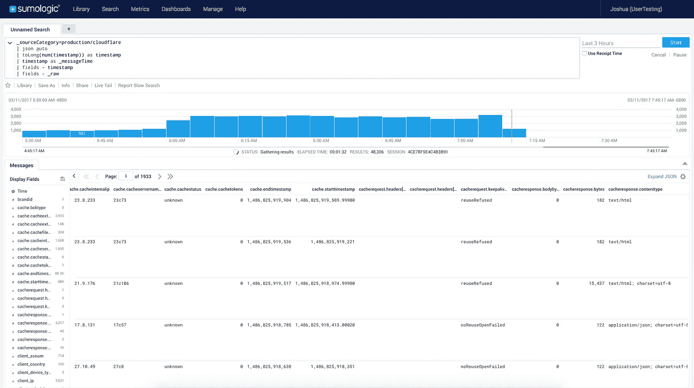

# 如何使用 Lambda 将 Cloudflare 日志传送到 Sumo Logic

> 原文：<https://medium.com/hackernoon/how-to-ship-cloudflare-logs-to-sumo-logic-with-lambda-a119e5379f02>


随着 Cloudflare 新的[企业日志共享(ELS) REST API](https://support.cloudflare.com/hc/en-us/articles/216672448-Enterprise-Log-Share-REST-API) 的出现，现在可以很容易地通过单个 RayID (Cloudflare 对请求 ID 的别称)、定义的时间段或从上次下载的 [RayID](https://hackernoon.com/tagged/rayid) 下载和检查区域的访问日志。在我们的例子中，我们将所有其他日志发送到 [Sumo Logic](https://www.sumologic.com) ，这样每个人都可以用任何可以想象的方式来分析和解析它们！

不幸的是，似乎没有现成的方法来整合这两者。令人欣慰的是， [AWS](https://hackernoon.com/tagged/aws) Lambda 函数现在可以使用 [CloudWatch 预定事件](https://docs.aws.amazon.com/AmazonCloudWatch/latest/events/ScheduledEvents.html)按预定的时间间隔运行，有点像服务器上的 cron 作业。

在自己运行的物理/虚拟服务器上使用 Lambda 函数代替作业有几个明显的好处:

1.  **低成本:**执行一个 Lambda 函数[的成本仅次于*零成本*](https://aws.amazon.com/lambda/pricing/) ，如果您保持在 AWS 每月分发的免费层中，实际上可能什么成本都没有
2.  **易于开发:**在我的例子中，我使用了[无服务器框架](https://serverless.com/)来允许我快速启动和运行，在本地调用一个函数(这是快速开发和迭代的关键)，并且它使部署变得简单。我也推荐去看看 apex 。
3.  **速度:**λ函数*快。这对于需要速度的事情很重要，比如像我们这样的高流量网站解析和获取日志。*
4.  **无需构建/维护服务器:**编写代码、测试和部署——就这样！没有厨师，没有码头工人，什么都没有…只要写下你的功能，交付它，它就是活的。

# 它是如何工作的

首先，您需要[创建一个新的 HTTP 源](https://help.sumologic.com/Send_Data/Sources/02Sources_for_Hosted_Collectors/HTTP_Source)来接收 Cloudflare 日志。设置源类别、主机等。以使 Lambda 函数的配置更容易。

接下来，创建一个新的无服务器函数:

```
$ mkdir -p ~/cloudflareToSumoLogic$ cd ~/cloudflareToSumoLogic$ serverless create \
    --name cloudflareToSumoLogic \
    --template aws-nodejs \
    --path ~/cloudflareToSumoLogic
```

让我们浏览一下`serverless.yml`配置文件:

```
functions:

***# This is the name of the Lambda function***  cloudflareToSumoLogic:***# This is the name of the handler; this is the "main"* # *function called by Lambda***
    handler: index.handler ***# This function was written to be run every one minute
    # Any adjustments will require code changes...***
    events:
      - schedule: rate(1 minute) ***# Required environment variables:***
    environment:
      **# Grab this URL from the Sumo Logic source you just created**
      SUMO_ENDPOINT: ...
      **# Get these values from the Cloudflare admin UI**
      CLOUDFLARE_ZONE_ID: ...
      CLOUDFLARE_AUTH_EMAIL: ...
      CLOUDFLARE_AUTH_KEY: ...
```

最后，您将需要这个函数:

现在，尝试一下吧！

```
$ serverless invoke local -f cloudflareToSumoLogicstartTime: 2017-02-11T15:07:00.000Z
endTime: 2017-02-11T15:08:00.000ZcloudflareOpts: { method: 'GET',
  hostname: 'api.cloudflare.com',
  path: '/client/v4/zones/.../logs/requests?start=1486825620&end=1486825680',
  headers:
   { 'X-Auth-Email': '[.](mailto:jdelsman@usertesting.com)..',
     'X-Auth-Key': '...' } }res.statusCode:  200res.headers:  { date: 'Sat, 11 Feb 2017 15:38:40 GMT',
  'content-type': 'application/json',
  'transfer-encoding': 'chunked',
  connection: 'close',
  'set-cookie': [ '__cfduid=...; expires=Sun, 11-Feb-18 15:38:39 GMT; path=/; domain=.cloudflare.com; HttpOnly' ],
  vary: 'Accept-Encoding',
  'x-cf-request-id': '00000000-0000-0000-0000-000000000000',
  'strict-transport-security': 'max-age=31536000',
  'served-in-seconds': '0.355',
  server: 'cloudflare-nginx',
  'cf-ray': '...-ORD' }Log events: 659
```

一切都好吗？是时候部署了:

```
$ serverless deployServerless: Packaging service...
Serverless: Uploading CloudFormation file to S3...
Serverless: Uploading service .zip file to S3 (9.45 KB)...
Serverless: Updating Stack...
Serverless: Checking Stack update progress...
.....................
Serverless: Stack update finished...
Serverless: Removing old service versions...Service Information
service: cloudflareToSumoLogic
region: us-east-1
api keys:
  None
endpoints:
  None
functions:
  cloudflareToSumoLogic
```

## 在 Sumo Logic 中分析摄取的日志



现在您的日志每分钟都在被接收，您可以运行下面的查询，您应该能够开始看到类似上面截图的结果:

```
_sourceCategory=...
| json auto
| toLong(num(timestamp)) as timestamp
| timestamp as _messageTime
| fields - timestamp
| fields - _raw
```

将`_sourceCategory`替换为之前为 Cloudflare 日志创建的 HTTP 源类别。这个代码片段自动解析 JSON 行，将日志时间戳`timestamp`转换为时间对象，用日志时间戳替换`_messageTime`，然后删除原始 JSON 对象及其接收时间戳。

[](http://bit.ly/HackernoonFB)[](https://goo.gl/k7XYbx)[](https://goo.gl/4ofytp)

> [黑客中午](http://bit.ly/Hackernoon)是黑客如何开始他们的下午。我们是 [@AMI](http://bit.ly/atAMIatAMI) 家庭的一员。我们现在[接受投稿](http://bit.ly/hackernoonsubmission)并乐意[讨论广告&赞助](mailto:partners@amipublications.com)机会。
> 
> 如果你喜欢这个故事，我们推荐你阅读我们的[最新科技故事](http://bit.ly/hackernoonlatestt)和[趋势科技故事](https://hackernoon.com/trending)。直到下一次，不要把世界的现实想当然！

