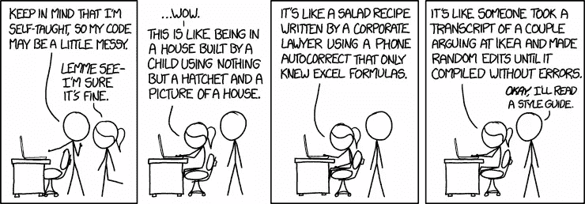

# 作家能教给程序员什么

> 原文：<https://medium.com/hackernoon/how-to-solve-programmers-block-18363c040656>

## 希瑟·奈特，机器人专家

[https://imgs.xkcd.com/comics/code_quality.png](https://imgs.xkcd.com/comics/code_quality.png)

你有没有注意到没有关于编程的自助书籍？当然，对于循环有*的解释，以及这种或那种编码语言的指南。但是我们的行为实践呢？如果你一直关注电视节目《硅谷》，你就会知道程序员和作家一样容易被屏蔽:理查德停止睡觉，穿着衣服走进游泳池，但肯定有更好的办法。*

原来作家知道防止程序员卡壳的秘诀。这十个灵感来自写作的技巧将使你成为一个更有效率、更有创造力、更自信的程序员，不管你是新手还是专家程序员。这些是哪里来的？为了减轻我博士最后一年在教师面试时的负罪感，我读了很多关于在飞机上写作的书(见最后的阅读清单)。我发现许多写作书籍都有适用于编程的见解和方法。

显然这个列表是从零开始的。

## 技巧 0:先编程

编程需要专注，人们很忙。那么解决办法是什么呢？我们在早上最有创造力，所以让你一天中的第一个小时神圣不可侵犯。不要安排会议。不要查看你的电子邮件或社交媒体。如果你在家，可能连牙都不刷。对我来说，咖啡是神圣的。但之后，就把自己放在椅子上。(有人说作家最有用的工具是胶水)。像开会一样把这件事列入你的日程*，*，把这段时间从所有其他承诺中解放出来。

## 提示 1:不要害怕使用纸张

在你打开屏幕之前，画出你的想法，在记事本上记下想法，列一个清单。*每天用 15 分钟写论文*强调草稿零的重要性，概念模板早于初稿。你整个晚上都在你的潜意识里反复思考。让他们浮出水面。艺术家之路表明自由写作能让你成为更好的程序员(雕塑家、投资银行家)。做对你有用的事。

## 技巧 2:养成编程瘾

人类是习惯性动物。所以让编程成为你时间表的一部分，设定合理的目标。这个概念来源于*记下骨头*。几个星期后，如果你放弃一个疗程，你会开始想念它。我发誓，我的博士导师在每次导师会议的前 10 分钟，都在敲打一些不起作用的项目。会有抱怨，在心流中失去时间敏感性的标志，以及最终把自己撕裂开开始我们的会议。(那时，我也做好了充分的准备。)分分秒秒累积起来，建立一个时间表是保证完成任务的最好方法。

## 技巧 3:跟踪想法和错误

把想法和问题记录下来，当你陷入困境或寻找下一件要解决的事情时，你也可以回来。编程时间表(技巧 2)是一个很好的开始，但是创造力可能并不总是遵循时间表，或者你可能正忙于其他事情，所以尽可能抓住你的想法。他们说写作带来更多的写作，所以你写得越多，你对编码的想法就越多。我总是带着笔记本。

## 秘诀 4:交朋友

当我们有责任感时，人们会做得更好。建立每周检查制度，在这里你可以设定目标，讨论障碍，分享资源或策略。例如，我在 CMU 的计算机视觉朋友们每周一早上在我们学校的咖啡厅里进行 15 分钟的站立会议。所有人(甚至程序员)都关心社会压力。亲自去最好，但也要使用在线论坛。人们可能会很高兴你询问他们的代码。

## 技巧 5:向他人学习

就像把东西拆开通常比把东西放在一起更早一样，程序员可以通过阅读和修改他人的代码来培养代码的“耳朵”。在《风格的感觉》一书中，斯蒂芬·平克强调“优秀的作家都是热情的读者。”与写作不同，非常鼓励使用预先存在的库和样本来支撑你的项目需求。参考事物的来源，但是当有人已经解决了一个问题时，没有必要重新发明轮子。

## 提示 6。善待你的缪斯女神

概念化的代码应该如何构造或者解决什么问题开始于一个创造性的过程。想象一下，你的办公室里有两张桌子，一张用来写作(当前的提示)，一张用来编辑(提示 7)。写字台看着窗外，异想天开，开放式，鼓励你追逐一个想法的蝴蝶。不要害怕散步或尝试一些可能是也可能不是最好的最终解决方案的事情。我的一个最有效率的实习生在 CMU 的走廊里踱来踱去，思考她的代码的下一步。编程和写作一样，不仅仅是在屏幕上输入字符，所以要庆祝在种植前给土壤施肥，种植后浇水的活动。

## 技巧 7。无情(但不卑鄙)

如果你处于剪辑阶段，你经常会“杀死你的宠儿”。这句话被许多作家广为流传，包括斯蒂芬·金。就是去掉多余的。例如，你可能花了很多时间让代码块工作，但是现在你有了更好的东西。如果你真的不能忍受与它分离，就把它全部注释掉，但是杀，杀，杀。与技巧 6 相反，你的编辑桌没有装饰，放在角落里。程序员通常擅长这一步(尽管我自己更喜欢 windows)。棘手的是发现错误而不反责。谷歌显然给员工失败奖金，因为他们搞砸了根本不可能成功的项目。所以，当涉及到你的代码的基本目的时，要无情，但当涉及到你自己时，要仁慈。

## 提示 8:小心知识的诅咒

我们不(经常)用汇编语言编程的原因之一是它不容易被人类阅读。随着高级编码语言赋予我们抽象的能力，我们也应该选择有意义的抽象。如果以后需要修改代码，将某个东西称为*变量 1* 和*变量 2* 对使用你的代码的任何人(尤其是你自己)都是一种伤害。写作的最大挑战之一是确保观众跟得上。使用空白，注释你的代码，花时间创建合理的抽象和结构。如果人们不能解构这个故事，你的散文(或代码)再聪明也没用。

## 提示 9:在向下的斜坡上结束

每天早上应该在前一天开始。把每天最后 10%的时间用来做第二天要做的事情。也许你把下一个代码块构造成注释。也许你可以列个清单。我开着一辆手动档汽车，通过停在一个下坡上，我知道即使我汽车的电池在一夜之间耗尽，我也能够利用斜坡的势能来启动我的发动机。这就像前一天晚上把你的运动服放在外面一样。你不用想，你只要去。

把这个当做程序员自助清单。编程是一个创造性的过程，就像写作一样，我相信这十个策略可以让你更有创造力，更有效率，更不容易卡住。

## 阅读列表:

1.  每天十五分钟内写完论文。琼·博尔克。
2.  [艺人之道](https://www.amazon.com/Artists-Way-25th-Anniversary/dp/0143129252/ref=sr_1_3?s=books&ie=UTF8&qid=1496510681&sr=1-3&keywords=the+artist%27s+way)。朱莉娅·卡梅隆。
3.  [记下骨头](https://www.amazon.com/Writing-Down-Bones-Freeing-Writer)。娜塔莉·戈德堡。
4.  写作:工艺回忆录。斯蒂芬·金。
5.  [时尚感](https://www.amazon.com/Sense-Style-Thinking-Persons-Writing)。史蒂芬·平克。
6.  [如何大量写作:高效学术写作实用指南](https://www.amazon.com/How-Write-Lot-Practical-Productive)。保罗·j·西尔维亚。
7.  [如果要写](https://www.amazon.com/You-Want-Write-Brenda-Ueland)。布伦达·尤兰。
8.  写得好:写非小说的经典指南。威廉·津瑟。

**你使用什么方法？让我们在评论中扩展这个列表。**

> [黑客中午](http://bit.ly/Hackernoon)是黑客如何开始他们的下午。我们是 AMI 家庭的一员。我们现在[接受投稿](http://bit.ly/hackernoonsubmission)并乐意[讨论广告&赞助](mailto:partners@amipublications.com)机会。
> 
> 如果你喜欢这个故事，我们推荐你阅读我们的[最新科技故事](http://bit.ly/hackernoonlatestt)和[趋势科技故事](https://hackernoon.com/trending)。直到下一次，不要把世界的现实想当然！

