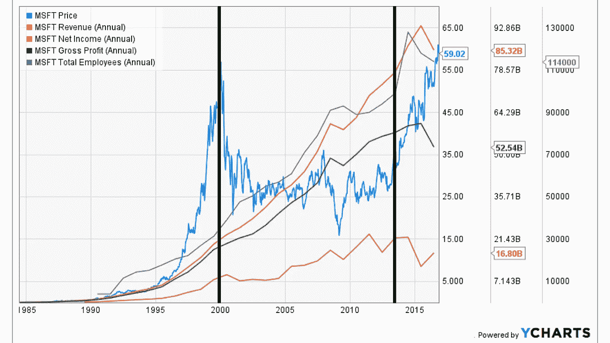

# 如何在数字世界中生存和发展

> 原文：<https://medium.com/hackernoon/how-to-survive-and-grow-in-a-digital-world-25baceda185d>

## ***敢于与众不同。创造对话。保持相关性。***

John Cleese Graffity in Eindhoven, The Netherlands

> "商业领袖应该怎样做才能在数字世界中保持成功？"
> 
> "大型老牌企业如何重塑自我？"
> 
> "创业公司应该如何应对增长和复杂性？"

当我在各种会议和研讨会上讲授和谈论创新、商业和领导力时，我总是会收到这些问题。

这并不奇怪。毕竟，我们生活在一个不断变化的数字世界，毫无疑问，由此产生的不确定性给最佳应对方式带来了巨大的焦虑。这对于扩大规模和已建立的企业来说尤其如此。

每个人都可以看到数字社会的机遇，但理解*商业领袖需要做什么才能在今天的数字环境中取得成功却不那么明显。*

## **“但是……建议无处不在”**

商业领袖有大量的书籍和文章来帮助他们应对数字世界的挑战和机遇。我自己也就这些事情写过几篇 [*中*](https://vunela.com/5-ways-business-can-thrive-in-an-age-of-disruptive-technology-a-millennial-culture-and-a-sharing-5e1db813e0fe) 的帖子。

大多数此类“解决方案”都是围绕从对数字经济至关重要的快速增长的科技公司那里学到的东西构建的。这些高速增长的公司已经利用网络技术的机会开发新的商业模式。信任、价值和财富是通过平台、关系和网络创造的，而不是对工人和实物资产的管理。

这些“年轻”公司的成功让许多评论家得出结论，成长中的公司应该尽一切努力保留“创业的感觉”。

对于老牌企业来说，解决办法是“更像初创公司”。人们普遍认为，识别“创业文化”的独特特征，然后将它们融入现有组织，是现任者在数字世界中生存的最佳方式。

然而，大多数商业领袖都很难遵循这些建议并实施变革。想想 [*东芝*](http://ww2.cfo.com/corporate-finance/2017/04/toshiba-issues-warning/) 和 [*优步*](https://www.nytimes.com/2017/02/22/technology/uber-workplace-culture.html?_r=0) 。

例如，模仿成功创业公司的流程往往会导致空洞的“剧院”。引入了“创业文化”的表面现象(开放的工作空间或更宽松的着装规范)，但并没有对工作实践做出真正的改变。这种戏剧通常会遭到怀疑(组织内部和外部)，尤其是当它不能立即给业务绩效带来预期的积极影响时。

但这并不意味着建议是错误的。需要不断重新发明*。为了实现真正的变革，我们只需要对需要做的事情更加现实一点。*

因此，这里有三个策略可以帮助*所有的*商业领袖适应数字世界的新现实。

## **①敢于与众不同！**

保守是组织的本性。大多数企业将继续依赖现有的结构、流程和程序，尤其是当这种方法在过去取得成功时。即使当商业文化不适合当代对敏捷和富有想象力的决策的需求时，组织也很难改变。

但是他们必须改变。公司中的每个人都需要不断地询问结构、过程和程序是否仍然有正确的结果。用杰夫·贝索斯在最近给亚马逊股东的信中的话说:

> **“是我们拥有流程，还是流程拥有我们。”**

每个人都需要非常诚实地判断什么过程有效，什么过程无效。

 [## 贝佐斯致股东信:不要让世界把你逼成“第二天”公司

### 贝佐斯将公司的成功归功于亚马逊对客户结果的精确关注。他说亚马逊总是关注…

www.cnbc.com](http://www.cnbc.com/2017/04/12/amazon-jeff-bezos-2017-shareholder-letter.html) 

这似乎是显而易见的，但有许多力量反对这种对商业组织进行彻底自我批评的方法。等级制度、根深蒂固的利益和根深蒂固的运作方式会使一种新的文化很难制度化。

对于由中介机构(如律师、会计师、审计师和其他顾问)控制的组织来说尤其如此。这些中介往往比较保守，厌恶风险，不愿意“跳出框框”思考。

他们通常推荐标准化的安排和一刀切的“最佳实践”，而不是向客户提供原创的、定制的和更优化的解决方案。这样，这样的中介助长了企业的保守主义。

这有几个原因。

首先，在企业组织和流程领域有大量的最佳实践，为中介机构提供了一种确定感和舒适感。因此，中介机构在向客户提供建议时，通常会建议采用“既定的”最佳实践。

第二，中介机构通常投入大量时间和金钱来熟悉这种既定的“最佳做法”，使它们难以推荐新的和创新的解决方案。

最后，推广新的和创新的方法，如果不成功，可能会损害中介机构的专业声誉。

然而，商业领袖(以及他们的顾问)应该敢于与众不同，敢于偏离既定的解决方案。他们应该不断地问:这些结构、实践和过程还在工作吗？如果没有，就需要进行公开和诚实的讨论，讨论需要做些什么才能带来真正的改变。

对组织结构和流程的相关性提出尖锐的问题需要成为企业文化/DNA 不可或缺的一部分。

建立这种不断提出难题的文化的一个方法是重新审视商业沟通策略。

## **(2)创造对话！**

商业组织在历史上一直是封闭的系统，缺乏透明度和信息流。

然而，公开和透明有多重好处。例如，它们有助于在利益相关者之间建立“尊重”和“信任”,并且——至关重要的——对成功所必需的业务绩效进行公开和诚实的评估。纵观企业界，投资者、经理、员工和消费者之间很容易产生不信任感，因此建立和维持健康的关系至关重要。

在这种情况下，尤其重要的是一个企业组织中所有不同利益攸关方之间进行非中介和包容性对话的可能性。最明显的是，公开对话涉及不同风格的信息传播和交流。

它不仅仅是分享信息，即信息从组织的一部分单向传播到另一部分，或从组织单向传播到外部行为者，如投资者或消费者。这也是为了与这些利益相关者建立持续和建设性的对话。

这种方法包括承认潜在的好处，如实时反馈，这些好处来自组织内部以及组织与“外部”之间更加自由的信息流动。

这种非中介的对话的特点是更加个性化和粗糙的交流方式。通过这种方式，可以将不同的观点带到桌面上，并允许“最佳创意胜出”文化蓬勃发展。

显然，社交媒体(如 *LinkedIn* 、 *Twitter* 、 *Medium* 、 *YouTube)* 是打破传统企业沟通形式的一个非常有用的手段。

不言而喻，社交媒体与更大程度的开放相关联。然而，令人惊讶的是，只有少数公司首席执行官和其他高管使用社交媒体(尽管社交媒体代表着社会的文化转变)。

 [## 首席执行官们需要出现在社交媒体上——为什么他们没有呢？

### 如今，很难找到不在脸书的人——除非这个人恰好是《财富》500 强的首席执行官。一个…

blog.hootsuite.com](https://blog.hootsuite.com/ceos-need-to-use-social-media/) 

这里应该注意的是，社交媒体活动与企业营销和品牌关系不大，与讲故事关系更大。首席执行官和其他高管应该利用社交媒体告诉市场他们(企业)在哪里，他们学到了什么，他们将去哪里。

## **③切题！**

那么，商业文化的最终目标是什么？在这种文化中，所有利益相关者*都以诚实的方式解决棘手的问题。*

为了在今天取得成功，企业领导人需要专注于保持在市场中的相关性。思考为什么如此多的企业没有认识到并解决相关性问题是有帮助的。这些不太成功的公司有什么共同点？

简短的回答？对盈利能力和财务指标的短视和短期关注。

大多数领导者更喜欢专注于围绕现有产品或服务建立的既定商业模式的执行。了解并专注于创新和消费者体验的高管经常发现自己在核心决策过程中被边缘化。

特别是上市公司，容易过分强调财务指标，如“净资产收益率”(RONA)、资本配置收益率和内部收益率(IRR)。

当然，关注盈利能力和财务指标很重要。

但是，我们必须认识到，强调以季度收益和短期股价表现为目标的衡量标准，很容易分散组织对重要业务任务的注意力，这些任务是确定有助于他们在未来保持相关性的战略。

例如，一家企业可能仍然利润丰厚，尽管它开始失去与消费者的相关性。史蒂夫·鲍尔默在 2000 年接替创始人比尔·盖茨成为首席执行官后，这种情况就发生在他领导下的微软身上。

在接下来的十年里，鲍尔默的销售额翻了三番，利润翻了一番，并创造了大量的就业机会。他收购了 *Skype* ，推出了 *Xbox* 。用任何传统的标准来衡量，史蒂夫·鲍尔默都被认为是成功的。

Microsoft under Steve Ballmer (January 2000 — February 2014) — Financial Metrics

但如果一家公司的目的是保持相关性，那么鲍尔默并不成功。

在一篇博文中，硅谷连续创业者史蒂夫·布兰克解释说，鲍尔默未能理解在他担任首席执行官期间发生的最重要的技术发展。他让其他通常更年轻的企业进驻并获利。想想搜索引擎(*谷歌*)、智能手机(*苹果*)、移动操作系统(*谷歌*和*苹果*)、媒体(*网飞*和*苹果*)以及云(*亚马逊*)。在每一个案例中，微软都没能发现新的机会。

直截了当地说，在鲍尔默的领导下，*微软*不再重要。一个网络技术和移动消费的新世界到来了，而微软没能足够快地适应。该公司错过了这些发展，因为它专注于短期财务指标，而不是设计与下一代相关的产品。

新任 CEO 塞特亚·纳德拉接任后，*微软*转变方向，专注于商业云服务( *Azure* )和认知服务(语音识别、人工智能)。从相关性的角度来看，这一新的战略方向是明智的。

微软通过自我革新得以生存。然而，公司历史上充斥着许多公司未能扭转趋势，结果默默无闻的例子。想到*诺基亚*或者*柯达*。他们在各自市场的快速变化使他们的产品/服务变得无关紧要后崩溃了。

## 外卖

而这才是重点。我们需要建立一种商业文化，在这种文化中，所有利益相关者都参与对话，以诚实的方式解决棘手的问题。通过这样做，企业给了自己在数字时代保持相关性的最佳机会。

有趣的是，这三个策略——“**敢于与众不同**”、“**创造对话**”和“**与众不同**”——对其他类型的组织也很重要，比如政府或大学，而不仅仅是企业。

但是，更重要的是，在一个每个人都必须与人工智能和机器人打交道的时代，它们还可以帮助个人。

 [## 埃隆·马斯克:人类必须与机器融合，否则在人工智能时代将变得无关紧要

### 马斯克解释了他所说的计算机可以以“每秒一万亿比特”的速度进行通信的意思，而人类…

www.cnbc.com](http://www.cnbc.com/2017/02/13/elon-musk-humans-merge-machines-cyborg-artificial-intelligence-robots.html) 

***请按下“心脏按钮”或留下评论。***

***每周三都有新故事。因此，如果你关注我，你不会错过我关于颠覆性技术的指数增长如何改变我们生活和工作方式的最新想法。***

> [黑客中午](http://bit.ly/Hackernoon)是黑客如何开始他们的下午。我们是 [@AMI](http://bit.ly/atAMIatAMI) 家庭的一员。我们现在[接受投稿](http://bit.ly/hackernoonsubmission)并乐意[讨论广告&赞助](mailto:partners@amipublications.com)机会。
> 
> 如果你喜欢这个故事，我们推荐你阅读我们的[最新科技故事](http://bit.ly/hackernoonlatestt)和[趋势科技故事](https://hackernoon.com/trending)。直到下一次，不要把世界的现实想当然！

