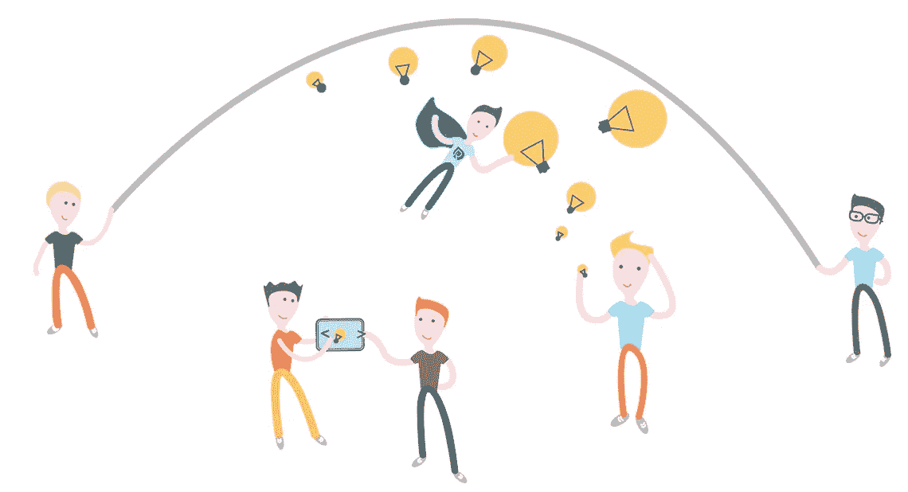

# 我有个主意，下一步是什么？逐步指南

> 原文：<https://medium.com/hackernoon/how-to-turn-idea-into-a-product-step-by-step-guide-82c0fe911ee>

大量的想法浮现在人们的脑海中。你可以自己检查一下——一天之内，我们的大脑有可能产生无数个这样的问题。一旦你得到一个真正好的或者你已经得到了。生意就是这样开始的。但是等等，失败不也是同样的情况吗？其实不是。我们故事的两个版本之间有一定的差异。一个版本取得了高质量和高利润的成功结果。另一个有一个痛苦的工作流程和许多挑战，除了浪费时间之外没有带来任何东西。让我们来看看两者的区别，并探索如何将创意转化为产品。

中国最伟大的将军孙子不仅是中国古代的军事家和历史人物。他也是一个真正的哲学家，几个世纪后成为现代商业的指南。他的著作《孙子兵法》影响了西方和东方的商业世界。在中国最聪明的公司的办公室里，你可以看到写有孙子的书法语录海报。那么每个足智多谋的领导者都想实施的他的战略的秘密是什么呢？有一个复杂的行动，著名的将军建议获胜。孙子说:“古代的好战士首先把自己置于失败的可能性之外，然后等待击败敌人的机会。这意味着如果你要创业，你必须建立一个真正强大的平台，以最小化风险。过程中总会有一些危险，由不同的原因造成。但是在你的道路的最开始，只有一个想法，你应该用强有力的战略和战术来保护自己。那怎么办呢？

# 分析——您必须拥有的第一件东西

是的，分析在你的创业中扮演着最重要的角色。逻辑和渐进的研究将让你对你的产品及其独特的价值主张有一个平衡的理解。此外，你会发现一个明确的项目目标和收入流，客户细分，对问题的完整和更深入的理解，你的产品需要解决。让我们更详细地看看这些过程。

# 您希望通过该产品达到的目标

目的和目标是我们应该与高度动机、灵感等相关联的东西。但“一个目标”这个词应该对应的是“一门学科”。纪律是发展你的想法的一个非常聪明和一致的方法。在理解这个想法时，会问这样的问题:“为什么？干什么？”可能会出现。我们的目标就是答案。

# 项目目标和货币化

你希望你的产品达到哪些目标，以及它将如何赚钱——这些问题就像是对每个初创公司的一次碰撞测试。尽量让答案简单。把你深刻而高尚的想法放在你的秘密盒子里——它们很快就会给你灵感。但是如果你真的想非常清楚地找出项目目标和货币化问题，你应该把答案说得清清楚楚，甚至对一个孩子来说也是如此。然后找一个孩子，说说你的项目目标。继续尝试，直到你的陈述变得尽可能简单。

# 目标受众研究

当你有了目标和现金流，让我们找到你的用户。首先看一下总体情况。目标受众研究是一种探索那些一生中至少会使用你的产品一次的人群的方法。通过民意调查、统计数据分析和行为算法，你会遇到很多这样的人。为什么了解所有这些信息并使用它们很重要？它会给你一个准确的知识，告诉你为什么他们会为你的产品花钱，以及如何让这个过程对双方都更有利可图。例如，如果你知道你的目标受众是如何度过他们的空闲时间的，你就会找到提供你的产品信息的最合适的时间。

# 目标受众和市场分析

为了分析你将要加入的市场，你应该准备好改变你的一些目标。这就是分析的目的——当你在探索某件事的时候——你在改变你的观点。这没关系。它甚至会让你的创业比开始时更好。应该是那样的。市场分析由几个步骤组成，因此你会发现市场需要什么，这里的竞争如何，你进入时会遇到哪些障碍，市场如何增长，当然还有市场趋势。**目标受众**根据产品系列、性别、生活方式、偏好、当前教育或就业状况、居住国家和购买本地化等因素进行细分。细分将帮助你识别不同的用户群。未来，对你的创业公司来说，建立一个集中的、直接的行动(新产品、公关管理、活动等等)将是非常关键的。

# 用户研究

当我们谈论目标受众研究时，我们想到了一群人。但是当我们谈论用户时，我们指的是个人。用户研究和分析将为您提供改善产品、服务和体验的工具。

有很多用户研究方法，你可以选择最适合你的策略。

用户研究中最具互动性的方法是访谈。很明显，因为你是在和你的用户交流，得到在实现阶段有用的答案。

另一个了解用户的好方法是移情图。有句话说得好:试着设身处地为别人着想。移情映射的过程有助于我们思考和考虑用户的想法和感受。此外，它还有助于缩小和获得关于用户的情绪和体验的广泛理解。为了制作移情图，我们需要坚持用户的环境，在我们的脑海中模拟一些情境。然后我们可以发现用户会看到什么，感觉到什么，说什么，以及最终会做什么。如今，我们应该培养对顾客的同理心，让他或她快乐和满意。

# 客户旅程图或 CJM

另一种方法是客户旅程图——对个人与公司、品牌或产品沟通的可视化解释。信息来自用户的视角，但同时强调用户期望和业务需求之间的基本交互。CJM 由人物角色组成，说明用户的需求，时间表或决策和购买的可变阶段，伴随所有过程的情绪，说明与你的品牌互动的接触点，渠道或使用环境:网站，应用程序，呼叫中心，商店等。)但在制作顾客旅程图之前，你需要创建人物角色。大概，**创建人物角色**是用户研究过程中最有趣的部分。

**Persona** 是一个虚构的人物，是目标受众中有着相似习惯、行为和动机的一部分。人物角色包括对用户、**用户故事**、环境、问题和目标的描述。通过个性化、同理心和交流来加深对用户的理解，人物角色的编制是必要的。创建人物角色是相当容易的，尽管有很多工具。毕竟你会认识到苦心经营的好处。进入下一阶段——用例——会容易得多。

# 用例

用例是使用您的产品的一步一步的路径。当我们谈论用例场景时，我们想象一个人来到产品前并如何使用它。我们模拟了一个人可以去网站或在应用程序中的各种情况。事实上，你可以想象自己是用户未来的作者。想象并确定一组可能发生的选项。想想道格拉斯·亚当斯的一本书《银河系漫游指南》——有那么一瞬间，英雄们面对平行现实的主题的可变性。这真的很有趣和快乐。

我们可以参考精益画布方法来总结用户研究过程:战略管理和精益启动模板是为了生成和订购商业模式，还是为了创建新的商业模式。商业模式画布是亚历山大·奥斯特瓦尔德在 2008 年提出的。现在我们知道它是瘦帆布。它包括问题、解决方案、独特价值主张、不公平优势、消费者细分、关键指标、高级概念、渠道、早期采用者、成本结构和收入流。

# 客户开发

用户愿意为之付费的价值是什么？为什么他们一定要用你的产品，而不用别人的？你永远不会知道什么对你的用户更好，直到你做了深入的研究。这是 **UX 设计**——获取数据分析并测试原型。用户体验能给你一种改进食谱的冲动。当你准备蛋糕时，你品尝的是奶油和饼干，对吗？因此，对你的产品也要这样做，明确顾客的需求。

最后一个，我们想提醒您注意的是**的竞争对手分析**。大家都知道 SWOT 分析法。所以用它来识别和建立你的质量标准。重要的是，当你评估竞争对手的优势和劣势时，你会发现你的产品的可能性。你需要做的就是把他们的弱点变成你的优势。

来源:Redentu.com