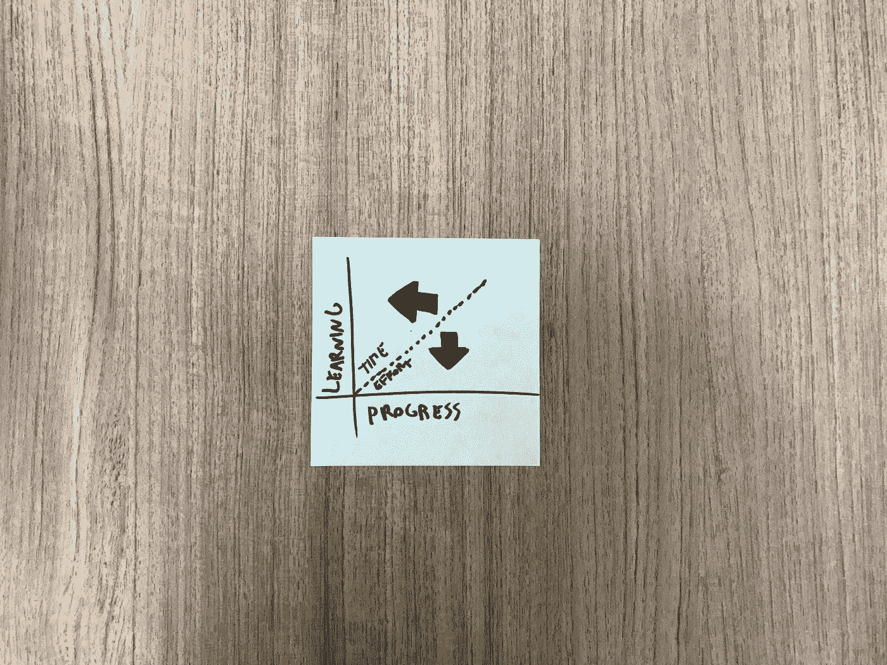
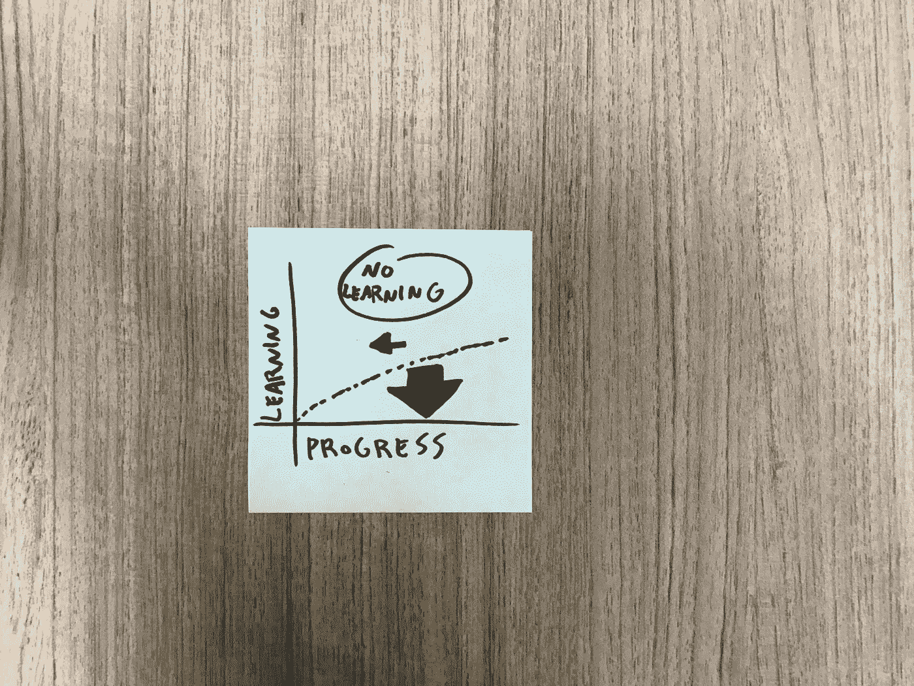
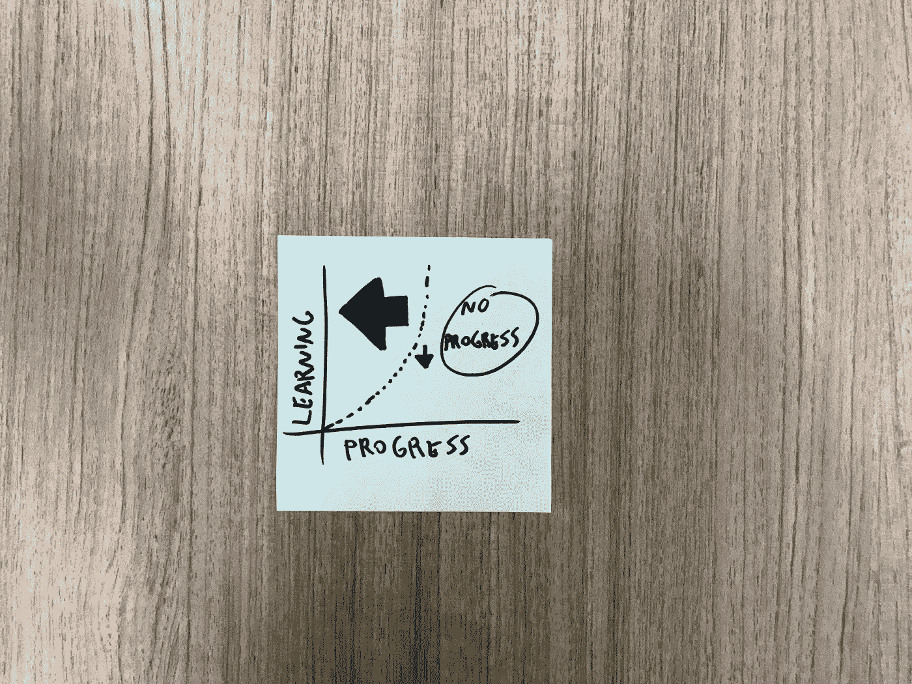
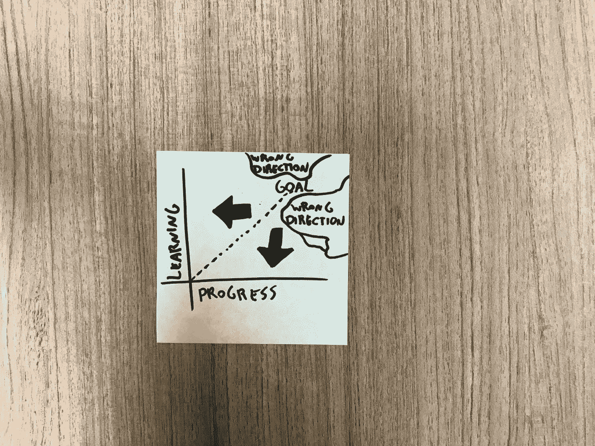

# 如何理解学习与进步的平衡🔊

> 原文：<https://medium.com/hackernoon/how-to-understand-the-balance-between-learning-and-progress-6783e7f711ac>

## 在持续改进中，进步和学习可能会相互影响

A white and dark Knight chess pieces on top of a table. Both are facing the other closely.

Listen to the audio version!

持续改进是指持续改进特定能力、技能、流程、环境等的过程。这是关于尽可能多的运用这种技能，挑战你所知的极限，这样最终会有很大的提高。

> 持续改进是指持续改进特定能力或技能的实践

软件行业中持续改进的一个例子是，一个工程师总是试图学习关于特定技术、开发实践或设计模式的新东西。这可以通过多种方式实现，最常见的是阅读时事通讯，在社交网络中关注某些人，或者通过建立副业来锻炼特定技能。姑且称之为**个人提升**。

然而，持续改进也可以用于团队层面。团队从他们的错误和他们工作的项目的特征中学习。这样，他们的集体知识增加了，这也将提高他们的团队效率。姑且称之为**团队改进**。

个人进步可以通过问一个简单的问题来衡量:**上周以来，你学到了哪些新东西，提高了你对所衡量技能的了解**？不需要精确到“最后一周”，只要是一个合理的时期。还有，答案不需要很大的数字，但也不应该是零。

> 持续改进是指学习与你所衡量的技能相关的新事物。在给定的时间内学到的东西的数量并不重要，只要它不是零。

团队成员可以和团队一起学习，以提高个人水平。这可以通过[提问](/@fagnerbrack/how-to-find-the-best-solution-for-a-bug-33818838502)或[与在某些领域更有经验的团队成员配对](/@fagnerbrack/pair-programming-8cfbf2dc4d00)或尝试新的做事方式来实现，这样他们就可以了解什么可行，什么不可行。

但是还有另外一面。

尽管[学习](https://hackernoon.com/tagged/learning)有可能提高个人知识，并因此提高整体团队能力，但等式中还有其他因素可能会影响是否更专注于学习的决定。

首先，让我们就“团队”的含义达成一致。

一个“团队”是一组个人，他们为了一个共同的目标而集体工作。这个目标需要**的努力**。这种努力可以通过学习或直接朝着共同的目标努力来实现。朝着那个目标努力的叫做 [**进步**](https://hackernoon.com/tagged/progress) 。学习可能与进步没有直接关系**。这并不意味着学习对目标没有用，只是意味着如果你专注于一个目标，那么你可能不得不牺牲另一个目标的一部分。**

**然而，学习有很多种类型。一种是做[尖峰](https://en.wikipedia.org/wiki/Spike_(software_development))，帮助理解问题，因此有可能**减少对目标**的努力，而不是消耗它(提高完成任务的速度)。另一种类型是在你练习手艺时自然发生的一般性学习，这有助于个人的提高。一般来说，学习会提高努力的质量，并能提高速度，但是为了这篇文章的目的，我们将只讨论提高质量的学习类型，而不是提高速度的学习类型。**

> **朝着一个目标的努力和为了提高质量而学习的努力是相似的。但如果你专注于其中一个，就会以另一个为代价。**

****

**An illustration showing the direction of “Time” or “Effort” that is horizontally moving up, being pulled by the “Learning” and “Progress” dimensions**

**在上图中，有两个维度:进步和学习。这个想法是，一个维度应该把另一个维度拉向相反的方向，但是没有一个维度会强到影响为实现目标所花费的时间。它们应该是互补的，以引导时间走向最佳路径。**

**这是公司应该致力于雇佣有经验的工程师的原因之一。**

**如果工程师们没有经验，他们将会把精力过多地集中在学习上，这将会极大地影响进度。**

****

**An illustration showing the direction of “Time” or “Effort” that is horizontally moving up, being pulled by the “Progress” more strongly than “Learning”**

**这也是大公司不愿意雇佣那些认为自己什么都懂，不需要学习的工程师的原因之一。**

**如果工程师不每天学习或改进，那么代码质量将会受到影响。在更复杂的问题环境中使用简单的开发技术缺乏代码质量会产生另一种类型的问题。这些问题将会使那些将来必须维护代码的其他开发人员的“努力”线朝着“进步”的方向变得更强。由于新的团队成员用现有的代码学习，这将影响他们自己的学习能力，也会产生 bug、性能问题、技术债务等。**

**[成为英雄](/@fagnerbrack/thoughts-on-software-development-heroes-5ec656c2e31a)也会造成类似的影响，会影响自己的学习能力。**

****

**An illustration showing the direction of “Time” or “Effort” that is horizontally moving up, being pulled by the “Learning” more strongly than “Progress”**

**当处理学习和朝着目标前进时，你需要找到平衡点。学习太多会影响进步，进步太多会影响学习。这不是一门精确的科学，每个团队或项目的平衡都是不同的。**

**当你**通过回答[的正确问题](/@fagnerbrack/the-journey-for-the-right-question-c3f5b9e90035)来学习**时，你更愿意尝试很多次，失败，学习，再尝试，但这需要额外的努力。然而，如果你不花时间从正确的问题中学习，你可以做得更快。但是如果你失败了一次，你就迷失了，可能不得不重新开始。**

**我们能做的是了解我们的选择，并尝试在每种情况下确定学习和进步之间的正确平衡。**

****

**An illustration showing the direction of “Time” or “Effort” that is being pulled by the “Learning” and “Progress” equally. The Time goes in the direction of a goal, that is located between in the middle of two rocks representing the “wrong direction”.**

**这种平衡会驱使你找到更好的解决方案。**

**持续改进是一种验证你至少在 [**正确方向**](https://hackernoon.com/the-journey-for-the-right-question-c3f5b9e90035) 前进的方法。**

**感谢阅读。如果你有一些反馈，请在推特上联系我。**