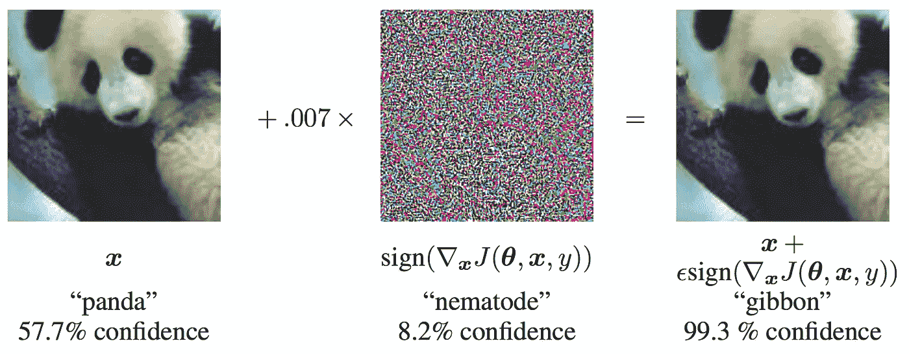

# 今天如何将人工智能武器化

> 原文：<https://medium.com/hackernoon/how-to-weaponize-ai-today-a73dce12b8ed>

像 [Prisma](https://prisma-ai.com/) 和 [FaceApp](https://www.faceapp.com/) (上面的演示照片)这样的玩具表明，尖端的人工智能研究可以在几个月内转化为生产系统。这些应用程序使用起来很有趣，所以它们让人工智能看起来像是噱头。在这篇文章中，我将概述一些最近的人工智能研究，并描述当它用于生产系统时的潜在危险。尚不清楚我们如何才能有效缓解社会和政治混乱。我希望你意识到什么是可能的，并开始思考解决方案。

## 模仿任何人做任何事

2016 年美国大选，假新闻[可能影响了选民](https://web.stanford.edu/~gentzkow/research/fakenews.pdf)。那只是短信。几年后，人们将廉价而可信地合成政客们说的话和可能做的武断事情的假视频。

以下 2016 年 6 月的视频演示了对视频的实时操作，这样任何演员、政治家等都可以看起来像是在说攻击者想要的东西。

虽然这很可怕，但经过几年的改进，将很难或不可能区分真假。

当结合类似的[技术](https://hackernoon.com/tagged/technology)转换声音，像 [lyrebird.ai](http://lyrebird.ai) ，我们很快就会有极具说服力的假新闻。

也许美国人会很快学会检查他们的来源，或者可信的组织会对他们发布的内容小心翼翼。教育更差的地方呢？阿富汗的识字率只有 38%。想象一下一个被劫持的，合成的美国政客在当地电视台叫嚣着要消灭他们国家的广播的效果？那会创造一个什么样的世界？

## 操纵金融市场

对冲基金已经使用神经网络来驱动他们的交易平台。如果我们可以操纵这些自动化系统做我们想做的任何事情，我们可以通过让它们以可预测的方式改变市场来变得非常富有，或者我们可以故意造成像 2010 年那样的闪电崩盘。

来自人工智能图像分类系统的一个例子向我们展示了这可能是如何做到的。考虑这个来自[解释和利用对立例子](https://arxiv.org/abs/1412.6572)的例子:

通过在熊猫的图片上添加一点点看起来像噪音的东西，分类器自信地认为它实际上是一只长臂猿(一种猴子)。对于人类观察者来说，图像看起来没有变化。攻击是无形的。

为了以这种方式攻击分类器，攻击者甚至不需要访问它，因为他可以训练自己的模型来完成相同的任务，然后学习如何攻击他的替代品。

为了将此应用于金融，攻击者可以根据历史市场数据训练投资机器人，然后攻击它，他将模拟进行有针对性的交易，并看到他的投资机器人被迫采取他想要的行动，如购买或出售大量特定股票。在那里，他将在真实的市场上进行真实的交易，并希望同样的攻击对他无法控制的投资者机器人有效。虽然这看起来很难实现，但有强大的金钱激励。哪里有钱，哪里就有人愿意为此付出努力。

类似的利用可以操纵自动驾驶汽车的行为。例如，目标汽车视野中的混乱图像可能会导致它“故意”撞车。这可能就像某人[在停车标志](https://arxiv.org/abs/1602.02697)上贴一张特殊的贴纸一样简单。对于人类来说，贴花可能看起来什么也不是，就像上面的熊猫图像看起来未经修改一样，但对于人工智能系统来说，它会迫使它采取一些特殊的行动。

## 无法检测的恶意软件

恶意软件检测器让我们的电脑免受劫持，除非是像 [2017 年 WannaCry 攻击](https://en.wikipedia.org/wiki/WannaCry_ransomware_attack)这样的情况。但是，如果恶意软件总是可以变异，以避免检测，同时仍然执行其功能呢？还会有多少 WannaCry？

最近的研究表明[神经网络使恶意软件](https://arxiv.org/abs/1702.05983)变异，因此基于机器学习的恶意软件检测器总是会失败。手动调整的系统可能仍然有效，但随着攻击变得越来越多样化，越来越容易产生，我们可能会跟不上。

## 泄露私人信息

即使没有访问我们的计算机，攻击者也有可能访问您存储在云中的私人记录。个性化系统，如亚马逊预测你的下一次购买，是建立在现代人工智能吞噬你的云数据的基础上的。特别是，他们支持[差分隐私](https://en.wikipedia.org/wiki/Differential_privacy)，确保个人用户的数据保持隐私，同时仍然允许系统进行有效的推广。在去年发表的一篇论文中，研究人员展示了[对标准差分隐私技术的完美人工智能攻击](https://arxiv.org/pdf/1702.07464.pdf)。虽然有其他方法来保护隐私，但保持私人数据隐私将是一场持续的军备竞赛。

许多这些危险不是来自人工智能的智能，而是来自它的弱点，不是来自任何天生的破坏倾向，而是来自人类对它的使用。

## 有感知能力的恶意机器人不是问题所在

上面的例子让我们领略了今天人工智能是如何被恶意利用的。我相信随着我们的技术变得更加强大，人们会想到更多的用途。机器不需要有意识，它们不需要是物理机器人，它们也不需要讨厌我们。把人工智能想象成核工程:它是一个强大的[工具](https://hackernoon.com/tagged/tool)，可以用来做好事或坏事。

一些研究人员已经在研究防御机制，但是他们可能还不够。他们需要我们的帮助。新技术会产生新的漏洞。让人们意识到漏洞和适用的防御技术也是一项艰巨而重要的任务。

我们需要更多的人来研究减轻损害的方法，包括技术性和非技术性的。给我发消息让我知道你的想法，帮助集思广益，或者查看这篇文章[你可以如何帮助](https://80000hours.org/problem-profiles/positively-shaping-artificial-intelligence/)。