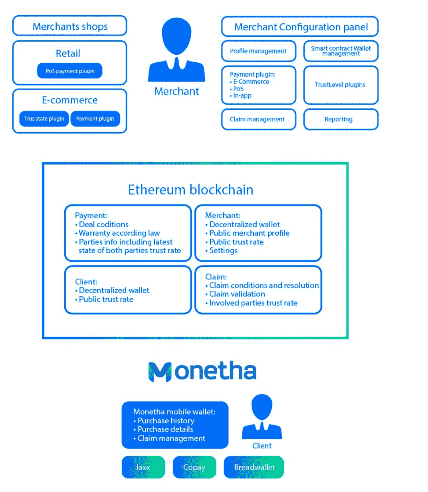
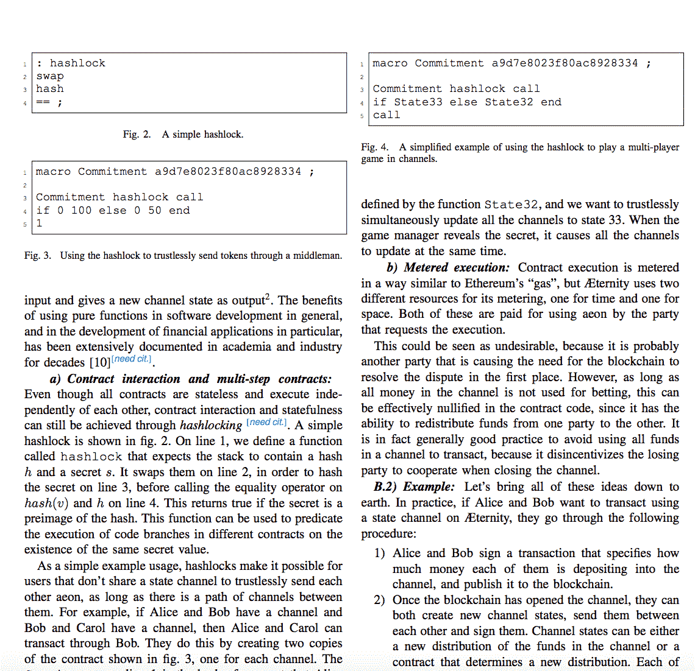

# 如何撰写好的 ICO 白皮书:技巧和示例

> 原文：<https://medium.com/hackernoon/how-to-write-a-good-white-paper-for-ico-tips-and-examples-42d71c3fa4fe>

对 ICO 的兴趣持续增长。全球数百个创业项目正试图利用这项技术筹集资金。市场已经建立了自己的 ICO 指南，其中一个坚持创建一个特殊的文件，“白皮书”。每个团队需要在 ICO 过程中使用此文档提供一个项目描述。今天我们来谈谈正确的做法。

# 什么是白皮书？

白皮书是确定区块链项目技术的文件。该文件通常包含系统架构及其与用户交互的详细描述，以及当前市场数据和增长预期以及对代币发行和使用的要求。此外，它还提供了项目团队成员、投资者和顾问的列表。

如果没有白皮书的适当模型，项目团队将很难执行成功的 ICO 程序:很少有人愿意投资一个缺乏关于技术和团队成员以前业务经验的适当信息的项目。你可能会找到一些创建高质量白皮书的技巧，以及下面几个真正成功的例子。

# **这个文档应该是什么样的？**

安德鲁·查平，区块链问题专家，Benja.co 和船忍者项目的创始人，[在黑客专栏中描述了这份完美的白皮书。这篇文章是白皮书的良好指南。所以，就总结到这里吧。](https://hackernoon.com/what-to-look-for-in-an-ico-white-paper-successful-token-54eba3787139)

一份好的白皮书应该包含以下几个部分:

一个问题；

提议的解决方案和产品描述；

代币商业化的描述(产品与商业化的经济和技术条款的相互作用)；

团队成员；

代币发行和前景。

白皮书中最重要的元素之一通常是项目团队的信息，尽管它经常被放在文档的末尾。

根据 Chapin 的说法，任何投资天使都可以讲述投资一个有坏主意的强大团队的故事，因为他相信他们在活动过程中创造有价值产品的能力。举个例子，在它的 pivot 之前，Android 曾经是一个[相机操作系统](https://www.pcworld.com/article/2034723/android-founder-we-aimed-to-make-a-camera-os.html)。诺基亚之前处理过[的木工和纸张生产](http://www.telegraph.co.uk/technology/nokia/10282657/Nokia-a-timeline-in-pictures.html)，Pinterest 在其事业的初期，曾经是一个[的购物应用](https://www.fastcompany.com/3001984/pinterest-pivot)，它不是一个社交网络(尽管最近它已经回到了电子商务的原点)。

因此，团队应该是多专业的，并且应该已经取得了一些成功，这是至关重要的。在一个完美的世界里，他们至少应该在区块链领域有一些经验。很多时候，当团队没有胜任的工程师处理区块链时，他们会试图发起筹款。创始人认为筹集资金是最重要的任务，他们非常确定以后可以雇佣一名工程师。但你应该三思而后行，因为在投资者急于为项目捐款之前，他们需要确信团队能够创造出他们所计划的东西。

白皮书的第二部分应包含产品描述:原型数据、首批用户和开发策略。通常，在 ICO 过程中，项目团队只有一个完美设计的 pdf 和一些模型。然而，他们没有实际的产品，其潜在用户和发展战略。如果项目已经有了生态系统和用户，这就增加了代币在市场上存活的几率。因此，这些元素必须存在于文档中。

资金使用的详细计划也是必不可少的。今天，在 ICO 的世界里，有很多组织提到“产业财团”，非营利单位或与“产业发展”有关的事件。这可能会引起怀疑，团队成员不仅打算将钱花在产品开发上，还打算花在其他事情上(可能是他或她的个人需求)。

代币的信息在证券交易所发售时有详细说明。如果它没有被引入，或者如果计划规定这将在 30-60 天内实现，那么我们有理由相信有些事情没有按预期进行。根据 Chapin 的说法，在这种情况下，项目团队极有可能在自由贸易开放时操纵代币的价格。总的来说，公众对公司与已发行代币的未来合作感兴趣。在这种情况下，需要回答一些问题:在预售之前，发行会受到限制吗？市场上什么时候开始销售？会操作赎回(或回购)吗？

至关重要的是，白皮书还包括项目及其未来发展计划(发展路线图)的详细技术描述。从理论上讲，团队应该提交一份未来 12-18 个月的详细工作计划，其中应该包括 beta-launch。如果路线图的一些任务已经被执行了，这可能被认为是项目团队的一个优势。

# **一份完美的白皮书:3 个成功项目的例子**

查看最佳实践:了解理想 ICO 文档要求的最简单方法是查看成功项目的真实例子。我们选择了三个非常成功的项目，并分析了他们的白皮书(点击此链接查看更多示例[)。](https://themerkle.com/top-10-cryptocurrency-icos-throughout-2017-to-date/)

[Monetha](https://www.monetha.io/) 是区块链的一个支付系统项目。仅在 18 分钟内就募集了 3700 万美元(95 000 ETH)。他们系统的[白皮书](https://www.monetha.io/Monetha_WP.pdf)包含了上述所有章节。它详细描述了项目的工作计划、象征性经济、资金使用计划，以及团队成员的服务记录(甚至是之前筹集投资的业务经验)。这些细节对所有白皮书都至关重要。

除了产品架构的技术描述，还有一些易读的图表。

另一个例子是筹集了近 3，400 万美元的项目" Aeternity"。它的[白皮书](https://www.aeternity.com/aeternity-blockchain-whitepaper.pdf)可能给人的印象是文档不需要像我们建议的那样全面。该文件(见下文)设计得并不美观，是以研究文章模式(一个简单的两列文档)创建的。

一个研究文章模式真的值得信赖。此外，文档不必很长(10 页左右)。

最后，赢家是 Filecoin，[在 ICO 期间获得了](https://www.coindesk.com/257-million-filecoin-breaks-time-record-ico-funding/)2 . 57 亿美元。它的创始人还决定使用研究文章模式，而不对他们的[白皮书进行任何设计改进。](https://filecoin.io/filecoin.pdf)

呈现风格与模式相对应:大量的公式和不同的模式。

# **最后的想法**

我们最近一直在积极研究 ICO 市场。我们尤其对内容设计感兴趣，这是区块链初创公司应该选择的。最后，我们会根据我们的调查给你一些建议:

*   **完美的白皮书无助于糟糕的项目:**如果项目团队针对不存在的问题或不重要的问题提出解决方案，或者如果项目团队成员缺乏开发经验且不熟悉区块链，那么项目很有可能不会成功——即使其文档非常出色。创业者需要意识到这一点。
*   **模式应该适合团队:**例如，Filecoin 和 Aeternity 为他们的项目描述选择了研究文章模式，而 Monetha 选择了更“流行”的模式。有趣的是注意到“研究文章”不包含项目团队的信息。这些信息可以在他们网站的一个特殊部分找到。要创作出高质量的“研究文章”，其作者必须有一些撰写此类文档的经验。如果经验不足，不如走 Monetha 的路，做个项目演示。
*   **将公众考虑在内至关重要:**白皮书的风格和模式取决于其读者。如果你的目标是吸引懂技术的公众和科学家，那么使用研究文章模式来展示信息是非常合理的。但是如果你的目标是吸引更多的读者，你就不应该在你的文档中过多地使用科学术语。但是您也可以创建文档的两个版本:一个面向更广泛的受众，另一个面向那些想要更多技术细节的人。