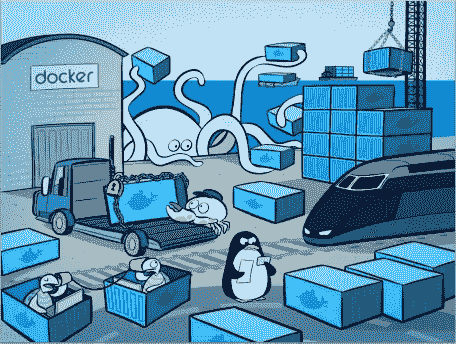

# 我们如何使用 Docker 组织类似 CTF 的活动

> 原文：<https://medium.com/hackernoon/how-we-used-docker-to-organize-a-ctf-like-event-5e32061eb597>

# **比赛概述**

竞赛的主题是解决基于 Linux、网络和基本脚本的挑战。也有一些关于逆向工程的问题。(我们称之为 RevEngg :P)。团队被期望像他们自己的系统一样工作和执行命令。此外，我们希望保持每个团队的工作环境与其他团队完全分离，以便团队的特定变化不会反映到其他团队。

说它我们的无知或参与其他事件，我们几乎没有 15-18 小时来设置我们的服务器和测试它。对于那些不是这个领域的人来说，这可能听起来像是很长时间，但是相信我，这不是，特别是，如果你是第一次组织这样的比赛。

# **我们有什么选择？**

我们可以用传统的方式来完成整个活动。我们可以创建一个虚拟机(VM)映像，然后在所有桌面上安装该映像。但是，虚拟机的问题是它们实际上非常慢。偶尔使用虚拟机时会出现网络相关问题。此外，如果我们在每个桌面上安装映像，将花费我们很长时间，这一事实促使我们寻找另一种方式..一些更简单，更有效，对懒惰的小伙子来说意味着:P

另一个选择是创建一个远程服务器，每个团队都有自己的登录服务器的凭证。乍一看，这似乎没有问题，预计会工作得很好。但是，这样做意味着设置大量复杂的权限，指定用户应该被允许做什么，以及限制性的内存分配技术。

最重要的是，如果有人设法重新启动系统，甚至只是运行一个叉炸弹，每个人都在劫难逃！(是啊，我们也是！！)此外，使用 wall、mesg 这样的命令可以很容易地分散他人的注意力，你肯定不想失去你的注意力，至少在 CTF 的活动中。

> "当共享同一个系统时，会有无穷无尽的事情会出错."

在排除了两种可能的方法后，我们只剩下第三种，也可能是最后一种选择，“Docker”。所以，我们决定尝试一下，尽管我们没有太多的工作经验。

# **码头工人来救我们了..**

对于那些不了解 docker 的人来说，*“Docker 是一个工具，旨在通过使用容器来更容易地创建、部署和运行应用程序。”*简单地说，我们创建一个程序的映像，然后你可以拥有同一个映像的多个运行实例，称为容器，每个容器由一个唯一的 id 标识。除非另有说明，否则所有容器都有其独立的工作环境。

这正是我们想要的，每个团队都有自己的工作环境，完全不受其他团队的影响。如果只是简单地开箱即用，我们肯定会有安全问题，但考虑到比赛的小规模，这可以忽略不计。

所以首先，我们从 docker hub 中调出了一个基本的 Ubuntu 映像。(Docker hub 非常像 GitHub，只是针对 Docker 图片。)然后，我们只需要将所需的挑战从本地磁盘复制到 docker 映像。基本上，我们运行了一系列命令，我们的映像就可以部署了。最后，我们编写了一个 bash 脚本，它简单地检查当前的 ssh 会话是否来自某个用户，并启动一个 docker 容器。

这么多的家庭作业对于 4 个小时的基本活动来说可能已经足够了。然而，我们还有几个小时的时间，在测试了几次之后，我们遇到了一个很可能被忽视的严重问题，但是尽管如此，我们还是跳到 docker 文档中寻找解决方案。

# **与码头工人的问题**

如上所述，默认情况下，所有的容器都是易失性的，也就是说，一旦您退出并删除容器，所有的更改都将消失。在挑战有许多步骤要执行的情况下，这可能非常关键。假设，一个团队完成了完成挑战所需的 5 个步骤中的 4 个，然后由于疏忽或网络问题而被注销。

默认情况下，Docker 没有持久存储，这在使用容器时会出现一些问题，但是，有一些方法可以实现持久存储。对于我们想要实现的目标，在不实际使用持久存储概念的情况下，也有一些变通办法(记住，我们只剩下几个小时了。)

# 我们是如何解决的

我们希望用户恢复他的会话(容器),而不丢失他的任何更改。这意味着识别所有的容器，并将它们与相应的团队相关联。这就产生了一个识别团队的问题，并确保即使在退出之后，他们也能看到相同的环境。

然后我们决定使用 IP 作为每个团队的标识符，因为 IP 是静态的，一个团队只能使用一个系统！因此，每当团队使用凭据登录时，就会运行一个脚本来检查是否已经有一个具有该 IP 名称的容器，如果存在，我们就启动该容器，否则就会创建一个名为“用户 IP”的新容器并启动。因此，我们没有让用户登录我们的实际系统，而是运行了一个 docker 环境，这样我们的实际系统就不会受到任何篡改！另外，当一个容器退出时，它的状态会被保存，除非从文件系统中删除，这样我们就可以访问同一个容器和文件了！

# 最后的想法…

我们用 Docker 实现的可能并不完美。事实上，可以肯定地说，这与理想的设置相差甚远。然而，我相信，在没有任何经验的情况下，我们能够利用 docker 以一种恰到好处的方式实现我们的目标。我们肯定会努力，并计划使它成为一个 docker-compose 就绪的图像。所以，下一次，组织成员将不会遭受我们所遭受的痛苦

特别感谢 [Jatin Rungta](https://medium.com/u/9ab31cc5e3f9?source=post_page-----5e32061eb597--------------------------------) 设置服务器和处理 Docker 的东西..

## 感谢阅读！如果你喜欢它，请鼓掌并分享帖子以示支持。