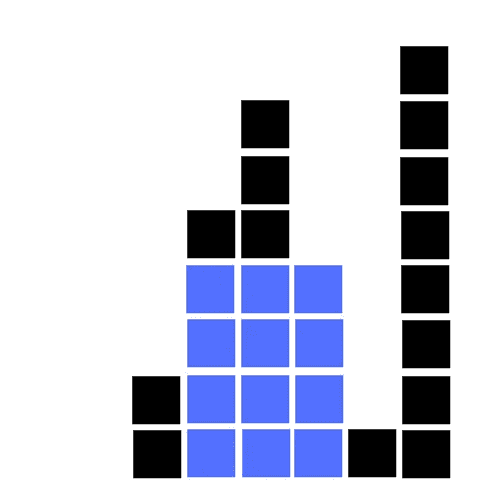

# 效果如何？Haskell 中的剖析

> 原文：<https://medium.com/hackernoon/how-well-does-it-work-profiling-in-haskell-4f495d0e7e38>

我以前说过，但我要再说一遍。尽管我们愿意这么想，但我们的 Haskell 代码并不仅仅因为编译就能工作。这就是为什么我们有[测试套件](https://mmhaskell.com/blog/2017/4/10/putting-your-haskell-to-the-test)。但是，即使它通过了我们的测试套件，这也并不意味着它可以工作得很好。有时我们会意识到我们写的代码不够好，所以我们必须改进。

但是改进我们的代码有时感觉像是在瞎猜。你将花费大量的时间来调整某一部分。然后你会发现你实际上并没有减少应用程序的总运行时间。某些操作通常需要更长时间，比如数据库调用、网络操作和 IO。因此，您通常可以对从哪里开始有一个不错的想法。但确保万无一失总是有帮助的。这就是基准测试和概要分析的用武之地。我们将处理一个特定的问题，并学习如何使用一些 Haskell 工具来锁定问题点。

注意，我们将使用的工具要求你使用 Stack 或 Cabal 来组织你的代码。如果你以前从未使用过这两种游戏，你应该看看我们的 [Stack 迷你课程](http://academy.mondaymorninghaskell.com/p/your-first-haskell-project)！它将教你用 Stack 创建一个项目的基础。您还将学习使用 Stack 的主要命令。这是全新的，最好的是免费的！看看吧！这是我们的第一门课程，所以我们希望得到反馈！

# 问题是

我们在这篇文章中的首要问题是“最大矩形”问题。你实际上可以在名为“约翰和篱笆”的 [Hackerrank](https://www.hackerrank.com/) 上尝试自己解决这个问题。想象一下，我们有一系列高度不同的竖条并排放置。我们想找出我们能在这些条上画出的最大矩形的面积，它不包括任何空白空间。这里有一个这样的问题和解决方案的可视化:



在这个例子中，我们有高度为`[2,5,7,4,1,8]`的帖子。我们可以形成的最大矩形面积为 12，正如我们看到的突出显示的正方形。

用 Haskell 解决这个问题非常简洁明了，因为它适合递归解决方案。首先让我们定义几个新类型来说明我们对这个问题的概念。我们将使用一个编译器扩展来派生索引类型上的`Num` typeclass，因为这在后面会很有用。

```
{-# LANGUAGE GeneralizedNewtypeDeriving #-}
...
newtype FenceValues = FenceValues { unFenceValues :: [Int] }
newtype FenceIndex = FenceIndex { unFenceIndex :: Int }
  deriving (Eq, Num, Ord)
-- Left Index is inclusive, right index is non-inclusive 
newtype FenceInterval = FenceInterval { unFenceInterval :: (FenceIndex, FenceIndex) }
newtype FenceSolution = FenceSolution { unFenceSolution :: Int }
  deriving (Eq, Show, Ord)
```

接下来，我们将定义我们的主要功能。它将接受我们的`FenceValues`，一个整数列表，并返回我们的解。

```
largestRectangle :: FenceValues -> FenceSolution
largestRectangle values = ...
```

它将依次调用我们的递归助手函数。该函数将计算特定间隔内的最大矩形。我们可以用越来越小的区间递归求解。我们先在整个列表的区间上调用它。

```
largestRectangle :: FenceValues -> FenceSolution
largestRectangle values = largestRectangleAtIndices values
  (FenceInterval (FenceIndex 0, FenceIndex (length (unFenceValues values))))largestRectangleAtIndices :: FenceValues -> FenceInterval -> FenceSolution
largestRectangleAtIndices = ...
```

现在，为了分解成递归的情况，我们首先需要更多的信息。我们需要的是这个区间内最小高度的指标`i`。一种选择是，我们可以用这个高度制作一个横跨整个区间的矩形。

任何其他的“最大矩形”都不会使用这个特殊的索引。所以我们可以把我们的问题分成另外两种情况。首先，我们将在左边的区间上找到最大的矩形。在第二个例子中，我们向右看。

正如您可能意识到的，这两种情况仅仅涉及到递归调用！然后我们可以很容易地比较他们的结果。我们唯一需要添加的是一个基础案例。以下是用代码表示的所有这些情况:

```
largestRectangleAtIndices :: FenceValues -> FenceInterval -> FenceSolution
largestRectangleAtIndices
  values
  interval@(FenceInterval (leftIndex, rightIndex)) = 
    -- Base Case: Checks if left + 1 >= right
    if isBaseInterval interval
      then FenceSolution (valueAtIndex values leftIndex)
      -- Compare three cases
      else max (max middleCase leftCase) rightCase
      where
      -- Find the minimum height and its index
      (minIndex, minValue) = minimumHeightIndexValue values interval
      -- Case 1: Use the minimum index
      middleCase = FenceSolution $ (intervalSize interval) * minValue
      -- Recursive call #1
      leftCase = largestRectangleAtIndices values (FenceInterval (leftIndex, minIndex))
      -- Guard against case where there is no "right" interval
      rightCase = if minIndex + 1 == rightIndex
        then FenceSolution (maxBound :: Int) -- Supply a "fake" solution that we'll ignore
        -- Recursive call #2
        else largestRectangleAtIndices values (FenceInterval (minIndex + 1, rightIndex))
```

就这样，我们差不多完成了。这里唯一的症结是几个助手函数。其中三个很简单:

```
valueAtIndex :: FenceValues -> FenceIndex -> Int
valueAtIndex values index = (unFenceValues values) !! (unFenceIndex index)isBaseInterval :: FenceInterval -> Bool
isBaseInterval (FenceInterval (FenceIndex left, FenceIndex right)) = left + 1 >= rightintervalSize :: FenceInterval -> Int
intervalSize (FenceInterval (FenceIndex left, FenceIndex right)) = right - left
```

现在我们必须确定这个区间的最小值。让我们用最天真的方法来做这件事，用一个折叠扫描整个区间。

```
minimumHeightIndexValue :: FenceValues -> FenceInterval -> (FenceIndex, Int)
minimumHeightIndexValue values (FenceInterval (FenceIndex left, FenceIndex right)) =
  foldl minTuple (FenceIndex (-1), maxBound :: Int) valsInInterval
  where
    valsInInterval :: [(FenceIndex, Int)]
    valsInInterval = drop left (take right (zip (FenceIndex <$> [0..]) (unFenceValues values)))
    minTuple :: (FenceIndex, Int) -> (FenceIndex, Int) -> (FenceIndex, Int)
    minTuple old@(_, heightOld) new@(_, heightNew) =
      if heightNew < heightOld then new else old
```

现在我们完成了！

# 对我们的代码进行基准测试

这是一个简洁的算法解决方案，但是我们想知道我们的代码是否有效。我们需要知道它是否会扩展到更大的输入值。我们可以通过编写基准来找到这个问题的答案。基准是一个我们可以与 Cabal 和 Stack 一起使用的特性。它们的工作很像测试套件。但是他们不是证明我们代码的正确性，而是向我们展示我们的代码在各种环境下运行的速度。我们将使用`Criterion`库来完成这项工作。我们将首先在我们的。该基准的 cabal 文件:

```
benchmark fences-benchmarks
  type:                exitcode-stdio-1.0
  hs-source-dirs:      benchmark
  main-is:             fences-benchmark.hs
  build-depends:       base
                     , FencesExample
                     , criterion
                     , random
  default-language:    Haskell2010
```

现在我们将制作我们的文件`fences-benchmark.hs`，使其成为一个`Main`模块并添加一个`main`函数。我们将生成 6 个列表，每次增加 10 倍。然后我们将创建一个基准组，并在每种情况下调用`bench`函数。

```
module Main whereimport Criterion
import Criterion.Main (defaultMain)
import System.Randomimport Libmain :: IO ()
main = do
  [l1, l2, l3, l4, l5, l6] <- mapM 
    randomList [1, 10, 100, 1000, 10000, 100000]
  defaultMain
    [ bgroup "fences tests" 
      [ bench "Size 1 Test" $ whnf largestRectangle l1
      , bench "Size 10 Test" $ whnf largestRectangle l2
      , bench "Size 100 Test" $ whnf largestRectangle l3
      , bench "Size 1000 Test" $ whnf largestRectangle l4
      , bench "Size 10000 Test" $ whnf largestRectangle l5
      , bench "Size 100000 Test" $ whnf largestRectangle l6
      ]
    ]-- Generate a list of a particular size
randomList :: Int -> IO FenceValues
randomList n = FenceValues <$> (sequence $ replicate n (randomRIO (1, 10000 :: Int)))
```

我们通常用`stack bench`(或者`cabal bench`，如果你没有使用 Stack)来运行这些基准测试。但是我们也可以用`--profile`标志编译我们的代码。这将自动创建一个关于我们代码的更多信息的分析报告。注意使用性能分析还需要重新编译所有依赖项才能使用性能分析。所以你不想来回切换太多。

```
>> stack bench --profile
Benchmark fences-benchmarks: RUNNING...
benchmarking fences tests/Size 1 Test
time                 47.79 ns   (47.48 ns .. 48.10 ns)
                     1.000 R²   (0.999 R² .. 1.000 R²)
mean                 47.78 ns   (47.48 ns .. 48.24 ns)
std dev              1.163 ns   (817.2 ps .. 1.841 ns)
variance introduced by outliers: 37% (moderately inflated)benchmarking fences tests/Size 10 Test
time                 3.324 μs   (3.297 μs .. 3.356 μs)
                     0.999 R²   (0.999 R² .. 1.000 R²)
mean                 3.340 μs   (3.312 μs .. 3.368 μs)
std dev              98.52 ns   (79.65 ns .. 127.2 ns)
variance introduced by outliers: 38% (moderately inflated)benchmarking fences tests/Size 100 Test
time                 107.3 μs   (106.3 μs .. 108.2 μs)
                     0.999 R²   (0.999 R² .. 0.999 R²)
mean                 107.2 μs   (106.3 μs .. 108.4 μs)
std dev              3.379 μs   (2.692 μs .. 4.667 μs)
variance introduced by outliers: 30% (moderately inflated)benchmarking fences tests/Size 1000 Test
time                 8.724 ms   (8.596 ms .. 8.865 ms)
                     0.998 R²   (0.997 R² .. 0.999 R²)
mean                 8.638 ms   (8.560 ms .. 8.723 ms)
std dev              228.8 μs   (193.6 μs .. 272.8 μs)benchmarking fences tests/Size 10000 Test
time                 909.2 ms   (899.3 ms .. 914.1 ms)
                     1.000 R²   (1.000 R² .. 1.000 R²)
mean                 915.1 ms   (914.6 ms .. 915.8 ms)
std dev              620.1 μs   (136.0 as .. 664.8 μs)
variance introduced by outliers: 19% (moderately inflated)benchmarking fences tests/Size 100000 Test
time                 103.9 s    (91.11 s .. 117.3 s)
                     0.997 R²   (0.997 R² .. 1.000 R²)
mean                 107.3 s    (103.7 s .. 109.4 s)
std dev              3.258 s    (0.0 s .. 3.702 s)
variance introduced by outliers: 19% (moderately inflated)Benchmark fences-benchmarks: FINISH
```

所以当我们运行这个的时候，我们会发现一些…麻烦的事情。在 100000 规模上运行最终的基准测试需要很长时间。平均来说，这个案件需要超过 100 秒…超过一分半钟！我们可以进一步注意到平均运行时间是如何根据案例的大小而增加的。让我们稍微缩减一下数据:

```
Size 1: 47.78 ns
Size 10: 3.340 μs (increased ~70x)
Size 100: 107.2 μs (increased ~32x)
Size 1000: 8.638 ms (increased ~81x)
Size 10000: 915.1 ms (increased ~106x)
Size 100000: 107.3 s (increased ~117x)
```

每当我们将问题的大小增加 10 倍，花费的时间就增加接近 100 倍！这表明我们的运行时间是`O(n^2)`(如果您不熟悉 Big-O 符号，请查看本指南)。我们想做得更好。

# 确定问题

所以我们想弄清楚为什么我们的代码执行得不是很好。幸运的是，我们已经分析了我们的基准！。这会输出一个我们可以查看的特定文件，称为`fences-benchmark.prof`。它有一些非常有趣的结果:

```
COST CENTRE                            %time %alloc
minimumHeightIndexValue.valsInInterva  69.8   99.7
valueAtIndex                           29.3    0.0
```

我们看到我们有两个大的罪魁祸首花了很多时间。首先，我们的函数确定了特定区间的最小值。报告甚至更加具体，指出了函数中具体的违规部分。我们花了很多时间来获得特定区间的不同值。第二，我们有`valueAtIndex`。这意味着我们也花了很多时间从列表中获取值。

首先，让我们庆幸我们很好地分解了代码。如果我们把整个解决方案写在一个大函数中，我们就不会有任何线索了。这让我们分析问题容易多了。当检查代码时，我们看到为什么这两个函数会产生`O(n^2)`行为。

由于我们进行递归调用的次数，我们将调用每个函数`O(n)`次。然后当我们调用`valueAtIndex`时，我们在链表上使用`(!!)`操作符。这需要`O(n)`时间。扫描最小高度的整个区间具有相同的效果。在最坏的情况下，我们必须查看列表中的每个元素！我有点犹豫，但这是基本结果。当我们调用这些`O(n)`片段`O(n)`次时，我们得到`O(n^2)`总时间。

# 悬崖吊死结局

我们实际上可以在`O(n log n)`时间内解决这个问题，比目前的`O(n^2)`时间有了巨大的进步。但是我们必须改进我们的数据结构来实现这一点。首先，我们将存储我们的值，以便我们可以在亚线性时间内从索引到元素。这很简单。其次，我们必须确定包含任意区间内最小元素的索引。这在亚线性时间里有点棘手。我们需要更先进的数据结构。

要了解我们如何解决这些问题，您必须等待本系列的第 2 部分！下周周一早上回到[哈斯克尔的博客](https://www.mmhaskell.com/)！

提醒一下，我们刚刚在 Stack 上发布了一个免费的[迷你课程。它将教你布局一个项目和使用堆栈工具在它上面运行命令的基础。你应该在周一早上的哈斯克尔学院报名！这是我们的第一门课程，所以我们希望得到一些反馈！一旦你了解了 Stack，自己尝试这个问题就容易多了！](http://academy.mondaymorninghaskell.com/p/your-first-haskell-project)

除了堆栈，递归在我们的解决方案中也很重要。如果你做过一定量的函数式编程，你会看到递归在起作用。但是如果你想巩固你的知识，你应该下载我们免费的[递归练习册](https://www.mmhaskell.com/workbook)！它有两章关于递归的内容，并且有 10 个练习题供你解决！

没用 Haskell 编程过？没问题！你可以下载我们的[入门清单](https://www.mmhaskell.com/checklist)，它将帮助你安装 Haskell。它还会为你指出一些很好的学习资源的方向。看一看！

> [黑客中午](http://bit.ly/Hackernoon)是黑客如何开始他们的下午。我们是 AMI 家庭的一员。我们现在[接受投稿](http://bit.ly/hackernoonsubmission)并乐意[讨论广告&赞助](mailto:partners@amipublications.com)机会。
> 
> 要了解更多信息，[请阅读我们的“关于”页面](https://goo.gl/4ofytp) , [喜欢/在脸书给我们发消息](http://bit.ly/HackernoonFB)，或者简单地，[发推文/DM @HackerNoon。](https://goo.gl/k7XYbx)
> 
> 如果你喜欢这个故事，我们推荐你阅读我们的[最新科技故事](http://bit.ly/hackernoonlatestt)和[趋势科技故事](https://hackernoon.com/trending)。直到下一次，不要把世界的现实想当然！