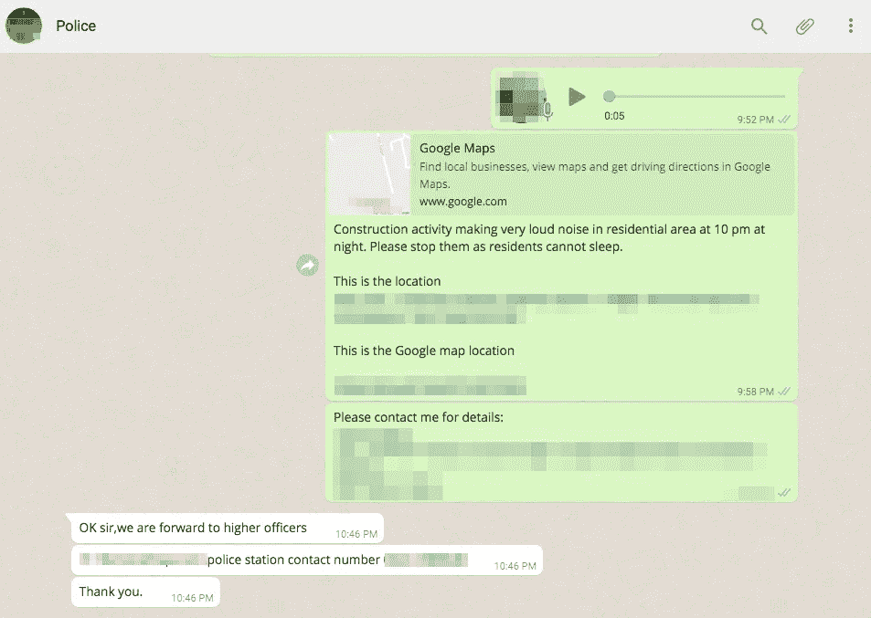

# WhatsApp 如何帮助印度警方让民众参与维护法律和秩序

> 原文：<https://medium.com/hackernoon/how-whatsapp-helps-indias-police-involve-its-people-in-maintaining-law-and-order-f2f27263b44c>

India’s police now allow anonymous complaints via WhatsApp

几天前，一个建筑商开始在我房子后面的那块地里施工。根据印度法律，住宅区的建筑工程只允许在上午 9 点到下午 5 点之间进行。但是这位建筑工人继续用他那震耳欲聋的凿岩机工作，直到深夜。晚上 9 点 30 分左右，一位邻居女士要求他关掉电视，因为她睡不着。建造者拒绝服从，继续他的邪恶的吵闹。

那这位女士为什么不报警呢？原因有二。

首先是害怕被骚扰。

让我来说明我所说的骚扰是什么意思。虽然印度表面上很和平，但实际上还是有点像蛮荒的西部。

几年前，一个近亲与一个侵占他财产的房地产集团发生了口头争执。最后他们威胁要痛打他一顿。几天后，我的亲戚因暴力袭击房地产集团的领导而被警方立案。

在这种情况下，有关系的群体胜算更大。例如，这次所谓“袭击”的“目击者”是一名警察。基于这一指控，对我的亲戚发出了逮捕令。他的律师花了几年时间才设法驳回了这个案子。他很幸运，建筑商不是大人物，因为建筑黑手党在印度很有势力。他们甚至可能雇佣打手殴打他，或者索要“保护”费，或者安排一场致命的“事故”。

没有人需要这样的骚扰，所以一般来说，人们会避免与任何有权势的人发生争执。

印度人避开警察的第二个原因是，由于对印度警察的看法，印度警察和人民的关系非常不稳定。

首先，警察被视为无能为力——他们采取的任何行动都可能被有政治关系的罪犯取消。

第二，如果警方受到压力，他们会透露投诉罪犯的人的姓名，反过来，他们会立即追查投诉人，迫使他们撤回投诉。

第三，印度人害怕警察，因为他们有一种暴力的气息-警察经常出现在电视上，暴力镇压某种形式的公众抗议。

第四，印度警察的工资很低，因此很容易成为贿赂的目标。

最后，还有一个语言障碍——印度有多种语言，通常警察只能流利地使用他们国家的语言。

正因为如此，大多数人只有在别无选择的情况下才会和警察打交道，比如当他们遭遇交通事故时。即便如此，大多数人还是尽量避免让警察介入，自己解决问题。除了严重的犯罪，普通人只是在不可避免的问题上才不情愿地报警，如抢劫、财产边界冲突等。事实上，人们甚至经常不会报告发生在他们眼前的现场犯罪。就像我之前提到的，他们害怕被骚扰。

这是一个严重的问题，因为印度人口众多，警察维持法律和秩序的努力只有在他们和印度公民共同努力下才能成功。

最近，警方已经开始积极努力改变这种看法，并让普通人参与警务工作。我所居住的印度南部城市就有这样一个由警察发起的倡议，这是一个利用社交媒体的非常令人钦佩的努力。

警察意识到人们不会介意举报违法行为，只要他们自己不会惹上麻烦。这只有在警方接受匿名投诉的情况下才会发生。

这就是 WhatsApp 的由来。印度是 WhatsApp 最大的市场，在这个受欢迎的社交媒体平台上拥有超过 1.6 亿活跃用户。任何拥有智能手机的人都可以使用它，可以发送短信、照片、录音，甚至短视频。有了像样的互联网连接，你甚至可以进行音频或视频通话。

但促成这笔交易的是 WhatsApp 的相对匿名性。尽管 SIM 卡与手机号码绑定，但在印度很容易买到。因此，WhatsApp ID 可以很容易地与第二个 SIM 卡关联起来，发送 WhatsApp 消息的人可以保持匿名。

这正是警察所做的。他们创建了一个 WhatsApp 号码，人们可以匿名发帖投诉。人们甚至可以附上图片或短视频来证明他们的投诉是真实的。警察把这个 WhatsApp 的号码贴在了城市各处的户外广告牌上。由于 WhatsApp 部门是一个独立的部门，即使是警察也无法轻易获得投诉人的详细信息，这给了举报人更多的匿名性。

这就是我第一次直接向警察投诉的过程。

事发当晚，我身上没有 WhatsApp 的号码，但它在谷歌上弹出来了。我迅速打出一份投诉，并在晚上 10 点 30 分通过 WhatsApp 发送出去。由于我对我居住的州的语言不太流利，我用英语写了这条信息，并尽可能保持简单。我附上了手提钻爆炸的音频，以及事故发生地点的谷歌地图链接。

45 分钟后，我收到了警察的回复，说信息已经被转发给有关部门。他们还给了我相关警察局的电话号码，以防我想直接联系他们。

又过了 15 分钟，我听到承包商突然关闭了所有设备，现场一片寂静。从我的房子里看不到工地的大门，但我想警察已经到了，并斥责了承包商。第二天晚上，承包商早上 9 点才开始工作，下午 6 点整结束所有活动。我得说工人们似乎很高兴早点离开。所以看起来警察确实拜访了建筑商。

整个事件中我喜欢的是建筑商并不确定是谁出卖了他。我甚至不认为警察，谁把他的任务，知道谁投诉。匿名让我感到安全，并尽自己的一份力量帮助警察履行他们的职责。

“分而治之”是这些小罪犯策略的一部分。如果他们认出了我，他们会用一些小手段骚扰我，比如“不小心”损坏我的电源、水或电线，或者他们的网站和我们的网站之间的墙。如果我去找警察，他们会注意到只有一个人不停地抱怨另一个人，并倾向于将其作为个人恩怨不予理会。但由于建筑商不知道是谁投诉的，他不得不骚扰该地区的所有人，以进行报复。这将很快适得其反，因为如果警方接到太多投诉，他们将被迫做出回应。

印度警察确实正在发生变化，而且是通过 Whatsapp。

我严重怀疑简·库姆或扎克伯格是否知道有一天印度警察会依靠他们的应用程序来维持法律和秩序。

对于一个免费应用来说，这是一个不小的成就。

祝福你，WhatsApp！

> [黑客中午](http://bit.ly/Hackernoon)是黑客如何开始他们的下午。我们是 [@AMI](http://bit.ly/atAMIatAMI) 家庭的一员。我们现在[接受投稿](http://bit.ly/hackernoonsubmission)，并乐意[讨论广告&赞助](mailto:partners@amipublications.com)机会。
> 
> 如果你喜欢这个故事，我们推荐你阅读我们的[最新科技故事](http://bit.ly/hackernoonlatestt)和[趋势科技故事](https://hackernoon.com/trending)。直到下一次，不要把世界的现实想当然！

