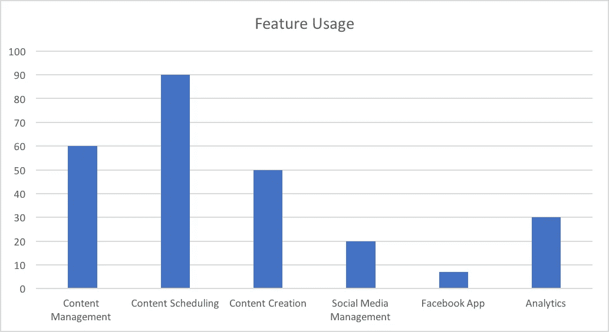

# 哪些产品经理做得不够

> 原文：<https://medium.com/hackernoon/https-medium-com-herry-what-product-managers-dont-do-enough-3ab985ac7dd9>

[Source](https://unsplash.com/photos/HU-uL54pfQI?utm_source=unsplash&utm_medium=referral&utm_content=creditCopyText)

还记得苹果宣布他们将从 iPhone 上移除 3.5 毫米耳机插孔吗？他们热情的用户准备反抗。当苹果表示将从 iPhone X 上去掉 home 键时，他们也面临着类似的回应。我对苹果的大多数设计决定都没意见，但这一个触动了神经。

触控 ID 照明速度很快，效果很好。我可以一边从牛仔裤口袋里掏出手机，一边解锁。有了 Face ID，我不得不从手机里拿出来，看着它，等待它确认确实是我(这一步可能会在很多方面搞砸，取决于我是否躺在床上，从正确的角度看它，等等。)并向上滑动。在我看来这是一种倒退。我很难相信 Face ID 会在快速解锁手机方面达到标准。*

显然，大家都有这种担心。

# 冒很大风险

我最近和一名苹果工程师交谈，他告诉我 Face ID 已经开发了很多年。在 iPhone X 发布之前，苹果公司的每个人都屏住了呼吸。他们真的不知道他们的用户群会对这种变化做出什么反应。这对他们来说是一场豪赌。

几个月后，数字会自己说话。本季度对 iPhone X 的需求高得惊人。这一趋势看起来将持续到 2018 年。根据 KGI 分析师 Ming-Chi Kuo 的说法，苹果公司预计在这个假期销售 2200 万到 2400 万台 iPhone Xs。

由此，我开始意识到产品管理的一些问题:

> 对于产品经理来说，知道用户想要什么和知道用户不需要什么一样重要。构建未来可能需要产品经理做出艰难的决定，削减旧的，有时是心爱的功能。

然而，在与其他产品经理交谈时，我发现没有多少产品团队会优先考虑削减功能。这让我想知道这是为什么。

# **你典型的功能用法是什么样的？**

直到几年前，当我们的首席产品官有一天找到我，问我们应该削减哪些功能时，我才想到削减功能。我很困惑，问他是什么意思。我们的产品做得很好，没有人们抱怨的功能。

当然，我的看法是错误的。

## 他想让我发现的是，哪些功能维护起来成本很高，很少用户使用。

下面是我们的使用图表:

如你所见，我们的脸书应用程序并没有被经常使用。事实证明，维护起来非常昂贵。

# **修剪脂肪**

我们已经建立了脸书应用程序，以便用户管理他们的 YouTube 视频内容，并将其发布到脸书。随着时间的推移，当脸书开始允许用户原生上传视频时，这款应用变得有些过时。我们一直没有删除脸书的应用，因为我们专注于我们的桌面和移动应用。令我们惊讶的是，每天仍有数百名用户在使用它。

在查看了该功能的使用情况后，我制定了一个计划，放弃脸书应用程序，在我们的桌面和移动应用程序中建立一个功能，允许用户转换他们的 YouTube 视频，并将其原生发布到脸书。因为脸书本地的视频会在新闻提要中自动播放，使用这一功能可以提高参与度。

当我们让用户了解我们的计划时，我们收到了许多愤怒的回复，反对我们的决定。尽管困难重重，我们还是决定推进计划。两个月后，我们看到 MAU 上升了 20%。最精彩的部分？一些强烈抗议我们决定的用户成为了新功能的积极用户。

# **为什么更多的产品经理不裁？**

削减旧功能和构建新功能一样重要，那么为什么没有更多的产品经理考虑这个问题呢？我以前很难做到这一点，在分析我自己的恐惧时，我注意到这些事情:

**1)有时运送一个产品≦****构建一个新功能**

产品经理的主要角色是为用户提供合适的产品。你可能会开始变得过分热情，变得过于热衷于建设新的东西，以至于忘记了维护和机会成本。运送正确的产品并不总是意味着制造新的东西。这也可能意味着削减现有的功能。

拿走一样东西很难

尽管大多数产品经理都可以说不，但是告诉用户他们喜欢的东西正在消失却是一个完全不同的挑战。在阅读我不得不这样做而得到的所有过去的愤怒回复之前，我仍然必须深呼吸。尽管如此，重要的是在必要的时候坚持到底，并且在你知道你将要裁剪一个特征的时候马上通知你的用户。

很容易变得近视

作为一名产品经理，你可能会同时参与这么多不同的项目，很容易迷失在茫茫人海中，变得过于战术化。因此，很少有时间退一步，看看大局。当这成为一个问题时，是时候请你的领导(可能是产品副总裁或产品总监)介入并提供帮助了。

**4)别太执着**

当你花这么多时间构建一个特性时，很难不去依恋它；毕竟你确实倾注了大量的时间和精力。在那些时刻，你必须提醒自己，你是在为你的用户而不是为你自己而构建。你必须将该特性视为沉没成本，并为你的用户做出最佳决策。

# 这都是关于权衡

做好削减的第一步是意识到可能会阻碍你的事情。下一步是定期批判性地分析你的特性，看看哪些特性阻碍了你的产品和业务。我建议每个季度检查一次你的功能的使用情况，也许更频繁，并评估你是否需要削减脂肪。

> 产品管理是关于权衡的，这只是其中的一个。在你的产品中去掉好的部分，加倍购买必须的部分。

当你削减特征时，人们最初会对你生气。但从长远来看，如果你代表你的用户做出好的决定，并继续为他们提供价值，你会发现即使是最直言不讳的批评者也会回心转意。

值得一提的是，我曾是 home 键消失的大抱怨者，但在使用 iPhone X 两个月后，我现在不能说我怀念它。