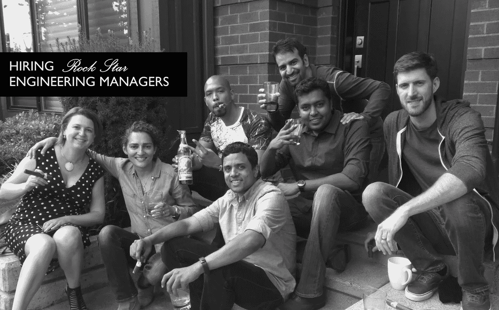

# 寻找摇滚明星工程经理

> 原文：<https://medium.com/hackernoon/hunting-for-rock-star-engineering-managers-9ef9c3716b02>

## 伟大的团队需要伟大的领导者。这里有一个如何采访他们的指南。

Caught in the wild! A pack of strong engineering managers fresh from shipping a big release.

# 介绍

找到优秀的经理很难，尤其是当你不知道该找什么的时候。没有一个简单的 leetcode 测试可以识别出具有合适的技术背景、人际交往能力和跟踪记录的人来满足你的团队的需要。这是一个非常困难的定性挑战，也是在建立你的工程组织时正确处理的一个关键。雇佣一个优秀的经理可以让你的团队达到新的高度。雇佣一个糟糕的人可能会破坏团队的文化和生产力。在我的职业生涯中，我雇佣过很多工程经理，在本指南中，我将帮助你了解在寻找世界级人才时应该寻找什么。

# 管理者到底在做什么？

如果你是一名新经理或个人贡献者，对经理的期望可能并不明显。在技术职业生涯的早期，你会花大部分时间在第一线与其他工程师并肩工作来制造产品。进入管理层意味着承担一系列针对人员和业务目标的新职责。工程经理负责:

## 吸引、留住、培养人才

吸引人才意味着积极参与寻找新的团队成员，而不是被动地等待招聘经理或招聘人员的面试小组请求。你有责任确保团队拥有合适的技能，并有一个健康的人才渠道来满足未来的招聘需求。经理们有很多工具可以用来实现这个目标，比如招聘人员、临时员工来源、LinkedIn 等。要记住的重要一点是，经理必须不断花时间去吸引最优秀的人才。

一旦获得人才，他们必须保持参与和兴奋留在公司。管理者应该考虑确保团队中的每个成员都受到工作激励所需的系统和流程。定期一对一、表扬成就、团队活动、薪酬和运送高质量产品都是吸引员工参与的方式。

培养人才意味着更进一步，找到不仅能让员工参与进来，还能提高他们技能和能力的方法。定期辅导和反馈、网络、培训和挑战性/突破性项目都是推动团队成员更上一层楼的好方法。

## 执行

经理的核心职责是推动他们的团队完成工作。产品可以使用非常不同的方法和团队组成来开发。一些公司可能更喜欢精心计划的瀑布开发，而大多数初创公司使用敏捷的变体。一些公司更喜欢“探索性”的执行，其中交付日期是可选的，不需要预先设定目标。另一些人则有非常严格的“死期”目标，要求产品在非常特定的时间点发货(想想大型假日发布会)。

我个人的期望是，管理者应该推动他们的团队朝着明确的目标和时间表前进。他们应该知道每个团队成员都在做什么，为什么，以及大概什么时候完成。最后，经理们应该对运输充满热情。他们必须喜欢快速、高质量地向客户交付新产品和改进。

## 平衡传入的请求

经理们必须完成任务，但是总会有比现有工程师更多的工作要做。随着团队规模的扩大，对团队的期望增长得更快。因此，一般来说，无论您的团队有多大，您都会感到人手不足。

这意味着你的大部分工作将是决定将你的团队成员投入到哪里，因为你知道你不能做所有的事情。工程经理必须能够推回会超出他们能力的请求，以保护发布时间表、成品质量和团队健康。

## 管理技术债务

经理还必须能够识别必要的工程投资，并根据特征工作对其进行优先排序。错误、不完整或糟糕的体系结构、缺失的遥测/监控、过时的工具/基础架构，所有这些都让您的工程团队的有效性面临风险。EM 不应该期望组织中的其他人为他/她确定这项工作，相反，他们将知道如何监控这笔债务，并倡导改进，作为可预测的工程节奏的一部分。

## 代表公司

最后，经理是“公司”和现场员工之间的接口。管理者需要代表组织的理想和价值观，理解和执行组织的政策，并执行高层管理的“向下”要求。与此同时，经理们应该与他们的团队建立紧密的联系，收集反馈，并在必要时进行“传递”。

# 为您的团队找到最好的经理

以下列表试图概述在经理面试中可以“测量”的特征，并提供一些可以纳入的示例问题。重要的是要知道，没有一套正确的特质可以衡量。不同的情况需要不同类型的经理，面试过程的目标实际上是描绘出候选人将如何适应新的组织。

## 经验

在大多数面试中，你应该问的第一个问题是关于候选人的背景。任职年限、参与过的项目类型、成功和失败，以及管理过多少人。每一个都会让你洞察到当前可用的机会是否合适，或者相反，你将把什么技能带入组织。

**任职年限** —简单来说，这是一位新经理还是经验丰富的经理？和其他类型的员工一样，新经理也需要培训和指导。该组织是否有能力和时间进行投资，或者他们是否需要能够立即投入运营的人？

**团队规模—** 告诉你经理的参与程度，以及他们对设计/扩展组织流程的适应程度。

*   < 5, still working shoulder to shoulder with the team
*   5 -15, must focus primarily on people/resourcing/planning
*   15+, potential director, thinking about org structure, resource management and strategy

**公司类型**——候选人在哪里度过了他们的时间？企业、消费者、成长、持续、内部还是面向客户？一个经理可能有很多年的团队建设经验，但是在不适合你当前团队需要的环境中。你也可能偶尔会发现那些在许多不同类型的工作场所都能自如工作的经理。

**重大成功/失败—** 过去的表现是未来成功的重要指标。这个人参与过哪些主要项目，他们从每个项目中学到了什么？成功对他们意味着什么？候选人能解释他们对业务的影响吗？

**抱负—** 经理希望在当前职位及以后实现什么目标？他们了解自己的技能差距吗？组织会是一个这个人可以成长的地方吗？

***样题***

*   告诉我你最成功/失败的项目，你会做什么不同？
*   你是如何为一个新项目组建团队的？
*   说说你从 IC 到经理，或者经理到总监的转变？随着角色的转变，你学到了什么？
*   你如何比较你在过去两家公司的管理经验的差异？
*   你理想的下一步职业是什么？

## 技术

工程经理不一定需要亲力亲为，但他们应该对相关技术、开发实践以及与该角色相关的当前趋势有很好的理解。经理将被要求做出不仅影响产品，而且影响如何使用宝贵的工程资源的决策。简单来说，一个管理者不能(或者不应该)管理他们不懂的东西。

**深度—** 这个人能解决/贡献的问题有多复杂，在哪些领域。最好的开发人员和管理人员在他们的职业生涯中都有需要深入理解技术问题的时候。探究这个领域将帮助你了解这个人在技术上有多可信，以及他们有多顽强。

**广度—** 经理通常需要能够监督各种技能组合(前端、后端、开发运维等)。此外，最优秀的经理能够在非常不同的技术领域提升和有效地执行。这位候选人是否展示了解决各种问题的能力？答案表明他们愿意承受多大的风险，以及在应对新挑战时有多灵活。

**愿景—** 伟大的管理者激发灵感。这个人能回答“为什么”一个特定的任务对客户或业务是重要的吗？更好的是，他们能在组织的战略方向中发挥作用吗？

**客户痴迷** —这个人是对技术还是对其用途更感兴趣？最好的工程经理永远不会忘记最终目标:向用户交付优秀的产品。

***样题***

*   对于希望管理较小团队的经理，询问一个技术设计问题，这个问题至少要占用一半的面试时间
*   告诉我你最成功/失败的项目，以及它们对业务的贡献
*   告诉我你最复杂的项目
*   你对实验平台有什么看法？
*   如果被要求在一个完全不同的技术领域工作，你会有什么反应？

## 执行

能够快速、高质量地朝着明确的目标前进是区分优秀团队和非凡团队的一大优势。工程经理应该努力确保他们的团队拥有合适的工具和流程，尽可能有效地向最终用户交付价值。他们应该了解如何平衡资源、估计和安排任务、根据明确的目标跟踪进度、管理中断以及偿还债务。

**团队组成—** 此人能否将产品分解成所需的技术和技能。仅仅构建架构是不够的，他们还必须了解他们将如何配备人员和筹集资金。

**交付速度** —此人是否习惯于快速或缓慢移动的团队。更快不一定意味着出货节奏。在没有明确规范的情况下，他们的前进速度有多快？是什么促使他们开始向团队成员分配工作？

**授权—** 有些经理更擅长或更乐于将工作授权给其他人。最优秀的经理会乐于委派工作，但也会有一个检查进展的系统。微观管理者与高级工程师一起工作时会产生非常负面的影响。(反过来说，他们可以很好地管理供应商团队。)

**流程—** 这个人如何跟踪他们团队的工作？他们能制定项目时间表吗？他们熟悉哪些工具和系统？在规划过程中，他们如何与其他学科互动？一些经理更喜欢较低的过程，特别是 bug 跟踪和通过口头决定的工作。在光谱的另一端，有一些经理迷恋于过程，比如瀑布或者非常僵硬的敏捷框架。最好的管理者会理解过程是必要的，但是它们也是灵活的工具，应该被调整以适应。

**质量/完整性—** 这个候选人是否喜欢完整地完成他们的任务，也就是说，他们是否考虑了 bug 债务、文档、遥测和其他使项目得以完成的细节。或者，他们是更适合 V1 和实验项目的枪手吗？

**数据—** 候选人如何将数据融入他们的决策过程。避免陷入分析瘫痪陷阱的候选人，也避免完全忽视数据价值的候选人。

***样题***

请注意，下面的问题没有“正确的答案”，但是最好的经理能够解释他们的观点，并根据过去的经验提供例子。

*   告诉我你是如何组织你的团队去解决一个大的技术项目的？
*   告诉我你被要求以极快的速度执行的一次经历？
*   你如何决定给你的团队成员分配工作？
*   你如何平衡功能需求与质量和 bug 债务？
*   你喜欢如何为一个新项目做准备？你怎么知道什么时候完成了？
*   告诉我你不得不管理人手不足的团队的一次经历。你能完成工作吗？
*   描述一次你带领你的团队采取你不一定支持的行动的经历？
*   描述一下你被给予冲突优先权的时候？
*   你如何开发一个没有预先说明的产品？
*   描述一下你上一个产品或服务的发布过程？如何改进？如果开发人员增加 4 倍，会有什么变化？

## 人

除了执行力，与人打交道是管理的另一个基本支柱。经理对员工的日常生活有着深刻的影响，有助于他们的幸福和价值感。随着管理者范围的扩大，他们与团队成员并肩工作的机会越来越少，取而代之的是承担多个团队和多个团队组的责任。随着责任和抽象的增加，一个伟大的管理者永远不会忽视他们的决策会影响个人的事实。他们记得，除了开发伟大的产品，他们还有责任培养伟大的人。

**自我—** 候选人谈论自己的成功还是团队的成功。他们会因为他人的工作而邀功吗？他们会说“我”而不是“我们”吗？他们会夸大自己的成就吗，更重要的是，他们会贬低/赞美他人的成就吗？

**协作—** 这是一个能在团队冲突中工作的人吗？他们是否需要掌控局面，或者在适当的时候可以退居二线？他们知道如何平衡他人的需求和自己的目标吗？如果您的项目有许多依赖项或不明确的规范，了解这些技能是非常重要的。

**沟通—** 组织越大，他们的沟通就需要越清晰明了。他们说话是否自信、直接、敏感、清晰？他们与团队交流的频率和渠道如何？

**同理心—** 这个人如何将他人的感受融入自己的决策过程。这对他们向公司和/或客户交付价值的能力有何影响？

**招聘/解雇—** 一个有经验的经理会有相应的策略和程序。两者都是可以训练的技能。避开那些不愿意解雇表现不佳的人才的经理。新经理的一个特点是，他们会等很久才把表现不佳的人从组织中清除出去。糟糕经理的一个特点是，他们会无情地解雇员工，而不考虑对个人或整个组织的影响。

**培养—** 候选人对培养人才有多重视，他们如何投资。他们的努力集中在哪里？伟大的经理人通过花时间把 B 级玩家变成 A 级玩家来优化他们的投资回报。

***样本*** ***问题***

*   你的团队会如何描述你的领导风格？
*   你如何与你的团队成员保持联系？
*   你如何鼓励团队的多元化和包容性？
*   你如何向你的团队传达信息和指导？
*   你为员工士气做了什么？
*   培养人才的方法是什么？你决定发展谁？
*   你曾经需要解雇一名员工吗？你是怎么处理的？
*   你如何处理表现不佳的员工？
*   请告诉我您不得不与合作伙伴团队一起发布某项功能的一次经历。
*   除了你的直接下属，你还依靠谁来完成工作？
*   描述你最好/最差的雇佣

# 我理想中的经理

在每次面试的某个时候，一个好的候选人会扭转局面，开始向面试官提问。经常出现的一个问题是“你能描述一下这个角色的理想人选吗？”虽然我坚持认为没有所谓的“最佳”经理，你必须根据具体情况接受每一次聘用，但作为 Reddit 的工程副总裁，我非常幸运地能够定义我希望带入组织的经理的品质。在我们公司，一个至少由六名面试官组成的小组会见每一位[工程](https://hackernoon.com/tagged/engineering)经理候选人，我要求面试小组考虑以下几点:

**他们有动力和激情吗？他们想赢吗？**

Reddit 仍然是一家[初创公司](https://hackernoon.com/tagged/startup)，我们需要能够帮助我们快速开发新产品和新功能的人。引入以下人员:

*   想快速而有目的地发展 Reddit 吗
*   乐于接受不确定性
*   爱，爱，爱航运
*   被迅速将 Reddit 变成数十亿美元公司的潜力所鼓舞

可以相信他们会照顾其他人吗？

优秀的人才是任何成功团队的基础。经理负责我们员工的日常体验，这意味着他们是公司最有价值资产的管理者。引入以下人员:

*   对培养顶尖人才感到兴奋
*   把团队的目标放在他们自己的目标之前
*   可以通过理想激发灵感
*   将创造一个友好和支持的环境
*   足够关心多样性和包容性，使其成为组织目标的一部分

**他们在技术上是否足够强大，可以拥有一个领域？**

工程经理必须能够承担产品或基础设施开发的责任。为了做出正确的决策、权衡和成本估算，经理必须能够深入了解技术。这并不一定意味着他们需要每天写代码，但是他们绝对必须了解他们所拥有的技术背后的东西。您是否相信此人有能力或能够学习必要的技能来指导我们服务的发展？

他们能扩大规模吗？

2017 年，Reddit 正在以惊人的速度扩张。当然，这意味着要发布很多很酷的功能，但我们也需要经理们为招聘、更好的流程、内部工具等等做出贡献。引进那些对与我们一起成长感到兴奋的人。

最后，简单地问自己“我会喜欢和某人一起工作吗？”

感谢了不起的马蒂·韦纳帮我润色这篇文章。你可以在我们即将发布的 [Reddit Voices 简介](https://www.reddit.com/user/nick_and_marty)中找到更多我和 Marty 的文章。你也可以阅读更多关于[我从实习生到工程副总裁的职业历程](https://startupsventurecapital.com/career-journey-part-1-3bdddf1f87a)。

**摇滚上
-尼克**