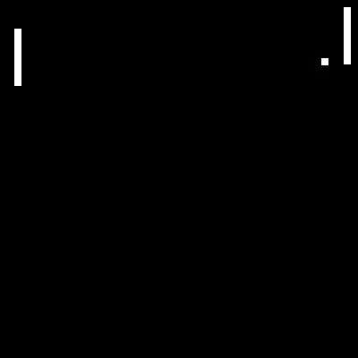

# 我建立了一个可以和我玩乒乓球的线性回归。

> 原文：<https://medium.com/hackernoon/i-built-a-linearregression-that-can-play-pong-with-me-7b00d73f3fcc>

一种天真的创造人工智能的方式。挺酷的。

你还记得那个老式电子游戏“乒乓”吗？只有两个垫子和一个不是圆的球？它看起来有点像这样。

Starting positions of the three main objects in Pong. RetroFun.

几年前，DeepMind 建造了一个超级酷的[模型](https://www.cs.toronto.edu/~vmnih/docs/dqn.pdf)，可以播放 7 种不同的雅达利经典音乐。他们所做的很棒，主要是因为他们使用了原始像素数据。这是一种非常纯粹的方法，跳过了传统的[机器学习](https://hackernoon.com/tagged/machine-learning)中的手工制作阶段，我发现深度学习很有趣。使用正确的工具，这是比手工构建功能更强大的方法。

这一突破让我感到好奇:“这个超级复杂的模型实际上可以玩视频游戏，并且超过人类。但是！一个非常简单的模型就足以体面地与另一个人类对战吗？”

## 时间线注释

当我有这个想法的时候，我的技能不足以将它编码，但现在情况不同了，感谢神奇的 Python，我可以在不到七天的时间内解决它。

# 输入线性回归和 Pong。

让我们想简单点。一个很简单的游戏:Pong。一个非常简单的，如果不是最简单的，模型:线性回归。很好。事实上这看起来很简单:

*   输入数据:每帧屏幕的原始像素。
*   要预测的变量:衬垫在每一帧的位置。
*   模型:ElasticNet*线性回归
    *(套索和脊正则化的线性组合的奇特说法)

在我看来，这听起来像是一个经典的监督学习问题。那么，我该如何着手呢？

1.  获得一个有效的 Pong 框架。
2.  改编代码以收集数据，训练模型并将其部署到视频游戏环境中。
3.  通过玩几个游戏来收集大量的数据。
4.  定型线性回归模型。
5.  用验证数据测试模型。
6.  将它部署在视频游戏的自然动态环境中，看看它是否能够运行。

简单？是也不是。事实上我做了所有这些，但有一些有趣的情节曲折，我觉得很有趣，值得分享。

## 情节转折 1:数据收集

虽然使用 [***pygame***](https://www.pygame.org/news) 请求像素原始数据相当容易，但收集正确的数据需要更多的思考。在收集了一些游戏的原始数据后。我开始训练线性回归。尽管这个模型是*“大的”，*400 x 400 的扁平图像，酷的 [SciKit-Learn](http://scikit-learn.org/stable/) 模块已经准备好迎接拟合数据的挑战，甚至进行[交叉验证](http://scikit-learn.org/stable/modules/generated/sklearn.linear_model.ElasticNetCV.html)。但正如我在动态环境中发布后所意识到的，这第一个模型不足以拥有一个聪明的对手。对手实际上会从原来的位置移动很少。为什么？下面剧情中的答案曲折。

## 情节转折 2:原始不那么原始的数据

鉴于第一个模型没有成功(我没想到会成功，但我没想到会基本上停留在最初的位置！)，我对数据收集做了一点调整。你看，原始数据和纯粹主义的方法是好的，但对于这些传统的 ML 技术来说，你必须为它们做一些工作。所以，我实施了一些技巧来帮助它:

*   去除对手 pad 造成的数据中的噪音。
*   仅当球在球场的一半时收集数据，球员复制另一半。

这些条件看起来足够公平，以至于我可以告诉自己我不是在构建手工制作的功能，但也足够让模型可以公平地运行。虽然我的第一点可能是对的，但后一点却不是。该模型将再次非常接近动态环境中的初始位置！这是怎么回事？！这真的让我很困惑，因为在游戏之外的静态环境中，平均绝对误差并没有大到让垫子打不到球。

## 情节转折 3:答案在数据中

在 ML 中，你总是希望你试图预测的答案/变量是*‘内部’*你将用作预测器或自变量的数据(如果不是这样，那为什么还要使用它们呢？).虽然这可能是真的，但有时，就像这次，你并不总是想以实际上偏向你的模型的方式来提供它。这是我的情况，直到这一点，预测的变量是垫的位置和*‘答案’*总是编码在数据中:提供的像素。因此，当部署在动态环境中时(预测位置、绘制框架、预测位置、绘制框架……)，这导致模型非常接近初始位置。这有点违背直觉，但这也解释了为什么垫子不能移动足够的距离来将球弹开。

通过从输入数据中移除包括两个焊盘的像素，模型将在动态环境中更加自由地移动。成功！只是还没有，它仍然打得不够好，所以你可以和它比赛，而不是像一个一岁的孩子那样打败它。

## 剧情转折 4:是来了还是走了？

在思考了模型还需要什么才能玩得相当好(在大多数角度击球)后，我意识到通过输入单帧数据，很难(甚至对你来说更像是不可能)分辨球是朝着还是远离端区移动。这导致模型做出最佳猜测，但由于它基本上是从以前的行为(我的行为)中学习，它只能做这么多。

Away or towards the pad?

模型需要什么来捕捉方向感？更多数据，顺序数据:帧窗口。我没有向模型提供单个帧，而是将数据集转换成一个序列:为每个训练示例的模型提供三个连续的帧。

这真是一针见血，最后的数据处理让这个模型很好地实现了我的目的:证明一个简单的模型可以和人类比赛。这是一个有点起伏，但做的工作。你可以想象，我在右边和左边的人比赛。

Me vs a Linear Regression

## 一些最后的想法

*   由于这是一种受监督的方法，因此性能取决于您收集的数据，然后用这些数据训练您的模型。但是如果数据来自一个不擅长打乒乓球的人呢？嗯，模型不会表现得很好，这就是为什么使用[强化学习](https://en.wikipedia.org/wiki/Reinforcement_learning)方法对于玩“人工智能”的视频游戏很有意义。
*   我在这里提出的公式/模型实际上对人类有一点优势，理论上:它可以预测垫移动的位置，并且由人类控制的垫被限制为在给定垫按下键时的速度的情况下垫可以移动多少。
*   根据上一点，另一种(更“公平”的)方法是将问题表述为分类问题。预测三个选项中的一个:按键向上移动，按键向下移动或在每一帧都不移动。

从[数据科学](https://hackernoon.com/tagged/data-science) /机器学习的角度来看，这是一个非常有趣且完整的问题:

1.  你需要写代码。
2.  分析数据和转换数据。
3.  培训、验证和选择模型
4.  将它们部署到应用程序中，以便智能地做出反应来执行任务。

你可以在这里找到代码**来玩，收集数据，训练一个模型，和一个模仿你乒乓风格的人工玩家对战！**

**PS:欢迎 PR(注:**