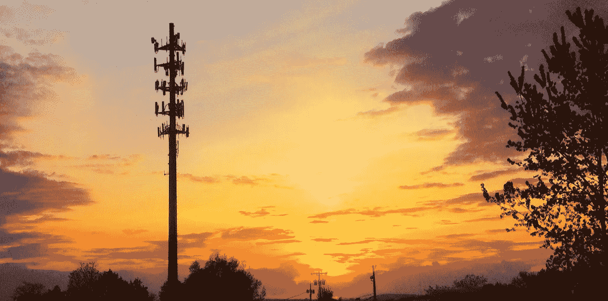
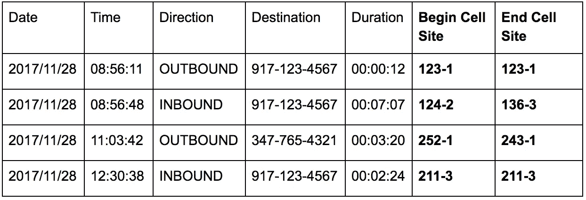
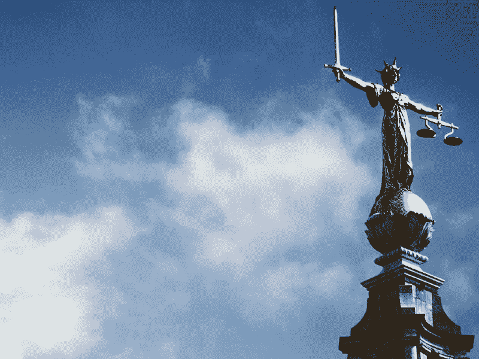

# 我曾为检察官追踪手机定位信息。我的经验表明，辩护律师迫切需要更好的技术资源。

> 原文：<https://medium.com/hackernoon/i-used-to-track-cell-phone-location-information-for-prosecutors-b0dbd4325997>

明天上午，最高法院将听取 [*卡彭特诉美国*](http://www.scotusblog.com/case-files/cases/carpenter-v-united-states-2/) 一案的辩论，该案质疑宪法是否保护无线提供商从其客户处收集的手机定位数据。当执法机构希望访问 127 天的数据时，它是否必须向法官证明它有“可能的理由”相信这些记录将揭示犯罪证据？或者它只需要满足一个稍微低一点的标准——它有理由相信这些记录“与正在进行的刑事调查相关且重要”？

Photo by [Mike Mozart](https://www.flickr.com/photos/jeepersmedia/14175438234/), licensed under [CC-BY-2.0](https://creativecommons.org/licenses/by/2.0/).

现在有许多其他文章和专栏文章都在讨论这个摆在法庭面前的问题——我们是否对为了获得服务而自愿与我们的电话提供商分享的位置信息有“隐私预期”,特别是现在由于技术的不断变化，我们必须与我们的电话提供商分享的信息比过去更加暴露。

我想谈谈一个密切相关但同样重要的问题，人们并没有谈论这个问题:技术的进步如何让资源有限的辩护律师极难开展工作。

我对这个问题有一个不同寻常的观点，因为在我成为律师之前，我作为曼哈顿地区检察官办公室的分析师全职分析这种类型的位置信息。事实上，我在曼哈顿地方检察官办公室的经历帮助我决定去法学院，并最终成为一名隐私律师，我会解释为什么。

但在此之前，请允许我解释一下本案中的关键信息。每当你的手机连接到网络时，比如拨打或接听电话或短信，或者通过应用程序传输数据，你的手机公司都会记录下来。您可以查看其中的一些信息。例如，如果您有一份详细的电话账单，它可能会列出您拨打的所有电话，如下所示:

你可能没有意识到的是，这里有遗漏的栏目——你的电话公司存储了比你账单上显示的更多的通信信息。它存储的东西之一是你的手机在每次通信时连接的无线信号塔——你的手机的“手机站点位置信息”换句话说，在电话提供商端，记录可能是这样的:

(此示例仅显示了您的手机在每个事件开始和结束时连接的手机站点。这是我十年前的工作，但最近政府承认，它也寻求获得后台运行的应用程序生成的手机网站位置信息——这可能是大量的附加信息。)

我曾经亲自检查过这些东西，所以请相信我:如果有人不仅想知道你和谁说过话，还想知道你去过哪里，这些额外的栏目就是数据黄金。这些号码与电话公司运营的特定天线或手机基站相对应。通过查找这些手机基站的地理位置，分析人员可以估算出你在一段时间内的移动情况。如果您在旅途中拨打和接收大量电话和短信，或者如果您居住在信号塔非常密集的地区，因此倾向于使用非常近的电话进行通信，例如在城市地区，情况尤其如此。对塔楼位置的分析可以揭示一个人生活中高度隐私的细节。像我这样的人也许可以利用手机定位信息来确定你住在哪里，在哪里工作，你的孩子在哪里上学，你是否有外遇，你在哪里做礼拜。

作为一名 23 岁的大学毕业生，这正是我所做的。我为检察官提供建议，告诉他们应该要求哪些信息来立案，或者找出某人去过哪里，我还帮助为这些信息生成法院指令。然后当这些信息进来时，我分析它，绘制它，偶尔在法庭上展示它。

在法庭上，很少有什么东西能像一幅非常好的图形那样引人入胜——也很难让人信服——它表明，当犯罪发生时，被告就在犯罪现场附近。当我介绍我的地图时，法官和陪审团会聚精会神地盯着我，而被告会沉下脸来。当辩护律师盘问我的时候，他们努力提出尖锐的问题。在水下，因为他们有难以置信的沉重的案件量，很少或没有技术专业知识，以及检方拥有的很少的分析资源，我在法庭上遇到的辩护律师总是被迫盘问我，而没有对数据进行独立的分析。

Photo by [Captain Roger Fenton](https://www.flickr.com/photos/762_photo/2233509492/).

审判中的对抗程序应该确保对被指控犯罪的人——他们可能在未来几年甚至几十年被剥夺自由——提出的证据得到仔细审查，并且法官和陪审团意识到证据的弱点。但是因为我的证据在技术上很复杂，这个过程就中断了。我在法庭上似乎是不可战胜的。被告和他们的律师对我提出的证据感到措手不及，无力反驳。

当这种权力显然来自法律体系的失败时，拥有这种权力的感觉并不好。这就是为什么我去了法学院，并最终进入了隐私法和政策领域。因为技术发展了，法律也要跟上。希望明天听完辩论后，最高法院将同意并承认我们在自己的位置上有隐私权，即使技术在进步，更多的信息在被收集。

但从长远来看，我们必须想出如何应对辩护律师面临的越来越多的挑战，他们越来越缺乏进行辩护所需的技术专长。除此之外，辩护律师将需要资源和培训来发展他们自己的技术专长，以及在需要时聘请外部专家的资金。政策制定者需要认识到，当他们支持执法机构获取和使用先进技术工具时，他们必须支持辩护律师的并行改进。否则，对刑事被告——尤其是贫困被告——的不利局面将变得完全无法克服。