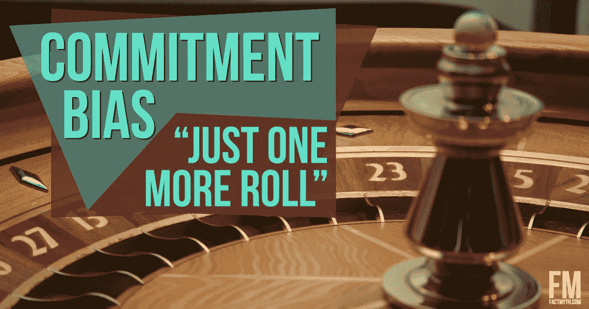

# 本周观点:承诺偏差

> 原文：<https://medium.com/hackernoon/idea-of-the-week-commitment-bias-9b620898da6>

行为经济学和心理学是科学的瑰宝。像卡尼曼或特沃斯基这样的天才忍受了以色列的战争和其他地方的学术战争，他们成功地解开了北半球人关于“理性”的纠结观念。我想把重点放在行为经济学的一个特殊观点上:我们对自己的观点投入得越多，就越难摆脱自己和自己的信仰。又名。沉没成本谬误、承诺升级或承诺[偏差](https://hackernoon.com/tagged/bias)。

我的论点是，承诺偏差是所谓“西方民主国家”政治低效的主要原因之一。政客们采取 X 立场，不会改变。行为科学家已经证明，人类花越多时间思考自己的想法，就越难改变和摆脱这些想法。

为什么美国不放弃化石燃料，80%依赖可再生能源？这将创造数百万个工作岗位。这种改变只需要批准一项新的法律，执行一项支持化石燃料的能源政策。正如丹麦和其他国家所做的那样。华盛顿的决策者之所以不这么做，是因为沉没成本谬论。换句话说，你太专注于自己的事业了，你甚至不能意识到这山望着那山高。

企业和决策者未能迅速改变和适应新的条件，并将这些新的前提纳入决策过程，是由于这种启发和其他原因。渐进式变革和致命瘫痪之间的障碍取决于少数决策者，他们有责任在董事会、国会或初创公司办公室体现变革和真正的收益/成本分析。

因此，问题是鼓励不动而不是迅速和充分知情的政策变化的两党制度是否有利于我们的人民。因此，像新加坡这样的小型技术官僚政府似乎是一个更好的选择。一个没有意识形态的政府，或者换句话说，将所有的意识形态作为制定政策的众多来源之一，而不是一个产生脆弱性和盲点的中央集权的教条。

初创公司创始人和企业家也深受这种启发。他们很难改变和摆脱自己的想法。这是专注和扩张之间的微妙平衡。尽管如此，技术和创业行业需要更高程度的参与，与政府和整体企业相比，这是一个竞争优势。它为那些像我们中的许多人一样，从底层开始，没有什么或几乎没有什么可以失去的人提供了高水平的奖励。这就是梦想家和勤奋的技术人员碰撞在一起创造创新和改变世界的原因。

一些政治家或传统企业经理认为，解决这个问题的办法是假装喜欢初创公司，并就此发起公关活动。他们错了。他们需要臭鼬工厂。他们需要真正的颠覆从他们的队伍中产生。再一次，正如我在以前的文章中所说的，有必要杀死思想的单一文化。单一文化的思想让所有这些先天偏见茁壮成长，并创造出更加脆弱的系统。

解决办法是拉下政策制定者和企业管理者的椅子，让他们摔在屁股上。一个站立的人将被迫行走，而不是坐在舒适的长期持有的意见。在游戏中，人类将被迫穿越丛林，在老虎和蛇中穿行。然后，探险者、骗子和梦想家将加入到探索中来。

这里有一些值得思考的东西。

作者:EJT

> [黑客中午](http://bit.ly/Hackernoon)是黑客如何开始他们的下午。我们是 [@AMI](http://bit.ly/atAMIatAMI) 家庭的一员。我们现在[接受投稿](http://bit.ly/hackernoonsubmission)，并乐意[讨论广告&赞助](mailto:partners@amipublications.com)机会。
> 
> 如果你喜欢这个故事，我们推荐你阅读我们的[最新科技故事](http://bit.ly/hackernoonlatestt)和[趋势科技故事](https://hackernoon.com/trending)。直到下一次，不要把世界的现实想当然！

