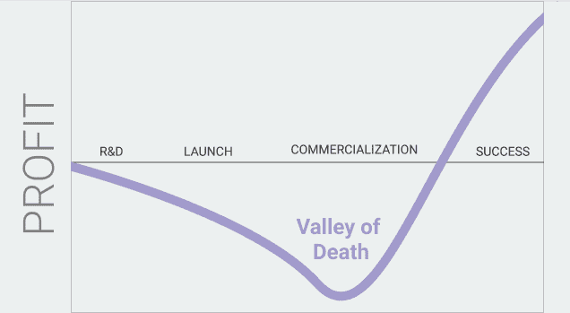
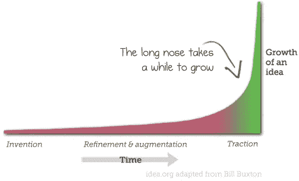
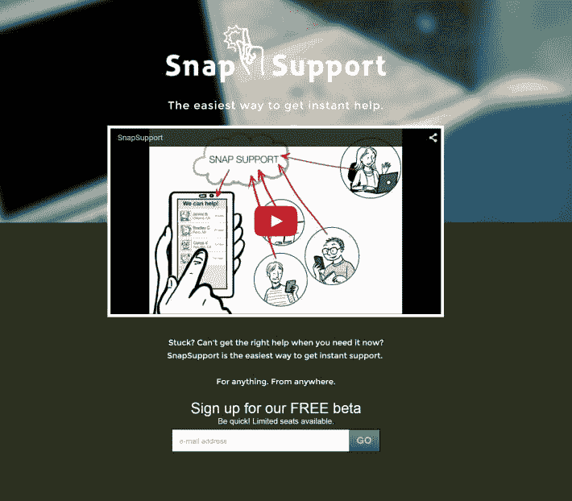

# 想法被高估了

> 原文：<https://medium.com/hackernoon/ideas-are-overrated-cad21c82066b>

产生想法很有趣——甚至会上瘾。我应该知道。作为一名设计主管，在我的职业生涯中，我主持过许多构思会议。

你可能也经历过这种情况:一个团队聚在一起几个小时或几天来集思广益。“追求音量，”他们被告知。最后，工作室的墙上可能会有数百个想法。成功是通过使用便利贴的数量来衡量的。

但在大多数公司，创意的数量很少成为问题。我从未遇到过没有足够多想法的组织。事实上，大多数人都沉浸在他们不知道如何实施的想法中。然而，我们继续参与练习，为这一堆想法添加越来越多的想法。

部分问题是对[想法](https://hackernoon.com/tagged/idea)生命周期的错误达尔文主义观点。我们假设最好的想法会因为它们自身的价值而浮出水面。如果你能收集到足够多的想法，那么从数学上来说，其中一些想法存活下来的几率就会增加。

那是一个虚幻的希望。最好的想法并不总是成功的。

相反，任何组织中的自然力量都会压制想法，不管它们是好是坏。其中最主要的是*不确定性*，这是企业内部领先的思想抗体。

新概念对厌恶风险的经理来说是一场赌博，即使它们在高保真原型中得到了很好的表达。

许多想法在我们拥有的时候看起来很棒。“就是它了！我们要拯救公司！”我们充满信心地思考。但是当需要做出艰难的决定，那些天真的想法变成现实时，即使是最好的想法也会很快消失。

麻省理工学院研究员、《创新者的假设》一书的作者迈克尔·施拉格更进了一步。他认为好主意是有害的。他写道:

好的想法实际上是生产力的敌人。专注于好想法会给优秀的管理者和优秀的企业带来可怕的伤害——无论是在运营上还是情感上。与冰毒上瘾者和其他瘾君子一样，商业思想狂人总是在寻找下一个解决方案。

施拉格认为，好的想法承诺过多，交付不足。它们分散了我们对“丑小鸭”想法的注意力，如果给予关注，这些想法可能会变成天鹅。

问题的部分原因是我们过于看重想法的表面价值。事实上，很难(如果不是不可能的话)在一个伟大的想法还在萌芽阶段就发现它。我们假设会有某个“啊哈”的时刻，一切都感觉恰到好处。

然而,[创新](https://hackernoon.com/tagged/innovation)的历史表明，即使是最深刻的创新最初也是如此。斯科特·伯昆在他的书*中对顿悟的错误观念提出了警告。他写道:*

*大多数创新都是在没有顿悟的情况下出现的，当强大的时刻真的发生时，很少有人知道如何找到下一个。即使在神话中，牛顿有一个苹果，阿基米德有一个尤里卡。专注于神奇的时刻就是错过了重点。目标不是神奇的时刻:而是一项有用创新的最终结果。*

*乘坐莱特兄弟的第一次航班。只有少数人观看了这一历史性事件，他们甚至花了六年时间才卖出第一架飞机。没有人看到数十亿美元的产业源于他们的发明。只是很难在一个真正伟大的想法还处于萌芽阶段时就识别出来。*

*尽管如此，我们仍然痴迷于想法的起源。有一个伟大想法的灵感是什么？我们如何将对人类需求和欲望的洞察与想法联系起来？*

*例如，看看史蒂文·约翰逊的书《好主意从何而来》。这是一个非常详细的想法是如何开始的。他调查了人类最重要的创新的兴起及其起源。*

*约翰逊建议组织*

*…创建一个开放式预感数据库，这是传统意见箱的 Web 2.0 版本。公共直觉数据库让组织中的每个人都可以看到每一个经过的想法，而不仅仅是管理层。*

*我们当然应该关心思想的自然演变，并注意它们从何而来。但这还不够。成功的公司能够将想法转化为交付的价值。*

*我们既要考虑创意来自哪里，也要考虑创意在组织中的去向。*

# *思想的“死亡之谷”*

*在创业公司的世界里，“死亡谷”一词指的是在公司早期阶段覆盖负现金流的困难。这是他们的新产品或服务赚取收入并成为可行的业务所需要的时间。初创公司靠“天使投资人”的早期投资生存。*

*想法也有一个死亡之谷。当然，R&D 实验室保护新生概念不受商业世界金融力量的影响。但是最终的决定将取决于商业的可行性。*

*思想沿着相似的路径进入死亡之谷，但速度可能更快。在许多情况下，想法的寿命只有几个小时。在一次头脑风暴会议后，他们立即死在了山谷里。*

**

**死亡谷也适用于组织中的想法**

*过于依赖想法本身要求我们的商业伙伴要有信心。相反，我们需要以决定性的方式证明新概念的市场可行性。*

*围绕想法设定正确的期望。你不会把便利贴贴在车间的墙上直接付诸实施。(实际上，我在一个项目中遇到过这种情况)。而在一个季度甚至一年内产生现金流也是不现实的。相反，可能需要几年甚至几十年的时间，创意才能作为创收产品和服务充分实现。*

*比尔·巴克斯顿，著名的计算机科学家和微软首席研究员，[向我们展示了创新](http://www.bloomberg.com/news/articles/2008-01-02/the-long-nose-of-innovationbusinessweek-business-news-stock-market-and-financial-advice)的长鼻子。想法孵化后的生命周期需要耐心和努力。他写道:*

*一个想法很可能始于一项发明，但是大部分的工作和创造力都是在这个想法的扩展和完善中。想法越新，大多数分析的粒度就越粗，人们就越有可能说，“哦，这就像 X”或“这是以前做过的”，而不知道将想法从概念变为广泛实践需要多少工作和创新。*

**

*拿着 iPod。与普遍看法相反，苹果没有发明数字音乐播放器。事实上，第一台数字音乐播放器诞生于 80 年代初，比 iPod 早了近 20 年。作为第一款商业数字音乐播放器，Diamond Rio 比 iPod 早了好几年。*

*自然，组织努力缩短创新的长鼻子。它始于认识到在便利贴上表达的想法仅仅是新生的想法，还有很长很长的路要走。*

*创新就是再发明。很多。在成为我们今天所指的光辉典范之前，创意经历了概念、技术和商业发展的多次迭代。*

# *准备好了。开火！瞄准。*

*要明确的是:构思和头脑风暴在我们的团队和组织中确实扮演着重要的角色。他们把人们聚集在一起，创造性地设想一个尚不存在的未来。还有个人层面的参与，加强协作，拉近团队距离。*

*更重要的是，围绕着一个共同的目标，观点也是一致的。小组通过创造性地一起解决问题来形成一种共同的现实感。这对一个组织的整体健康非常重要，我并不提倡减少这类活动。*

*然而，当每个人都回到他们的“常规工作”时，失望就来了头脑风暴会议的能量和兴奋会很快消失。获得新思想的希望瞬间消失。*

*首先，[《车间失忆》设定在](http://blog.mural.co/2015/04/13/do-you-suffer-from-workshop-amnesia)。几天之内，研讨会参与者就会问，“我们决定了什么？”以及“谁拥有什么？”以及“我们如何找到时间来做这些工作？”。*

*但是，我们也缺乏走出思想死亡之谷的动力。请记住:即使是你最好的想法，也会遇到阻力——不确定性、短期财务目标和缺乏资源。*

*通过一个组织的正常决策过程获得新的想法需要承诺、时间和毅力。它要求首先采取行动，以便建立势头，让想法有机会实现。这需要实验。*

*是的，你需要有效的、全面的市场洞察力作为你的出发点。是的，你需要召集一群合适的人来创造性地解决问题。但是不要忘记提前计划好一个强有力的后续行动，并且有一条前进的道路。*

*幸运的是，你可以做一些相当简单的事情来保持这种势头:*

***1。将构思作为一个正在进行的项目来管理** 邀请一位项目经理参加你的构思或头脑风暴会议。参与行动后，他们的主要功能是将结果分解成可操作的步骤。让他们为不断涌现的想法制定一个计划。*

*从一开始就引入项目管理表明了对未来挑战的认识。它还显示了组织中更广泛的利益相关者的承诺。想法的产生只是一个开始。*

***2。将实验作为结果** 你在便利贴上的天真想法还没有准备好实施，也没有准备好做出最终决定。相反，将实验作为工作会议的结果。首先，将想法表达为假设:*

**我们相信提供<产品/服务/功能>将为<客户>带来<利益>。当我们看到<可衡量的结果>时，我们就会知道这一点。**

*这需要一些谦卑，但设定正确的期望。在没有首先证明商业价值的情况下，你不会从头脑风暴进入实施阶段(例如，从死亡之谷出来)。头脑风暴会议结束时，以“我们相信”开头的陈述表明你不知道这个想法是否可行。实验让你做到这一点。*

***3。具有讽刺意味的是，决策者会被伟大的想法所吸引。他们想要一个本垒打，正在努力争取。“我想要我们行业的下一个 iPod，”他们会要求。有一种被美化的观念，认为伟大的想法更好。***

*而是下很多小赌注。你不知道一个想法会有多大。伟大的想法实现的机会越来越少，因为赌注越来越高。更重要的是，有时小创意会变成有价值的商业创意。*

***4。开始前投入资源** 提前获得持续实验的承诺，甚至在你开始产生想法之前。将有专门时间进行实验的小组排成一行。也要提前明确预算。一个便宜的实验可能只需要 4-8 周就可以完成，并且需要几千美元的预算。*

*给予团队进行实验完全自主权。目标是立即获得真实世界的反馈并理解市场反应、业务含义和技术含义。*

***5。进行廉价测试** 准备好一次又一次的重新发明。在得到真实世界的反馈后，你最初的想法甚至可能不像最初的概念。*

*这不需要太多投资。问问你自己，获得你的想法的潜在影响的最短可能的方法是什么？在大多数情况下，一组简单的实验就足够了——一个简单的概念证明，验证你的假设与否。*

*例如，在我几年前举办的一次研讨会之后，我们开发了一个解释性视频和一个登录页面。访问者可以观看视频，然后注册获得测试版发布的通知。注册后，我们还推出了一个简短的三个问题的调查。*

*从这些接触点，我们能够衡量一段时间内网站的流量、注册人数以及对我们调查的回应。我们还与选定的个人进行了交谈，以更好地了解他们的动机以及是什么让他们对我们的价值主张感到兴奋。*

**

**“假店面”实验收集前期反馈**

*这个概念一直在改变。它最终不再像原来的样子了。我们伟大的想法被证明不是一个可行的商业或独立的产品。相反，它更适合作为现有旗舰产品中的一项新功能。*

# *思想万岁！*

*重申:产生想法对任何组织都是有益的。它把人们聚集在一起，提供了一个锻炼创造性肌肉的安全论坛。*

*但是最终想法本身被高估了。商业决策不是基于一个概念的草图或不完整的描述而做出的。组织需要一个更现实的观点来看待想法是如何存活(或不存活)的。它始于认识到从一开始力量就会与你作对。*

*避开思想的死亡之谷。这包括将结果作为项目来管理，确定假设(不是用于实现的概念)，并通过行动来跟进。*

*廉价的实验每次都胜过好主意。这需要组织各个层面的承诺，但结果比仅仅过于相信想法要令人满意得多。*