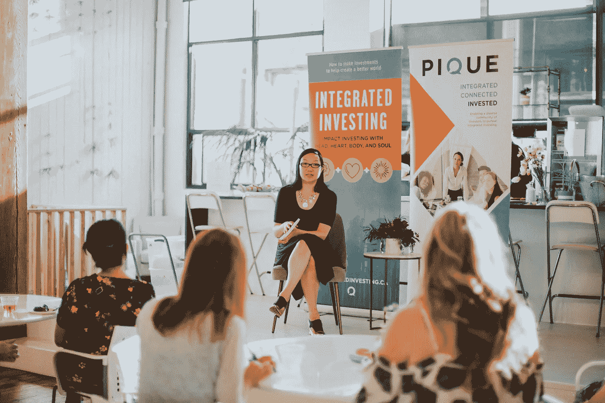

# 如果你不知道，现在你知道了

> 原文：<https://medium.com/hackernoon/if-you-dont-know-now-you-know-4b754f24e4e6>

Photo credit: Alejandra Aguirre [http://www.alejandramaria.com/](http://www.alejandramaria.com/)

## 关于为你的企业融资的 7 条重要建议

我一直在写新书。我的第一本书《T2 综合投资》帮助有抱负、有经验的投资者做出投资决策，以获得更积极、更有影响力的结果，而这第二本书是为企业家写的。这一次，我正在帮助企业家们应对艰难的决定，包括筹集和管理资金，为他们的[业务](https://hackernoon.com/tagged/business)提供资金。基于《综合投资》中介绍的概念，你可以肯定这本新书将把分析、情感、身体和直觉整合到决策中。新书需要一个标题——如果你有什么建议，请告诉我。

下面的许多建议对任何寻求资助的人来说都是通用的，然而我是从一些关键建议的角度来写的，尤其是对女企业家。

1.  在你需要见人之前，先去见他们。有些人可能会称之为“网络早期”。在很多不同的情况下都是如此，对于资金来说也是如此。即使是最有经验、最老练的企业家也会求助于他们现有网络中的人，这些人他们很了解，与他们有很大的相互信任，与他们有很好的关系。为了让你的网络中已经有了一致的投资者，你需要在见他们之前先见他们。
    正如 Diana 项目 2014 年报告的[执行摘要所指出的，妇女被排除在增长资本融资网络之外，似乎与投资者和金融家的联系不够。女企业家需要采取额外的步骤，并尽早采取这些步骤，以发展她们目前或未来需要的资金网络。](http://www.babson.edu/Academics/centers/blank-center/global-research/diana/Documents/diana-project-executive-summary-2014.pdfhttp://www.babson.edu/Academics/centers/blank-center/global-research/diana/Documents/diana-project-executive-summary-2014.pdf)
2.  **存钱，早点存。**建立自己的启动资金。[成为自己创业公司的投资者](https://hackernoon.com/be-an-angel-invest-in-your-own-startup-b724a6252d47)——用辛苦赚来的钱，而不仅仅是血、汗和泪。最初，你需要自己的资源来启动你的企业，而不需要外部资本。平均而言，[女性的收入是男性的 80%。](https://www.census.gov/library/publications/2016/demo/p60-256.html)一般来说，女人比男人需要更多的时间来积累自己的创业资本，所以你需要早点开始。
3.  像投资者一样思考。与上面的第二点密切相关的是，建立自己的资本，投资一点，然后保留一些用于自己创业的后续投资。留出资本意味着，如果你愿意，你可以继续投资于你的企业，并在以后将其转化为额外的股权资本或来自外部投资者的融资。能够提供与你这位创始人共同投资的机会，是一个更有吸引力的故事。在[综合投资](http://integratedinvesting.ca/)中，我专门用了一章来讲述帮助人们像投资者一样思考的心态。
4.  **学习金融的语言。**熟悉数字、会计和财务术语。从投资回报率和内部收益率到稀释和上限表，了解这些术语的含义以及它们为什么重要。了解燃烧率和运行率的区别。了解你的借方和贷方，理解你的资产负债表、损益表和现金流量表所传达的不同信息。
    有一句话(当我还是投资银行家的时候):谁拥有金融模型，谁就拥有交易。这就是说，理解数字是最重要的。
5.  了解一点法律术语没有坏处。除了理解数字，我还发现理解与融资相关的法律文件是谈判中的一个优势。金融模型用数字讲述投资机会的故事，而法律文件用法律术语讲述故事。我能够向任何人概述他们将要签署的法律文件。我提醒自己不是律师，并鼓励我的合作伙伴去寻求法律建议。我鼓励他们让律师独立审查法律文件，但这并不能免除我对文件内容的理解。我遇到的那些不知道文件内容的企业家太多了，多得数不清，这很可怕。
6.  **明白“退出”是什么意思，有策略。**从投资者的角度来看，退出是最常被谈论的话题，它是我们实现投资回报的时间和方式。
    拥有一个“退出策略”实际上意味着将你的风险投资变现为辛苦赚来的现金或等价物。换句话说，退出是将企业的所有权转移给另一个投资者——通常是作为一家拥有股权流动性的大公司的子公司，或者成为一家拥有股权流动性的公司(IPO)。
    创业者可能会也可能不会和投资人同时退出。研究其他企业和投资者是如何实现退出的。接受行业并购活动方面的教育，制定可信的退出策略。
7.  **做你最好的、最明智的自己，相信外面有一致的投资者。**当你用外部资本投资你的企业时，你做的不仅仅是带来资金，你还为你的团队带来了一个新的合作伙伴。对于任何企业家和投资者来说，结盟是最重要的。越来越多的投资者真正重视女企业家对经济和社会的贡献。见多识广，做好自己。寻找与你的愿景一致的投资者，他们会支持你，指导你，并成为你的投资伙伴。符合某些投资者熟悉的特定模式的需求越来越少了。投资者群体正变得越来越多样化，因此吸引资金的目标正变得更加合适、互补和一致。

对于企业家来说，这是一个激动人心的时刻，尤其是对女性而言。被告知，找到你的社区，建立你的网络，这样你就可以继续建立令人兴奋的有影响力的业务。

这篇文章的最初版本最初发表在 [Quora](https://www.quora.com/What-is-the-best-advice-for-women-entrepreneurs-in-terms-of-funding/answer/Bonnie-Foley-Wong) 上，并在 [Inc.](https://www.inc.com/quora/7-things-every-entrepreneur-needs-to-know-about-ge.html) 、[福布斯](https://www.forbes.com/sites/quora/2017/07/13/what-every-woman-entrepreneur-needs-to-know-about-getting-funded/#76be27cb19d3)和[赫芬顿邮报](http://www.huffingtonpost.com/entry/my-7-key-pieces-of-advice-for-women-entrepreneurs-that_us_596545cae4b09be68c0055ff)上进行了专题报道。

如果这篇文章对你有所帮助，请❤并关注我的 [Medium](/@bonnieowong) 以获得更多关于投资企业的见解、故事和观点。

关注皮克风险投资博客了解影响力投资资源。

同时，你可以看看我在 Quora 上关于[创业](https://www.quora.com/profile/Bonnie-Foley-Wong/answers/Entrepreneurship)的其他回答。

**最后一件事**——我该怎么称呼我写给企业家的关于决策、融资和理财的书呢？