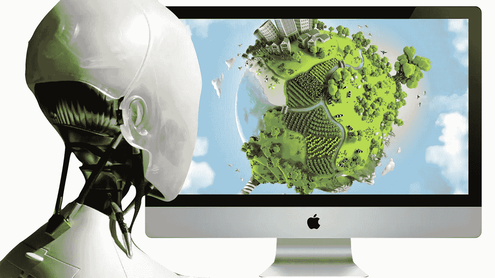
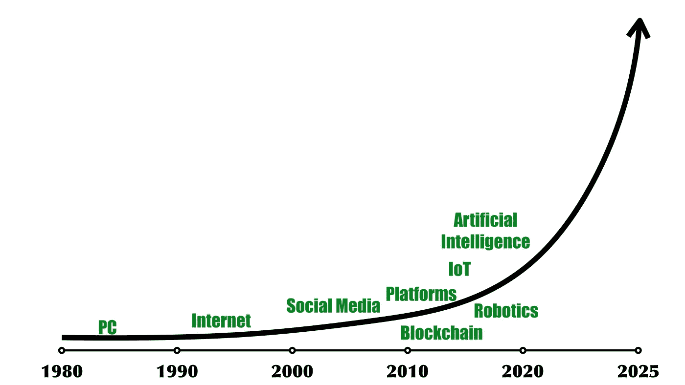

# 对人工智能和机器人最好的回应是什么？

> 原文：<https://medium.com/hackernoon/if-you-want-to-make-the-world-a-better-place-you-need-to-embrace-ai-robots-and-big-data-6e1d53d63466>

> 人们需要拥抱人工智能和机器人。否认新技术的影响创造了一个平行世界，有可能伤害社会。

## “善”还是“恶”

对人工智能、机器人或大数据等新技术的社会影响的讨论，通常会区分两种不同的态度或群体。

第一组关注这些技术的社会效益，或者说*【好】*。这样的观点强调 AI、机器人和大数据对社会的积极影响。例如，他们关注技术如何刺激健康老龄化，消除贫困或保护环境。

例如，大数据可以帮助医生做出早期诊断，从而促进更有效的治疗。自主和智能系统有助于消除贫困和保护环境。以农业革命为例。技术使农民在施肥和收割作物方面更有效率。

然而，另一方面，也有怀疑者。属于这一群体的人对技术的影响更加乐观，并强调人工智能、机器人和大数据的潜在风险——或*【邪恶】*。他们关注智能机器变得越来越聪明的危险，并担心机器人扮演越来越像人类的角色。在他们看来，人工智能机器人将从人们手中夺走越来越多的工作。

这种恐惧还不止于此。怀疑论者警告其他更严重的危险。他们最大的担心是，如果我们不保持警惕，领先技术进化一步，人工超级智能最终可能会消灭人类。根据这种反乌托邦观点，电影( *Ex 玛奇纳*)和电视剧(*人类*和*西部世界*)中出现的人形机器即将进入现实世界。

具有讽刺意味的是，“*善*”和“*恶*”对 AI、机器人和大数据的看法并不相互排斥。它们往往是相辅相成的。事实上，这两种观点是同时持有的，通常是由技术专家和具有开发和推广颠覆性创新的实际经验的人持有。

或许不足为奇的是，埃隆马斯克(Elon Musk)、斯蒂芬霍金(Stephen Hawking)和比尔盖茨(Bill Gates)加入了其他技术专家的行列，对机器学习和人工智能可能存在的危险发出警告，同时也不一定忽视新数字技术的好处。

## 否认的文化

然而，真正的问题不是我们是否害怕或拥抱新的数字技术。毕竟，两个群体都承认这种变化的深刻社会影响。他们只是在我们前进的方向上有分歧。

然而，还有第三个群体——也是迄今最大的一个群体——否认人工智能、机器人和大数据的社会影响。特别是，这一群体未能认识到快速发展的新数字技术如何改变了世界。

这种否认文化的一个症状是“旧世界”的思想、概念和模型被用来理解新世界。这无疑是一种安慰，但这种方法不太可能成功。毕竟，在工业资本主义时代发展起来的思维模式和今天截然不同的现实之间存在脱节。

但是还有更多。否认文化有可能创造一个与现实脱节的平行世界——一个虚构的幻想世界，如果你愿意的话。与新的数字技术相比，这种“世界建设”可能对社会构成更大的威胁。

## 世界建筑

在他的一个视频中，广受欢迎的 YouTube 系列节目“书呆子”的主持人 Evan Puschak 解释了为什么“T2”创造世界的现象如今随处可见。它不再是托尔金或 C.S .刘易斯等幻想家的专利。事实上，鉴于数字世界的出现，当前世界建筑的流行并不令人惊讶。让我们解释一下

不可否认，人工智能、机器人和大数据等颠覆性技术已经将“*模拟世界*”转变为“*数字世界*”，这个新世界越来越多地围绕网络、计算机代码、算法和机器学习构建。

这些技术发展的社会和经济影响是深远的。数字技术的指数级增长只会进一步重塑我们对工作、消费和休闲的概念。这里需要注意的是，我们可能还没有接近指数增长曲线的“拐点”。

然而，第三类人继续使用旧世界的模式、方法、制度和法规来思考、理解、分析和构建非常不同且快速变化的新现实。这就造成了一种“*构造的幻想*”，这就有造成“*不快*”、“*困惑*”、“*不信*”、“*假希望*”等风险。

以下是快速变化的数字世界与政治家、研究人员、商业领袖和监管者构建的“平行”世界之间脱节的一些日常例子。

最近，职场创新在商界成为一种时尚。毫无疑问，新技术的实施可以提高员工的绩效、承诺和创造力。然而，工作场所的创新往往局限于表面的改变，这只会带来新的危险。

以最近开放工作空间的趋势为例。任何经历过这种新型办公室的人都会告诉你，这种开放式办公室——特别是如果与“朝九晚五”的企业心态结合起来——往往会赶走有才华的员工，因为它们忽视了深度工作的重要性，限制了个人自由和创造力。

Prototype of “Hushme” (a voice masking device that protects privacy in open space environments)

或者，在大学和其他学术机构中，通过新的社交媒体渠道传播研究成果仍然不被“接受”,当涉及到雇用和提升研究人员时。事实上，大多数研究人员通常仍然喜欢通过更传统的渠道(如学术期刊或传统的学术出版公司)传播他们的研究，尽管近年来由于技术变革，这些渠道的影响已经大大降低。

或者，在这种背景下，想想那些政客——尽管他们越来越多地采用基于现代“社交媒体”的沟通策略来动员选民——仍然鼓吹通过保护(或回归)旧的和被破坏的行业来创造就业。

虚构的平行世界的创造和存在的例子比比皆是。继续采用等级制和隔离式治理结构的公司，这种结构与 21 世纪组织的更具流动性和动态性的需求脱节。

或者，决策者利用“T0”旧世界的“T1”监管模式，但最终却减缓了创新和技术发展。

## 那么，下一步是什么…？

识别对“*新常态*”的正确反应并不总是容易的。

然而，看起来很清楚的是，20 世纪的模型不再适用。在工业生产和国民经济发展的时代，大多数这样的想法根本不适合全球互联的数字时代。使用这种模型仅仅是为了创造一个上述的平行幻想世界。

相反，企业需要在其组织内促进“自由和责任”，充分利用新技术和互联性。大学应该雇佣和提升那些证明有能力创造在线足迹的研究人员。政治家应该开始关注当前技术进步的潜力，以创造新的机会和新的职业类型。企业(及其高管)应该更好地理解新的数字世界，并采取适合这一新现实的治理结构。在监管(或者在某些情况下，*而不是*监管)颠覆性技术时，决策者应该依靠数据驱动和响应的方法。

如何实现这一目标？嗯，首先，我们必须重塑“社会科学”。虽然可以说人工智能、机器人和大数据已经成为“正式科学”和“应用科学”的一个组成部分，但它尚未成为社会科学领域的主流，特别是在经济学、法学、政治学、心理学和社会学等领域。

我们需要做的不是试图用社会科学的传统模型来理解数字世界，而是开发新的范式来描绘和理解我们新现实的不同方面。只有这样，我们才能享受数字现实的全部好处。否则，我们就有助长否认文化和这种否认似乎造成的平行现实的风险。

***请按下“心脏按钮”或留下评论。***

***每周三都有新故事。因此，如果你关注我，你不会错过我关于颠覆性技术的指数增长如何改变我们生活和工作方式的最新想法。***

> [黑客中午](http://bit.ly/Hackernoon)是黑客如何开始他们的下午。我们是阿妹家庭的一员。我们现在[接受投稿](http://bit.ly/hackernoonsubmission)并乐意[讨论广告&赞助](mailto:partners@amipublications.com)机会。
> 
> 如果你喜欢这个故事，我们推荐你阅读我们的[最新科技故事](http://bit.ly/hackernoonlatestt)和[趋势科技故事](https://hackernoon.com/trending)。直到下一次，不要把世界的现实想当然！

