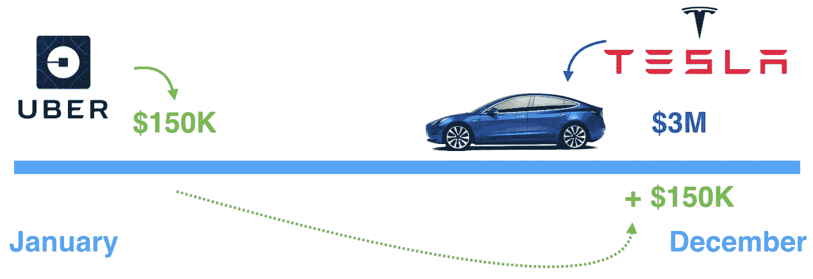

# 忽略技术性债务，转而关注对冲。

> 原文：<https://medium.com/hackernoon/ignore-technical-debt-and-focus-on-the-hedge-instead-76c6fa0538c2>

在我之前的文章中，你可能已经读到了我对[技术](https://hackernoon.com/tagged/technical)债务的[概念](https://hackernoon.com/tagged/concept)的看法。我认为这是一个过于简单的概念，被我的软件争论伙伴们不适当地、过于频繁地使用。

几年前，我读了 Stephen Freeman 关于[未对冲看涨期权](http://higherorderlogic.com/2010/07/bad-code-isnt-technical-debt-its-an-unhedged-call-option/)的博文，它几乎完美地捕捉到了我试图引起注意的额外细节……几乎。

技术债务概念中缺失的细节尤其与一种危险的关注不对称有关。业务团队和工程团队之间关于技术债务的争论升温并不少见。工程团队声称主张减少技术债务，同时指责业务团队是造成技术债务的原因。设置是，工程团队为了只有他们能判断为良好的代码质量而冒着业务生存的风险，而业务团队却在拖延时间，从而为工程设计设置了一个壮观的未来灾难。考虑到这一点，这场争论归结为技术债务就不足为奇了；现在支付你的费用，或者以后用额外的痛苦来支付。但绝对没那么简单。看涨期权的类比更加适用。

## 泰斯拉和优步

为了更好地说明我的观点，让我们用一个容易理解的当代实例。比方说，特斯拉计划在年底前以每辆 3 万美元的价格向优步出售 100 辆 Model 3s。这相当于 300 万美元的收入。特斯拉提议在 1 月初向优步出售一份看涨期权。它基本上保证了优步全年都能以不超过 3 万美元的价格买到 Model 3。这种担保就是看涨期权。

The premium and the Call Option give both Tesla and Uber an advantage respectively

由于特斯拉向优步提供了担保，优步在 1 月初向特斯拉支付了溢价。让我们假设它是预计的 300 万美元的 5%,即 15 万美元。对特斯拉来说，这意味着不管优步最终买不买这 100 辆 Model 3s，特斯拉都能多赚 15 万美元。这也意味着特斯拉获得了早期现金注入，这对 Model 3 的早期制造至关重要。对优步来说，这意味着它将锁定一个由 100 辆 Model 3s 组成的新车队的预计成本上限。这对所有人都是双赢的；如果一切顺利的话。

在这种情况下，特斯拉并不是免费获得溢价。事实上，这是将一点风险货币化。如果到年中，Model 3 的制造成本变得更加昂贵，特斯拉就会吃掉这笔成本。如果 Model 3 的制造成本超过每辆车的利润，特斯拉根据看涨期权协议出售给优步的每辆车都将亏损。特斯拉的下跌空间是无限的。比方说，Model 3 的电池突然变成每辆车 10 万美元。根据协议，特斯拉有义务以不超过 3 万美元的价格向优步提供汽车。噩梦般的场景。

特斯拉可以通过设置安全措施来对冲这种风险，从而减轻这种噩梦般的风险。特斯拉去保护自己的程度完全取决于特斯拉。例如，如果特斯拉决定不持有 Model 3s 的股票来覆盖优步的期权看涨，这将是一个*未对冲或裸*期权看涨。

## 运还是不运

在软件领域，为了短期收益而交付工程界认为不太理想的软件的决定就像提供一个看涨期权。我们要求通过现在发货并承诺稍后交付全部产品来获得提前溢价。对冲我们的看涨期权就变成了我们在软件架构中投入多少努力才能在以后兑现我们的承诺的问题。我们开始强调定义真正企业家的权衡艺术。

## 想想最有价值球员

这种看涨期权类比为这场辩论增添了急需的解决方案。斯蒂芬文章中我不认同的是标题的断言。标题暗示代码中任何看涨期权的实现都是在创造“坏代码”。也许在 2010 年， [MVP](https://en.wikipedia.org/wiki/Minimum_viable_product) 并不是什么大事，但我打赌“糟糕的代码”是当时所有 MVP 的标签。

技术债务做出了两个无效的假设。一个是我们知道代码应该如何完成，另一个是我们知道它是正确的代码，将导致一个成功的产品。一个 MVP 说“不，我们甚至不知道产品到底是什么，所以我们不能做那些假设”。因此，提供看涨期权更有意义，因为它提供了企业生存所必需的灵活性。而且我真的要在这里强调*生存*。我见过太多的软件工程师和系统架构师完全忽略了这一点。你可以坚持写你认为好的代码，也可以付租金。你不能指望一直都能做到这两点。你不可避免地会遇到岔路口，这篇文章就是要让你做好心理准备，不仅要明白你正处于这种情况，还要知道如何去处理它。

## 这是一种技术性对冲

就你而言，噩梦般的场景当然是你没有构建出完美的代码，并且你在将来会以代价高昂的混乱而告终。可能吗？当然可以。可能吗？…呃。你有多确定你试图实现的完美是最终的解决方案，而这需要一开始就做出如此大的牺牲？

如果我们达到了这样的理解水平，那么在那一点上，也许我们可以将争论转移到我们需要多少技术对冲来支持我们的看涨期权。我的意思是在当下做出选择，尽可能地考虑到最好的结果。利用从长远来看有助于获得更大成功机会的溢价。把它想象成建立一个学习架构。因此，与其专注于构建你可能遇到的每一个特性，不如专注于一个旨在学习、适应和发展的架构。

> [黑客中午](http://bit.ly/Hackernoon)是黑客如何开始他们的下午。我们是 [@AMI](http://bit.ly/atAMIatAMI) 家庭的一员。我们现在[接受投稿](http://bit.ly/hackernoonsubmission)并乐意[讨论广告&赞助](mailto:partners@amipublications.com)机会。
> 
> 如果你喜欢这个故事，我们推荐你阅读我们的[最新科技故事](http://bit.ly/hackernoonlatestt)和[趋势科技故事](https://hackernoon.com/trending)。直到下一次，不要把世界的现实想当然！

