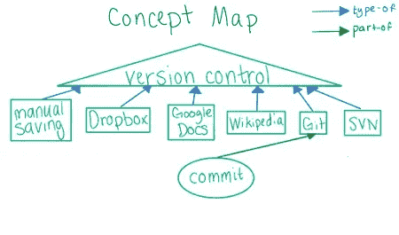
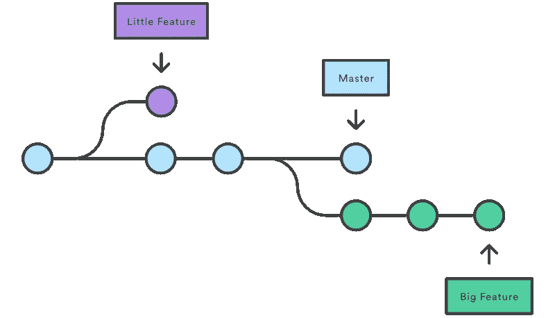

# 为了保护版本控制

> 原文：<https://medium.com/hackernoon/in-defense-of-version-control-f8d8a0d7e23f>

## git 推送媒体文章

我刚刚完成了由 Sarah Spikes 和 Caroline Buckey 教授的 Udacity 课程“[如何使用 Git 和 GitHub](https://www.udacity.com/course/how-to-use-git-and-github--ud775) ”,我迫不及待地想利用版本控制的力量来开发我的项目，以成倍提高生产率。我开始意识到我意识到版本控制的重要性晚了。

One of the early concept maps in the Udacity course

在这里，我试图为您的项目使用版本控制系统(VCS)提供足够的动机，并指导您一些关于人们如何使用名为 [Git](https://git-scm.com/) 的 VCS，这是 Linus Torvalds 给人类的另一份礼物。然而，没有深入的编程知识是先决条件，这篇文章中根本没有提到代码(你有我上面提到的学习具体内容的课程)，所以不要害怕！这里只提到了几个命令。当然，您可以在没有版本控制的情况下开发您的项目，但是有了版本控制，您可以以更加自由和灵活的方式进行开发。一旦你开始使用版本控制，你会惊讶于它的威力，并且会想知道如果没有它你是如何开发你的东西的！

那么到底什么是**版**控件(或者**源**控件或者**改版**控件)？简单来说，版本控制意味着跟踪你的文件。虽然您可以看到一些显而易见的实用程序，如备份、访问文件历史记录等，但您很快就会发现，版本控制不仅仅是这些。但是人们也可以指出一些缺点。一个显而易见的缺点是较大的内存占用。然而，内存占用通常没有人们想象的那么大，在我看来，与版本控制消耗的内存相比，您获得的能力是无价的。

由于我们开发的大多数项目都是增量式的，所以添加或更改内容是一种例行公事，并且会分散在多个日期和文件中。因此，如果我们后来发现我们上周五添加的代码实际上包含了一个不那么容易修复的 bug，该怎么办呢？如果我们能够以某种方式穿越时间，回到上周五之前的代码状态，这样我们(和其他用户)仍然可以使用代码而不会遇到问题，这不是很好吗？版本控制允许我们精确地完成这个任务。此外，它仍然允许访问新代码，以便我们可以检查和修复它，同时我们的“产品代码”(没有 bug 的代码)仍然是完整的。bug 可能跨越多个文件/脚本，所以跟踪多个文件也是可取的，是的，版本控制也提供了这一点。

Image source: [http://smutch.github.io/VersionControlTutorial/](http://smutch.github.io/VersionControlTutorial/)

顺便说一下，版本控制系统不一定与程序脚本相关，它们不仅仅被开发人员使用。大型域上的版本控制清单。事实上，这篇文章有自己的修改历史，我可以用它来做很多事情。例如，我可以回到几天前删除的一个段落，只要转到保存的那部分就可以了。这些保存的部分就像帖子在开发过程中的各个快照。(用技术术语来说，我们称这样的快照为“提交”。)提交也可以被认为是项目开发过程中的检查点。[时光机](https://en.wikipedia.org/wiki/Time_Machine_(macOS))(准确的名字吧？)，苹果用于 MAC 的备份系统，也可以认为是版本控制系统。与其说它是技术，不如说它是一种哲学。Dropbox，Google Docs，Git(当然！)，手动备份…这个列表是无穷无尽的—所有的都有某种形式的版本控制。如果我们想一想，甚至撤销和重做——我们每天无数次使用的动作，都是微小的版本控制系统！如此无处不在！

说到上面提到的实用程序，我们知道它们会自动备份我们的工作。但是，这些仅允许在线备份，并具有有限的离线支持(Time Machine 除外)。但是有一些工具可以提供离线和手动备份，以及其他附加的工具。其中一个流行的工具是 [Git](https://git-scm.com/) ，这是一种为软件开发而微调的工具。在这种情况下，手动“提交”的可用性受制于自律。人们可能在很长一段时间内没有提交，因此没有保存重要的大的更改。或者她/他可能提交得太频繁，从而使版本历史更加混乱。然而，如果用户明智地提交，手动提交比自动保存更加灵活。每当添加/更改逻辑单元时，都可以提交。用户应该在他/她觉得合适的时候提交，但是只有重要的提交才允许方便地浏览修订历史。使用自动保存的缺点是，它们可能会导致潜在的不必要的保存，并会使您的历史记录变得混乱。许多保存甚至可能没有意义和编译。如果明智地执行，手动提交可以避免这种糟糕的事情发生。

一些系统，比如 Git，也允许一次提交多个文件。这里需要注意的是，Git 是为程序员设计的。在编程中，将工作分布在不同的文件中是很常见的。因此，经常会发生这样的情况:您在一个文件中使用另一个文件中的代码(这在模块化编程中很常见)。因此，更改一个文件中的代码会直接影响另一个文件的行为，因此可能需要更改另一个文件。所以提交应该能够保存多个文件。如果编辑一个文件，然后提交，另一个文件可能无法正确编译(因为它需要相应的适应性更改)。另一方面，Google Docs 单独保存文件，因为一个文档中的更改通常不会链接到其他文档中的更改。

Version control can be difficult to understand, but with patience and persistence, you can and will eventually master it. Image Source: [https://xkcd.com/1597/](https://xkcd.com/1597/)

非常非直觉地，版本控制也增强了你的自信和冒险本能。它让我更有信心做出更大的改变，因为即使我所做的改变破坏了我正在工作的程序，我也可以很容易地回到我的回购的早期工作版本，因为我可以访问我的文件的历史。此外，这里出现了另一个行话——回购(或更正式的说法，储存库)。简单地说，存储库就是您想要一起跟踪的文件的集合。它就像你电脑上的一个文件夹或目录，包含一堆文件(可能还有其他子文件夹或子目录)。然而，除了这些内容之外，存储库还包含一些关于这些内容的历史的元数据。使用 Git，您可以在工作目录的终端键入“git init ”,然后嘣！您的目录变成了一个存储库！现在您可以使用 Git 跟踪这个目录中任何文件的变化；它将记录您对更改的文件所做的提交。此外，您还可以选择跟踪哪些文件和不跟踪哪些文件。是不是很牛逼？

我前面提到过，您可以在一次提交中保存多个文件。这到底是怎么发生的？使这成为可能的是集结地。工作目录包含被跟踪和未被跟踪的文件。这只是一个普通的目录。但是，暂存区只包含那些要跟踪的文件。它的用途是允许我们在创建提交之前有一个地方来检查我们正在做我们真正想要做的事情。换句话说，staging area 是一个垫脚石，它位于一个目录中的一堆已更改的文件与保存这些文件中的更改的 commit 之间。这确实有助于对每个逻辑变化进行一次提交。

到目前为止，我们已经讨论了进行更改并将其保存为提交，这样您就有了一个很好的提交链，它允许更好和有效的跟踪，等等。但是，如果你想开发一个新功能(比如将你的应用服务扩展到另一个国家)，同时保持现有代码不变，该怎么办呢？这就是分支发挥作用的地方。在这个上下文中，分支仅仅是另一个提交链。该链可以具有共同的“祖先”或者与另一个提交链(即，另一个分支)一起提交。因此，我们有两个不同的提交链，每一个代表不同的，但是并行的代码版本。分支有助于保持我们的历史有组织，因为它们允许我们分离出不同的特色版本，以便我们可以同时关注任何特定的版本，而不会影响其他版本。这允许保持每个版本的历史相关且切题，而不干扰其他版本的历史。因此，分支允许我们维护代码的多个并行版本，每个版本代表一个或另一个。通常，在 Git 中，包含生产代码的“主”分支被称为“主”。

Three branches here — circles represent commits. All branches have their respective heads (rightmost circles) which represent latest commits and all the branches began took off from a single commit (the earliest, leftmost one). Before that, there was just one branch. Image source: [https://www.atlassian.com/git/tutorials/using-branches](https://www.atlassian.com/git/tutorials/using-branches)

在 Git 中，我们可以将存储库中的分支可视化为图表。图表有助于了解我们的存储库的历史。它们还让我们对回购中发生的开发活动有所了解。图表提供了我们回购的“大图”视图，显示了周围的活动，而不仅仅是我们签出的分支(即我们当前正在处理的分支)的活动。当我们与他人合作时，分支也非常有用。其他人有可能通过共享同一台计算机来访问您的存储库进行协作，或者更常见的是，通过访问您在互联网上的存储库副本(这被称为您的回购的“远程”)。“git push remote master”是您用来将本地 repo(您计算机上的 repo)中的更改(在这种情况下是在 master 分支中进行的更改)上传到其远程对应部分的命令(因此副标题中为“git push medium 文章”)。但是多个人提交同一个主分支可能会造成混乱，而且主分支上的代码也可能会中断。但是如果我的合作者在不同的分支工作，不是很方便吗？冲突会更少，主分支上的生产代码也不会有潜在的错误。然而，当一个特性或修复很小，并且我们很有信心它既不会破坏我们的主代码，也不会对其他合作者造成重大问题时，直接在 master 上提交是可以的。

但是考虑到我们刚刚完成了一个大特性的工作，现在我们想把它正式添加到我们现有的代码中。我们确实使用了一个不同的分支来处理这个特性，但是现在我们想要将主分支上现有的生产代码与包含新特性的代码结合起来。我们如何做到这一点？我们*合并*主分支和特色分支。如果出现冲突(除了添加代码，特色分支还更改了主分支仍在使用的一些以前的代码)，Git 将报告冲突，然后解决冲突是合作者的责任。在冲突解决之前，不会发生合并。但是一旦这样，分支就会合并成一个新的提交，其中包含来自两个存储库的代码。我们可以选择给这个提交加上什么标签。通过标签，我的意思是我们可以选择这个提交应该代表哪个分支——主分支还是特色分支。

此外，当我们仍然在特色分支上工作时，合并允许我们跟上主分支上提交的变更。为此，我们可以定期将主分支*合并到*特色分支中，并将结果提交标记为特色分支的一部分。这根本不会影响现有的主分支——人们仍然可以提交变更，我们仍然可以将这些变更*合并到*特色分支中。

我希望这能给你一个要点，告诉你如何使用版本控制(或者特别是 Git)来跟踪你的文件，并在你或其他人的项目中与人合作。我还想补充一点，版本控制的理念可以扩展到软件开发之外。然而，使用 Git 进行通用版本控制(归结起来就是简单地备份内容)并不是一个好主意。这更像是用大锤钉钉子🙂。几乎每个人都以某种形式使用版本控制，并且大多数人认为这是理所当然的。但是没错，它确实有助于保持事物的有序，最重要的是，它让我们的生活变得更轻松(或许还很有趣)。

学习版本控制的一个自然延伸是使用 GitHub 这样的网站学习协作，但我认为这值得单独讨论。在这里，我试图为您提供一个抽象的版本控制视图，显然我没有涵盖所有内容。如果你想学习 Git 的具体内容，一定要查看我提到的 [Udacity 课程](https://www.udacity.com/course/how-to-use-git-and-github--ud775)，或者查看[Git 官方网站](https://git-scm.com/)。

如果你能走到这一步，那就太棒了！

我是博客新手，所以建设性的批评不仅受欢迎，而且非常受欢迎！

> [黑客中午](http://bit.ly/Hackernoon)是黑客如何开始他们的下午。我们是 [@AMI](http://bit.ly/atAMIatAMI) 家庭的一员。我们现在[接受投稿](http://bit.ly/hackernoonsubmission)，并乐意[讨论广告&赞助](mailto:partners@amipublications.com)机会。
> 
> 如果你喜欢这个故事，我们推荐你阅读我们的[最新科技故事](http://bit.ly/hackernoonlatestt)和[趋势科技故事](https://hackernoon.com/trending)。直到下一次，不要把世界的现实想当然！

