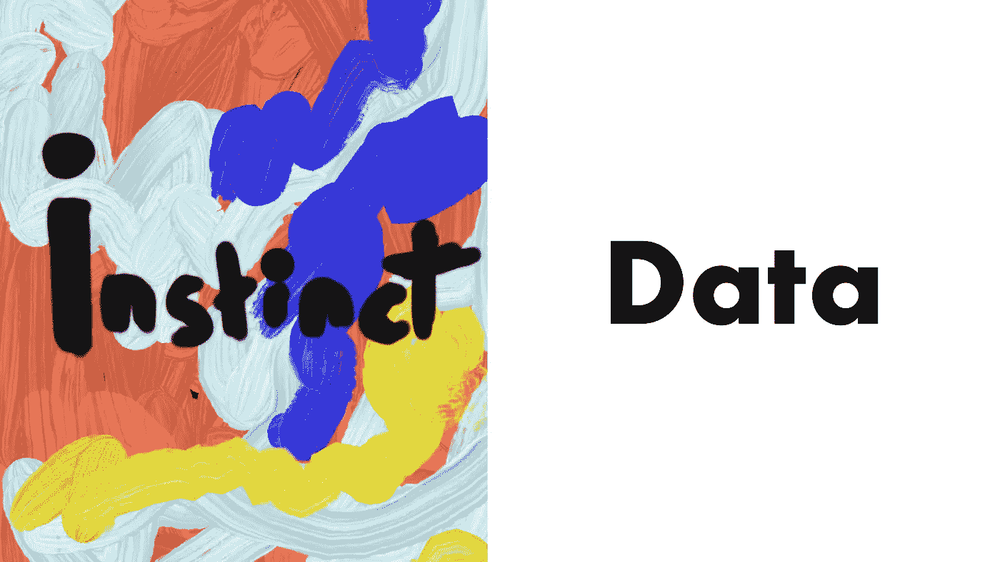
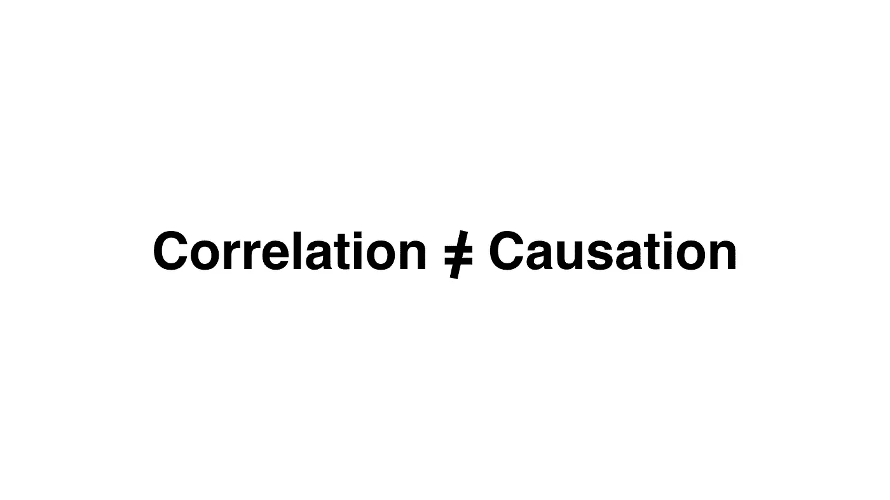
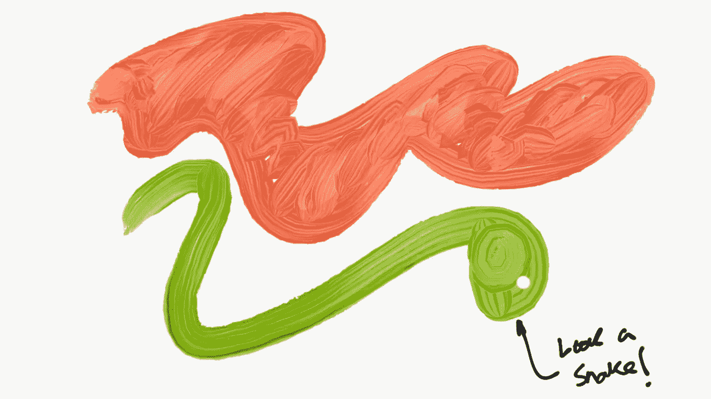

# 直觉 vs 数据

> 原文：<https://medium.com/hackernoon/instinct-vs-data-71e0866867cc>

我们人类有一种在不完整的信息中寻找模式的自然倾向。一加一大于二；整体的确不仅仅是部分的总和。我们喜欢建立因果联系，我们每天都根据不完整的数据做出决定、判断和假设。“我喜欢这件衣服，但它不适合你”或“他很好，但不是你喜欢的类型”是我们每天在没有太多关于情况或被评判的人的信息的情况下做出的奇怪决定。然而，我们发现自己在这些日常决定中有很大一部分是正确的。乍一看可能有点奇怪，但是我们在做这些决定时确实有很多练习。我们大多数人都是世俗决策的专家。这种“眨眼”的瞬间——马尔科姆·格拉德威尔在他名为《眨眼》的书中指出——是一种生存本能。你会听到像“这感觉不好”或“我不喜欢它的样子”这样的专家评论，并经常发现自己对他们缺乏合理的推理感到困惑，然而他们往往是对的。请记住，作为一名“专家”是给出这种模糊评论的关键原则，当一场争论缺乏合理的逻辑时，我经常会感到愤怒。这些专家多年来积累了大量的信息，进行了长时间的实践，并在其人格核心中吸收了这些决策本能。他们在不知道为什么的情况下做决定。

我不同意。

## 领域专家之死

这个世界极其混乱，不可能成为万事通。真正的专家是一个虚构的实体。我们今天面临的大问题给我们提出了一个令人生畏的任务，而这种人类寻找模式的倾向在信息时代完全消失了。我们得到的数据比人类以往任何时候都多。在一个来自多个地方的信息呈指数级流入的时代，我们并不总是能够轻松地找到模式，至少不仅仅是基于直觉。

传统的数据处理系统包括提出一个假设并分析数据来证明或否定它。例如，我们可以假设“只有大约 5%的数据是结构化格式的”，然后通过筛选样本数据集来证明或否定这一说法(仅供参考，上述假设是正确的)。然而，大数据分析，在大多数情况下，并不是从一个假设开始的。它类似于一个水晶球，你向数据集提出一个问题，让它告诉你它的故事。它将始终根据所提的问题进行回答。在处理大数据时，我们不做任何假设。呈现的故事往往以关联的形式出现。它总是一种可能性，而不是确定性。

模式和相关性在大数据世界中大放异彩。“谷歌流感”就是这样一个实验，它利用大数据来预测疾病的爆发和传播。它通过扫描人们的搜索查询的聪明方式来做到这一点——在一个地方搜索与疾病相关的特定症状的人数越多，疾病爆发的几率就越高。谷歌流感在 2014 年埃博拉疫情期间非常有用，政府官员可以实时预测受影响的地区，并采取适当的行动。该系统在搜索查询和病毒症状之间建立了巧妙的关联，从而预测可能受影响的地区。如果你还记得的话，这和约翰·斯诺试图用他的霍乱爆发地图实现的目标相似。

然而，当使用数据进行预测时，人们需要警惕将相关性误认为是因果关系。一项研究表明，女性比男性更快乐。平均而言，女性的头发比男性长。人们可以从现有数据中得出一个关联，即拥有长发是幸福的原因——这是一个微弱的关联。将相关性误认为因果关系几乎导致美国伊利诺伊州向该州的每个孩子发送书籍，因为研究表明，家庭环境中的书籍与更高的考试分数相关。后来的研究表明，来自有很多书的家庭的孩子表现更好，即使他们从不阅读，这导致研究人员纠正他们的假设，认识到父母买书的家庭有一个鼓励和奖励学习的环境。

# 高盛算法

大数据仅仅意味着数量极其庞大的数据。强相关性确实在大数据世界中大放异彩，尽管其中一些与主流观念截然相反。

1996 年，布兰登·雷利接管了库克县医院的内科。库克县是一家公立医院，每天都有大量患者涌入。医院的急诊部特别混乱。政府在教育公民了解心肌梗塞方面做得很好。也被称为“心脏病发作”。这导致本已紧张的急诊室出现了更多的虚假心脏病发作病例——几乎每天都有 30 名患者担心自己心脏病发作。在资源受限的系统中，如何决定谁需要什么？你如何将资源分配给真正需要的病人？请记住，胸痛患者是资源密集型的，治疗周期很长。医生通常依靠从各种测试和一系列问题中得出的大量参数，然后对可能的疾病做出估计。你经常会发现不同的医生对同一组症状给出不同的意见。医生的准确性很大程度上是经验的作用，也许这就是为什么它被称为实践。在像急诊室这样的密集环境中，医生需要快速做出决定。当人类面临生死关头时，医生往往倾向于谨慎行事。为什么要冒险忽视心脏病发作的可能性，即使它可能是一个假警报？问题是这使得估计非常不准确，这是资源有限的急诊室所不能承受的。赖利向不同的医生展示了一系列症状，并要求他们根据严重程度对患者进行分类。结果到处都是，一些医生把病人送到重症监护室，而一些医生把他们送回家。答案的范围从 0 到 100。这看起来更像是猜测，而猜测会导致错误。

Reilly 求助于心脏病专家 Lee Goldman 的工作，他设计了一种算法来识别心脏病发作的存在和严重程度。在 20 世纪 70 年代，Goldman 和一群数学家一起工作，他突然想到一些统计学原理可以应用于检测心脏病发作的问题。他分析了数百个案例，将它们输入电脑，开始研究什么样的事情会导致心脏病发作，并提出了一种算法。他认为，这个等式将消除治疗胸痛的许多猜测，尤其是在紧急情况下。该算法表明，医生需要将心电图的证据与一系列紧急风险因素结合起来:(a)患者感到的疼痛是不稳定心绞痛(强烈的局部疼痛)吗？(b)患者肺部是否有积液？以及(c)患者的收缩压是否低于 100？高盛为每一个推荐适当治疗的因素组合画了一个决策树。尽管他的计算非常严谨，但没有人愿意相信这种算法。生与死的情况应该是复杂的问题——一个简单的算法似乎太容易了。

在库克郡医院，雷利举办了一场烘焙比赛。急诊科的工作人员将遵循传统的协议几个月，然后他们将使用高盛的算法。在两种系统下治疗的每个患者的诊断和症状将被比较。这些数据收集了两年，令人惊讶的是，高盛的算法取得了胜利。它比传统方法好 70%,同时也更安全。毕竟，该算法的目标是确保真正心脏病发作的患者会被立即分配到正确的资源。高盛的算法完全违背了传统观念，即决策者掌握的信息越多，他们就越有利，而事实上更多的信息会导致更多的困惑。并不是每个因素都有很强的相关性。拥有更多信息有时根本不是优势。通常，解决方案可能无法解释问题的原因，只能说明问题确实存在。

> 遵循一个简单的算法感觉很平凡或者太容易了，因为任何人都可以遵循一个算法。不可能这么简单。感觉不太对劲*。*

对大数据的分析通过识别效应和变量之间的强相关性，帮助我们得出这些简单的算法。对于手头的一个大型复杂问题来说，它的结果有时似乎过于简单。像医生一样，许多专业人士陷入了过度信息谬误的陷阱。遵循一个简单的算法感觉很平凡或者太容易了，因为任何人都可以遵循一个算法。不可能这么简单。T4 感觉不太对劲。

# 统计和芝麻街

大数据的概念由来已久。哥白尼在 15 世纪创建的天文数据集可能是第一个公开的大数据集。长期以来，我们一直在使用和分析大量数据，而且往往是在最意想不到的地方。

创作一部儿童电视节目绝非易事。电视节目《芝麻街》的制作并非灵光一现。它是经过精心设计的——“设计”似乎是一个不恰当的词，但它确实如此。它是围绕一个突破性的见解设计的:如果你能抓住孩子们的注意力，你就能教育他们。大多数成年人在我们感到刺激时会看电视，当我们感到无聊时会换台或转移视线。学龄前儿童不是这样看电视的。他们不会在屏幕前走神，而是不断地在屏幕上有意义的东西和周围环境之间转移目光。在一个实验中，给孩子们看了重新编辑过的一集，其中某些场景出现了混乱。这毫无意义，孩子们也不再看了。在一个对照实验中，一组孩子在一个满是玩具的房间里看一集，而另一组孩子在一个空房间里看同样的一集。不出所料，第一组人看节目的次数少了很多。然而，我们的目标不是衡量孩子们的参与时间，而是他们的学习情况。测试时，两组的分数完全相同。这对研究人员来说是一个令人惊讶的发现:孩子们看着他们理解的东西，当他们感到困惑时，他们会把目光转向别处。

艾德·帕尔默是一名心理学家，也是芝麻街的研究负责人。凭借在使用电视作为教学工具方面的专业知识，帕尔默用统计学的方法来设计剧集。他使用了一种他称之为“干扰物”的技术，让一群孩子在一个屏幕上看一集芝麻街，另一个屏幕播放随机图像的幻灯片。幻灯片每七秒半换一次。帕尔默和他的同事坐在房间的后面，注意到当孩子们失去兴趣看幻灯片时。在研究结束时，帕尔默的团队已经掌握了整个事件中每一秒的参与度数据。他们将数据绘制在一张大纸上，作为一段时间内参与次数的线形图。他们记下起作用和不起作用的部分，经常重新拍摄整个场景，以达到 85-90%的最佳参与时间。

尽管不可否认，大数据现象向我们展示了奥威尔式未来的邪恶一面，但我们也需要记住，它有许多积极的方面，可以将人类推向正确的方向。大数据是一种资源，但与物理资源不同的是，信息的价值不会随着使用而减少，而且其使用通常会增加潜在价值。

我以反驳“直觉”或“本能”现象开始这篇文章。然而，我真的相信，人类有价值的恰恰是这种直觉，这是硅片和算法无法揭示的。我们也不仅仅是我们各个部分的总和。令人兴奋的是即将到来的事情。

就像佛陀说的:我们需要找到一个中间地带。有一个地方让本能和数据并排躺着。勇气同样重要——这是第一步，但不是最后一步。

## 参考

1.  马尔科姆·高尔德维尔的《眨眼》
2.  **马尔科姆·高尔德维尔的《引爆点》**
3.  肯尼斯·库基尔和维克托·迈尔·舍恩伯格的**大数据**

感谢 [Kanika](https://medium.com/u/360fbcfdf046?source=post_page-----71e0866867cc--------------------------------) 最后一分钟的编辑:)

