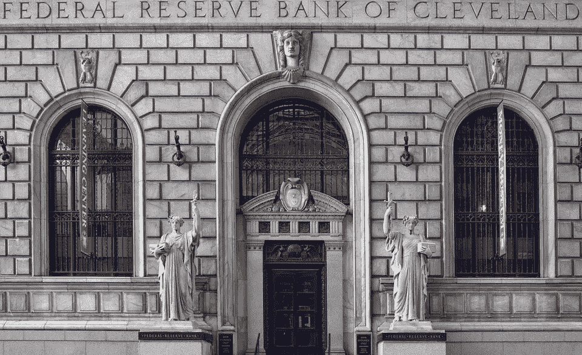

# 利率和风险资本

> 原文：<https://medium.com/hackernoon/interest-rates-and-venture-capital-390429a83903>

在过去的二十年里，风险资本市场经历了巨大的增长。创业公司更喜欢获得风险投资资金，而不是举债。然而，当谈到经济增长时，利率和风险投资(VC)是并行不悖的。风险投资促进创业活动，当涉及到对经济福祉的冒险活动时，利率是有帮助的。

如果利率很低，它会成为风险投资的燃料，但同时，它也会阻止风险资本家将资金投入到年轻、在其他国家和不太受欢迎的行业的风险更高的初创公司。

通常情况下，风险投资公司在将他们获得的利润与投资者在其他地方获得的利润进行比较后进行投资。然而，利率和风险承担之间的关系可以基于考虑哪个投资者的观点而改变。

**利率对非传统资本的影响**

当我们谈论利率的中短期变化时，它通常会影响非传统资本来源，包括对冲基金和共同基金。与传统风险资本投资者不同，传统风险资本投资者将资金投资 10 年左右，非常规投资者可以将资金放在不同的篮子里，分散到不同的资产类别中。他们可以迅速决定应该把钱投到哪里，以减少利率变动的影响。

**利率变化对风险投资的影响**

在过去三十年中，联邦利率从 80 年代初的 16%降到了 0.09%。然而，风险投资已经从一个小行业发展成为一个每年 1000 亿美元的资产类别。风险资本家每年都投入大量资金。因此，了解利率变化对风险投资的影响是非常重要的。

2000 年至 2009 年间，联邦基金利率和风险投资彼此平行。当科技泡沫破灭时，美联储采取了降低利率的策略来促进经济增长。对风险资本家来说，环境不如以前有吸引力，有限合伙人在风险资本上的投资也减少了。风险资本随着利率的下降而下降。

量化宽松推出后，VC 和利率之间的这种关系不复存在，它们成了反比。

此外，在信贷紧缩后，近零利率政策让金融机构和经纪公司得以更新资产负债表，解决不良资产，重振财务健康。它还使美国经济从危机的余波中复苏，并使企业能够以合理的利率借入资本。在这一廉价资金阶段，科技行业、风险投资公司和初创公司利用了有利的估值环境。

美联储决定提高利率

到今年年底，美联储计划提高利率。如果该计划成为现实，这将是美国在过去九年中首次经历利率上升，从而结束零利率时代。

美联储主席珍妮特·耶伦表示，加息不会很快。

这将是一个渐进的增长，不会立即改变一家[初创公司](https://hackernoon.com/tagged/startup)和科技行业的估值环境。但是，它会随着股市的估值环境而变化。原因很简单；估值倍数与利率间接相关，在中，倍数随着利率的上升而下降。

观察美联储的下一步行动和市场对利率变化的反应很重要，因为这可能会影响风险资本市场。

让我们在[推特](http://www.twitter.com/eliandalvarez)上讨论这个问题