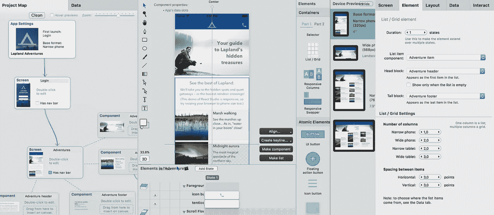
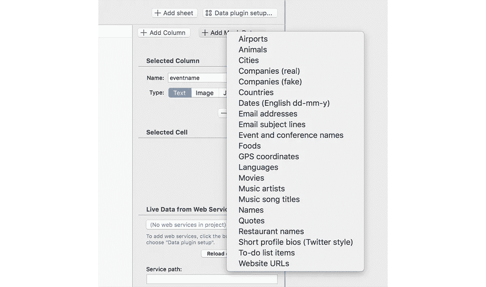
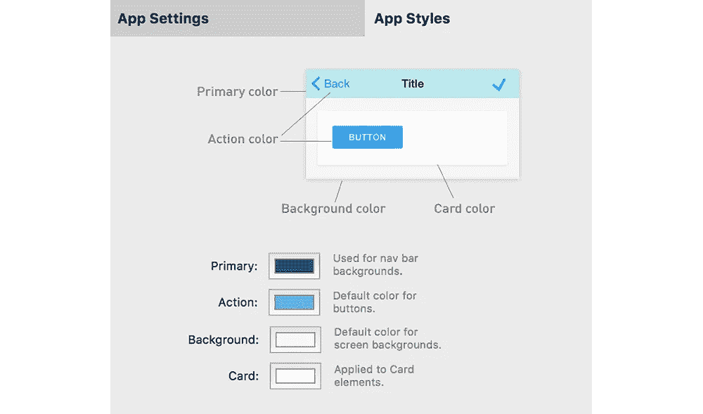
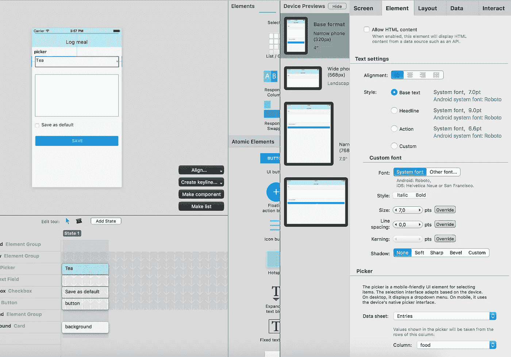
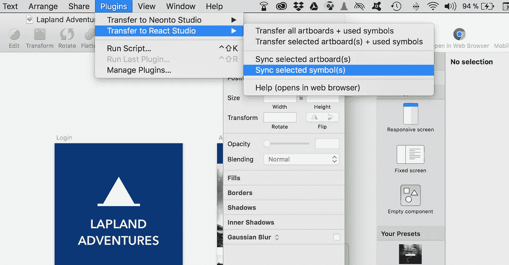
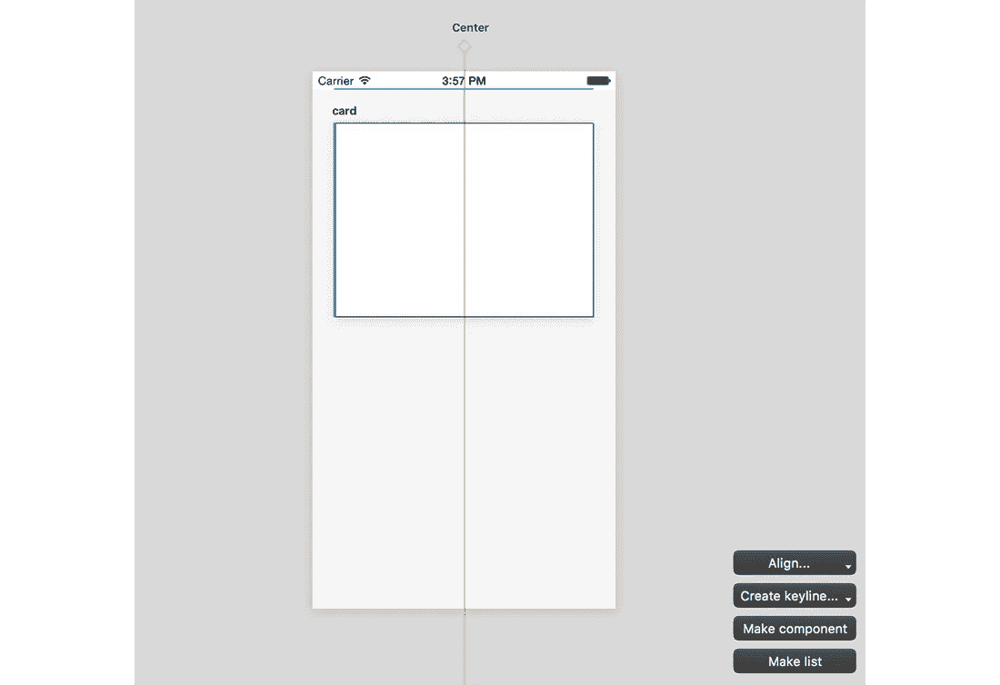
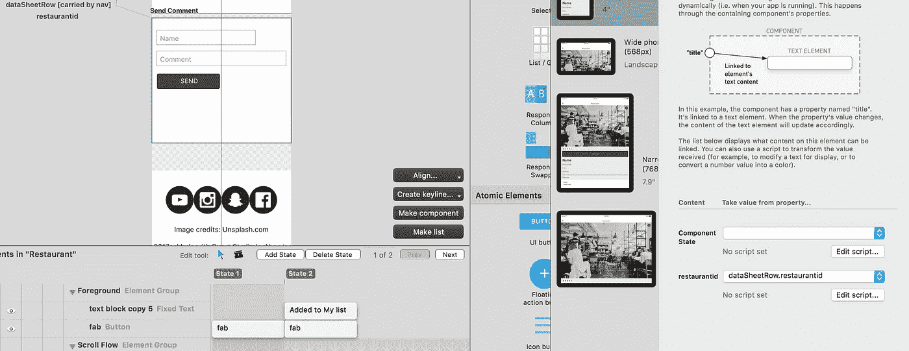
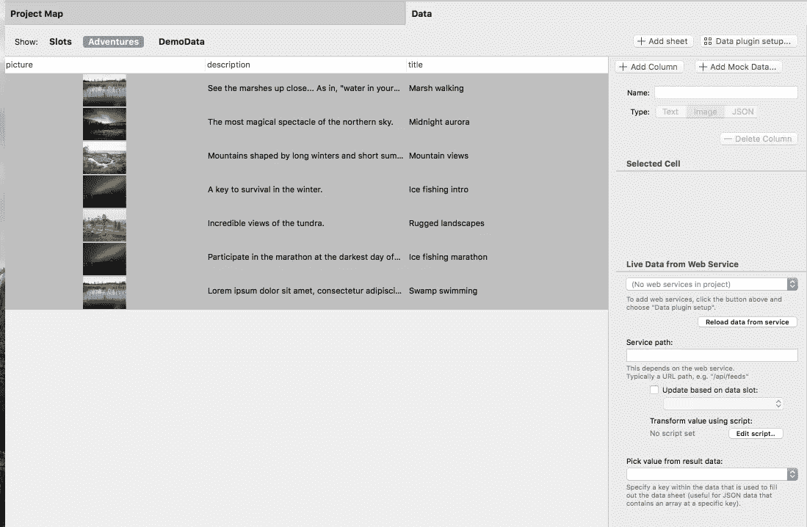
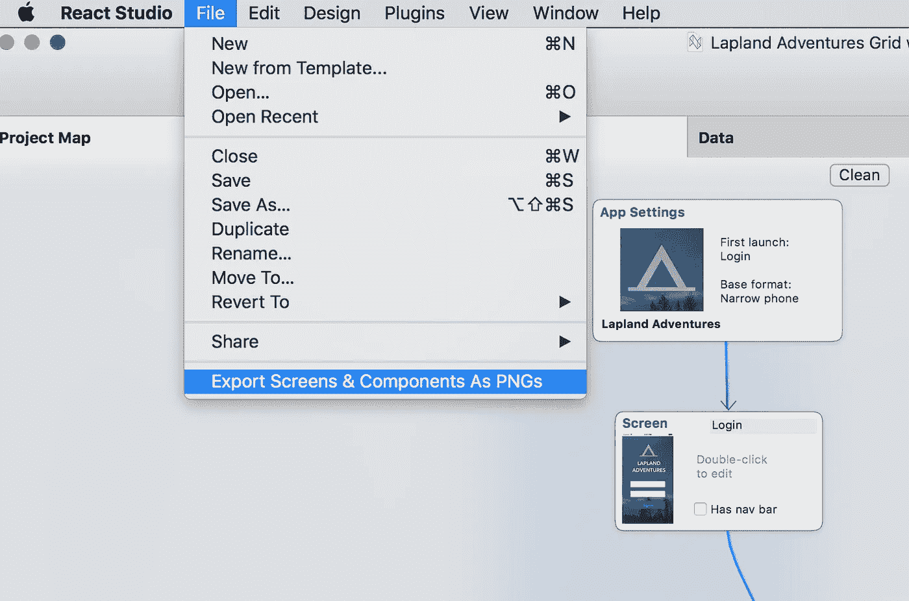
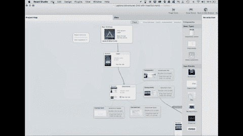

# React Studio 1.3 简介

> 原文：<https://medium.com/hackernoon/introducing-react-studio-1-3-e782226a1031>

# React Studio 1.3 简介

欢迎光临！根据您的反馈，我们在过去的一个月里与 React Studio 一起做了大量工作。这些特性中有一些是在 1.2.x 临时更新中发布的，但是这个 1.3 版本把所有的特性都集中到了一起。

以下是新增功能的概要，我们将在下面详细讨论每一项新功能和改进:

*   主要的**性能改进**
*   **本地化**:自动支持多种语言
*   **列表/网格元素的头尾项**
*   新的**灵活的屏幕导航条设置**
*   在表单编辑器中点击添加**模拟数据**
*   新的**卡**元素(以及与之匹配的新的应用程序风格)
*   新的**拾取器**元件
*   草图插件中新的**同步命令**
*   新的“符号 id”设置允许**草图符号转换成真实组件**
*   对" **Make 组件"**功能的改进
*   **嵌套组件属性**的数据链接
*   **数据表服务路径的值转换器脚本**选项
*   更新到项目导出中的 **React v16.2** 库
*   **导出时更整齐的方法名称**，例如，对于导出时的多状态组件
*   文件菜单中的**“将屏幕&组件导出为 PNGs”**命令
*   各种 UI 错误修复

## 表演

现在，编辑画布和设备预览的渲染速度明显加快，内存使用量也大大降低。希望你会发现体验有所改善。

## 本地化

React Studio 现在支持多种语言，并且可以在编辑时和运行时在它们之间无缝切换。在导出的代码中，这是使用 [react-localization 包](https://www.npmjs.com/package/react-localization)实现的(它现在默认包含在 Webpack 设置中)。

虽然这个特性可能看起来并不令人兴奋，但它实际上是一个很大的特性！任何曾经做过大型 web 应用程序(或其他软件)的人可能都知道正确支持多种语言有多难。

多语言支持是那些刚开始时看起来不太重要的事情之一…但是当时间到了，本地化变得必要时，通常会有大量的工作要做。有了 React Studio 的集成支持，确保应用程序文本可本地化的枯燥工作将自动为您完成。

通过此更新，所有项目现在都包含一个名为“本地化:

每当添加包含可本地化文本的 UI 元素(如按钮、复选框或文本块)时，都会在本地化表单中自动创建一个新行。新的 UI 元素被分配了一个*本地化键*，您可以在元素的检查器中更改它。(通常，您会希望将这些键更改为比自动分配的键更具描述性的键。)

要添加更多语言，只需在本地化表单中添加列。在上面的例子中，有两种语言:英语(en)和法语(fr)。

要将用户界面切换到另一种语言，请在本地化菜单中选择“活动语言”:

现在，所有元素都将显示数据表中的本地化文本。

一旦切换了语言，您还可以直接在 React Studio UI 中编辑本地化。只需双击该按钮或其他任何按钮，然后输入翻译，新文本将自动保存在本地化表的右栏中。

## 在运行时切换应用程序的语言

活动语言是您可以在应用程序中修改的设置。为此，会自动提供一个名为“ds_activeLang”的数据槽。只需创建一个交互，将该数据槽的值更改为一种语言代码。

例如，这里有一个将应用程序的语言更改为法语的交互:

通常，您可能还需要从基于活动语言的服务器加载新数据。为此，React Studio 的数据表包括一个标记为“基于数据槽更新”的设置。您可以在那里选择“ds_activeLang”数据槽，当语言改变时，工作表将自动重新加载。(语言代码如何传递给服务器完全取决于 web 服务插件。例如，对于 Google Sheets 插件，您可以使用以语言为后缀的文档 id。)

## 使用本地化动态更新文本

这是一个很酷的技巧，你可以用本地化表来做。因为它是一个常规的数据表，你可以使用一个 web 服务插件来获取它的内容…所以你可以使用 Google Sheets 插件从一个电子表格中加载本地化的文本。

更重要的是，Google Sheets 插件可以实时更新，所以当你修改电子表格时，应用程序的文本会实时更新——你甚至不需要重新加载，更新是真正动态的。

如果你需要将你的应用程序发送给远程自由职业者进行翻译，这将非常有用。发布应用程序的私有副本(例如，使用 React Studio 的内置发布功能)，其中本地化表链接到 Google 电子表格。然后与翻译分享电子表格，并将应用程序的链接发送给她。现在，她可以进行翻译，并在工作时实时查看应用程序更新。不用再猜测一段特定的文字在应用程序中的实际位置！

## 列出改进

现在，您可以为列表/网格项目指定可选的“头块”和“尾块”。我们已经更新了 Lapland Adventures 示例项目来演示此功能(您可以在“文件”菜单>“从模板新建”中找到此项目):

[*查看样本项目*](https://neonto.cloud/u/adventuresdemo/)

对于头部模块，还有一个新的设置*“仅当列表为空时显示”*。这对于用户生成的内容列表特别有用，这些内容通常最初是空的。通过此设置，您可以轻松显示“点击此处开始”等入职占位符项目。

## 即时模拟数据

尽可能早地使用真实数据进行设计是一个好主意…但是获取这些数据可能很困难。

为了减轻填写数据表的痛苦，我们增加了一个功能，让您只需点击一下鼠标就可以输入真实数据。

点击数据>表视图中的*按钮【添加模拟数据】*，从[列表提供的多个数据集中进行选择。](https://lists.design)

所选列表数据将作为新列添加到工作表中。您当然可以将多个列表添加到一个工作表中，如下所示:

## 导航栏的更多选项

React Studio 的标准导航栏现在有了新的选项，使它更加灵活。您可以在屏幕检查器中找到这些设置。

*   **“从属性中获取导航条标题”**允许你根据属性值改变标题。这对于细节视图特别有用，在细节视图中，标题通常应该是用户在前一个屏幕中选择的项目的名称。(参见[拉普兰探险示例项目](https://neonto.cloud/u/adventuresdemo/)中的示例。)
*   **“在导航条上显示前景项目”**允许你在导航条上放置元素。Lapland Adventures 示例再次展示了这一点——查看位于主列表屏幕导航栏顶部的徽标图标和菜单按钮。

## 卡片元素

这是一种新的元素类型，用于背景和分组。以前你只是使用矩形矢量图形，但是我们想增加一些语义来区分实际的图形和简单的背景卡。

还有一个新的应用程序范围的颜色，不出所料，它被称为“卡”:

这是新卡片元素的默认颜色，但是您当然可以为任何单独的卡片将其更改为自定义背景颜色。

## 选取器元素

选取器是一种 UI 元素，允许用户从列表中选择一个值。它是移动友好的:在一个小设备上，它显示为一个原生的选择器列表——例如，在 iPhone 上，一个可滚动的列表占据了屏幕的下部。在桌面上，它显示为下拉菜单。

要为选取器提供值，您需要使用数据表。(如果您需要一些模拟值来尝试，为什么不使用上面描述的新的即时模拟数据特性呢！)

## 同步草图插件中的特征

我们名为“转移到 React Studio”的草图插件在过去的几周里有了很多更新。(没有插件？[在这里下载](https://neonto.com/pro-plugins-install)。)

一个立即可见的新功能是两个新命令，*同步选定的画板*和*同步选定的符号*:

这些新命令旨在解决一个典型的工作流问题，即您已经将一些设计从 Sketch 转移到 React Studio 中，但随后您在 Sketch 端更新了设计，并希望在 React Studio 中匹配该设计，而不会丢失您的更改。

同步就是这样！如果在 React Studio 端找到匹配的名称，它将只传输画板/元件(这样您就不会意外地得到某个内容的多个副本)。当使用 Sync 进行传递时，它会用 Sketch 中的新层替换任何现有层，但也会保留您在 React Studio 中进行的任何交互和关键线对齐。

这样，可以在 Sketch 中维护设计，同时在 React Studio 中维护交互和响应对齐。

## 符号 id-将草图符号转换为真实元件

对于元件，现在可以指定一个“符号 id ”,用于将草图符号映射到该元件中。该设置可在组件检查器的标题*下找到，从草图*转移设计:

这个特性比它看起来要深刻得多！它实际上是关于启用设计系统，其中草图符号库可以通过 React Studio 映射到真实代码。我们为此写了一整篇文章/教程，所以来看看吧:
[使用 React Studio](https://hackernoon.com/transform-your-sketch-based-design-system-into-real-code-using-react-studio-35b89e67ce79) 将你基于草图的设计系统转换成真正的代码

## 对 Make 组件命令的改进

“Make component”快捷方式对于创建分组非常方便，但是以前它对于将哪些属性转移到组件中并不太明智。我们现在对常见场景进行了更智能的处理，包括关键线对齐。

特别是，使用一个 Card 元素来“屏蔽”一个组件是很常见的，就像这样:

在此屏幕截图中，卡片元素有一个中心关键线对齐。当您单击“Make component”时，React Studio 现在会计算出卡片应该成为新组件的背景，并且关键线应该位于组件之外(即，您希望新组件对齐，而不仅仅是其中的卡片元素)。

## 嵌套组件特性的数据链接

这是一个以前只实现了一半的特性，但是现在应该可以在任何地方工作了。对于作为组件实例的元素，其自定义属性显示在“数据”选项卡中，您可以将它们链接到外部属性:

这是 React 中一项非常重要的技术——将属性值传播到嵌套组件的更深处。

## 数据表服务路径的值转换器脚本选项

那个标题确实有点拗口！这意味着您现在可以使用脚本来定制“服务路径”,该路径将被传递给加载数据表内容的 web 服务插件。

仍然不确定它是做什么的…？不能怪你！我们来举一个具体的例子。

在上面的本地化讨论中，提到了活动语言存储在数据槽中。让我们假设您的应用程序从一个定制的服务器后端加载其内容。为了以正确的语言获取数据，您需要将活动语言作为 URL 参数传递——可能类似于:*example.com/myapp/frontpage-items?lang=fr*

在本例中，“frontpage-items”可能是您为数据表指定的*服务路径*。我们需要做的是告诉 web 服务插件，服务路径也需要包含额外的参数。

使用“基于数据槽更新”和值转换器脚本设置，这是可能的。数据槽的新值作为名为 *input* 的变量提供给脚本，因此脚本可以简单到:

`return "frontpage-items?lang+"+input`

## 更新至 React 16.2

导出项目中使用的库已更新到最新的 React 版本 16.2。这并不意味着任何重大的代码更改，但如果出现了阻止您的应用程序工作的问题，我们很乐意帮助解决它——与我们联系的最简单的方法是使用 React Studio 中的集成聊天窗口(查看帮助菜单)。

## 更整洁的方法名称

代码输出现在看起来更清晰，尤其是对于多态组件。

## “将屏幕和组件导出为 png”

以前，这个命令隐藏在项目地图中。现在它也在文件菜单中。

这是从项目中获取完整截图的一种非常方便的方式。所有屏幕和组件都以多种设备尺寸呈现在一个文件夹中:

这个特性的一个很好的用例是——连同上面描述的 Sketch transfer“Symbol id”特性——它允许您使用 Sketch 使用您在 React Studio 中制作的组件来构建屏幕。

取一个组件的截图，作为符号带入 Sketch。然后使用“符号 id”字段将原始 React Studio 组件链接到该符号。现在，当您在设计中使用草图中的符号时，当您使用 Transfer to React Studio 插件时，它将作为实际组件进行传递。

通过这种方式，您可以构建一个符号草图库，通过 React Studio 自动转换为真实代码。相当酷！

—

本次发布到此为止。我们正在努力使 React Studio 成为满足您的设计和开发需求的值得选择。如果您有任何要求或想法，我们很乐意倾听。你可以使用应用内聊天(在帮助菜单中)或者写信给:[hello@neonto.com](mailto:hello@neonto.com)

我们也做**React Studio**的定制版本，适应贵公司的开发实践和设计语言。如果你对这种内部电动工具感兴趣，请联系 sales@neonto.com——我们认为你会对它的便利程度感到惊讶。

最后，如果你喜欢这篇文章，为什么不在这里为它鼓掌呢？感谢您一路阅读！