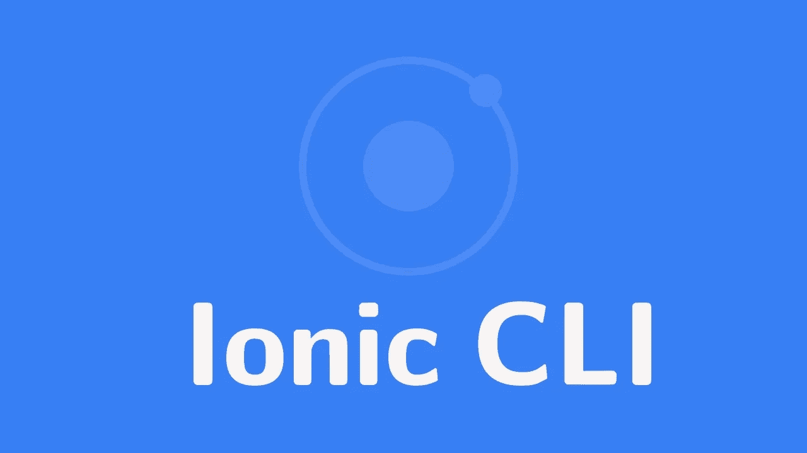

# Ionic 2/3 CLI 参考

> 原文：<https://medium.com/hackernoon/ionic-2-3-cli-reference-13f9fae3f964>

> *Ionic CLI 是开发 Ionic 应用程序的必备工具。*

Ionic CLI 是避免编写大量重复代码的一个很好的工具。它可以生成页面和服务，可以运行或模拟您的 Ionic 应用程序，并为移动应用程序生成所需的资源，如闪屏。

这是 Ionic CLI 的快速参考。

# 安装 CLI 工具

您可以使用 npm 安装它:

要检查它是否已正确安装，请在终端窗口中键入:

# 启动新应用程序

从一个新的移动应用开始，Ionic framework 提供了不同的现成模板:

要创建新项目:

*随着 Ionic 3 的更新，不再在上述命令的模板名称后添加标签，如* `*--v2*` *。默认情况下，生成的 Ionic app 将是 2/3 版本。要生成版本 1 的 Ionic app(具有良好的 ol' Angularjs):*

# 服务

一旦你`cd`进入你的项目目录，用`serve`在你的本地机器上提供你的应用程序:

要在不同的端口上服务:

使用`–-lab`标签在多个平台(如 iOS、Android 和 Windows Mobile)上并排查看您的应用:

要在没有实弹的情况下发球:

# 生成提供程序和页面

要生成新页面:

要生成提供商/服务:

全部了解-列出可用的发电机:

# 生成资源

要生成带有资源的应用程序图标和闪屏:

或者，只是启动画面:

现在，为特定平台生成资源:

# 添加平台

要添加应用程序要使用的目标移动平台:

# 模拟器上的应用程序

要启动模拟器，请执行以下操作:

用 livereload 模拟:

# 在连接的设备上运行 Ionic App

比方说，我连接了一台 iOS 设备，因此要在该设备上运行应用程序:

生产检查:

# Git 初始化

使用 Ionic CLI 工具的另一个优点是，在已经有了`initial commit`的终端上使用`ionic start`命令创建 Ionic 项目时，它会初始化 git 存储库。您可以通过运行以下命令进行验证:

**你也可以在 Twitter 上找到我**

 [## 阿曼·米塔尔·🖖(@阿曼本人)|推特

### 阿曼·米塔尔·🖖的最新推特(@阿曼本人)。# book blogger @ https://t.co/UQvyNf1OTC |开发者| #Nodejs |…

twitter.com](https://twitter.com/amanhimself)