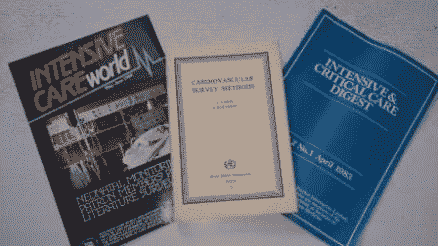
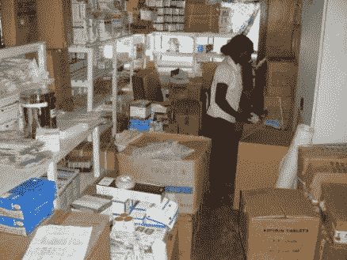

# 有总比没有好吗？

> 原文：<https://medium.com/hackernoon/is-something-always-better-than-nothing-31f324a5e216>

我们在满是灰尘的储藏室中搜寻，以解决善意但却适得其反的医疗捐赠问题。

我妈妈讨厌购书券。*讨厌*他们。我姐姐曾经给过她一张购书券，嗯，那是“有史以来最糟糕的生日”之类的事情。很公平——给一个很容易买得起书的人一张购书券是懒惰的化身。如果这种想法是有价值的，那么，是的…你根本没有投入任何想法，是吗？

干得好姐姐。16 年前毁了妈妈的生日。

另一方面是书？超棒的礼物。我希望如此。天哪，这些年来我给了妈妈很多书。其中一些是新的。

**新书很受欢迎，但旧书对他们也有吸引力——杀死一只知更鸟？永恒的东西，不管它是什么时候印刷的。莎士比亚——见鬼，越老越好！**

旧的医学参考书……没那么多。

这个月我们在工作中得到一份“礼物”;一家国际医疗公司捐赠的参考书。它们包括诸如'心血管调查方法，1968 年'和'重症监护文摘，1983 年'等有用书籍。

# 总共 20 箱我们需要焚烧的垃圾。

用他们花在运费上的钱，我们可以买一打当前版本的真正有用的书；但是给钱不会让几个退休医生清理他们的阁楼。

如果这种想法是重要的，那么关于这些书的最好评价就是捐赠者没有特别考虑周到。更糟糕的是，如果他们真的认为我们会使用它们，我们会感激涕零地看《肾脏》(The Kidney，1976)这样的经典作品。感谢上帝，感谢上帝，我们终于可以读点东西了！！

我们通常喜欢被捐赠的书籍。如果他们不到 3 或 4 岁，如果他们是相关的，如果他们在可用的条件下，医学参考书是黄金。

# 另一方面，药品捐赠…

我收到的一份研究报告在某种程度上重新点燃了关于捐赠的争论。作者发现过期的药物“通常”仍然可以使用。好的，很好。然而，不知何故，作者没有解决制造商对过期时间的错误计算，也没有暗示美国医院可以安全地继续使用它们。相反，它们助长了关于将越来越多不需要的药物强加给穷人的陈腐争论。

所以我们开始了…暗示喘息，暗示愤怒——**如果有一个问题有些人似乎不能理解，那就是当我们运行一个药物供应系统的时候，*我们不喜欢私人药物捐赠*。原因如下……**

你去一个发展中国家，拜访朋友，旅游，工作或作为教会旅行的一部分。这很棒，人们很热情，你去一个村庄，你去一个诊所。他们没有“任何”药物。这是一个悲剧，你决心对此做些什么，因为你知道在你的国家“大多数”药品都被扔掉了。

所以你回家准备一些药物。有些人把家里所有的东西都收集起来，或者从当地药店收集。一些了不起的人会组织一次捐赠活动，积累大量的药物…他们打包，他们发送…几乎在每一种情况下，他们的努力都将付诸东流。

# [世卫组织将他们的药物捐赠指导方针建立在四个关键原则之上](http://apps.who.int/medicinedocs/en/d/Jwhozip52e/4.html)。

*   最重要的是，药品捐赠应该尽最大可能使接受者受益，这是既定的；捐赠还应该是有礼貌的，支持现有的政府政策和行政安排。
*   最关键的是，在质量上不应该有双重标准: ***如果一个物品的质量在捐赠国是不能接受的，那么作为捐赠也是不能接受的*** ，包括过期的药品。
*   最后，要有沟通；只有在负责机构(而非诊所护士)提出要求时，才能捐赠。具体来说， ***主动提供的药物捐赠应予以劝阻*** 。

所以在现实世界中，捐款到达了——通常运费已经付到了入境点；他们很少考虑通关和关税(然而，许多捐赠的药物根本没有被游客申报，他们非法将药物包装在包里，并带着它们穿过边境)。

此外，在它们到达国家供应设施之前，还有从入境口岸的运输成本。在这个阶段，它们可能已经过时，可能不在基本药物清单(在某个发展中国家可以使用的药物清单)上，可能没有用当地语言包装。它们可能与该国使用的剂量或剂型不同。它们可能状况不太好，即使是这样，我们也无法检查它们在捐赠前是如何储存的。

但是公平地说，让我们假设所有这些条件都满足了。通常它们需要被分类，这很费时间；可能会有一份打印的清单和制造商信息。也许我们事先被告知它们将被发送，让我们有时间计划存储、数据输入和分发。也许他们甚至事先问我们想要什么！

**也许*所有的*都完成了……**

**但这里有一个有趣的数据——6 年来，我从未见过符合所有这些条件的药物捐赠。永远不会。我们看到每年都有几十笔捐款到达。**

今天的问题是(这也是令人困惑的部分)——*即使他们满足了*条件，并且正确捐赠了……我们通常还是不需要他们。

私人药品捐赠有什么影响？这听起来很残酷，但我们不仅仅是想得到药物，并把它们放在医院的货架上；**我们试图建立一个全面的药品供应和药品信息系统——而随机捐赠几乎在各个层面上破坏了这一系统。**

首先，捐赠的数量通常是无益的。在国家层面上，即使是几千片抗生素，与我们每年处理的数百万片相比也是小巫见大巫。然而，在诊所中，即使少量也会对他们的库存系统产生不利影响。

我们的官员使用一个简单的公式来计算诊所的需求，但他们首先需要知道已经向该机构发送了什么。因此，最常见的情况是，接受私人捐赠的诊所有很好的一些物品库存，但其他物品的供应却很糟糕——我们一直都在看到这种情况。护士们开始对订购感到困惑，而省药房的工作人员则不知该送多少，因为实际的数量并没有反映在诊所的订购单上。

更糟糕的是，如果诊所收到的药物在其他地方可能很常见，但在接受国却买不到——例如，我们没有在澳大利亚非常常用的头孢氨苄、氨氯地平或培哚普利的库存。如果这些东西不请自来地被送到诊所，它们充其量只能被废弃，必须通过掩埋或焚烧来销毁；没有高温焚化炉(这里几乎不存在)，环境污染是不可避免的。

**继 2007 年吉佐海啸之后，整理捐赠的药品**

我记得在 2009 年，一名即将离开的游客带着一盒随机药品进来。粗略的一瞥告诉我们，药物已经过期，你可以看到其中一些是开放的，还有许多我们没有使用。

他想，我们能不能把他们送到他上个月去过的一家没有任何药物的诊所？

我了解这家诊所——我很了解它。我们一直对此感到紧张，因为我们已经有六个月没有向那里发送任何东西了；到该省的航运服务已经暂停，空运也远远超出了我们的预算。

# 我们在仓库有一整批订单——几十箱救命的最新药物——准备发送，但我们没有办法把它们送到那里。我们能把他的捐款寄出去吗？“不，我们不能。”

“我们真正需要的是钱，”我告诉他。如果你愿意支付一些空运费用，我们可以从我们的仓库发送紧急物品来度过难关。但是我们会烧掉这个盒子。

他的脸受到了打击——不是关心，而是愤怒；我是个彻头彻尾的混蛋，我不知道我在说什么，我去过诊所吗？实际上，我有—我们照看的 310 个中的一个。

你看，我们一般需要的并不是人们想的那样。我们需要后勤，我们需要培训，我们需要资源，我们需要桌子，我们需要制服，我们需要钱！我们*有*一个装满毒品的仓库，我们正在努力保持这种状态。我们需要的是将它们带到诊所，系统地培训护士如何使用它们，并建立一个系统，使所有这些可持续发展。一盒过期药品并不能解决我们的问题。100 盒过期药物也不能解决问题。

即使是在严重的灾难中，私人捐赠也是不必要的。

[**在对 4 个灾后/冲突国家**](http://www.who.int/medicines/technical_briefing/tbs/Nassery-DrugDonation-whole.pdf) **的世卫组织研究中，发现*“在大多数情况下，通过使用当地缓冲库存，以及拥有提供高质量紧急救灾援助专业知识的主要捐助机构，在灾害的紧急阶段提供了充足的药品供应”。***

记住——有很多方法可以帮助你。最好的，最明显的，最普遍的就是*钱*。是的，这很无聊，有太多的陷阱……但是向你去过的国家的红十字会和无国界医生这样的大型组织或者一个较小的、有声望的非政府组织捐款，这些钱会以一种有组织的、长期的方式去帮助那些最需要帮助的人。

组织药物捐赠的人是最棒的。他们很善良，他们有自己的方式，他们对他们所看到的充满热情……所以在批评他们的时候，我们是在批评真正的好人。

问题是，他们是给我们购书券的好人。我们不需要它们，我们不会使用它们，当你被原始雨林和珊瑚礁包围时，摆脱它们真的很难。购书券欠考虑。问问我妈妈。

在我们的姐妹出版物中阅读更多关于[医疗保健](https://healthcareinamerica.us/)的信息:

 [## 美国的医疗保健

### 这个国家医疗保健人性化的一面。

healthcareinamerica.us](https://healthcareinamerica.us)