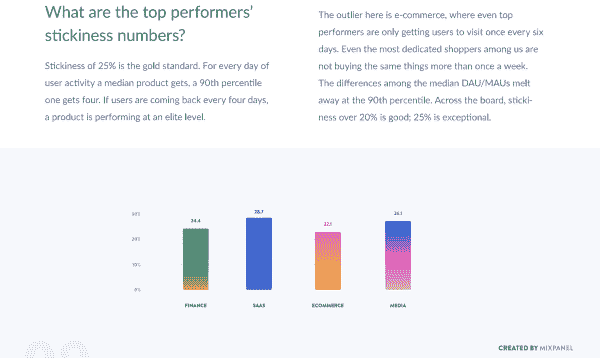

# 粘性有黄金标准吗？

> 原文：<https://medium.com/hackernoon/is-there-a-golden-standard-of-stickiness-eafc76708d1>

## 产品基准报告访谈

> 披露:[数据分析公司 Mixpanel](https://goo.gl/9Q5bKE) 此前曾赞助过黑客 Noon。

我有机会采访了这份报告背后的聪明人:高级分析师 [Phil Perry](https://www.linkedin.com/in/philaperry/) 和高级产品经理 [Hubert Lin](https://www.linkedin.com/in/hublin/) 。

> 为了更好的阅读体验，这篇采访经过了浓缩和轻度编辑。

David Smooke: 当你做这样的报告时，你带着你的假设进去，然后你带着实际的分析和数据出来。你对任何具体的数字感到惊讶吗？

菲尔·佩里: *每个人都对一个行业的发展有自己先入为主的看法。我想我有点惊讶于媒体娱乐产品并不像我预期的那样吸引人。我们可以只报告平均每日活跃用户或每月活跃用户。但就真正帮助人们开发更好的应用程序而言，我们认为更好的初始指标报告应该是两者的比率，即粘性，即每日活跃用户数与每月活跃用户数之比。*

*我思考我自己的媒体消费习惯，即我每天晚上都会去 Hulu。我预计(媒体粘性)会远远高于我们最初的预期。但部分原因是，并非每个应用都是 Hulu。我回想起我在学习中上过的课，在那里你听到 X 数量的企业失败了，而这个 X 实际上是相当大的。很明显，实际上成功是值得庆祝的。很多应用程序最终都没有你想要的粘性。如果你高于中间值，你实际上做得相当好，可能做对了一些事情。*

**David Smooke:** 我发现粘性的黄金标准是一个很好的术语，也是一个有趣的数字。产品的粘性是产品或服务的现有用途鼓励其继续使用的程度。你能对 25%说一点吗？真的有粘性的黄金标准吗？

菲尔·佩里: *当你说金本位制的时候，你是在把一些东西放在基座上，对吗？这 25%是第 90 个百分位数。所以最终这意味着这比 90%的应用程序都要好。在大学里获得某种荣誉可能已经足够好了。*

所以，是的，我认为 25%是值得努力的目标。从本质上来说，如果人们在一个月中有差不多四分之一的时间登录你的产品，那是相当成功的。

***Hubert Lin:*** *我们发现这些第 90 百分位的指标在所有行业中都相当一致。这确实令人惊讶。我想我们会在更高的水平上看到更多的变化。但是 25%的粘性实际上在我们观察的所有行业中都非常相似。我确实相信这个数字是人们所渴望的。但我总是告诫使用黄金标准数字，因为现实是你必须考虑什么对你的业务、你的产品有意义，以及你实际上希望你的客户做什么。*

*假设你有一款产品，只需要用户每周或每月回访一次；突然之间，25%这个数字可能会变成一个不切实际的标准，对你的业务没有任何实际意义。或者也许你是另一种方式，你成功的唯一方式是每天都有人利用你。当你看到这些数字时，你必须考虑这些事情:我是一个适合这份基准报告框架的企业，还是我在评估自己与这些数字的对比时需要考虑一些额外的特征？*

**David Smooke:** 当下一任产品经理试图定义月活跃用户和日活跃用户时，你会对他们说些什么？是否应该通过具体行动而不是仅仅登录来衡量？

***Hubert Lin:****这可能是个人偏好，但我总是倾向于以行动作为衡量你是否是日常活跃用户的标准。有很多方法可以得出“使用错误”，无论是跟踪意外点击还是其他不表明对使用产品有实际兴趣的事情。我不认为让 DAU 采取关键行动的标准太高。尤其是因为有了 Mixpanel，你几乎可以跟踪任何东西。但是我会用面向行动的方法来表示活跃的用户。*

**David Smooke:** 周日晚上，金融服务应用的移动参与度超过平均水平，这是该报告中一个很酷的细节。你能谈谈你是如何发现这样的见解的吗？

***菲尔·佩里:*** *任何数据集令人兴奋的地方在于，分析它是一个非常探索性的过程。所以通常你会从一个简单的假设开始。对于参与度，我们最初的假设是这样的，嗯，如果我试图开发一个应用程序，并试图为某些结果进行优化，*人们什么时候做这些事情？

从那以后，更多的是我们如何解析这些数据。我们可以按行业来分析，也可以按网络和手机的使用来分析。

*我认为，在同样的数据中，我发现真正有趣的是，在媒体领域，周末的移动使用量高于平日；相比之下，在网络上，人们倾向于在一周内使用高于平均水平的媒体应用。我认为这又是一种情况，你经常在工作，也许你在工作时播放一首歌，或者也许有人给你发了一个有趣的视频，你点击进入，所以你在你的笔记本电脑上看它。*

***Hubert Lin:*** *对我来说，让我陷入某种怪圈的事情是，这在多大程度上取决于最终用户自然使用数字产品的方式，或者取决于项目经理和营销人员向最终用户推广使用和参与的方式。例如，当 pm 发布新功能或新版本的应用程序时，他们是否有一个标准的时间和日期？营销人员是不是一直都是在特定时间发促销？这些因素可以预先确定模式将会是什么，以及人们希望如何自己使用应用程序。我认为这很难理清。因此，对我来说，这部分总是令人困惑的部分，那就是看一看信息，并试图找出什么导致什么，如果有的话！*

***菲尔·佩里:*** *经典的鸡和蛋的问题。*

**David Smooke:** 你如何看待这份报告对下一个产品制造商的帮助？因此，如果你知道你的产品是一个低百分比，也许你应该做更多的推送通知或做更多的电子邮件，使他们回到电子商务网站。这份报告还能如何帮助读者做出更好的产品？

***Hubert Lin:****对我来说，如果我看到这些使用模式，我希望产品经理和其他阅读这份报告的人能够意识到有这些决定因素存在。比如营销人员什么时候发送促销信息等等。但我会从表面上看这些数字，然后用它来塑造一些其他的策略。*

除了“开展促销活动以获得转化”,这里还有更多其他的东西。如果我是一名产品经理，我想运行 A/B 测试，尽可能多地参与并尽快获得结果对我来说非常重要。从数据来看，很明显，在周六下午进行 A/B 测试对所有行业来说都是一个非常糟糕的主意。这基本上是我处理这个问题的方法:看看参与度，想想你要做什么，确保你的策略适合你的商业模式和需求。因此，可能会有这样的情况，应用程序绝对希望在周末和低参与度时刻之前重新吸引人们。然后很好，你知道什么时候这些适合你的行业和你的应用类型，这将帮助你。或者对于需要高参与度的应用程序，如促销、A/B 测试等，我会将注意力集中在我看到这些使用高峰的日子。

*如果我的产品实际上没有遵循这里的模式，如果我有一个产品实际上*在周末*看到额外的使用，它只会给我另一个数据点让我挖掘。为什么我的产品在这里与众不同？为什么它与行业中的其他产品不同？这对我是好事还是坏事？这可能会引导你进行额外的分析，让你更好地理解为什么你的客户可能会与众不同，或者为什么你的产品可能会推动不同的行为。*

***菲尔·佩里:*** *我认为这是非常重要的一点。当你看任何一种基准时，仅仅因为你可能偏离它，并不意味着它是坏的。你的生意纯粹是你自己的，你的 app 纯粹是你自己的。想象一个薪水支票应用程序。我只经常收到工资，所以我不会每天都登录那个应用程序。因此，如果我在一个月的 30 天中有两天登录，那就相当不错了。*

*因此，从根本上说，偏离基准并不一定是件坏事。这纯粹是理解背后原因的问题。这最终是一个你可能会花很长很长时间去思考的问题。*

**David Smooke:** 最后，你们每个人能不能简单谈谈你们对业务数据的总体看法，以及企业应该如何使用数据。

***Phil Perry:****当我思考数据和业务时，最终数据旨在反映业务中正在发生的事情，并为决策提供信息。追踪事情非常容易，因为它们让你感觉良好。跟踪事物也很容易，因为那些事物是容易跟踪的，比如页面视图。*

但是这并不一定意味着你需要跟踪这件事，以了解你的企业是否成功。所以最终，把大量的思想放在你想要理解的东西上，以及为什么你认为是这样。正确地做到这一点将会产生好的仪表盘，让你知道你的业务是否在运行。

*如果你漫不经心地跟踪每一件事，这种不专注会导致错误的假设，并被你的数据淹没。最终，如果没有一些与之匹配的度量标准，很难说一个计划是否成功，包括领先和落后。假设您想要增加您的平均交易规模。你可能会牺牲许多小交易来实现这一点，因此你可能希望将另一个指标与“增加交易规模”配对，如成交数量。*

*所以最终当你考虑度量标准，考虑总体业务时，你会有一些你正在努力实现的目标。对于每一个计划，都应该有某种衡量标准来表明我们是否成功了？如果我们没有，这不是一件坏事；让我们从那些错误中吸取教训。*

***休伯特林:*** *是的，在我这边，我以几种不同的方式使用数据。一种是菲尔描述的方式，即数据可以提供答案。我的假设是真的吗？如果不是，现在我知道了，如果是，那就太好了。这是一种特定的方式，显然对你的业务很有用。除此之外，我努力确保我所监控和跟踪的一切都有目的，并且与你的业务的实际成功相关。所以这也是非常重要的一部分。*

*对我来说，最后一件事是数据引出调查领域。如果有些事情不符合预期，或者如果我注意到有些事情似乎不合适，这些数据可以引导我进一步调查。然后，我们需要与客户交谈，找出背景。*

***Phil Perry:****我还想强调通过实验产生额外洞察力和数据的价值。建立商业实验，这样你就可以看到特别重要的结果。最终，实验是你验证任何假设的最佳方式。你当然可以浏览一堆数据，并产生各种各样的相关性，这很好，因为它们至少可以告知你应该走的一些方向。但是一旦你到了那一步，在你需要尝试看看它是否可行之前，你能做的相关迭代就只有这么多了。正确的收集数据，然后最终选择前进，或者修改东西。*

***Hubert Lin:*** *我会根据经验说，在 A/B 测试中，很难找出或提出具有统计显著性结果的特征。这真的是一件很难做的事情，如果你认为你有一个天才的想法，而测试却没有发现任何重要的东西，这可能会令人沮丧..但这是 A/B 测试的事实，这就是为什么你需要继续追求它，因为有很大的胜利，但它们很少发生。*

***菲尔佩瑞:*** *人是很难移动的。*

大卫·斯穆克: *是的。他们只想继续做他们已经在做的事情。*

***休伯特林:**确切地说。***

菲尔·佩里:今天早上我很乐意呆在床上，但是我起床了。

***David Smooke:****恭喜你战胜了惰性。*

***菲尔佩里:*** *对。我认为这是一场大胜。*

> 获得 [Mixpanel 产品基准报告的免费完整副本。](https://goo.gl/kvQQJ9)