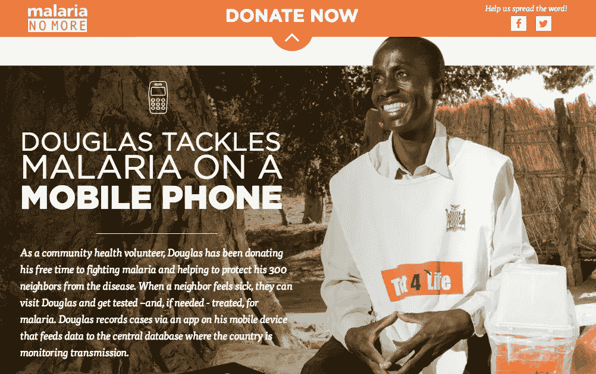

# 当社会影响遇到行为经济学

> 原文：<https://medium.com/hackernoon/is-your-social-impact-organizations-marketing-strategy-failing-you-ef98f6ac5eb1>

如果你的社会影响组织依靠支持者付出时间、金钱和资源(不都是吗？)你可能想知道如何让人们更多地参与到你的事业中来——不仅仅是同情，而是积极投入。如果你发现很难激励人们投入其中，那不是你的错。怪你的[营销](https://hackernoon.com/tagged/marketing)。和经济学。

**为什么社会影响力组织需要不同的营销方式**

理解人们如何做决定对任何组织来说都是关键，特别是当目的是让观众将时间或金钱投入到更大的(但无形的)利益中时。想想看——当你看到来自 [Zappos](https://hackernoon.com/tagged/zappos) 的广告时，它可能会影响你去买一双鞋。你会付钱给公司，几天后，你会收到一双鞋子。但是当你捐钱许愿时，你会有一种内在的满足感，因为你知道自己帮助了一个组织实现了一个孩子的梦想。对一些潜在的捐赠者来说，这种内在的满足感是一种激励，但对其他人来说，这还不够。通过行为经济学的课程，额外的激励因素可能会影响到这些受众，增加他们参与的欲望。

**什么是行为经济学？**

研究资源使用的传统经济学着眼于我们如何做出决策，其假设是人类做出理性的决策。但当你审视我们做出的决定时，很明显它们并不总是理性的。如果是的话，没有人会吸烟，我们都会只吃健康的食物。

行为经济学通过整合心理学、神经科学、社会学、政治和法律的观点，丰富了传统经济学的工具箱。其结果是，基于对我们在现实世界中的行为以及影响我们决策的现实环境的更现实的假设，经济分析变得更有活力、更具启发性。

我的公司 [Creative Science Labs](http://creativesciencelabs.com/) ，为使命驱动的组织开发数字体验，利用行为经济学概念作为开发的基础，以增加接触和推动受众采取行动的可能性。

但是我们使用的行为经济学概念不仅仅在网络上有效。如果你理解这些想法，你可以将它们运用到你自己的社会影响组织的营销信息中，让人们更有可能响应你的行动号召。

**第一课:突出一个可识别的英雄**

道格拉斯是一名社区健康志愿者，他正致力于终结非洲的疟疾。当邻居感到生病时，他们可以来道格拉斯进行测试和治疗这种危及生命的疾病。捐助者可以通过向“消灭疟疾”的筹款活动捐款来帮助道格拉斯和其他像他一样的人获得更多需要的设备。

我们的大脑[是为故事而生的](http://wrvo.org/post/neuroscience-shows-brain-wired-story)。通过神经科学，我们知道故事帮助我们与主角产生共鸣。心理学告诉我们，故事有助于与他人建立必要的联系。这些力量让我们关心道格拉斯，想帮他达到目的，更有动力去捐款。

我们创建了一个[网站](https://creativesciencelabs.com/malaria-no-case-study/)，突出了道格拉斯的努力和需求。通过关注一个人，它创造了一个我们可以描绘的人，一个我们可以认同的人，并建立了一种联系。

与其分享道格拉斯的个人故事，我们本可以分享[数据，](http://www.who.int/mediacentre/factsheets/fs094/en/)比如 2010 年至 2015 年间疟疾死亡人数如何下降了 29%，或者自 2001 年以来，已经避免了[680 万例](http://www.who.int/mediacentre/factsheets/fs094/en/)疟疾死亡。

但是道格拉斯的故事更有说服力。当一个捐赠者送钱来时，他可以想象他的捐赠如何帮助道格拉斯——或者像他这样的人，而不是他的捐赠如何帮助一个模糊的 680 万人生存。

**第二课:即时反馈循环**

你如何让消费者节约能源？电是看不见的，所以即使那些想节约的人也不知道他们用了多少。南加州爱迪生公司开始向其客户提供一个[环境球体](https://www.wired.com/2007/07/st-thompson-5/)来跟踪能源使用情况，在电网使用高峰时显示红色，在使用适度时显示绿色。结果呢？消费者减少了 40%的峰值能耗。

高质量、及时的反馈有助于推动行为。orb 可能不适合您的组织，但是反馈可以频繁(但不要太频繁)地更新项目进度。一个筹款温度计或通往目标的路径可以激励人。通过使用互动的视觉效果，向支持者展示他们的贡献将如何有助于推进他们组织的使命，可以创造奇迹。

飓风“哈维”造成的毁灭性洪水引发了大量的筹款活动，一些组织鼓励捐赠者在社交媒体上分享关于捐赠的帖子，这既是为了鼓励其他人捐赠，也是为了向那些捐赠的人提供公共荣誉。

**第三课:取景**

不是你说什么，而是*你怎么*说出来。你可以正面或负面地传递相同的信息，并影响听众的决定。例如，你更可能吃标有 20%脂肪或 80%无脂肪的碎牛肉吗？当然，它们的意思是一样的，但它被框定的方式暗示了一种对比。

在 T4 的一项研究中，大学教授被邀请参加一个会议。一些人收到了提前报名打折的邀请。其他人被警告说，他们将为迟到的注册支付罚款。这些提议被设计成有积极或消极的一面。有趣的是，相比那些注册以获得折扣的人，更多的人快速注册以避免处罚。

人们更倾向于避免消极，而不是追求积极。考虑到这一点，让人们为某个地区提供清洁水的更有效的例子可能是:

十分之一的儿童没有干净的水。请捐赠。

或者

10 个孩子中有 9 个有干净的水。请捐赠。

这两种说法的意思是一样的，但通过关注什么是需要的——或者是失去的利益——人们更有可能采取行动。

下次你的组织试图展示一个问题的范围时，试着用框架来给它更多的影响。

**第四课:抛锚**

有时候，不是你说什么，而是*你怎么*说，或者主播。想象一下，去找房子，看两栋房子——一栋在你的预算之内，一栋在你的预算之内。你可能会犹豫要不要买预算最高的那种。但是如果你看着三栋房子——同样的两栋，加上一栋超出你预算 10 万美元的房子，你预算最高的那栋突然看起来就不那么贵了。

在锚定中，感知到的事物的价值可以被操纵或锚定。一些餐馆在平板电脑上安装了新的结账系统。它可能会问你是否愿意留下 1 美元、2 美元或 5 美元的小费。如果你只有前两个选择，你很可能只给 1 美元小费。但是，通过把选择固定在 5 美元上，2 美元的小费看起来不再那么高了，所以你更有可能把它加进去。

在要求捐款的时候也是这样。如果期权范围从 100 美元到 5000 美元，人们会比期权范围从 50 美元到 150 美元的人给出更多。就像给小费的例子一样，人们用 5000 美元来“锚定”自己向高端的方向，所以 50 美元和 150 美元似乎不是很高的捐赠。

突出一个可识别的英雄，提供即时反馈，框架和锚定只是行为经济学的一些概念。我们将在随后的帖子中讨论更多，但同时，考虑在你即将到来的沟通中实施这些想法，将你的信息带给你的受众，并给他们参与其中所需的动力。

直到下一次，

内特