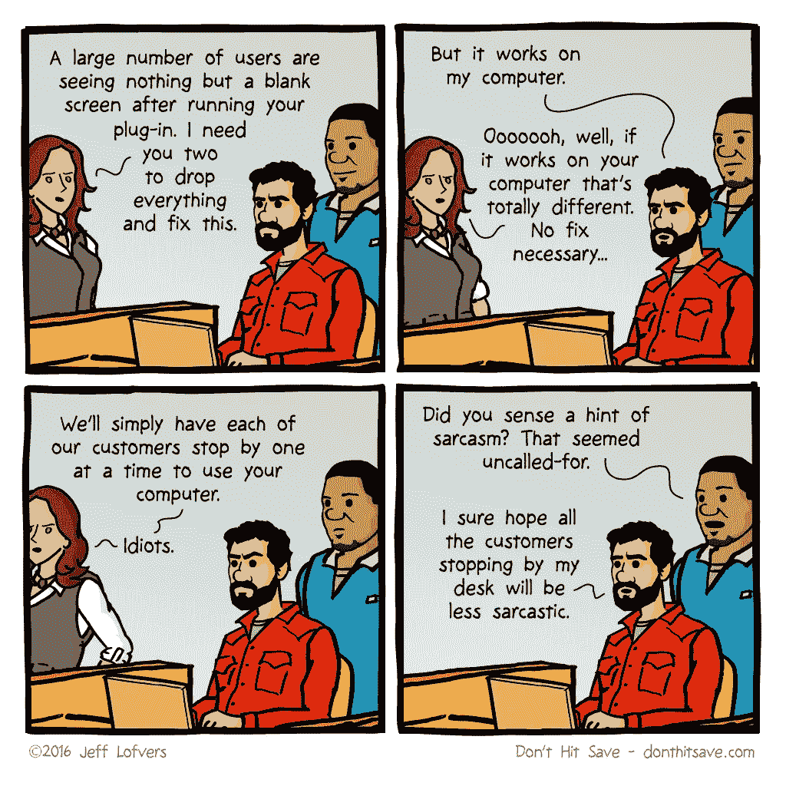

# 它在我的机器上工作

> 原文：<https://medium.com/hackernoon/it-works-on-my-machine-f7a1e3d90c63>

## 将初级开发人员与有经验的开发人员分开

当我还是一名初级开发人员时，人们知道一句谚语。我重复了一遍又一遍。我不得不经常说这句话，这甚至让我感到困扰。客户遇到 bug 我就说了。当客户支持声称我“修好”的东西还是坏了。当新功能发布后反馈不佳时。

> 它在我的机器上工作！

当客户遇到问题时，我的默认反应是责备他们。我永远不会把我知道不工作的东西发布到产品中。我会注意到这么明显的事情。这是你的错。回去再试一次。

不过，我花了很长时间才意识到一种模式正在形成。有几次是用户失误。但是大多数时候，用户会回来找我，声称他们仍然遇到这个问题。

> “它在我的机器上工作。我们去看看你做错了什么……哦。”

# 如果用户不理解，它就不会“工作”

当比较我的用户和我的用户的工作流程时，我经常能够推断出他们的问题实际上不是问题。他们在做错事。我会告诉他们他们的问题是什么，给他们指示，并呼吁解决问题。

这是错误的，原因有很多。

首先，你告诉用户他们错了。这是他们的错。没有人喜欢犯错。他们已经有过使用该产品的糟糕体验，现在他们被告知这是他们的错。这需要很大的耐心才能坚持下来，而大多数用户都没有这种耐心。

第二，如果一个用户有问题，很可能他们不是唯一有这种想法的人。这些用户会提出两个问题。这个问题会不断出现。所以要么你要么客户支持将会一遍又一遍地回答同一个问题。

其他人会认为这是一个坏的特性，而不会说什么。这些家伙不会呆太久的。不像抱怨者，你永远不知道为什么。

用户体验问题和 bug 一样重要。他们把优秀的产品和平庸的产品区分开来。不管你是否同意用户是如何到达他们的错误状态的。作为开发人员，我们的目标是让软件远离用户的目标。

# 处理所有用户反馈

多年来，我已经意识到用户反馈是多么有价值。更重要的是，我意识到我们必须以某种方式处理每一条用户反馈。

毫无疑问，一些反馈将是垃圾。他们想要别人不想要的东西。实施他们的改变会给大多数人带来问题。不值得浪费时间。但是我们仍然应该在某个地方记录和量化它。

这样我们就知道我们的用户在说什么。更重要的是，它鼓励用户，他们的反馈有助于改进产品。这比告诉他们他们错了要好得多。开发商让它工作没有问题，这是他们的错。

明确地说，这同样适用于客户和内部团队，比如 QA。当有人在测试你的功能时，他们最不想听到的就是它对你有多有用。与您的测试人员合作，在用户体验问题进入生产之前解决它们。你的顾客会感谢你的。

# 这是一个初级开发人员说的

[Source](/@KJump/it-works-on-my-machine-f7a1e3d90c63) From Don’t Hit Save

随着我职业生涯的进展，我已经从一个电脑工作如此出色的人走了很长一段路。有时候会难以下咽。但我知道，如果有人对我做的事情有意见，那就是我犯了一个错误。我错过了一些东西。我没有考虑某个用例。

随着我和越来越多的开发人员一起工作，我发现这不是有经验的开发人员会说的话。他们意识到他们的用户不是骗子，并有宝贵的反馈。不过，初级开发人员经常使用它。

初级开发人员如此倾向于不同意反馈的部分原因是他们认为这是针对个人的。差评是对他们的攻击，而不是对他们产品的攻击。他们变得有防御性。当我们处于防御状态时，我们该怎么做？我们转移视线。这不是我的问题，它对我来说很好！这是你的责任。你做了什么？

我们都必须意识到反馈，无论好坏，都与你无关。反馈是针对某个功能或产品的。美国开发者并不是由一个坏的特性来定义的。我们也不是由好的来定义的。开发人员是由我们解决问题的能力来定义的，不管是谁在经历这些问题。

> [黑客中午](http://bit.ly/Hackernoon)是黑客如何开始他们的下午。我们是 [@AMI](http://bit.ly/atAMIatAMI) 家庭的一员。我们现在[接受投稿](http://bit.ly/hackernoonsubmission)，并乐意[讨论广告&赞助](mailto:partners@amipublications.com)机会。
> 
> 如果你喜欢这个故事，我们推荐你阅读我们的[最新科技故事](http://bit.ly/hackernoonlatestt)和[趋势科技故事](https://hackernoon.com/trending)。直到下一次，不要把世界的现实想当然！

