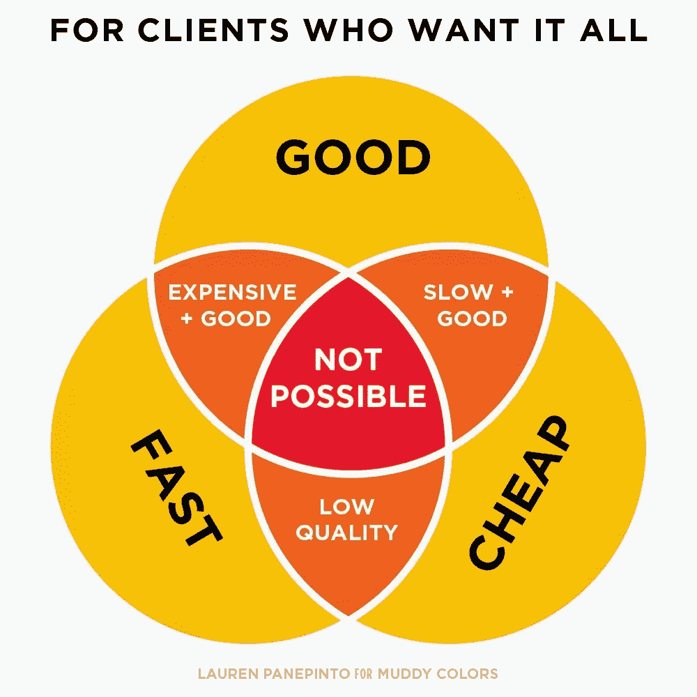
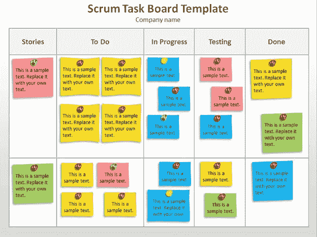
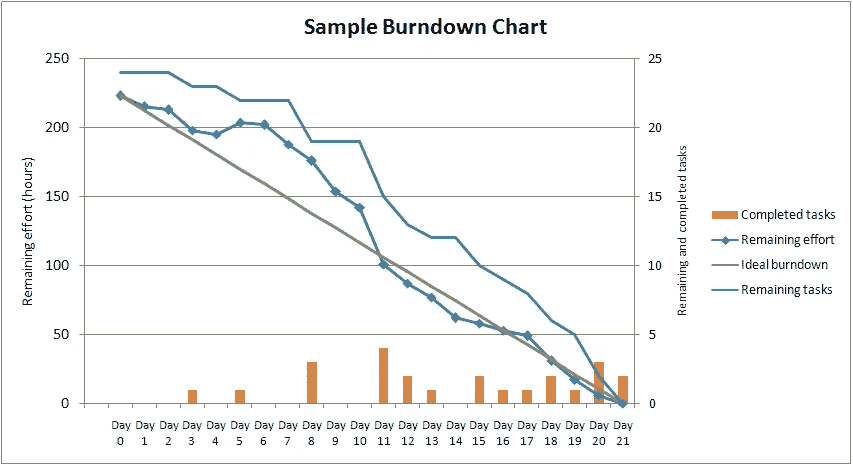

# 信守承诺——如何按时交付软件

> 原文：<https://medium.com/hackernoon/keep-your-promises-how-to-deliver-software-on-time-2009502bea42>

我们都经历过一个粗糙的开发周期，在这个周期中，我们被意想不到的问题和范围蔓延所困扰。当产品时间表延误时，我们的首席执行官会感到沮丧，我们解释混乱的努力也无济于事。我们都熟悉敏捷开发，但是在整个开发周期中保持持续清晰的交流是需要纪律的。当你向老板做出承诺时，在一个[初创企业](https://hackernoon.com/tagged/startup)的混乱世界中，你如何才能可靠地信守承诺？

***嗯，那要看承诺本身了。***

假设你向你的老板承诺:

> "我承诺，从现在起 30 天后，我将交付一个具有 A-Z 特性的应用程序."

你成功实现这一承诺的可能性有多大？很多事情都可能出错。你还不知道这 26 个特性实现起来会有多困难。有人生病了怎么办？如果生产中出现问题，您的开发人员不得不推出补丁，该怎么办？如果你没有想到所有可能出现的用例以及边缘情况会怎么样？如果在发布的中途，您的老板决定必须添加一个新的关键特性，该怎么办？

假设你做出了这个承诺:

> “我承诺，从现在起 30 天内，我将交付一个功能应用程序，按照优先级顺序，包含一组关键的特性 A-F，以及尽可能多的想要的特性 G-Z。我还承诺在整个过程中提供一致、透明的沟通，让您可以根据需要自由改变优先级。”

现在你已经为自己的成功做好了准备。然而，这仅仅是开始。现在你必须兑现这个承诺。有了这个过程，以及代表你和你的开发团队的一些纪律，你将会实现那个承诺。

# 软件开发的第一定律

在我们开始之前，我想陈述一下我称之为软件开发的第一定律:

> 你可以有好的，快速的，或便宜的，但你只能选择两个。

由于初创公司通常缺乏资金，初创公司的软件开发总是又快又好的拉锯战。由于初创公司的首席执行官们希望一切都快，那么你最终会把好的东西分解成质量、功能和抛光。质量应该是最重要的，所以只有功能和抛光应该是可以谈判的。在时间紧迫的情况下，您可以发布更少的功能，或者使这些功能不那么健壮和完美。

The First Law of Software Development

# 设定期望值

走向成功的第一步是在所有相关人员之间达成一致。您的老板、您的开发团队和您必须就流程、范围、优先级、截止日期和沟通达成一致。

敏捷方法学——如今大多数软件初创公司都使用 Scrum。我强烈建议你公司的每个人，从开发人员到 CEO，都熟悉 Scrum，然后应用你觉得合适的严格程度。虽然它肯定会增加开销，但拥有一个可持续和可预测的业务，定期生产高质量的软件是值得的。

**范围蔓延和期限** —范围蔓延发生了。通常，当您对一个版本进行评估时，您会遗漏一些重要的信息，或者没有考虑到所需特性的每一个可能的场景。随着您的深入，您会意识到如果没有其他细节或支持功能，一个功能是无法实现的。你的老板应该提前理解这种情况可能会发生，这将导致最后期限的推迟，或者低优先级的特性被推到下一个版本。

**状态报告和会议** —清晰一致的信息对于做出好的决策至关重要。你们应该就何时以及如何传达身份达成一致。对于您的开发团队，您应该每天会面一次来解决任何问题。你应该和你的老板会面，或者至少每周发一份报告，报告发布的当前状态，指出任何新的信息，比如范围的变化，或者预期的截止日期。

**里程碑和发布日期—** 就产品预计何时发布、将包含哪些功能以及何时达到某些里程碑达成一致。主要里程碑包括范围完成、设计完成、一些临时功能原型、代码完成、QA 完成和部署。在每个里程碑处，与你的老板进行一次回顾，以确保你在正确的轨道上，设计和优先级没有改变。

# 范围

创业的成败取决于你在正确的时间做正确的事情。你实现的每一个特性，都是在赌时间和金钱，赌它会以某种可度量的方式改善你的业务。你应该有一个持续的潜在功能列表，根据对用户获取、转换和保留的影响进行评分和排名。这些是增长漏斗的关键部分，每个特性都应该以可衡量的方式与其中至少一个联系起来。

Growth Funnel

> 你实现的每一个特性，都是在赌时间和金钱，赌它会以某种可度量的方式改善你的业务。

**分配—** 在每个版本中，你应该始终如一地分配一定比例的时间(或故事点)给新特性、技术债务/重构和润色。我建议 50%关注新特性，30%关注技术债务/重构，20%关注润色。你的老板总是要求更多的功能，你的开发人员要求更多的技术债务/重构，你的设计师要求更多的修饰。通过在每个版本中预算这一时间，您可以避免进行维护构建，在维护构建中，没有添加新的特性，并且时间花费在分解和修复可能很长时间没有查看的旧代码上。

术语技术债务是软件开发中最重要的术语之一。由于动作太快，偷工减料，压榨 QA，或者其他无组织的方式，你在你的应用程序中制造了一些问题，这些问题需要在某个时候解决。之所以称之为技术债，是因为你无法避免支付成本，而且你等待的时间越长，你要支付的利息就越多。兴趣可能包括让用户付出代价的不稳定的应用程序，不得不挖掘开发人员头脑中不新鲜的遗留代码，或者不得不完全封闭遗留组件，因为它已经过时了。

由于这个原因，维护构建非常昂贵。让技术债务搁置这么久，你最终会花费大量的时间来修复问题，而同时却没有实现任何特性。像偿还信用卡一样定期、持续地偿还你的技术债务，没有例外。

Scope Allocation

> 之所以称之为技术债，是因为你无法避免支付成本，而且你等待的时间越长，你要支付的利息就越多。

**定义详细的任务—** 每个功能都需要分解成简单的、明确定义的任务。从史诗开始，它是主要的路线图特性，并尽可能地分解它们。使用[工具](https://hackernoon.com/tagged/tool)，如[扳手](https://www.wrike.com)、[特雷罗](https://trello.com)或 [JIRA](https://www.atlassian.com/jira) 来捕捉你的任务。

**区分优先顺序—** 与您的利益相关者会面，并根据优先顺序对每个人进行排序。确定哪些是必须具备的功能，哪些是最好具备的功能。这一步非常重要，因为当范围蠕变开始出现时，您可以讨论它到底有多重要，并将其与范围内的其他任务进行比较。重新审视优先级迫使涉众做出艰难的决定，什么对业务真正重要。

**评估任务—** 开发人员应该为每个任务和子任务提供一个评估。一般来说，一天中的任何任务都应该分解成更小的任务。许多开发人员不愿意给出估计，尤其是对于不确定的任务。你必须哄他们给出一个估计值，向他们保证这些只是估计值，当新的信息出现时会改变。您还应该了解团队中谁总是高估或低估评估值，并做出相应的调整。

**评估不确定性—** 了解评估任务中的不确定性水平至关重要。具有更多不确定性的任务应该被给予更宽的时间范围和额外的缓冲。使用简单的 1-10 或 0-100%标度。

**给出时间范围**——很难说某件事到底需要多长时间，所以选择一个最好/最坏的范围。不确定性越多，范围就越广。

不确定性的缓冲— 不确定性越高，你应该给任务增加更多的缓冲。对于低不确定性的任务，我会增加 20%左右。对于高度不确定性的任务，我会增加 50%的额外时间。

**创建依赖关系—** 确定哪些任务相互依赖。沿着链来确定关键路径。

**估算速度—** 每个人都有不同的生产力水平。虽然许多人说他们每天工作 8 或 10 或 12 个小时，但实际操作的生产开发时间通常在每天 5-6 个小时左右。在一个典型的日子里，你有午餐和洗手间休息，会议，浪费任务，转换成本，和研究，吃了相当多的时间。有些日子比其他日子更好，但平均来说，我拍摄 5-6 个小时。

**创建粗略的时间表—** 现在你应该能够创建一个最好/最坏的时间表。将任务总时数加起来，除以开发人员数量，然后除以 5。这将为您提供完成发布所需的工作日数。如果这不符合你老板的期望，你可以决定是否调整时间表或扩大范围。

# 执行

在发展的第一天，为这一周制定一个目标。在依赖链中尽早选择优先级最高的任务，并填充当前周文件夹，以便每个开发人员都被分配了 25 小时的任务。

当每个开发人员开始处理一个任务时，他们应该将它从待办事项移到正在进行的文件夹或板上。当任务完成时，它应该被移动到一个测试文件夹/板上。验证后，应将其移至完成文件夹/纸板。

Scrum Board

**记录速度—** 在每周末，计算每个人完成了多少小时或多少分，并做一个连续记录。这是你的发展速度。它可能会每周波动，但随着时间的推移，它会给你一个很好的工作平均线，用于所有的短期和长期规划。

**追踪浪费—** 浪费会渗透到每个开发项目中。浪费任务可能包括因为错误的信息而陷入任务中，或者在生产中救火，或者处理支持问题，或者被拖进过多的会议中。你应该尽最大努力在一个单独的文件夹中记录这些浪费的任务，并估计每个任务的时间。当你到达一个发布周期的末尾，看看到底有多少时间被杂乱无章地浪费了，这真是令人大开眼界。您应该通过改进流程、组织、文档和沟通来消除浪费。

**每周回顾—** 每周结束时，你应该向团队和利益相关者发送一份报告，说明你在那一周完成了什么，浪费了多少时间，速度与历史平均水平相比如何，范围内增加了什么新任务，以及时间表是否会改变。燃尽图是展示团队完成进度的好方法。将这些报告保存在一个中央共享存储库中，以便团队中的任何人都可以查看它们。

Sample Burndown Chart

**发布常规开发构建—** 无论发布周期有多长，您都应该进行 2 周的开发冲刺，并在每个冲刺的末尾发布一个内部开发构建。通过这种方式，团队成员可以看到这些特性是如何组合在一起的，并预测出可能没有预见到的任何可能的场景。你越早得到这些信息，你就能越早调整，改变的成本也就越低。这也允许你的 QA 人员忙于稳定的构建。

**将大功能和小功能放在不同的分支上—** 只要有可能，将主要的大功能放在不同的分支上。在某些情况下，史诗般的功能可能会变得臃肿，导致时间表漂移，阻碍更容易实现的重要功能。例如，对商业模式的调整可能需要一个简单的改变来将一些东西置于付费墙之后。首席执行官可能会推动这一点，以增加转化率，但它可能会卡在一个更大的功能后面。现在，你不得不匆匆忙忙地完成这部史诗，以便把那点小小的改变推出门外。通过将史诗放在一个单独的分支上，你可以在中间推出一个小释放来缓解一些压力。

**尽可能早、尽可能经常地与用户确认—** 你设计了一套功能，以便为用户解决问题。只要有可能，甚至在开发开始之前，您就应该尝试验证您提出的解决方案将实际解决该问题。随着开发构建的发布，花时间从组织外部的任何人那里获得反馈。与新用户和现有用户举行焦点小组会议，向朋友和家人展示构建，甚至在咖啡店拦住一个陌生人，询问他或她的意见。在我的上一篇文章中，我更详细地讨论了这个话题，[如何避免委员会设计](https://hackersguidetogrowth.com/2016/06/11/how-to-avoid-design-by-committee%E2%80%8A-%E2%80%8Adeveloping-an-effective-product-design-process/)。

# 回顾

每周，你应该回顾团队的进展，评估任何必要的课程变化。

**重置速度—** 如果速度明显偏离历史平均水平，公开讨论。也许任务不明确。也许有异常多的任务被浪费了。不管它是什么，找到它的底部，并试图使速度回到标准。

**修改评估—** 随着新信息的收集，可能有必要修改您对某些任务的评估。这在任何版本中几乎都是必然的。预计一些任务会比最初预计的花费更多或更少的时间。

**分解任务，增加清晰度—** 随着大任务变得越来越清晰，把它们分解成子任务，增加更多清晰的细节。开发人员应该标记下一次会议中需要澄清的任务。

**Descope —** 如果最初的估计是错误的，引入了大量的浪费，或者新的范围被添加到发布中，为了在截止日期前完成，可能有必要将一些低优先级的任务推到下一个发布中。尽早做出决定，通知所有利益相关方。

**拆分发布—** 如果一个发布由于复杂性或范围蔓延而陷入困境，您可能会决定将其拆分为两个发布。这样，你的老板和用户都有所收获，也减轻了开发人员的压力。这就是为什么把史诗放在一个单独的分支上是有帮助的一个原因。

**重复——在这个过程中，重复是成功的关键。保持这个项目在正轨上有很多工作要做，但是通过持续地和经常地迭代，你收集了有价值的数据，这在将来会更容易。您应该为您所有的报告、公告板、任务描述、测试用例以及需求创建模板。你也应该在日历上安排时间来完成这些任务，这样它们就不会被日常的混乱所淹没。**

# 试验

测试可以说是软件开发中最关键的部分。不稳定的软件是没有用的，不管它有多少功能。这是反对不断发布新功能的另一个理由。用户并没有要求那个闪亮的新功能。他们只是想让它起作用。最好是发布更少的可用特性，而不是更多的不可用特性。

**编写测试用例—** 一旦范围完成，QA 团队就应该开始编写测试用例来验证每项任务。您应该开发一个包含所有测试用例的主测试计划，并且您应该在每个发布版本中添加测试用例。

**任务完成后测试—** 一旦任务被移动到测试文件夹中，您的 QA 团队应该能够开始运行针对它的测试用例。如果你有一个测试工程师，他或她应该开始编写自动化测试。

**永远不要压榨 QA —** 这太常见了，已经成了一种可悲的陈词滥调。开发人员总是迟到，最后期限也不会改变，所以 QA 总是很紧张。这是一个很糟糕的想法，已经毁了无数的产品。预先协议的一部分应该是截止日期适用于代码完成，而不是发布。不管代码是否按时完成，QA 周期是固定的。如果你有错过最后期限的危险，那就把开发任务转移出去。

**在代码完成后执行完整的回归测试计划—** 当代码完成时，大部分任务已经被验证。随着开发人员和测试人员的反复，可能会有几个 QA 版本。最后，当团队有信心构建一个发布候选时，QA 团队应该运行一个完整的回归测试。理想情况下，这些测试都是自动化的，如果发现了需要修复的 bug，整个回归测试套件应该再次运行。回归测试应该是部署之前绝对要做的最后一件事。即使是微小的变化也会产生灾难性的影响。这在我身上发生过很多次。

# 传递

如果你遵循了这个过程，你应该有一个高质量的产品，具有大部分要求的特性，并且按时交付。你应该有一个快乐的老板，他或她得到了他或她想要的东西；快乐的开发人员，他们不必经历一个艰难的时期；快乐的测试人员，他们不会被压榨；快乐的用户，他们收到了一个令人敬畏的新更新。

在这一点上，你应该和你的团队以及你的利益相关者召开一个回顾会，讨论哪里出了问题，哪里进展顺利。总有改进的空间，有时候你只是经历了一个粗糙的循环。花时间反思你的团队动态和你的过程，并尝试在下一次做出改进。像往常一样，你应该庆祝你的发布。在发布之后，在你陷入下一个周期之前，立即去做。

一如既往，我希望这篇文章对你有用。请回复任何有用的反馈或战争故事。我总是渴望学习别人是怎么做的。你可以在我的博客[黑客成长指南](https://hackersguidetogrowth.com)上阅读更多，或者阅读我在媒体上的[出版物。我正在写一系列详细、实用的指南，涵盖创业成长和产品开发的所有方面，包括战略规划、设计、产品管理和软件开发。祝你好运！](https://medium.com/hackers-guide-to-growth)

# 刚推出！获取免费的产品开发工具包！

我已经整理了一个完整的包来帮助企业家、初创公司创始人和首席执行官学习如何建立技术产品和业务。我免费赠送的第一部分是一个可定制的产品开发工具包。它包括我和我的真实客户一起使用的所有模板，帮助他们从想法到执行。[拿过来！](http://www.buildtherightthings.com/toolkit)

