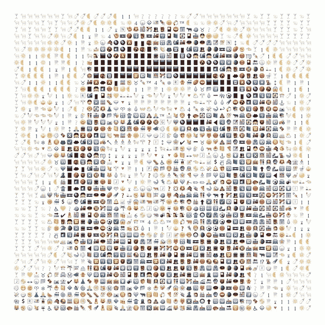
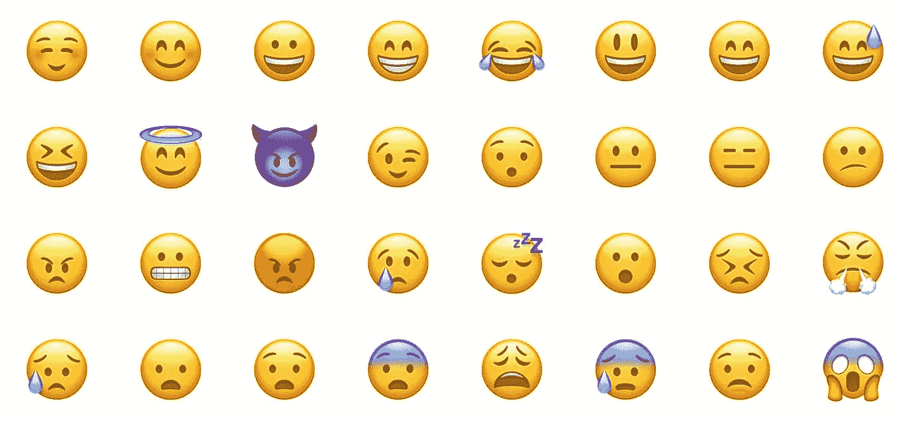

# 🤓 🚨| Kolmogorov 表情符号

> 原文：<https://medium.com/hackernoon/kolmogorov-emojis-5ef62d86712f>

当我们相互交流时，我们往往会忽略我们对非语言暗示的依赖程度。除此之外，我们的肢体语言，如手部动作、呼吸、眼神交流和面部表情，以及我们说话的特点，如语调、语速、交流频率等，对交流来说与我们使用的语言一样重要。

例如，如果有人在失去亲人后哭泣，同时告诉人们他们“很好”，我们大多数人会优先考虑他们的非语言交流，而不是他们的实际语言，并认为他们不好，没有告诉我们真相。但是，当我们通过书面语言交流时，我们对这些非语言手段视而不见，并会发现传达或解释语气和情绪可能会非常费力，这与我们直接面对面交流时不同。然后我们发现了表情符号…

尽管表情符号经常被比作千年象形文字，或者被视为从无意义到令人讨厌的任何东西，但它可能也是比任何其他书面语言更有效的传达语气和情感的方式。除了具有难以置信的直观性，使我们能够将面部表情等非语言交流融入到我们的写作中，表情符号还能让我们用更少的语言简洁地表达情感。因此，从 [Kolmogorov 复杂性](https://en.wikipedia.org/wiki/Kolmogorov_complexity)的角度来看，与没有表情符号的相同语言相比，增加了表情符号的书面语言可以用更少的字符来传达语气和情感，使书写更有效，更少冗余，更不复杂。

简单地说，你可以把 Kolmogorov 复杂度想象成一个句子中的一个字符或一个字母的数量。随着句子字符大小的增加，其复杂性也在增加；当你找到更短、更简洁的方法来定义同一事物时，你就降低了它的复杂性。例如，不写“三十二”，我们可以简单地写它的一个数值，如“2⁵”、“32”，甚至“16 + 16”。由于这三种方法中的字符都比单词“32”少，所以它们都不太复杂。

结合书面语言，很容易看出表情符号在这方面与数字没有什么不同，正因为如此，它们可以减少字符的数量，从而以同样的方式降低我们沟通的复杂性。正如阿拉伯数字可以比字母更简洁地定义数字一样，表情符号似乎比字母更简洁地定义我们的情绪。

**将同样的概念应用于表情符号:**

《书呆子警报》
或
🤓 🚨

**或**
的“我快乐”😊

“嘿，我超级为你骄傲！干得好！”
**或**
👌🏼💪🏼🔥👍🏼🙌🏼💯

作为一个物种，无论我们是否意识到这一点，我们都倾向于采用新的方法和技术来节省我们的时间和精力，表情符号也不例外。自 90 年代以来，它们的应用和流行不仅不断提醒人们非语言暗示在日常交流中是多么有利，而且也提醒人们语言和我们一样向高效进化。当然，表情符号有时会令人讨厌和厌恶，但这是语言进化的方式，它们会一直存在，直到被更有效的方式取代；不管有没有人喜欢。

✌🏼

 [## Kolmogorov 复杂性-维基百科

### 在算法信息论(计算机科学和数学的一个分支)中，一个数学模型的 Kolmogorov 复杂性…

en.wikipedia.org](https://en.wikipedia.org/wiki/Kolmogorov_complexity)