# 启动一个 GPU 支持的 Google 计算引擎实例，并设置 Tensorflow、Keras 和 Jupyter

> 原文：<https://medium.com/hackernoon/launch-a-gpu-backed-google-compute-engine-instance-and-setup-tensorflow-keras-and-jupyter-902369ed5272>

将 Udacity 自动驾驶汽车 Nanodegree 带到谷歌云平台。分步指南。🚗

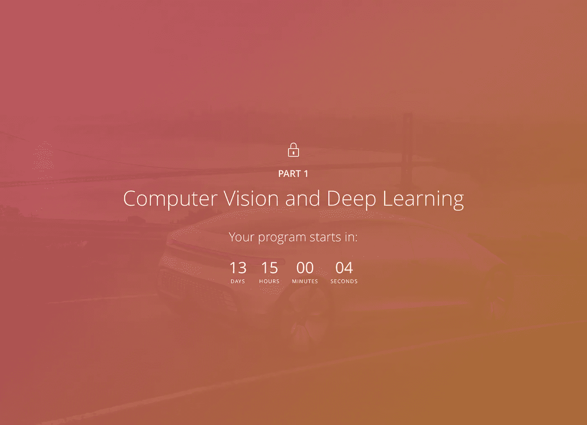

Countdown to the future?

# 介绍

早在 6 月份，我就成为了 Udacity 无人驾驶汽车纳米学位项目的学生。这是一个长达九个月的课程，教你在无人驾驶汽车上工作所需的一切知识。主题包括:

*   深度学习
*   计算机视觉
*   传感器融合
*   控制器
*   车辆运动学
*   汽车硬件

我们的第一个项目是检测视频馈送中的 lane，我这一批中的大多数学生现在都非常深入地学习深度学习课程。

这些课程依赖于运行 Tensorflow 程序的 Jupyter 笔记本电脑，我从惨痛的教训中得知，我的 Macbook Pro 上的 GeForce GT 750M 及其 384 个 CUDA 内核无法满足要求。

是时候去做更强壮的东西了。

## AWS vs GCP

作为 Udacity 项目的一部分，所有学生都可以获得 AWS 学分。它是这门课程事实上的平台，我们所有的指南和文档都基于它。

然而，我是 GCP 的长期粉丝，我已经在我的一些个人项目中使用它，并且我一直在寻找使用它的新借口。

这一次，我想利用平台的这些出色特性:

*   具有固定价格的可抢占虚拟机。
*   持续使用折扣。
*   分钟计费。

我想我可能最终会有一个非常便宜的深度学习盒子，而且(主要是？)看起来我会有一次很好的学习经历和一些乐趣。

经过一些研究，我很快发现可抢占的虚拟机不能连接 GPU，我预测的每月使用量肯定不会触发持续使用折扣。

哦好吧。看来这只是为了学习和娱乐。😅


## 定价

在我们开始之前，先简要说明一下定价。根据本课程的需要，我选定了以下设置:

*   n1-标准-8 (8 个 vCPU，30GB 内存):0.49 美元/小时
*   特斯拉 K80:0.70 美元/小时
*   50GB 永久固态硬盘:约 0.012/小时
*   区域:欧洲-西方-1b

每小时总计:**$ 1.20/小时**
平均卡学生使用总计(15 小时/周/月): **$77** 一整月总计(适用持续使用折扣): **$784.40**

我没有做过任何基准测试，也没有试图以任何方式优化这个设置。对于这种纳米度的目的来说，它可能过于强大，或者相反不够强大，所以如果您对自己正在做的事情有更好的想法，请随意调整。😉

# 指南

让我们开始吧。

您的第一步将是在 [Google Compute Engine](https://cloud.google.com/compute/) 上使用 GPU 启动一个实例。这个指南有两个版本，一个是给[网络用户界面爱好者](#ca9b)的，另一个是给[不喜欢离开终端](#e6b8)的人的。

在这两种情况下，本指南假设你已经有一个谷歌帐户，如果你没有，请先在这里创建一个[。](https://accounts.google.com/SignUpWithoutGmail?service=cloudconsole)

# 启动实例— Web 控制台版

## 创建项目

头转向[https://console.cloud.google.com](https://console.cloud.google.com)。

如果你是第一次使用谷歌云，你会看到以下页面，邀请你创建你的第一个项目:

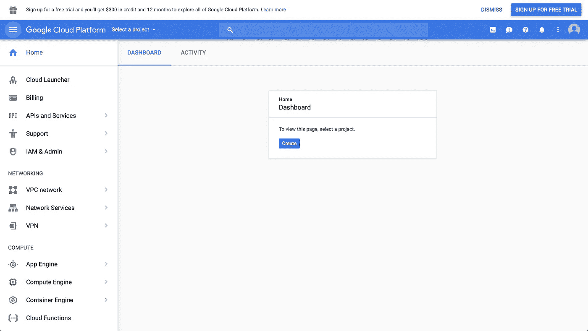

Google Cloud Console — homepage

***好消息:如果你是第一次使用谷歌云，你还有资格获得 300 美元的积分！要获得此积分，请单击顶部栏中的蓝色大按钮“注册免费试用”。***

点击“创建”,你将进入下图所示的页面。

如果你已经是一个 GCP 用户，点击顶部菜单栏中的项目切换器，然后点击出现的模态右上角的“+”按钮。

为您的项目选择一个名称，同意服务条款(如果您同意！)并再次点击“创建”。

如果你已经在使用谷歌云平台，你很可能已经有一个计费账户，所以你可以在项目创建表单上选择它。

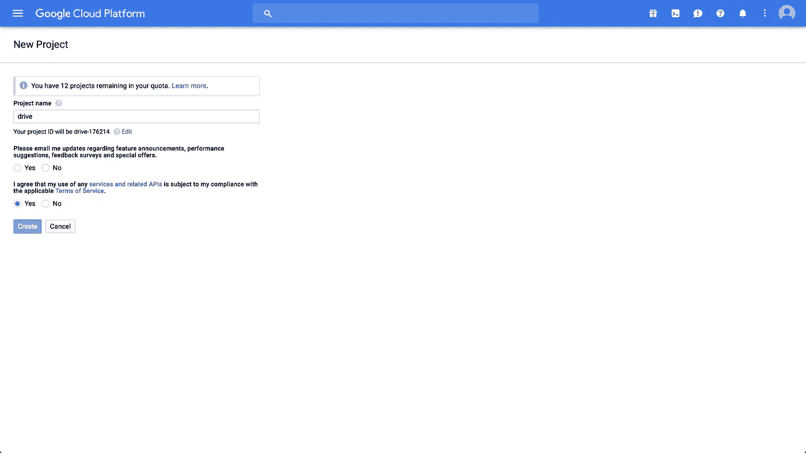

Google Cloud console — new project

如果你是一个新用户，一旦你的项目被创建，你将不得不创建一个计费帐户(这有时需要一点时间，请耐心等待！).这就像当你被提示时给出你的信用卡信息和地址一样简单。

使用菜单中的项目切换器前往项目的仪表板。

## 要求增加配额

在创建第一个实例之前，您需要请求增加配额，以便将 GPU 连接到您的计算机。点击侧边菜单(也就是臭名昭著的汉堡菜单)，进入“IAM & Admin”>“Quotas”。


Editing quotas — step 1

使用表上方的“配额类型”筛选器显示所有配额。选择“所有配额”。然后使用“区域”过滤器选择您的区域。

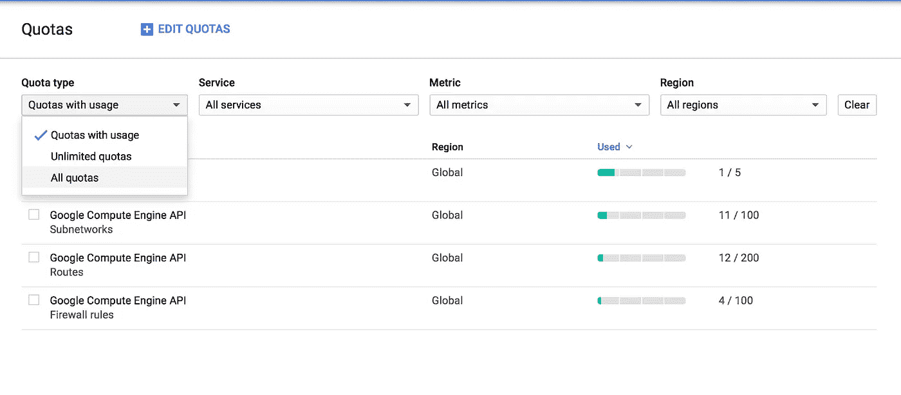

Editing quotas — step 2

在列表中查找“谷歌计算引擎 API —英伟达特斯拉 K80 GPUs”，选择它并点击顶部的“编辑配额”。

在右侧打开的菜单中，输入您的个人详细信息(如果尚未预先填写)，然后单击“下一步”。填写表格，询问您想要多少个 GPU 以及请求增加配额的原因，并提供以下详细信息:

*   请求的 GPUs
*   配额增加的原因:“使用 GPU 训练深度神经网络”

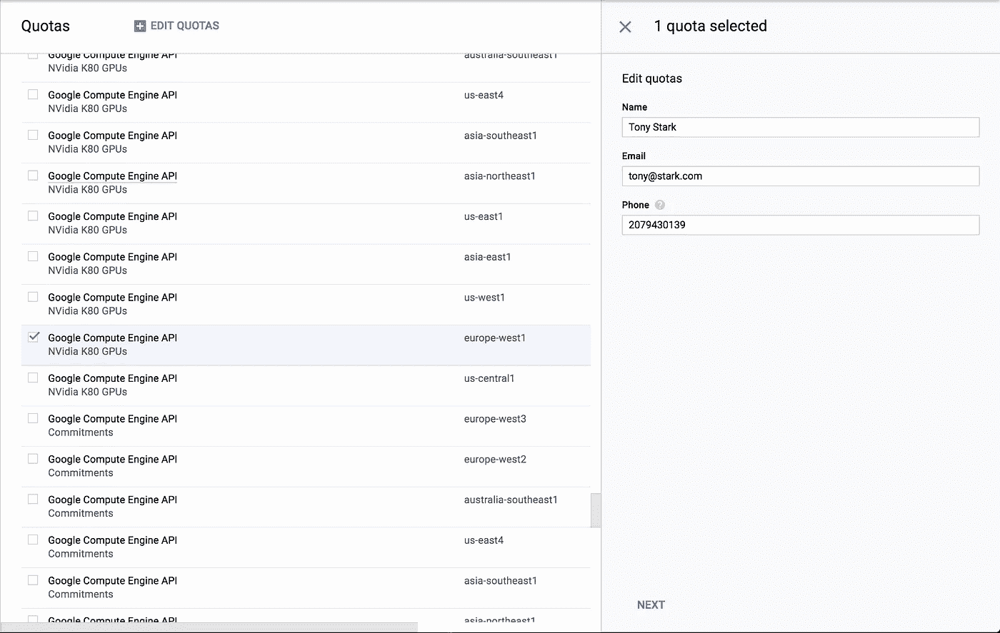

Editing quotas — step 3

过一会儿(应该很短)谷歌会批准你的请求。你现在可以进入下一步了！


Editing quotas — result

## 启动虚拟机实例

再次点击侧边菜单，进入“计算引擎”>“虚拟机实例”。

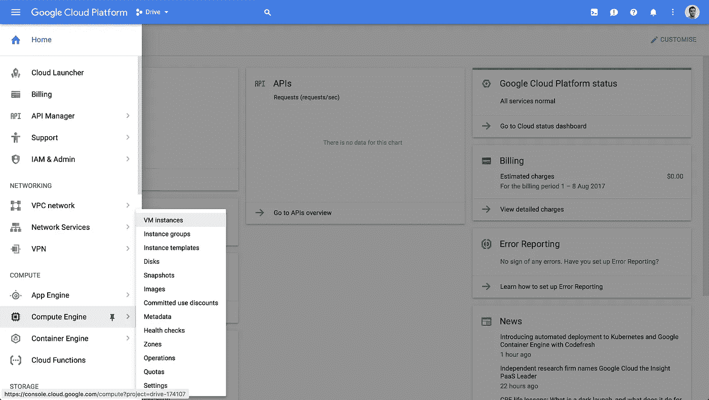

您将收到一个通知，邀请您创建第一个实例。点击“创建”。

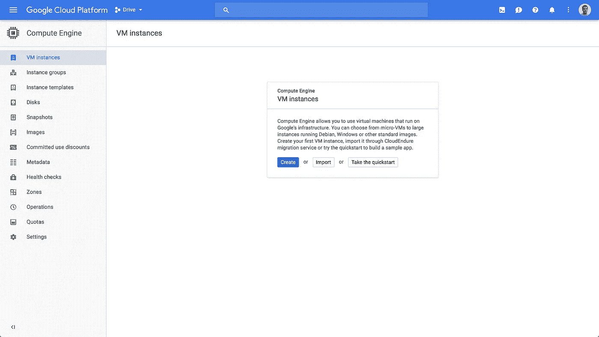

您已经为您的服务器选择了规格，因此该表单非常简单:

*   实例名:我和`drive01`一起去，但完全由你决定！
*   区:`europe-west-1b`。你可以自由选择任何你想要的区域，但它必须是有 GPU 支持的区域。
*   实例类型:`n1-standard-8`，8 个 vCPUs，30GB 内存。
*   单击实例类型选择旁边的“定制”,然后单击“GPU”显示 GPU 创建表单。使用“GPU 数量”和“GPU 类型”下拉菜单添加 1 个 NVIDIA Tesla K80。

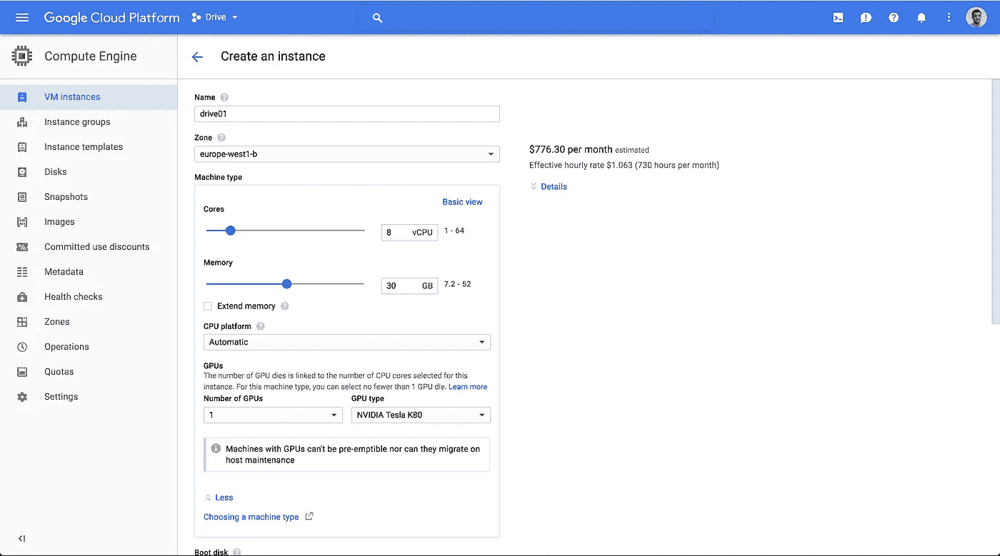

Create instance — step 1

接下来，您需要选择一个操作系统，并将 SSD 持久磁盘添加到您的实例中。单击启动盘部分的“更改”。


Create instance — step 2.a

使用这些设置:

*   OS: `Ubuntu 16.04 LTS`。
*   启动盘类型:`SSD Persistent Disk`。
*   尺寸:`50GB`。

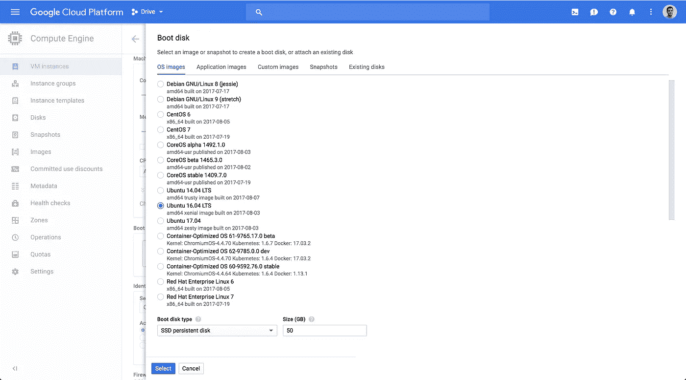

Create instance — step 2.b

你差不多完成了。

单击表单底部的“管理、磁盘、网络、SSH 密钥”。

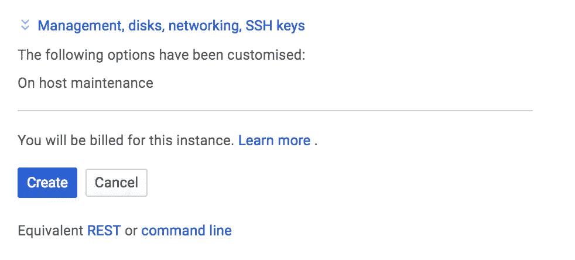

Create instance — step 3.a

在“网络”部分添加以下网络标签:`jupyter`。这在以后配置防火墙时会很有用。


Create instance — step 3.b

最后一步是将您的 SSH 密钥附加到实例。转到“SSH 密钥”部分。

复制并粘贴您的 SSH 公钥。它需要以下格式:

```
<protocol> <key-blob> <username@example.com>
```

这是非常重要的，因为<username>将会是你用来访问你的服务器的用户名。</username>

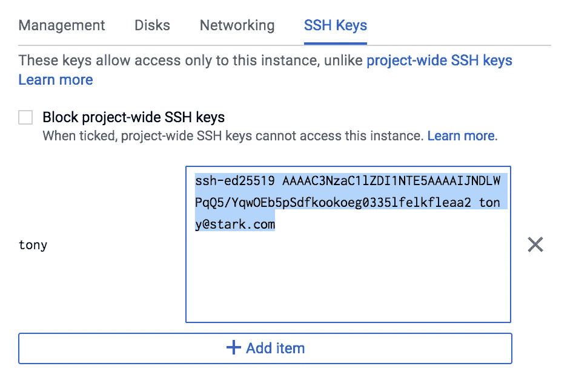

Create instance — step 3.c

点击页面底部的“创建”。

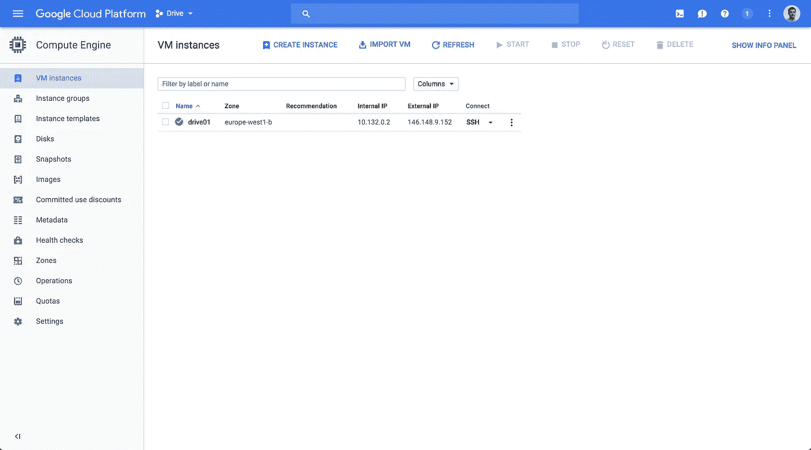

Create instance — success

记下实例的外部 IP，以备后用。

## 添加防火墙规则

为了访问您的 Jupyter 笔记本，您需要添加防火墙规则以允许端口 8888 上的传入流量。

使用侧面菜单进入“VPC 网络”>“防火墙规则”。


Firewall rules — step 1

点击“创建防火墙规则”。


Firewall rules — step 2

将这些值填写在以下表格中:

*   名称:`default-allow-jupyter`。
*   网络:`default`。
*   优先级:`65534`。
*   交通方向:`Ingress`。我们只对允许传入流量感兴趣。
*   对匹配的操作:`Allow`。我们希望允许符合特定规则的流量。
*   目标:`Specified target tags`。我们不想将这个规则应用于项目中的所有实例，而只是应用于选定的几个实例。
*   目标标签:`jupyter`。只有带有`jupyter`标签的实例才会应用此防火墙规则。
*   来源过滤器:`IP ranges`。
*   来源 IP 范围:`0.0.0.0/0`。来自任何网络的流量都将被允许进入。如果你想让这更严格，你可以把你自己的 IP 地址。
*   协议和端口:`tcp:8888`。仅允许端口 8888 上的 TCP 流量。

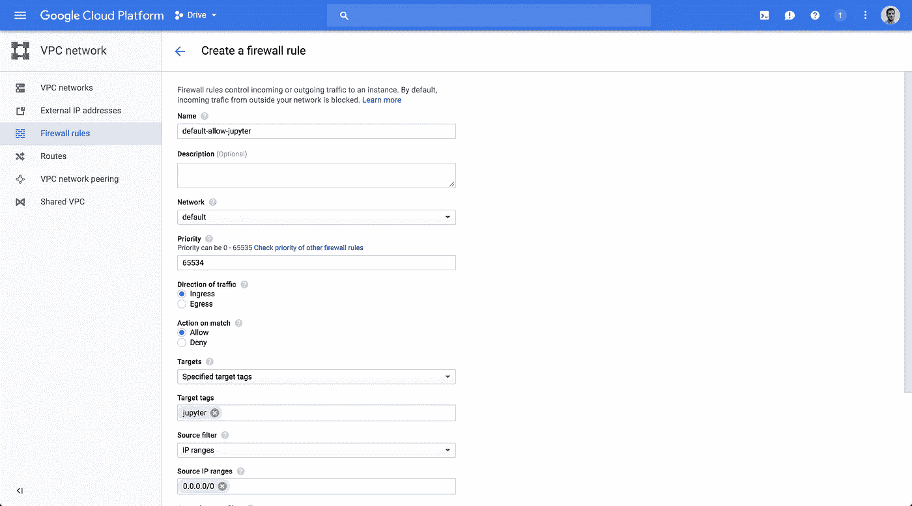

Firewall rules — step 3.a


Firewall rules — step 3.b

# 启动实例— CLI 版本

*如果您已经使用基于 web 的控制台启动了服务器，则可以跳过这一部分。*

## 安装云 SDK

遵循 Google Cloud Platform [文档网站](https://cloud.google.com/sdk/downloads)上的指南，为您的操作系统安装最新版本的 Cloud SDK。

## 创建项目

```
$ gcloud projects create "drive-cli" --name "Drive CLI"
```

如果您的项目 ID 已经被占用，请随意添加一些随机数。

## 启用计费

转到以下页面，为您新创建的项目启用计费:

```
https://console.developers.google.com/billing/linkedaccount?project=[YOUR_PROJECT_ID]
```

*注意:我没有办法从 CLI 做到这一点，但如果有人看到这篇文章，请在评论中告诉我。*

## 要求增加配额

在使用附加的 GPU 启动实例之前，您需要确保在您选择的区域中有足够的可用 GPU。否则，您将需要在此处请求增加配额:

```
[https://console.cloud.google.com/iam-admin/quotas](https://console.cloud.google.com/iam-admin/quotas)?project=[PROJECT_ID]
```

然后，您可以按照本指南的[网络版](#77e4)申请增加配额。

## 启动虚拟机实例

为了创建一个带有一个或多个附加 GPU 的实例，您需要安装至少版本为`144.0.0`的`gcloud`命令行工具和`beta`组件。

```
$ gcloud version
**Google Cloud SDK** **165.0.0**
**beta 2017.03.24**
bq 2.0.25
core 2017.07.28
gcloud
gsutil 4.27
```

如果不满足这些要求，请运行以下命令:

```
$ gcloud components update && gcloud components install beta
```

在本地计算机上的任意位置创建一个具有以下格式的文件:

```
[USERNAME]:[PUBLIC KEY FILE CONTENT]
```

例如(出于实际原因，键被缩短):

```
steve:ssh-rsa AAAAB3NzaC1y[...]c2EYSYVVw== steve@drive01
```

创建实例的时间:

```
$ gcloud beta compute instances create drive01 \
    --machine-type n1-standard-8 --zone europe-west1-b \
    --accelerator type=nvidia-tesla-k80,count=1 \
    --boot-disk-size 50GB --boot-disk-type pd-ssd \
    --image-family ubuntu-1604-lts --image-project ubuntu-os-cloud \
    --maintenance-policy TERMINATE --restart-on-failure \
    --metadata-from-file ssh-keys=~/drive_public_keys \
    --tags jupyter --project "[YOUR_PROJECT_ID]"
```

如果命令运行成功，输出应该类似于以下内容:

```
Created [[https://www.googleapis.com/compute/beta/projects/drive-test/zones/europe-west1-b/instances/drive01](https://www.googleapis.com/compute/beta/projects/drive-174107/zones/europe-west1-b/instances/drive01)].
NAME     ZONE            MACHINE_TYPE   PREEMPTIBLE  INTERNAL_IP  EXTERNAL_IP    STATUS
drive01  europe-west1-b  n1-standard-8               10.132.0.2   146.148.9.152  RUNNING
```

记下外部 IP。

## 添加防火墙规则

```
$ gcloud beta compute firewall-rules create "default-allow-jupyter" \
    --network "default" --allow tcp:8888 \
    --direction "ingress" --priority 65534 \
    --source-ranges 0.0.0.0/0 \
    --target-tags "jupyter" --project "[YOUR_PROJECT_ID]"
```

输出应该是这样的:

```
Creating firewall...done.
NAME                   NETWORK  DIRECTION  PRIORITY  ALLOW     DENY
default-allow-jupyter  default  INGRESS    65534     tcp:8888
```

# 准备服务器

既然您的实例已经启动，防火墙也已经正确设置，现在是时候配置它了。

首先使用以下命令登录到您的服务器:

```
$ ssh -i ~/.ssh/my-ssh-key [USERNAME]@[EXTERNAL_IP_ADDRESS]
```

[外部 IP 地址]是您在前面几个步骤中记下的地址。
【用户名】是您的 SSH 密钥中的用户名。

因为这是您第一次连接到该服务器，您将得到以下提示。键入“是”。

```
The authenticity of host '146.148.9.152 (146.148.9.152)' can't be established.
ECDSA key fingerprint is SHA256:xll+CHEOChQygmnv0OjdFIiihAcx69slTjQYdymMLT8.
Are you sure you want to continue connecting (yes/no)? yes
```

让我们首先更新系统软件并安装一些急需的依赖项:

```
$ sudo apt-get update
$ sudo apt-get upgrade
$ sudo apt-get install -y build-essential
```

幸运的是，Ubuntu 预装了 Python 2 和 Python 3，所以你可以直接进入下一步:安装 [Miniconda](https://conda.io/miniconda.html) 。

```
$ cd /tmp
$ curl -O [https://repo.continuum.io/miniconda/Miniconda3-latest-Linux-x86_64.sh](https://repo.continuum.io/miniconda/Miniconda3-latest-Linux-x86_64.sh)
$ md5sum Miniconda3-latest-Linux-x86_64.sh
```

最后一个命令的输出应该类似于:

```
c1c15d3baba15bf50293ae963abef853  Miniconda3-latest-Linux-x86_64.sh
```

这是您下载的文件的 MD5 总和。您可以将它与 MD5 哈希进行比较，以验证您的安装程序的完整性。

您现在可以运行安装脚本:

```
$ bash Miniconda3-latest-Linux-x86_64.sh
```

这将为您提供以下输出:

```
Welcome to Miniconda3 4.3.21 (by Continuum Analytics, Inc.)In order to continue the installation process, please review the license
agreement.
Please, press ENTER to continue
>>>
```

按下`[ENTER]`继续，然后再次按下`[ENTER]`通读许可证。一旦到达终点，系统会提示您接受它:

```
Do you approve the license terms? [yes|no]
>>>
```

如果同意，请键入“是”。

安装程序现在会要求您选择安装位置。按`[ENTER]`使用默认位置，或者如果您想自定义，键入不同的位置:

```
Miniconda3 will now be installed into this location:
/home/steve/miniconda3 - Press ENTER to confirm the location
  - Press CTRL-C to abort the installation
  - Or specify a different location below[/home/steve/miniconda3] >>>
```

安装过程将开始。一旦安装完成，安装程序会询问你是否希望它将安装位置添加到你的`PATH`中。这是在你的 shell 中使用`conda`命令所需要的，所以键入“yes”表示同意。

```
...
installation finished.
Do you wish the installer to prepend the Miniconda3 install location
to PATH in your /home/steve/.bashrc ? [yes|no]
[no] >>>
```

以下是安装过程的最终输出:

```
Prepending PATH=/home/steve/miniconda3/bin to PATH in /home/steve/.bashrc
A backup will be made to: /home/steve/.bashrc-miniconda3.bakFor this change to become active, you have to open a new terminal.Thank you for installing Miniconda3!Share your notebooks and packages on Anaconda Cloud!
Sign up for free: [https://anaconda.org](https://anaconda.org)
```

获取您的`.bashrc`文件以完成安装:

```
$ source ~/.bashrc
```

您可以通过在 shell 中键入以下命令来验证是否成功安装了 Miniconda:

```
$ conda list
# packages in environment at /home/steve/miniconda3:
#
asn1crypto                0.22.0                   py36_0
cffi                      1.10.0                   py36_0
conda                     4.3.21                   py36_0
conda-env                 2.6.0                         0
...
```

## 安装 CUDA 工具包

为了获得安装在服务器上的 Tesla K80 的所有好处，您需要安装 NVIDIA CUDA Toolkit。

首先，检查您的 GPU 安装是否正确:

```
$ lspci | grep -i nvidia
00:04.0 3D controller: NVIDIA Corporation GK210GL [Tesla K80] (rev a1)
```

在撰写本文时，Tensorflow 支持的 CUDA Toolkit 的最新版本是 8 . 0 . 61–1，因此我将在本指南中使用这个版本。如果你将来读到这份指南，请随意将它与在 https://developer.nvidia.com/cuda-downloads 找到的最新版本交换。

```
$ cd /tmp
$ curl -O [https://developer.download.nvidia.com/compute/cuda/repos/ubuntu1604/x86_64/cuda-repo-ubuntu1604_8.0.61-1_amd64.deb](https://developer.download.nvidia.com/compute/cuda/repos/ubuntu1604/x86_64/cuda-repo-ubuntu1604_8.0.61-1_amd64.deb)
```

将此文件的 MD5 总和与发布的文件进行比较[此处](http://developer.download.nvidia.com/compute/cuda/8.0/Prod/docs/sidebar/md5sum.txt)。

```
$ md5sum cuda-repo-ubuntu1604_8.0.61-1_amd64.deb
1f4dffe1f79061827c807e0266568731  cuda-repo-ubuntu1604_8.0.61-1_amd64.deb
```

如果匹配，您可以继续下一步:

```
$ sudo dpkg -i cuda-repo-ubuntu1604_8.0.61-1_amd64.deb
$ sudo apt-get update
$ sudo apt-get install -y cuda-8-0
```

运行该命令将一些环境变量添加到您的`.bashrc`文件中:

```
$ cat <<EOF >> ~/.bashrc
export CUDA_HOME=/usr/local/cuda-8.0
export LD_LIBRARY_PATH=\${CUDA_HOME}/lib64
export PATH=\${CUDA_HOME}/bin:\${PATH}
EOF
```

再次编译您的`.bashrc`文件:

```
$ source ~/.bashrc
```

NVIDIA 提供了一些样本程序，将允许我们测试安装。将它们复制到您的主目录并构建一个:

```
$ cuda-install-samples-8.0.sh ~
$ cd ~/NVIDIA_CUDA-8.0_Samples/1_Utilities/deviceQuery
$ make
```

如果一切顺利，您现在可以运行`deviceQuery`实用程序来验证您的 CUDA 安装。

```
$ ./deviceQuery

CUDA Device Query (Runtime API) version (CUDART static linking)Detected 1 CUDA Capable device(s)Device 0: "Tesla K80"
  CUDA Driver Version / Runtime Version          8.0 / 8.0
  CUDA Capability Major/Minor version number:    3.7
  Total amount of global memory:                 11440 MBytes (11995578368 bytes)
  (13) Multiprocessors, (192) CUDA Cores/MP:     2496 CUDA Cores
...
```

您也可以使用`nvidia-smi`实用程序来验证驱动程序是否正常运行:

Output from `nvidia-smi`

## 安装 cuDNN

cuDNN 是 NVIDIA 提供的用于深度神经网络的 GPU 加速原语库。如果在安装支持 GPU 的版本时 Tensorflow 需要。

Tensorflow 1.2.1(我们在本指南中使用的版本)仅支持 cuDNN 5.1。

为了下载这个库，你必须在这里注册一个 NVIDIA 开发者账户。

一旦你的账户创建完成，你可以在这里下载 cud nn(你必须登录)。

同意这些条款，并在本地计算机上下载“cuDNN v5.1 for Linux”归档文件。请务必使用 CUDA 8.0 版本。

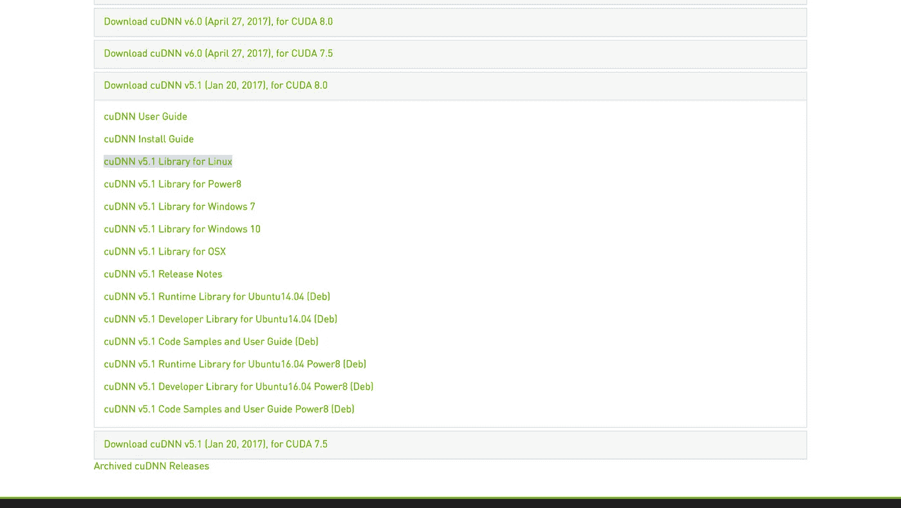

NVIDIA — cuDNN v5.1

运行这些命令进入下载归档文件的目录(在我的例子中是`~/Downloads`)并将它上传到您的服务器:

```
$ cd ~/Downloads/
$ scp -i ~/.ssh/my-ssh-key cudnn-8.0-linux-x64-v5.1.tgz [USERNAME]@[EXTERNAL_IP_ADDRESS]:/tmp
```

一旦成功上传，解压缩 cuDNN 库并将其复制到 CUDA toolkit 目录:

```
$ cd /tmp
$ tar xvzf cudnn-8.0-linux-x64-v5.1.tgz
$ sudo cp -P cuda/include/cudnn.h $CUDA_HOME/include
$ sudo cp -P cuda/lib64/libcudnn* $CUDA_HOME/lib64
$ sudo chmod u+w $CUDA_HOME/include/cudnn.h
$ sudo chmod a+r $CUDA_HOME/lib64/libcudnn*
```

## 访问 Github repos

能够直接从服务器上推/拉你在 Github 上的 repos 比必须先在你的笔记本电脑上同步文件要方便得多。为了启用该工作流，您将向您的 Github 帐户添加一个特定于该服务器的 SSH 密钥。

首先，在服务器上生成一个 SSH 密钥对:

```
$ ssh-keygen -o -a 100 -t ed25519 -f ~/.ssh/id_ed25519 -C steve@drive01
```

当出现提示时，输入密码并为您的密钥选择一个位置。

阅读公钥的内容，并将其复制到您的剪贴板:

```
$ cat ~/.ssh/id_ed25519.pub
```

转到你的 [Github SSH 和 GPG 键设置](https://github.com/settings/keys)，点击“新建 SSH 密钥”，在“标题”部分给你的密钥命名，然后将密钥粘贴到“密钥”部分。


Github — adding a SSH key

添加密钥后，您可以返回到您的服务器。

## 设置 CarND 环境

在您的主目录中创建一个名为`carnd`的新文件夹，并克隆`CarND-Term1-Starter-Kit` [存储库](https://github.com/udacity/CarND-Term1-Starter-Kit):

```
$ mkdir ~/carnd
$ cd ~/carnd
$ git clone git@github.com:udacity/CarND-Term1-Starter-Kit.git
$ cd CarND-Term1-Starter-Kit
```

在创建 conda 环境之前，我们需要对 Udacity 提供的`environment-gpu.yml`文件做一个小的修改。

使用 vim、nano 或任何您最熟悉的文本编辑器，更改以下内容:

```
# environment-gpu.yml
name: carnd-term1
channels:
    - [https://conda.anaconda.org/menpo](https://conda.anaconda.org/menpo)
    - conda-forge
dependencies:
    - python==3.5.2
    - numpy
    - matplotlib
    - jupyter
    - opencv3
    - pillow
    - scikit-learn
    - scikit-image
    - scipy
    - h5py
    - eventlet
    - flask-socketio
    - seaborn
    - pandas
    - ffmpeg
    - imageio=2.1.2
    - pyqt=4.11.4
    - pip:
        - moviepy
        - [**https://storage.googleapis.com/tensorflow/linux/gpu/tensorflow_gpu-0.12.1-cp35-cp35m-linux_x86_64.whl**](https://storage.googleapis.com/tensorflow/linux/gpu/tensorflow_gpu-0.12.1-cp35-cp35m-linux_x86_64.whl)
        - keras==1.2.1
```

变成这样:

```
# environment-gpu.yml
name: carnd-term1
channels:
    - [https://conda.anaconda.org/menpo](https://conda.anaconda.org/menpo)
    - conda-forge
dependencies:
    - python==3.5.2
    - numpy
    - matplotlib
    - jupyter
    - opencv3
    - pillow
    - scikit-learn
    - scikit-image
    - scipy
    - h5py
    - eventlet
    - flask-socketio
    - seaborn
    - pandas
    - ffmpeg
    - imageio=2.1.2
    - pyqt=4.11.4
    - pip:
        - moviepy
        - **tensorflow-gpu==1.2.1**
        - keras==1.2.1
```

这一变化将确保您获得最新版本的 Tensorflow 和 GPU 支持。

您现在可以创建 conda 环境了:

```
$ conda env create -f environment-gpu.yml
```

此命令将提取所有指定的依赖项。可能需要一点时间。

如果它成功创建了环境，您应该会在控制台中看到以下输出:

```
...
Successfully installed backports.weakref-1.0rc1 decorator-4.0.11 keras-1.2.1 markdown-2.6.8 moviepy-0.2.3.2 protobuf-3.3.0 tensorflow-gpu-1.2.1 theano-0.9.0 tqdm-4.11.2
#
# To activate this environment, use:
# > source activate carnd-term1
#
# To deactivate this environment, use:
# > source deactivate carnd-term1
```

是时候尝试你的新安装了！

激活环境:

```
$ source activate carnd-term1
```

在 python shell 中运行这个简短的 TensorFlow 程序:

```
(carnd-term1) $ python
>>> import tensorflow as tf
>>> hello = tf.constant('Hello, TensorFlow!')
>>> sess = tf.Session()
>>> print(sess.run(hello))
b'Hello, TensorFlow!'
```

如果您得到了这个输出，那么恭喜您，您的服务器已经为 Udacity 无人驾驶汽车 Nanodegree 项目做好了准备。

如果您收到错误消息，请参见 Tensorflow 网站上的[本节](https://www.tensorflow.org/install/install_linux#common_installation_problems)了解常见安装问题或在此留下评论。

# 实验室

现在您的服务器已经准备好了，是时候好好利用它了。

我将以 [LeNet 实验室](https://github.com/udacity/CarND-LeNet-Lab/)为例，演示如何使用您的服务器，但这些步骤适用于本课程中任何其他基于 Jupyter 的实验室。

## Jupyter 配置

为了访问您的 Jupyter 笔记本，您需要编辑 Jupyter 配置，以便服务器绑定到所有接口，而不是本地主机。

```
$ jupyter notebook --generate-config
```

该命令将在`~/.jupyter/jupyter_notebook_config.py`生成一个配置文件。

使用文本编辑器，替换此行:

```
#c.NotebookApp.ip = 'localhost'
```

有了这个:

```
c.NotebookApp.ip = '*'
```

下次您启动 Jupyter 笔记本时，内部服务器将在所有接口上绑定，而不是本地主机，从而允许您在浏览器中访问笔记本。

## 启动笔记本

首先，让我们通过从 Github 克隆存储库来检索实验室的内容。

在您的服务器上运行以下命令:

```
$ cd ~/carnd
$ git clone [https://github.com/udacity/CarND-LeNet-Lab.git](https://github.com/udacity/CarND-LeNet-Lab.git)
$ cd CarND-LeNet-Lab/
```

如果您的 conda 环境尚未激活，请立即激活它:

```
$ source activate carnd-term1
```

启动笔记本:

```
(carnd-term1) $ jupyter notebook
```

## 运行实验室

在您的本地计算机上，打开浏览器并转到:

```
http://[EXTERNAL_IP_ADDRESS]:8888
```

如果尚未打开，请单击“LeNet-Lab-Solution.ipynb”启动 LeNet 实验室解决方案笔记本。

运行笔记本中的每个单元格。应该在一分钟左右的时间内在该机器上训练具有解决方案笔记本中给出的超级参数的网络。

Tada！您有一个功能完整的 GPU 实例。

***重要提示:您的服务器是按每分钟计费的，因此在您使用完服务器后，不要忘记将其关闭。请注意，在终止实例之前，您仍然需要支付少量的存储费用(50GB 大约 8 美元/月)。查看*** [***本指南***](https://cloud.google.com/compute/docs/instances/stopping-or-deleting-an-instance) ***了解如何停止或删除实例。***

# 结论

希望这篇指南能让你相信在 Google 云平台上设置一个 GPU 支持的实例和在 AWS 上一样简单。

为了让这个指南尽量简短易懂(我真的努力了！)我掩饰了一些非常重要的话题:

*   服务器安全性:为了提高服务器的安全性，作为基本设置的一部分，应该尽早采取一些配置步骤。
*   应用程序安全性:您的 Jupyter 笔记本目前可以被任何拥有您的服务器 IP 地址的人访问。您可以轻松地更新防火墙规则，只允许来自您自己 IP 的访问，并[更改 Jupyter 配置，要求输入密码并使用 SSL](http://jupyter-notebook.readthedocs.io/en/latest/public_server.html) 。
*   自动化:手工完成所有这些工作显然是非常乏味的，使用配置管理软件或类似 Terraform 的工具来自动化部分(如果不是全部)工作是有意义的。此外，您可以在完全配置好的服务器上创建一个映像，或者至少创建一个快照，这样就可以避免下次启动实例时从头开始。

我希望你喜欢它，如果你有任何问题或意见，请使用下面的评论部分或直接给我发电子邮件联系。