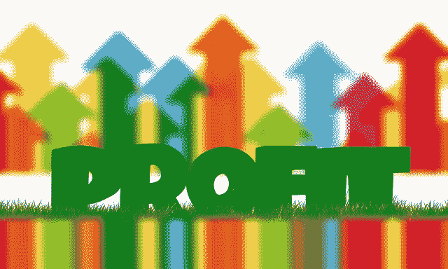

# 在考虑规模之前，先从 MVP 中吸取教训

> 原文：<https://medium.com/hackernoon/learn-your-lessons-from-mvp-before-thinking-about-scale-84554a36f7d8>

Dream Big. Start Small.

在过去的几年里，我一直在和很多初创企业的创始人约会，看看我是否能在产品管理或技术领域成为他们的合伙人。

在我与我遇到的每一位企业家的交谈中，我发现他们对 MVP 的理解非常扭曲。归咎于互联网，因为那些对软件产品开发毫无头绪的人或那些在 BS 的大公司世界里偷懒的人编写了大量半生不熟的资源。阅读这些，并尝试把它放入你的创业中——你肯定会被诅咒的！对你读的东西要有选择性。在你阅读一些东西之前，一定要知道它的作者和他的背景，看看这篇文章是否值得你花时间。在你读完之后，别忘了看看它是否符合你的语境。因为，是环境决定了该做什么和不该做什么。

也就是说，对于任何初创公司来说，确实有一些事情是绝对不能做的，如果你和我一样，认为创建一家初创公司的明智方式是消除风险。MVP(最小可行产品)的目标就是消除风险。

不幸的是，说起来容易做起来难。让我引用两位初创企业创始人亚当和夏娃在寻找企业首席技术官时与我分享的观点:

> ***创始人亚当:*** 我有一个绝妙的主意，就像零售业的优步。我希望有人谁可以建立一个有趣的功能负载 MVP，扩展到数百万用户。你有这种能力吗？
> 
> ***Eve 创始人:*** 我一直想创办一家公司，并且一直在为实现我的想法做功课。我决定采用这种独特的想法，因为这个领域的初创企业非常少，而且它们并不真正繁荣。我想要一个既能管理产品又能掌握技术的人，这样我就可以专注于筹集资金和向企业销售产品。在技术方面的事情，这将是伟大的，如果他(她)在用户界面，UX，PHP 和 esp 的专家知识。挖掘大量数据的大数据方面。你有这种能力吗？

在创始人亚当的例子中，他谈论的是 MVP 和大量特性的并列。似乎这还不够，他疯狂地希望自己的产品从上线的第一天起就可以扩展到数百万用户。在创始人伊芙的例子中，她谈论的是打造一款并非真正独一无二的产品，因为事实上，已经有一些初创公司几年来似乎很难获得牵引力。

在所有这些情况下，我试图通过分享我的一些成功和许多失败的经历来礼貌地教育他们他们的无知。不屈服于诱惑是值得的。

# 梦想远大。从小处着手。

在《创业大冒险》中，你会经常看到我鹦鹉学舌般地重复下面这句话:

> “要有足够的勇气去大胆梦想。别忘了要足够聪明，从小处着手”。

首先建立你的产品的原型，看看它在第一时间是否有吸引力，更不用说接受者了。在构建产品的过程中，有许多经验教训等待我们去发现。咒语是“建造。测量。学”。建立一个你认为能解决或减轻终端消费者问题的最重要的解决方案增量。当你衡量结果时，你应该揭露你的无知，并吸取一些教训。有了新的理解，你可以着手修补你的产品作为下一个增量。再次测量吸收新的教训。回去把你的经验转化成产品。当你重复这个循环时，你就获得了幸福(一个真正问题的真正解决方案)。现在，你可以在建立客户群的同时解决规模问题。

为了让你更好地理解精益创业的概念，我不会告诉你该做什么，而是告诉你我做了什么。我读了两本书，埃里克·里斯的《精益创业》(The Lean Startup)和阿什·莫利亚(Ash Maurya)的《精益运营》(Running Lean)以及其他杰出领袖的大量文章。我甚至参加了由 Ash Maurya 主持的[运行精益研讨会，并强烈推荐给任何对构建软件产品的精益启动方式感兴趣的人。](https://leanstack.com/workshops/)

*像往常一样，如果你喜欢，别忘了鼓掌并分享这篇文章。不用说，我洗耳恭听你对这个问题的经验和想法。*