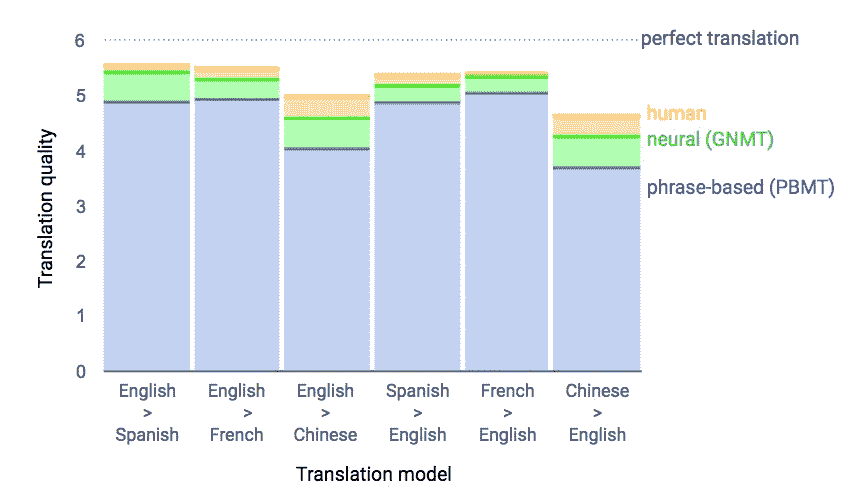
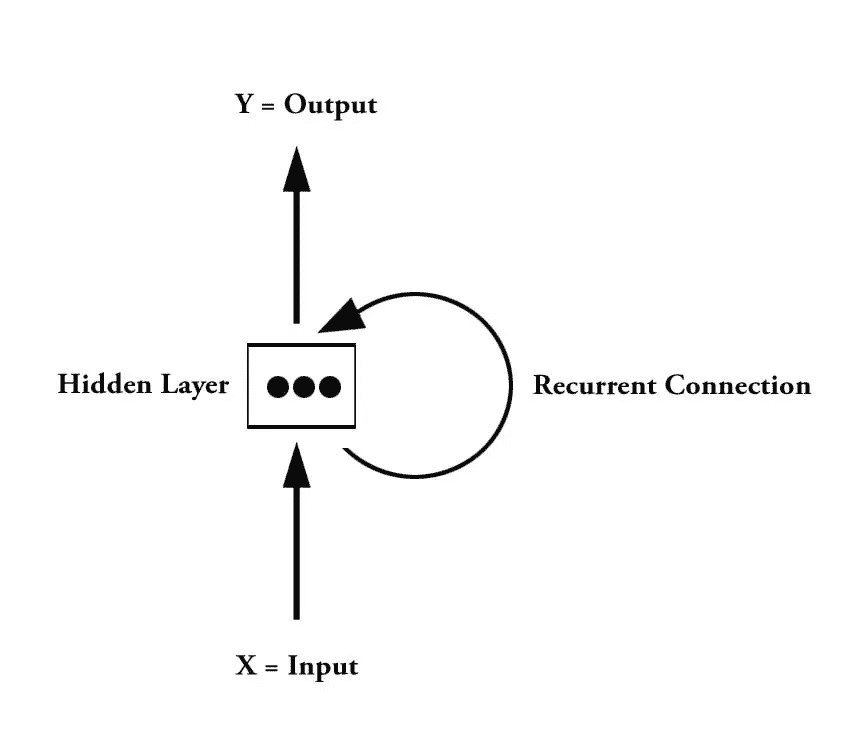
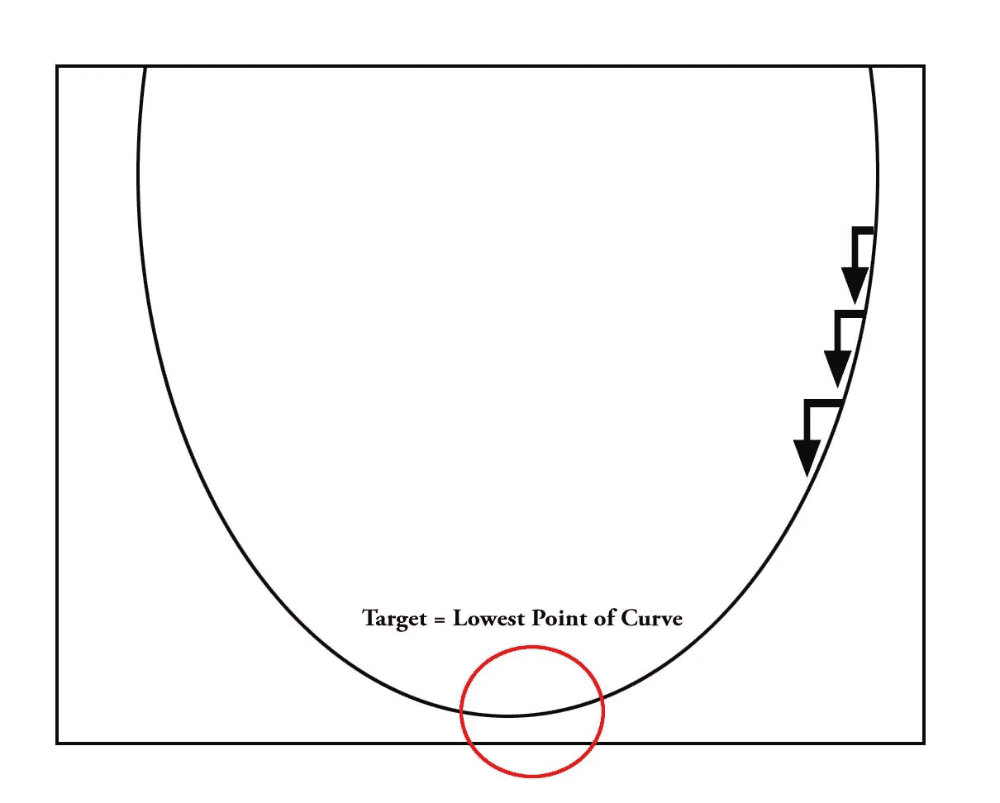
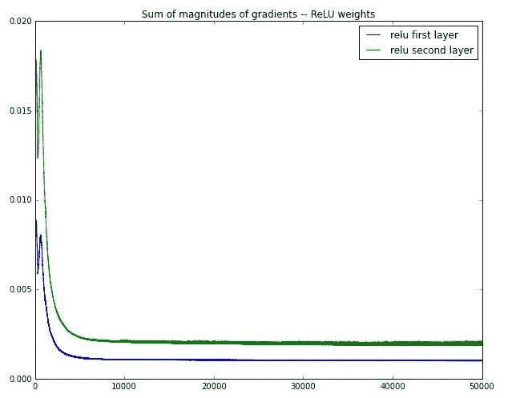
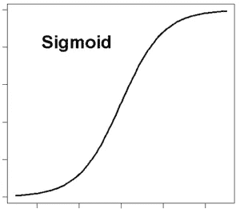
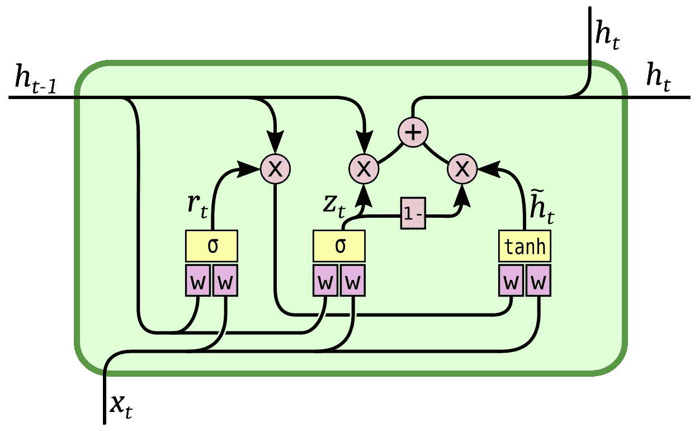
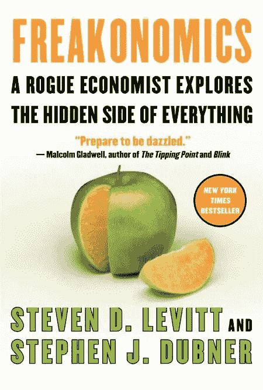
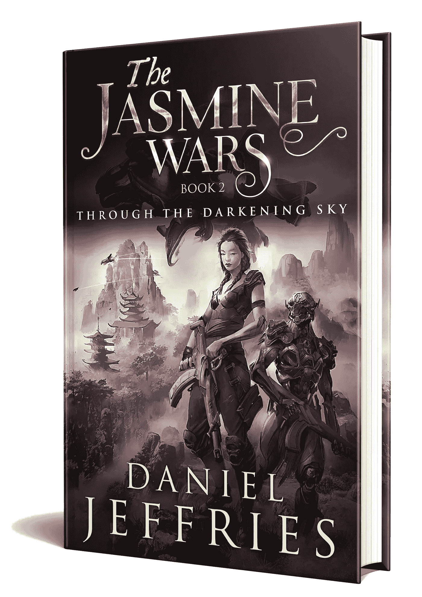

# 数学不好就学人工智能——P7——自然语言处理的魔力

> 原文：<https://medium.com/hackernoon/learning-ai-if-you-suck-at-math-p7-the-magic-of-natural-language-processing-f3819a689386>


在本系列的第五部分中发现了卷积神经网络对于图像识别的惊人能力之后，我决定先进入自然语言处理的 T2 领域。(如果你错过了之前的文章，一定要去看看: [1](https://hackernoon.com/learning-ai-if-you-suck-at-math-8bdfb4b79037#.wb9byq3o3) 、 [2](https://hackernoon.com/learning-ai-if-you-suck-at-math-part-two-practical-projects-47d7a1e4e21f#.x87xwbgx0) 、 [3](https://hackernoon.com/learning-ai-if-you-suck-at-math-p3-building-an-ai-dream-machine-or-budget-friendly-special-d5a3023140ef#.9xzlb0cee) 、 [4](https://hackernoon.com/learning-ai-if-you-suck-at-math-p4-tensors-illustrated-with-cats-27f0002c9b32#.g606budcf) 、 [5](https://hackernoon.com/learning-ai-if-you-suck-at-math-p5-deep-learning-and-convolutional-neural-nets-in-plain-english-cda79679bbe3#.xjah79lsd) 、 [6](https://hackernoon.com/learning-ai-if-you-suck-at-math-p6-math-notation-made-easy-1277d76a1fe5) 。)

这个机器学习研究的温床教会计算机理解人们如何交谈。当你问 Siri 或谷歌助手一个问题时，是自然语言处理推动了对话。当然，作为一名小说和文章的作者，对我来说，从事语言工作似乎是显而易见的下一步。

我可能数学很差，但文字是我的专长！

因此，我开始探索 NLP 能给我在自己擅长的领域带来什么样的见解。


Behold the Bard!

我有很多问题。NLP 发现了写令人心痛的诗的秘密吗？人工智能能比吟游诗人 T21 更会转短语吗？他们能阐明写作的秘密吗？

幸运的是，我有一个合适的项目来测试 NLP 的极限。我正在为我史诗般的科幻小说《茉莉花战争》中的第二本书命名，但我一直在努力寻找一个完美的书名。所以我想知道:

**如果我能给一个神经网络输入有史以来最伟大的头衔，让它为这个时代传递一个头衔，会怎么样？**

这不是我第一次涉足计算机辅助标题生成。在互联网上有[许多随机的标题生成器](http://www.fantasynamegenerators.com/book-title-generator.php#.WL9Yyn9uNOI) [，我不时地尝试过](http://www.kitt.net/php/title.php)。

坦率地说，他们不是很好。

他们是那种你可以玩几分钟然后继续前进的玩具。它们的工作方式是随机地将单词拼在一起，或者重复一些基本的排列，比如“第 _______ 对第 _ _ _ _ _ _ _ _ _ _”我非常怀疑是否有一个作者真的从这些引擎产生的原始单词“汤”中选择了他或她的书名。

把单词扔进帽子里，摇一摇，再拿出来，不会让你走得很远。一百万只猴子在键盘上随意打字可能会在一百万年后成为莎士比亚，但我没有那么多时间。

AI 来救援了！

# 窥视时间深处的网络

正如我们在[第五部分](https://hackernoon.com/learning-ai-if-you-suck-at-math-p5-deep-learning-and-convolutional-neural-nets-in-plain-english-cda79679bbe3#.7ci7zh7v3)中了解到的，神经网络拥有惊人的能力，因为它们进行*自动特征提取*。我们不能告诉机器我们驾驶汽车的所有步骤，但我们可以让它自己算出来！

作为一名作家，我使用各种技巧来吸引人们的注意力，但试图将这些归结为一套规则实际上是不可能的。它远远超出了对名词、动词和形容词的简单理解。语言是有节奏的。话语能在你的脑海中激起炽热的图像。它们会让你激动不已，让你泪流满面，或者让你因期待而颤抖。他们创造声音和愤怒，运动和感觉。

机器能做所有这些吗？

我是自动化的砧板上的肉吗？

AI 会让作家在未来变得多余吗？

为了找到答案，我首先需要弄清楚我需要什么样的神经网络(NN)。神经网络对他们试图解决的问题非常具体。人类可能拥有[通用学习算法](http://amzn.to/2nD9Mg2)，但我们肯定还不知道它。目前的技术水平集中在“狭义人工智能”上，每个神经网络在一些事情上做得很好，而在另一些事情上做得很差。

**那么，什么样的神经网络能帮助我们理解语言呢？**

**自然语言处理背后的主导力量无疑是递归神经网络(RNN)，特别是长短期记忆(LSTM)神经网络。**

所以让我们来看看这些，看看它们是否能帮我解开大片标题创作的秘密。

# **递归神经网络的魔力**

不可避免地，当你开始研究 RNN 的时候，你会发现 OpenAI 研究员 Andrej Karpahy 的博客“[循环神经网络的不合理有效性](http://karpathy.github.io/2015/05/21/rnn-effectiveness/)光是标题就让我充满了巨大的希望。

这些惊人的系统到底有多有效？

如果标题没有打动我，第一行肯定打动了我:

“递归神经网络有什么神奇之处？”

神奇！

我知道一个梦幻般的标题不会太远，它的超自然力量已经在矩阵的隐藏深处旋转。

那么是什么让 RNN 的“神奇？”首先，他们特别擅长预测未来。


当你买股票或在机场接人时，你是在猜测未来。一名棒球运动员试图接住一个高飞球，他必须预测球的弧线，并跳到球将要接住的地方。

我们无时无刻不在做预测，不管是在大城市的车流中穿梭还是在开车。

其他车会撞上你吗？

有人闯入你的车道了吗？

你的朋友会在机场哪里等你？

**我们不断尝试预测接下来会发生什么，并提前做出反应，所以我们已经准备好了。RNN 通过分析时间序列数据做了同样的事情。**

他们可以向前看，不像大多数其他 NN，他们也可以向后看。他们对过去的事情有“记忆”。他们可以看到火箭或股票价格变动的轨迹，并预测买入或卖出。当谈到自动驾驶汽车时，它们可以预测轨迹和弧线，这意味着它们可以帮助防止事故(正如你在特斯拉撞车前发出警告的镜头中看到的那样)或何时驶离匝道。

他们还擅长处理任意长度的序列。这是独一无二的，因为大多数神经网络只能接受固定大小的向量/张量，并输出固定大小的向量。有了卷积神经网络，我们必须将我们的图像变换成某种形状才能使它们工作。但是短信不行。你不能把一本小说或整个维基百科塞进一个放之四海而皆准的盒子里。这种灵活性使 RNNs 非常适合 NLP，它包含了从[机器翻译](https://www.nytimes.com/2016/12/14/magazine/the-great-ai-awakening.html)到[情感分析](http://text-processing.com/demo/sentiment/)到[谷歌](https://assistant.google.com/) ' [s Pixel AI](https://assistant.google.com/) 理解你的问题的一切。

这甚至给了 RNN 一定程度的“创造力”查看[这篇关于用 RNNs](http://www.hexahedria.com/2015/08/03/composing-music-with-recurrent-neural-networks/) 生成音乐的文章。该系统在一系列音乐序列上接受训练，并通过预测可能的下一个序列来“制作”音乐。

RNNs 还能做什么？

如果我们在做情感分析，也就是试图弄清楚人们对某件事的感觉是好是坏，那么我们可以输入电影评论，让它输出一个从喜欢(1)到讨厌(-1)的二进制分类分数。


你也可以给它一个*单输入*并让它输出一系列*输出*。例如，我们可以向网络提供一个图像(单个输入)，并让它生成图像的文本摘要(一系列输出)。[看看这篇文章，它展示了注册护士是如何看图片和做总结的，比如“男孩在尾波板上做后空翻”](http://cs.stanford.edu/people/karpathy/deepimagesent/)

该系统定位物体，并试图创造一个句子，就像我们看到的这个女孩打网球。


我们也可以将一个*序列输入到向量网络，称为编码器*，并输出相反的序列，称为解码器。



这对于机器翻译来说很有用([从《机器学习很有趣》的这篇精彩文章中可以看出](/@ageitgey/machine-learning-is-fun-part-5-language-translation-with-deep-learning-and-the-magic-of-sequences-2ace0acca0aa))。[谷歌最近使用 RNNs 来改造他们的谷歌翻译系统](https://www.nytimes.com/2016/12/14/magazine/the-great-ai-awakening.html?_r=0)，使其摆脱了以前版本的官样文章翻译，提供了人类水平的翻译能力。2017 年 4 月 11 日，[谷歌终于开源了他们翻译引擎背后的模型，称为 tf-seq2seq](https://research.googleblog.com/2017/04/introducing-tf-seq2seq-open-source.html?m=1) (不是最好的营销名称，但嘿，我们要了。)基本上，我们所做的是用原始文本*和*训练网络，这是另一种语言的专业翻译文本(输入和输出)，然后用它来帮助机器翻译它从未见过的新文档。

但是为了我们的目的，我们需要 RNN 的一个非常具体的特征:

他们非常擅长生成文本。

这也是卡波西的“神奇的 RNN”博客的内容，也是让我感兴趣的原因。

让我们快速浏览一下 RNN 的作品，然后跳到我是如何试图用它们来创作我的下一部伟大的美国小说。

# 一次次

递归网络看起来很像前馈神经网络，除了它们也有向后指向*的连接。如果我们观察一个简单的单神经元 RNN，我们可以看到它在特定的时间点接收输入 X，我们称之为“帧”，以及来自前一步骤 Y(t-1)的输出。*



网络实际上是时间上的一系列步骤。每一步都被称为一帧，这不是巧合，因为它就像电影中的帧。我们通过时间“展开网络”，就像我们在银幕上播放电影一样。


时间用“t”来表示。当前时刻就是我们在中间画面看到的“t”。前一步是“t-1”(左图)，迈向未来的一步是“t+1”(右图)。中间的 s 是隐藏状态，因此“s”代表状态。它是细胞的记忆。在纯前馈网络中，输入仅仅是前面节点的加权输出。在 RNN 中，这还包括来自前一时间步的加权输出*。换句话说，就像我们之前说的，它可以*回顾过去*，并且可以尝试预测未来的步骤*。**

# 发展长期记忆

基本的 rnn 有一些挑战。普通老 RNN 的主要挑战之一是，如果网络太深，它很容易开始“忘记”时间序列早期的信息。

为什么这是一个问题？

好吧，让我们假设你有一个 RNN 正在对股票新闻进行情绪分析，希望根据公众是看涨还是看跌一支股票来生成买入或卖出信号。一个股票博主可能会在第一句话就告诉你卖出，然后在文章的其余部分赞美股票的未来买入潜力，一旦它有几周时间从今天损害股票的任何消息中恢复过来。系统可能会忘记“卖出”部分，并基于故事后面的积极情绪宣布它为强烈的“买入”。

他们也很难学习更长的依赖关系，即使是更短的序列。这在 NLP 中成为一个严重的问题，因为句子的意思并不总是紧密地聚集在一起。

大多数人不会造出让他们小学语法老师骄傲的句子。相反，他们把意思分散在整个句子中。他们使用古怪的语法和俚语。对人类来说，这不成问题。我们有非凡的能力去理解那些被抬高的句子。错误的修饰语、遗漏的单词、错别字和悬空的分词不会减慢我们的速度，但它们确实会使机器出错。

例如，如果我说“穿蓝色西装和戴白色帽子的人演奏了一首精彩的爵士乐独奏”，句子的重点不是这个人穿什么，这接近句子的主题，而是他演奏了一首精彩的爵士乐独奏。如果系统在播放音乐时忘记了这些信息，那么它就错过了要点。

这就是所谓的[消失梯度问题，斯坦福大学令人敬畏的深度学习和 NLP 课程对此进行了深入研究](https://cs224d.stanford.edu/notebooks/vanishing_grad_example.html)。

但是我会帮你省去很多阅读，在这里给你一个快速的总结。要理解消失渐变，你需要了解一点反向传播。在[第五部分](https://hackernoon.com/learning-ai-if-you-suck-at-math-p5-deep-learning-and-convolutional-neural-nets-in-plain-english-cda79679bbe3#.viug9k8sh)中，我们讨论了反向传播如何通过在误差版图上的最低点*来最小化误差。这有助于神经网络调整其权重，以便能够进入下一个训练时期。在 3D 中看起来是这样的:*


在某些方面，2D 更容易理解，所以让我们看看:



这个系统正在一小步一小步地努力，试图找到曲线的底部。现在，当你有一个清晰的误差环境和一条定义良好的曲线时，这一切都很好。但是如果曲线严重变平了呢？让我们来看看。



Courtesy of the Stanford Deep NLP course

当直线变平时，我们称神经元“饱和”。他们非但没有激活和发现有用的数据，反而实际上已经死了。更糟糕的是，它们会对之前的神经元产生指数级的负面影响。记住，神经网络是矩阵，它实际上只是类固醇的电子表格。在一长串方程式中，一个储存格会加入或乘以下一个储存格。


顺便说一句，如果你还在纠结于矩阵数学，我很喜欢这本叫做《线性代数漫画指南》的动漫书。

日本人只是拥有更好的教学工具。如果我在学校有这本书，我可能会更喜欢它。

回到数学上来！

还记得我们在数学符号上的[第六部分中的 dot 产品形象吗？](https://hackernoon.com/learning-ai-if-you-suck-at-math-p6-math-notation-made-easy-1277d76a1fe5)


现在想象所有这些数字都是零或者几乎是零。计算链会发生什么变化？

当某个神经元的值为小数字时，相乘会导致*梯度值快速按指数缩小，这将快速驱动链中的所有神经元趋近于零*。这意味着它们实际上已经关闭 ***，什么也不做*** 。它们就像电视屏幕上的死像素，不再有用。网络越深，这个问题就越严重。

多年来出现了许多解决这个问题的办法。第一种是使用 RELU 激活函数代替 Tanh 或 Sigmoid 激活函数。

原因何在？只要看看 Sigmoid 曲线就能明白。



注意到它的底部和顶部有很好的曲线边缘了吗？当我们在画一张脸或一座桥的拱时，我们希望有这样的曲线，但这条曲线的底部是当梯度消失时绝望的斜率。

现在，我们来看看 RELU 与 Sigmoid 的可视化对比:


注意那个硬角度！RELU 函数给出的常数是 0 或 1，可以看出它的形状很硬，边缘没有软斜率，所以不太可能出现消失问题。

但有更好的解决方法。我们来看看。

# 进入巨龙

消失梯度问题的真正答案不是改变常规 RNN 上的激活。

**现在要切换到更流行的** [**长短期记忆(LSTM)，最早在 1997 年勾画出**](http://bioinf.jku.at/publications/older/2604.pdf) **或** [**门控循环网络(GRUs)，2014 年勾画出**](https://arxiv.org/pdf/1412.3555.pdf) **。**

这两种架构的设计都考虑到了渐变消失。他们还打算寻找长期的依赖关系。实际上，常规的 rnn 已经很少使用了，而 gru 和 LSTMs 在这个领域占主导地位。

LSTM 这个名字乍一看可能会很奇怪，但是当你考虑到这个网络正在做什么的时候就不会觉得奇怪了。本质上，LSTM 是一个黑盒存储单元，看起来像标准的 RNN 存储单元，但实际上它在两个向量中保持双重状态，一个长期状态和一个短期状态。

[这是我在深度学习 4 J 团队](https://deeplearning4j.org/lstm.html)的朋友给我的一张 LSTM 的插图。


顺便说一下，我读过的关于这个主题(以及神经网络/深度学习)的绝对最好的书之一是刚刚发布的 [**用 Scikit-Learn 和 Tensorflow**](http://amzn.to/2p5t4Ll) 进行机器学习的实践。我看了一些早期的版本，他们真的提升了我的游戏。不要等，尽快抓住它。太棒了。它比我这里的要详细得多，但是我会给你一些基本的东西，让你快速地朝着正确的方向前进。


你可以看到信息通过一系列的“门”沿着两条线传播最上面的线叫做“忘记线”以我的拙见，这是一个非常糟糕的术语，但我没有命名它，所以不要怪我。我们就顺其自然吧。

**“忘记线”记住长期状态。**

当*网络展开*时，它将*向前复制*到*新单元*中。其实也不是完全可笑的名字。

它被称为遗忘线，因为它在运行过程中会丢失一些信息。

**其他行包含短期联想和记忆，然后合并到“遗忘”行中。**

在每一个时间点，一些记忆从窗口消失，一些记忆被加入。

GRU 基本上是 LSTMs 的简化形式。看看这张来自 Jacob Kvita 的 GRU 棒极了的图，他是一名计算机科学的学生，也是前红帽匠，他为自己的论文制作了这张图。



有什么区别？

**GRU 细胞将长期记忆和短期记忆合并成一个单一的向量。**

为什么这么做？简单。性能。它的计算成本更低，而且不知何故似乎表现得也一样好。这是一个胜利！

它也只使用一个单一的“门”用于短期和长期记忆。最后，它添加了一种新的门来决定向下一层显示什么。

# **机器里的猴子**

好的。这一切都很好，丹，但是我如何从中生成文本呢？

好问题。

卡帕西的帖子展示了一个“性格”层面的 RNN。字符级模型试图在逐个字符的基础上理解语言。

它是怎么做到的？

所有神经网络本质上都是复杂的*预测引擎*。所以我们给系统输入数百万个单词，它将这些单词存储为字符序列。然后它开始预测下一个字符可能是什么。一旦它学会了预测什么，我们就可以让系统为我们变戏法，比如基于给它输入一组“种子”单词来生成样本文本。以上都是理论上的，我们来看一个简单的例子。

首先，我们假设系统只学习了几个单词:

*   嘿
*   你好
*   帮助
*   我
*   在那里
*   需要

我们也教它一些标点符号，比如“.”还有“！”

请记住，虽然我们简单的 RNN 还没有学会完整的单词。它只学习了一系列的字符，所以它不把“你好”理解为一个完整的自我包含的实体，而是知道 h-e-l-l-o。它知道“e”跟在“h”后面，以此类推。

现在想象一下，我向系统展示了一百万个句子的变体，我可以从我教机器的几个词汇中构建它们。这些句子可能是这样的:

*   嘿，你好。你好！
*   你好！救命啊！
*   救命啊！
*   救命啊。

然后，我在引擎中植入了这样一句话:

*   “我需要他”

请注意，我没有写出我想让它猜的完整单词。

然后，系统会查看其黑盒内部，并尝试预测下一个可能的字符。在这种情况下，它可能是“你好”中的“l”，也可能是“嘿”中的“y”，或者是“帮助”中的“l”

如果网络训练得当，我们希望它选择“l”并最终选择“p”来表示“帮助”，因为这是少数几个有意义的结构之一。

[**我们可以在 Keras 实例 Github**](https://github.com/fchollet/keras/blob/master/examples/lstm_text_generation.py) **中找到一个人物级别的 RNN 实现。**

它是在一个大约 10 万字的尼采语料库上训练的。该示例建议我们使用至少一百万个单词来使系统更加健壮。

[我决定给我的角色 RNN 一个数据集，这个数据集是我花了几天时间手工创建的](https://github.com/the-laughing-monkey/learning-ai-if-you-suck-at-math/blob/master/Deep%20Learning%20Examples/GreatBookTitles.txt)，你可以在我的 Github 上找到它。我通过梳理我的记忆、书架和无数的 100 强名单，输入了每一部伟大的小说的标题。

不幸的是，我很快用完了伟大的书名。

一种选择是通过下载图书馆目录，尽可能多的给它提供书目，但是我想把重点放在真正突出的书目上，而不是用任何旧的垃圾来堵塞它。为了扩充它，我继续寻找伟大的电影名，然后是伟大的歌曲和乐队名。

然而，当我完成时，我只剩下价值 26K 的单词，这使得该系统特别不可靠。但我还是决定试一试。那么效果如何呢？以下是几个结果。

```
tha ect are doga9t byta go thanwel pt year benc
```

一点也不神奇。

即使在训练了这个系统许多、许多、许多个时代之后，它仍然很糟糕。我一夜之间将系统运行了 7000 次迭代。它仍然产生垃圾。

在这一点上，我不知道这只是我给它的小数据集还是 RNN 本身。我没有强行调整系统，而是决定在花了五个晚上无休止地调整系统之前，看看我是否能找到这个问题的答案。当我对失败的原因感到困惑时，我回到了卡帕西的博客，找到了一个潜在的答案。

卡帕西用莎士比亚来训练他的角色等级生成器，让机器吃掉更多的文本。以下是他文章中的一个例子:

`“PANDARUS: Alas, I think he shall be come approached and the day When little srain would be attain'd into being never fed, And who is but a chain and subjects of his death, I should not sleep.`

`Second Senator: They are away this miseries, produced upon my soul, Breaking and strongly should be buried, when I perish The earth and thoughts of many states.”`

他特别兴奋的是，该系统似乎正在生成这样的文本，即*看起来像莎士比亚*，至少第一眼看上去是这样。

它的格式就像一部戏剧。有对话。有角色名字。它甚至有点像吟游诗人说的“唉”

在某些方面，这真的令人惊讶。记住系统对英语一窍不通。它没有上下文。它对动词、字符或对话一无所知。它通过搜索模式并输出相似的模式来学习。

然而，作为一名作家，我发现自己不像卡帕西那样迷恋这种产出。

虽然这个系统模仿了一个剧本的基本格式，但我不认为这是一个壮举。在 20 世纪 80 年代，我们有能够为编剧自动格式化剧本的愚蠢系统。我注意到的最大的事情是，系统产生了格式良好的乱码，但这绝对没有任何意义。它产生单词，但单词加在一起等于零。这些句子毫无意义。

基本上，它检测到一个模式，但不是一个非常有用的模式。我想让它学习诗歌，它学会如何表现得像一个聪明版的[编剧专业版](https://www.writersstore.com/movie-magic-screenwriter-screenwriting-software/)。

但是我没有失去希望！

凭直觉，我认识到试图在角色层面训练这些系统是没有意义的。

为什么要让系统如此努力地去预测下一个字符应该是什么，以便形成一些单词的外观呢？

请注意，即使在莎士比亚的输出中，它有时也会产生像“srain”这样的无意义的单词，这意味着即使经过数小时的训练，它仍在努力避免幼儿园水平的错误。我想知道研究人员是否像我一样意识到，在“单词”甚至“句子”级别训练系统更有意义。换句话说，不是学习“h-e-l-l-o”，而是在“hello”上训练它。

事实证明他们做到了。

我发现了[RNN 这个基本角色的修改，把它变成了一个单词级别的怪物](https://github.com/hunkim/word-rnn-tensorflow)。该系统还引入了 LSTM 和格鲁什更先进的概念。厉害！现在，该系统可以学习整个单词，而不是字母。

自从我三个月前开始写这篇文章以来，已经有几十个单词级 RNN 系统，这证明了这个领域的发展有多快。我有一些其他的工作要优先考虑，一些早期的学习人工智能的文章如果排在第一位似乎更合适，所以我把这篇文章放在一边。现在我回来找一个[号不同版本](https://github.com/vlraik/word-level-rnn-keras)的[字级 RNNs](https://github.com/deepanwayx/char-and-word-rnn-keras) 给[你来玩](https://github.com/vlraik/word-level-rnn-keras)和[测试出](https://github.com/pytorch/examples/tree/master/word_language_model)。太棒了。

那么成功了吗？这里是在训练系统数千次后的一些输出，再次记住我的数据集离理想的大小还很远。

```
Play Go The Wide Virgin Me is Teen Scream I, Masque and a Champions The For Is with Myself Tears, the Tropic of the Looking Ugly The Journey of to Big Empire The Red What Adventures The Naked Nails Dirty What's West Twenty Mask in the End of Earth As Dance to the Atlantis Was Be If Even In Me Paradiso Crime Smokestack Mojo Jest The Carpenter The Nightmare of Heights The Golden Twenty House So 1/2 Hand in the Drugs were God The Snows and the Rain Cat Things We Thank My Knew L.A. Did Deep The Goblet in Steal: The an These Along the Bonfire The End of Quarter Halloween Madonna Mote Killshot Way of the River Torturer The Inc. Rex The Anvil of Imagination were Sabbath Wild Morning Angry Mice The Thin Street Tangled Got In Want Pretty a Turning of the Beethoven not Salem's Atuan Break, Lost Red Charlotte's Drummer Giving Ship A Susie On Mars The Night Don't Still Crash Spy In the Ritz The Goblet of Heaven The Cure Good Cosmos The Time's Brigade this Dreams Can't Folsom Dove You Jumping Hide Come is a City Wars in the Taming In Like for the MindAll Above Terra Doom Things Rehab Exit You Lays Heat The Devil Outrageous Cry Clash Place The Ashes Men Side The Toyshop The Velvet in the Red A Road Without Little Red Of Door Comedy Undery Me a Gods The Eden and the Black Badge In Stop the Wall and the Night 96 Captain! Street to Time on the Earth of Bees Steel Why to Empty Got I Want Myself Rolling Iron in Everything Songs Oh, Be nd Folsom A Grifters The Game The Secret Fountainhead The River Nine Germs Nights for Me Are Know You Wear Miles in on Stuff Up Vanity Sleep The Clash A Empire A Lost in a Sex Machine Wake Dazed What Steel Steal: for Chocolate Secret Planet Moment Purple Red Snow Some Are Dark, Me You a Row Suspicious Detective Surrender Will Hound Delicatessen None The Cathedral of Empires What Mary Going Big Whom need by this The Dancer Up Summer Nine Kill Night Fight Dog Cross and the Bob World California I 101 Suede Drummer Book Pyscho Prophet Eye of the River Men Man I War Be Eyed Be Video Dream See Samurai The Widening Baby The Standing Express Untrodden The Man of the
```

它输出了一大块文本，有点难以处理，所以我写了一个小脚本，将它分割成 2 到 7 个单词的句子，这大约是一个好标题的长度。大多数好的标题实际上都在四个字的范围内。

这给了我一些好的结果，我保存到一个文件中，丢弃了明显的乱码。

```
Sleepless in CryptonomiconThe Sun Rope
Delicatessen in the Jungle
Daisy the Cloudy Shoplifters
Waiting for a Glass Full
Blood Agency
The China Proposal
Beloved Mayor of Horton
Walking China
The Metropolis Jacket
The Steel Beowulf
Magnolias Dawn, Little Prarie Sun
Fried Castle Blind
Sense of Disobedience
The Meatballs Dune
China Hooker Tomatoes
Of Slave Blood
In the Usual House
Trial Fried CastleWhy Eternity Glass
The Lovely Wide Evil
The Bright Gene
The Infinity Half
The Lathe of Dr Dispossessed
To Murder Proud
The Sick Archbishop
Gun Man Blue
In the Silence
The Radio Who Dragons Through
Glory of the Dead
A Golden Geisha
The Sand Woods
Gates of Cholera
A Right Good Dawn
A Rosetta Ruby
New Tide Sky
The Fire Plan
Man to Barbarism
The Deception NeedleThe River Break
The Secret Electric Manifesto
City of Lost Faces
Jude the Key
Mystic Germs
The Roman Woods
Gold Sweet Death
The Brand Morgue
Sweet Dreams Piano
Loving Shanghai
End of Lolita Childhood
Cold Geisha
The Last Baby
Good Journey into the Light
The Door Song
Song for Want
The Bitter LadyI, Samurai
In Me, Not Get Proud
Mystic Sex
The Death of Walter
Stop Heaven's Sun
One Mystic Cannibal
the Cannibal's Candle
The Secret Red Sky
People of the Fire
Stardust Winter's Love
Johnny Never Gonna Stop
Gone Thunder Rolling
The Metamorphosis Fish
Snowy Spots the Rainbow
The Tabloid BumsThe Invisible Deep
the Deep and Unbearable
Call of Fire
The Cuckoo's Jekyll
The Red Tenderness
The Raven's School
The Memories of God
The Cave Dragon
Jim the SavageSunset Now on Brooklyn
Black Song
I Was Toys
The Snows Creek Came
The Secret Land
The Well
The Last Lies
Lords of the Knife
Inside Physics
The Galaxy of Gone
The Satanic Playlist
The Bloody 9
Freakonmics: A Hard Black DanceStone of Fire
A Road Death
The Feast Baby
Lucifer's Rainbow
A Severed Cage
Of Summertime Glass
Lucky Break in the Night
the knife Man
Prison Rain
The Door to the Cosmos
Solitude in the Frost
The Clockwork Chamber
The Black Queen
Back to the Wind
The Blind Fields
Marathon of Fear
Sophie's Dragons
The First New Madre SoldierJurassic Magnolias
Seattle Siddhartha
The Glass Dawn
The Beloved Metropolis
The Glass Temple
Steel Woods
The House of Inception
The Tao of the Third
Lonesome Winter's Man
Sugar Acid
The Piano Ashes
The Anarchist's Game
The Furious Tenderness
The Red Hallows
Paradise Demons
Demons of Time
Cosmos, I Ride
The Machine King
The King's Blue Grass
The End of Kashmir
The Secret Soldier
Love of Sunshine
The Night of the Rose
Tea House CowgirlsThe Vishnu Indigo
Death of the Stars
In the Red Morning
The Star Queen's Face
River Demons
The Night RunnerThe Charge of Fire
The World of Chocolate Songs
A Purloined Cloud
The Art of Hanging
Ode to the Sleepers
The Gold Inside
Even the Asphalt
Rogue Funeral
Sea of the Red God
```

有些还不错！正如一位朋友所说，它从平庸转向了卓越。有一些很棒的，比如:

*   悬挂的艺术
*   路西法的彩虹
*   红神之海
*   河魔。
*   看不见的深处
*   黑人歌曲
*   上帝的记忆

还有一些像《中国胡克西红柿》这样的喜剧黄金！



你也可以看到，包含像“魔鬼经济学”这样的组合词并不是一个好主意，因为这显然是别人的著名书名，所以只要它出现，如果你真的决定以这种方式命名一本书，你就违反了版权。最好使用通用词汇。虽然我很喜欢《魔鬼经济学:一段艰难的黑舞》，但它可能是史蒂文·d·莱维特的经典原著《T2》的续集。

我对句子级 RNN 有更高的期望，但不幸的是，当我几个月前测试时，我没能找到一套像样的工作代码来测试。我[发现几篇来自中国的论文](https://arxiv.org/pdf/1703.07713.pdf)看起来很有希望。然后，当然，在我休息的时候，有人继续做了一篇关于句子层次分类的博客文章，并附上了代码！在我测试了一些新选择后，我可能会跟进。

# **NLP 和超越**

也就是说，我不确定这些系统产生的东西是否真的比随机单词生成器更好。它相当不错，但是如果你足够仔细地看，你会发现它基本上是一个已经很好的标题的半随机混搭。

如果我对你说实话，我不得不承认我不认为这种类型的系统对于制作莎士比亚作品和书名非常有效，更不用说“不合理地”有效了。这种句子级别生成器主要是一种掩饰 NLP 真正擅长什么的小把戏。

**事实证明，NLP 在更受限的问题集上表现得更好，比如情感分类。**

事实上，你可以从斯坦福大学自然语言处理入门课程的一个讲座中得到一个很好的技术状态分析。它只是稍微有点过时，因为其中一些问题在过去几年里得到了更好的解决，但它仍然是该领域的一个很好的入门。

那么，目前的技术水平如何？以下是视频的分类:

**大部分已解决的任务:**

*   垃圾邮件检测
*   词性标注:(形容词/名词/动词)
*   命名实体识别

进展顺利:

*   情感分析
*   共指消解
*   词义消歧
*   机器翻译

**还真狠:**

*   问题回答
*   反相
*   摘要
*   对话

正如我在我的标题实验中发现的那样，当你让*去做*他们擅长做的事情，而不是*去对抗* it 时，这些系统就会发光。

**所有这些任务有什么共同点？**

从本质上讲，这些系统擅长预测先前理解的序列中的下一个可能的单词。他们还能把一个句子分解成各个组成部分，或者判断出一个句子是肯定句还是否定句。

你想知道有什么好处？

答案很可能就在你的口袋里。或者当你在手机上阅读这篇文章时，你正盯着答案。我说的是谷歌助手或 Siri。

在对数百万小时的人的谈话进行训练后，这些人工智能助手可以采集音频样本，并通过预测最有可能的下一个单词是“help”而不是“halter”，来快速消除混淆的单词。事实上，我发现新的 Pixel 手机，它与最新的谷歌助手捆绑在一起，非常擅长这种任务。当我和它说话时，它很少预测错单词。

更好的是，它似乎理解了我向它提出的许多语义上下文。例如，当我说“给我看看附近的几家好餐馆”时，它知道显示我附近评分高的*餐馆，而不是随机选择的评分低的餐馆。那非常非常酷。*

事实证明，我让我初出茅庐的人工智能 NLP 宝宝做的事情是一个特别难的问题，只是还没有解决。事后看来，作为一个作家，我不难理解为什么。

**当 NLP 实践者专注于将句子分解成最基本的构件时，一个伟大的作家知道写作的力量和意义来自于单词的协同工作，而不是孤立的。**

我希望检测到的真正模式非常非常不同。它们是艺术的素材，比如富有诗意的短语和独特的单词组合。让我们看看几个伟大的标题，看看我的意思。

# **中国妓女西红柿的喧嚣与愤怒**

这里有一个来自玛娅·安杰洛的著名标题。这是我的最爱之一:

1) **我知道笼中鸟为何歌唱**

这是一个令人难以置信的高级标题结构，突出了为什么 NLP 是如此具有挑战性。

首先，这里有非常微妙的机器结构问题。例如，标题脱口而出，但没有明确的原因。它没有使用任何显而易见的文学技巧，像头韵，我们可以很容易地指出。如果我们找不到，机器可能也找不到。

现在，它可以说是使用了一种叫做[咝咝声](https://literarydevices.net/sibilance/)的技术，这要么是 S 音的名声，要么只是用一种低水平的耳语式抑扬顿挫说话，尽管它并没有使用它，因为只有一个 S。咝咝声会产生一种感官或邪恶的感觉。想象一个爱人在你耳边低语或者一条蛇发出嘶嘶声，他们都用 S 来刺激或恐吓你。

实际上，如果[你曾经看过安杰洛说话](https://www.youtube.com/watch?v=ePodNjrVSsk)，她使用了大量的咝咝声，所以也许当我读它的时候，我只是在脑海中听到她的声音？这让我想到了机器翻译的第二个主要问题:

自然语言处理系统只能从文本本身直接包含的 T4 中理解意思。

不幸的是，对于大师们来说，交流并不存在于真空中。

这个标题的真正力量来自于*不是来自于页面上的*而是 [*什么* *感觉* *和它在读者心中产生的联想*](https://en.wikipedia.org/wiki/Philosophy_of_language) 。

我们把自己的想法、生活经历和感受带到我们阅读的所有东西中。没有这种背景，机器就无法理解让这个标题不可思议的高阶理解。

比如*一只鸟天生会飞*。那是它的*首要目的*。然而，这只鸟被限制了它的设计用途*。它被剥夺了生存的理由，所以它在绝望和狂热中歌唱。它歌唱是因为它想要自由，想要翱翔，想要像鸟儿一样看世界，所以这个标题充满了悲伤。当然，如果你知道作者的历史和她自己生活中的悲剧，你就会明白她为什么选择它作为自传的标题。*

*这是无法通过使用聚类检测算法解决的问题。它来自于你的联想理解。*

*但是并没有失去一切！*

*让我们看看另一个伟大的标题，看看我们是否能从眼前的事物中获得更多的意义。*

*2) **善恶花园的午夜***

*这个标题对于基础算法来说更容易理解。它有几个明显的诗歌技巧，如头韵，这是像“g”一样的辅音的重复。因为它有实际的头韵，而不是只有相关的头韵，系统应该能够拾取这种模式。*

*它也有我所说的“对立统一”你往往会在著名的标题中找到这种动态的并列关系，如“冰之歌****火之歌】、**或“**漂亮的**小**怪物”、**甚至历史事件如、**玫瑰**的**战争**。鲜花和毁灭并不是精确的对立物，但一个很容易被认为有积极的情绪(玫瑰)和另一个消极的情绪(战争)。一些伟大的作品就是建立在这个原则上的，比如战争、和平。***

***它还使用了像“午夜”和“花园”这样令人回味和感伤的词语。这些文字在读者的脑海中创造出如画的画面，既恐怖又美丽。可以很容易地设计一个系统来理解这些充满感情色彩的词语，因为营销人员一百年来一直在挑选“有力量的词语”。***

# ***当鸽子哭泣时***

***对于自然语言处理系统来说，歧义是一个很难处理的问题，然而它却是伟大作品的核心，尤其是小说、文学、电影和诗歌！***

***掌握一个基本句子的深层结构是一回事。如果你不幸在小学时经历了造句，你就学会了如何将一个句子分割成各个组成部分。虽然老师、编辑和数学爱好者可能对此感兴趣，但你可能会惊讶地发现，对于作家来说，这是一种普通的老折磨。***

***我讨厌造句！***

***这是因为我和我的作者们都明白，文字的真正力量来自于别处。检测词性是一回事。检测是什么让一句话让一个人的心着火完全是两码事。***

***造句不是作家做的。***

***甚至那句话也不是机器能理解的。基本都是语法不好。然而通过使用它，它迫使你停下来注意它。你必须停顿片刻来处理它，即使这发生在无意识的层面。如果我在我想让你密切关注的一部伟大小说的情节的关键时刻这样做，作为一名读者，你可能更有机会发现它。***

# *****就是这样*****

***好吧，也许我们没有为第二部 [**《茉莉花战争》**](http://amzn.to/2oxO5O1) 拿到下一个伟大的标题。最终，我根据一个翻译过来的中国科幻故事中的一句话创造了自己的标题，这个故事叫做[看不见的行星](http://amzn.to/2oy102b)、[、**穿越黑暗的天空**、](http://amzn.to/2nD8VfE)、**。**我想让唤起一场即将来临的风暴的形象，那是你无法逃避的。你只能坚持下去，挺过去。对了，下面是新封面。我喜欢这幅由杰出艺术家伊格纳西奥·巴赞·拉兹卡诺创作的作品。***

******

***但是不要让我失败的自动标题生成器实验阻止你进入 NLP！***

***该领域目前正在享受数十亿美元的研究和真正的复兴，因为它为越来越多的基本应用程序提供动力，如谷歌翻译、数字助理和 [**甚至** **生活在耳塞**](http://www.sciencealert.com/these-new-earbuds-can-translate-languages-for-you-in-real-time) 内的实时翻译引擎。我们教会机器更好地理解我们是至关重要的。***

***如果你想了解更多，那就去斯坦福大学的 NLP 课程吧。或者继续阅读本文中的一些博客。我不撒谎:这不是一个容易的题目。正如我们看到的，语言和数学经常是不一致的。它们似乎存在于大脑的不同部分，这就是为什么人们经常只在 sat 的一部分表现良好，要么是数学，要么是英语。***

***然而，语言和数学有一种奇怪的统一。它们以意想不到的方式交织在一起，比如俳句的 5–7–5 法则。我不禁想到，未来的系统可能会发现各种隐藏的模式，因为它们在过去的伟大艺术和文学中工作。也许在文字的海洋下隐藏着一种模式，这种模式如此之深，以至于除了在梦里，甚至连作家都感觉不到。***

***也许，仅仅是也许，有一个等待诞生的人工智能，有一天它会唱让全世界都唱的歌。***

***############################################***

***一定要看看这个正在进行的系列的其余部分。请随时关注我，因为您想成为第一个在最新文章发布后第一时间阅读它们的人。***

***[**【学习人工智能如果你数学很差——第一部分**](https://hackernoon.com/learning-ai-if-you-suck-at-math-8bdfb4b79037#.ng7ggn5d9)**——这篇文章将指导你阅读一些必要的书籍，如果你从未是一个数学迷，但你作为一个成年人正在学习它。*****

*****[**学习人工智能如果你数学很差——第二部分**](https://hackernoon.com/learning-ai-if-you-suck-at-math-part-two-practical-projects-47d7a1e4e21f#.yo1o1ar5h)**——实际项目**——这篇文章指导你开始你的第一个项目。*****

*****[**学 AI 如果你数学很烂——第三部分**](https://hackernoon.com/learning-ai-if-you-suck-at-math-p3-building-an-ai-dream-machine-or-budget-friendly-special-d5a3023140ef#.6frka033t)**——打造一台 AI 梦想机器**——这篇文章指导你获得一个强大的深度学习机器设置，并安装了所有最新最棒的框架。*****

*****[**数学烂就学 AI——第四部分——张量图解(带猫！)**](https://hackernoon.com/learning-ai-if-you-suck-at-math-p4-tensors-illustrated-with-cats-27f0002c9b32#.2jpelkuhd)——这个回答了一个古老的谜团:张量到底是什么？*****

*****[**学 AI 如果你数学很烂——第 5 部分——深度学习和用通俗英语说的卷积神经网络**](https://hackernoon.com/learning-ai-if-you-suck-at-math-p5-deep-learning-and-convolutional-neural-nets-in-plain-english-cda79679bbe3#.xjah79lsd)——在这里我们创建了我们的第一个 Python 程序，并探索神经网络的内部工作原理！*****

*****[**学 AI 如果你数学很烂——第六部分——数学符号变得简单**](https://hackernoon.com/learning-ai-if-you-suck-at-math-p6-math-notation-made-easy-1277d76a1fe5)——还在纠结要不要理解那些搞笑的小符号？让我们现在就改变这一切！*****

*****[**数学烂就学 AI——第七部分——自然语言处理的魔力**](https://hackernoon.com/learning-ai-if-you-suck-at-math-p7-the-magic-of-natural-language-processing-f3819a689386)——了解谷歌和 Siri 是如何理解你喃喃自语的。*****

*****############################################*****

*****如果你喜欢这个教程，我希望你能鼓掌推荐给其他人。之后，请随时将文章通过电子邮件发送给朋友！非常感谢。*****

*****############################################*****

*****如果你喜欢我的作品**，请** [**赏光访问我的作品页面**](https://www.patreon.com/danjeffries) **，因为这是我们一起改变未来的方式。**帮我脱离母体**我会百倍地回报你的慷慨，把我所有的时间和精力集中在写作、研究和为你和世界提供令人惊叹的内容上**。*****

*****###########################################*****

**********

*****关于我:我是一名作家、工程师和连续创业者。在过去的二十年中，我涉及了从 Linux 到虚拟化和容器的广泛技术。*****

******你可以看看我的最新小说，* [***一部史诗般的中国科幻内战传奇***](http://amzn.to/2gAg249) *在这部小说中，中国挣脱了共产主义的枷锁，成为世界上第一个直接民主国家，运行着一个高度先进、人工智能的去中心化应用平台，没有领导人。******

## *****当你加入我的读者群，你可以免费得到一本我的第一部小说《蝎子游戏》。读者称之为“神经癌的第一次严重竞争”和“黑色侦探会见约翰尼记忆术。”*****

## *****最后，你可以[加入我的私人脸书小组，Nanopunk Posthuman 刺客](https://www.facebook.com/groups/1736763229929363/)，在这里我们讨论所有的科技、科幻、幻想等等。*****

*****############################################*****

*****我偶尔会从我文章中的链接赚钱，但我只推荐我拥有、使用和喜欢的东西。在这里查看我的[全部保单](http://meuploads.com/disclosure/)。*****

*****############################################*****

*****感谢阅读！*****

*****[](http://bit.ly/HackernoonFB)**********[](https://goo.gl/k7XYbx)**********[](https://goo.gl/4ofytp)*****

> *****[黑客中午](http://bit.ly/Hackernoon)是黑客如何开始他们的下午。我们是 [@AMI](http://bit.ly/atAMIatAMI) 家庭的一员。我们现在[接受投稿](http://bit.ly/hackernoonsubmission)并乐意[讨论广告&赞助](mailto:partners@amipublications.com)机会。*****
> 
> *****如果你喜欢这个故事，我们推荐你阅读我们的[最新科技故事](http://bit.ly/hackernoonlatestt)和[趋势科技故事](https://hackernoon.com/trending)。直到下一次，不要把世界的现实想当然！*****

**********