# 学习 Flask 成为 iOS 开发者

> 原文：<https://medium.com/hackernoon/learning-flask-being-an-ios-developer-3c6ec8c2ba83>

## 作为一名 iOS 开发人员，我相信在你生活中的某个时候，你会想:“如果我也编写应用程序的后端会怎么样？”。这似乎是一个很好的想法，因为你不仅能够编写应用程序的后端，而且后端还将用于服务于其他前端技术(Android，Web 等)。).

从你已经知道的东西中学习新的东西更有意义。这就是本课程的目的，始终从 iOS 开发人员的角度，教您如何使用 Flask 开发 REST API。

需要理解并能够遵循一些要求:

*   iOS 开发知识
*   Python 基础知识

在 iOS 开发方面，我是一个速度很快的人。我过去有过使用 Objective-C 的经验，但现在我只是在编写 Swift，本系列将针对它。

关于 Python，需要一个基础知识，你应该能够理解变量、缩进、函数、类等。我不会在这里详细介绍，因为这会使课程太长。在我写作的时候， [Codecademy](http://codecademy.com) 有一个很棒的免费 Python 课程，足以让你理解这个课程。

在整个课程中，我们将下载和使用不同的应用程序和软件，但一切都是免费的，所以我不会在这里列出它们。

# 这门课是关于什么的？

这里的主要目标是教你如何用 Flask 创建一个 REST API，但是我们应该给它一个“主题”,让它更容易学习。我们将为包含*学校*和*学生*的学校网络创建一个 API。我们还将实现一个登录系统，并让一些端点需要身份验证

理论上，数据库的图表如下所示:


We’ll keep it simple with this structure

如果您不理解关系数据库是如何工作，请不要担心，因为我将解释完成本课程您应该知道的一切。无论如何，将来参加数据库课程是个好主意，因为这是开发 API 的关键部分。

# 该开始了

首先我们需要一个文本编辑器，它可以是你喜欢的任何文本编辑器(如果你没有，我推荐 Atom 或 Sublime)。

我倾向于在文件夹中分离项目，我建议你也这样做。我的桌面上有一个名为“SchoolsManager”的文件夹，我们所做的一切都在里面。(我建议不要在任何文件夹的名称中使用空格，因为这会在使用 virtualenv 时带来问题)

## 安装 Python 和 virtualenv

如果您已经安装了 Python 和 virtualenv，请跳过这一节。

去[https://www.python.org](https://www.python.org)下载最新的稳定版本，因为写的时候是 3.6.4

*请记住，本课程使用的是 python3 版本，不支持 Python2。*

要安装“virtualenv ”,请打开终端并运行以下命令:

```
sudo pip install virtualenv
```

## 什么是‘virtualenv’？

virtualenv 创建了一个隔离的 Python 环境。当你在 Python 中使用库时(我们几分钟后会用到一些),你使用的是该库的一个特定版本，通常是当前最新的版本。假设你完成了这个 API，它工作得很好，你想让它继续运行(以便能够使用它)，并开始开发另一个 API。当您创建新的 API 时，您可能希望使用与第一个 API 相同的库的更新版本，但是您不想破坏第一个 API。这就是我们使用‘virtualenv’的原因。

> 这就像给你机会在较新的 XCode 中继续编码旧的 Swift 版本，你不会使用吗？

现在我们已经安装了基本组件，我们必须为我们的项目创建“virtualenv ”,为此，请在终端中转到您的文件夹并运行以下命令:

```
python3 -m venv venv
```

这将创建一个名为“venv”的文件夹，其中包含在项目文件夹中创建“virtualenv”所需的所有内容。简单吧。

现在，要进入“virtualenv ”,您只需运行:

```
. venv/bin/activate
```

你被录取了。

查看您的命令提示符如何改变，它说(venv):

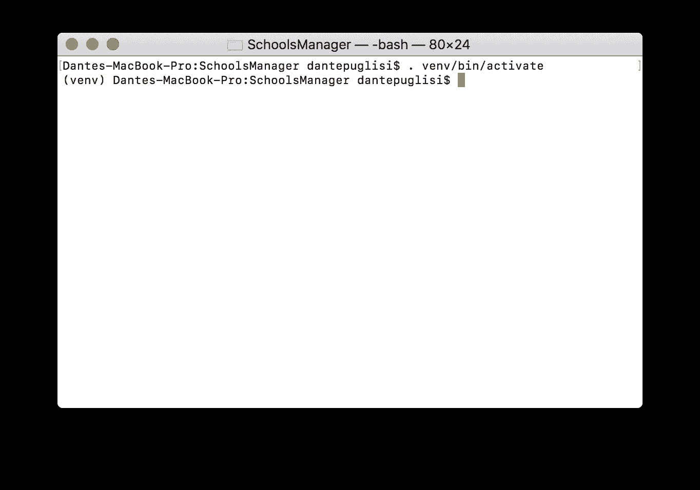

We are inside the ‘virtualenv’

如果您想离开“virtualenv ”,只需运行:

```
deactivate
```

# 这门课的重点是什么

我们可以直接进入代码，对吗？当然，但你会被第一个文件中的大量代码淹没，它只有 30 行代码，相反，你会了解代码背后的所有理论，然后我们会逐行将其与我们在理论中看到的进行比较。所以，试着去理解接下来的这些概念，然后当我们读到代码的时候，你会惊讶于你对它的理解程度。

## 安息

我们说我们将创建一个 REST API，但是 REST 是什么意思呢？要让一个 API 成为 REST，它必须遵循一些规则。如今大多数“REST APIs”并不是真正的完全 REST，它们只是遵循最基本的规则，这是 REST 的关键概念。在创建 REST API 时，我们必须记住，我们将使用“模型”来处理数据库，使用“资源”来处理我们的客户将要与之交互的对象。换句话说，这意味着，当我们从数据库中读取/写入数据时，我们使用“模型”，当我们从客户端(移动应用程序、web 等)接收/发送数据时。)我们使用‘资源’。“模型”和“资源”都是类。

## 数据库炼金术

我们将使用一个名为“SQLAlchemy”的库来读写数据库。SQLAlchemy 与 SQLite、PostgreSQL、MySQL 等一起工作。它的作用是让我们将模型写入数据库，然后检索它们。

## JWT

JWT 是我们用于身份验证的技术，JWT 网站对其工作原理有一个很好的定义:

> 用户登录后，每个后续请求都将包含 JWT，允许用户访问该令牌允许的路由、服务和资源。

基本上，这意味着当用户登录到我们的 API 时，API 将创建一个临时的“access_token”，将它传递给用户，并由客户端保存。此后，对于客户端向 API 发出的每个请求，都应该发送“access_token ”,这样 API 将知道客户端已经登录。该令牌在一定时间后过期(出于安全原因)，因此用户无法永远登录。通常，iOS 应用程序使用某种自动重新登录功能，因此用户不必一直登录。

# 让我们看看一些代码

我建议你下载整个项目，我们一步一步来，你可以在这里下载。解压缩它，你得到一个文件夹。

您刚刚下载的文件夹名为“code ”,它包含所有需要的代码，将其作为“venv”的兄弟放在您的项目文件夹中:

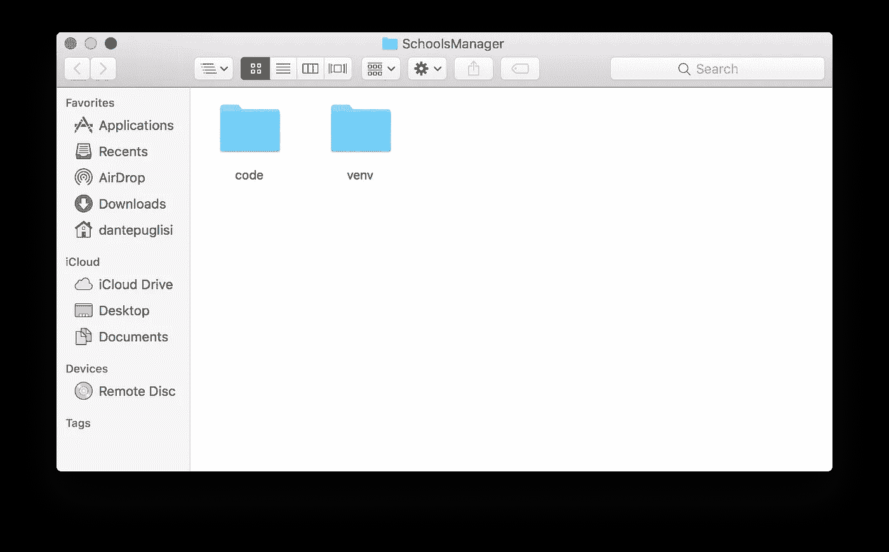

在文本编辑器中打开“code”文件夹。

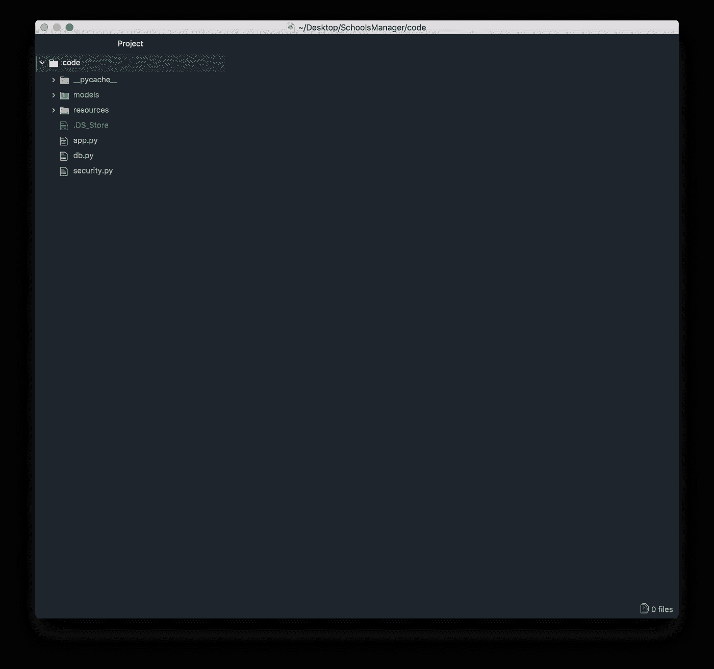

## 一些考虑

文件夹“__pycache__”由 python 自动生成，不应上传到 repo，也不应删除。

在文件夹“models”和“resources”中，“__init__”文件告诉 python 这个文件夹是一个包，而不仅仅是一个文件夹。

## SQLAlchemy

有个文件叫“db.py”，打开看看。该文件唯一做的事情是导入“SQLAlchemy”并创建一个名为“db”的变量。


这使得 API 中的每个文件都可以调用相同的“SQLAlchemy()”实例。

# 模型

## 用户模型

让我们先看看模型，记住，它们是我们将从数据库中写入和检索的对象。

在“模型”文件夹中打开“user.py”。

首先，我们导入“db ”,这将允许我们使用“db”变量来访问数据库:

```
from db import db
```

然后我们声明这个类:

```
class UserModel(db.Model):
```

记住“模型”是与数据库交互的东西。嗯，这就是为什么模型类继承自' db。模型。

在类的声明中，我们有一个类似于数据库表的东西:

```
__tablename__ = 'users'id = db.Column(db.Integer, primary_key=True)
username = db.Column(db.String(80))
password = db.Column(db.String(80))
```

“__tablename__”显然是表的名称。

然后，我们定义“用户”表将拥有的列，并定义它们的参数。

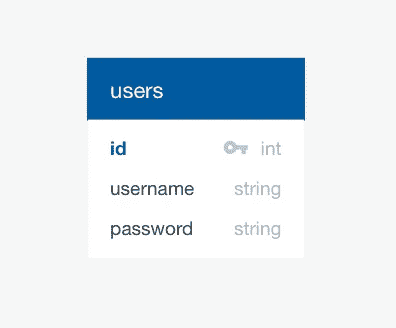

仅仅是写这个，SQLAlchemy 就知道如何为用户创建表，简单吧？

之后，我们有了非常简单的“__init__”方法。

```
def __init__(self, username, password):
    self.username = username
    self.password = password
```

> 请注意 id 是如何没有被传递的，这是因为对于数据库中的每个新条目，它的值都会增加 1。您可以为 id 传递您自己的值，但这样我们传递的是“None ”,它会自动递增。

```
def save_to_db(self):
    db.session.add(self)
    db.session.commit()
```

这是在 SQLAlchemy 中向数据库添加内容的方法，非常简单。

现在我们有 2 个“@classmethod”:

```
@classmethod
def find_by_username(cls, username):
    return cls.query.filter_by(username=username).first()@classmethod
def find_by_id(cls, _id):
    return cls.query.filter_by(id=_id).first()
```

“@classmethod”是一个装饰器，它以某种方式运行底层的函数。我不会详细讨论它，但这意味着该方法可以在没有类的特定实例的情况下被调用。

您可以通过说出“UserModel . find _ by _ username(name)”来调用它，或者通过创建一个名为“usermod”的 user model 实例(例如)并作为“usermod.find_by_username(name)”进行调用。这是相同的输出，因为它们没有接收“self”作为参数，而是接收“cls ”, cls 是调用它的类的解释。

## 学校模型和学生模型

它们是如此的相似和相关，以至于我们要同时研究它们。

首先，我们导入“数据库”:

```
from db import db
```

两个模型都有相同的“find_by_name ”,因为我们希望能够按名称搜索学生和学校:

```
@classmethod
def find_by_name(cls, name):
    return cls.query.filter_by(name=name).first()
```

我们有从数据库中保存和删除的方法:

```
def save_to_db(self):
    db.session.add(self)
    db.session.commit()def delete_from_db(self):
    db.session.delete(self)
    db.session.commit()
```

现在我们来谈谈数据库结构。

我们说过我们需要这样的东西:


我们已经知道如何让 SQLAlchemy 创建一个表(就像我们为用户做的那样)，但是这里我们有两个表之间的关系。

“学生模型”中的代码是:

```
__tablename__ = 'students'id = db.Column(db.Integer, primary_key=True)
name = db.Column(db.String(80))school_id = db.Column(db.Integer, db.ForeignKey('schools.id'))
school = db.relationship('SchoolModel')
```

定义了“__tablename__ ”,还定义了列“id”和“name”。

这里的图表非常有助于理解“学校标识”和“学校”变量是如何工作的。

“外键”用于表示两个表之间的关系，这一行表示:

```
school_id = db.Column(db.Integer, db.ForeignKey('schools.id'))
```

"创建一个名为' school_id '的整数类型的列，该列与表' schools '中的列' id '有关系"

下面的一行只是声明关系的“另一方”是什么类型，在本例中是“学校模型”:

```
school = db.relationship('SchoolModel')
```

现在看看它的表的“学校模型”声明:

```
__tablename__ = 'schools'id = db.Column(db.Integer, primary_key=True)
name = db.Column(db.String(80))students = db.relationship('StudentModel', lazy='dynamic')
```

简单吧。

我们只需要指定“学生模型”和我们(作为“学校模型”)之间的关系。“lazy =‘dynamic’”意味着变量‘students’是一个查询生成器，它将在每次调用时获取数据，而不是在之前。

然后我们有“__init__”方法和“json”方法:

*   学生模型:

```
def __init__(self, name, school_id):
    self.name = name
    self.school_id = school_iddef json(self):
    return {'name': self.name, 'school': self.school.name}
```

*   学校模型:

```
def __init__(self, name):
    self.name = namedef json(self):
    return {'name': self.name, 'students': list(map(lambda x: x.json(), self.students.all()))}
```

“__init__”方法是自解释的，当资源想要向客户端发送数据时，将使用“json”方法，因为我们必须发送回 JSON 而不是对象。

> 请注意,“地图”可以用“列表理解”来制作，如果你愿意，继续改变它。这是一个很好的方式来练习你的 Python 技能。

# 资源

## 用户

看一下我们正在导入的内容:

```
from flask_restful import Resource, reqparse
from models.user import UserModel
```

“reqparser”是我们马上要看到的解析器，Resource 将是“Resource”的父类，我们正在导入用户模型以使用它来创建和检索数据库中的数据。

创建用户的信息，即用户名和密码不会通过 url 到达我们这里，这是非常不安全的，它将在请求的正文中发送给我们。

为了获得这些数据，我们需要一个解析器:

```
parser = reqparse.RequestParser()
parser.add_argument('username',
    type=str,
    required=True,
    help="This field cannot be left blank."
)
parser.add_argument('password',
    type=str,
    required=True,
    help="This field cannot be left blank."
)
```

我们从接收到的数据中声明哪些参数对我们来说是重要的，并在参数丢失或错误的情况下设置一条消息。如果主体中有更多的参数，解析器将不会把它们计算在内。现在让我们使用它。

理想情况下，资源包含的唯一方法是 HTTP 动词，即:GET、POST、DELETE、PUT 等。

其背后的逻辑将走向模型。

用户只需要在我们的 API 中创建(不能删除或更新)，所以我们唯一的功能是:“发布”:

```
def post(self):
    data = UserRegister.parser.parse_args() if UserModel.find_by_username(data['username']):
        return {"message": "User already exists"}, 400 user = UserModel(**data)
    user.save_to_db() return {"message": "User created successfully."}, 201
```

我们从解析器获得“数据”,我们知道它有一个用户名和一个密码，因为这是我们的两个参数。

我们使用“UserModel”检查数据库中是否已经存在使用该用户名的用户，如果已经存在，我们返回一条消息，通知其状态代码为 400，这意味着“错误的请求”。

如果用户还不存在，我们创建一个“用户模型”,将“数据”中的所有数据作为参数传递。因为我们 100%确定“数据”中有用户名和密码，并且没有其他可以使用的内容:

```
UserModel(**data)
```

这将与以下内容相同:

```
UserModel(data['username'], data['password'])
```

用你最喜欢的那个。

然后，我们将刚刚创建的模型保存到数据库中，并返回一条消息，说明我们创建了状态代码为 201 的用户，意思是“已创建”。

## 学校

对于学校来说，我们需要能够处理这些事情:

*   通过名字得到一所学校
*   张贴学校名称
*   删除名为的学校
*   获取所有学校

我们将这个资源分成两个资源:“学校”和“学校列表”，因为我们有两个 GET 方法，一个用“/学校”调用，另一个用“/学校”调用。再往前会更清楚。

我们导入的内容与 user.py 中的相同，但没有“reqparse ”,因为我们不会从请求体中获得任何信息。当然，我们导入的不是“模型.用户”,而是“模型.学校”

```
from flask_restful import Resource
from models.school import SchoolModel
```

**让我们从“学校”资源开始。**

*它有一个 GET:*

```
def get(self, name):
    school = SchoolModel.find_by_name(name)
    if school:
        return school.json()
    return {'message': 'School not found'}, 404
```

我们要求“SchoolModel”在数据库中搜索一个特定的名称，如果有，则返回“school.json()”,否则我们返回一条状态代码为 404 的消息，表示“未找到”。

*它还有一个帖子:*

```
def post(self, name):
    if SchoolModel.find_by_name(name):
        return {'message': "School '{}' already exists".format(name)}, 400school = SchoolModel(name)
    try:
        school.save_to_db()
    except:
        return {'message': 'An error occurred while creating the school'}, 500return school.json(), 201
```

首先，我们需要查看数据库中是否已经有这个名字的学校，如果有，我们返回一个状态代码为 400 的消息。如果没有，我们继续用给定的名字创建一个新的“学校模型”。然后是“try-except ”,与 Swift 中的 try-catch 相同。在这里，我们试图将模型保存到数据库，如果由于某种原因无法执行，它将返回一条状态代码为 500 的消息，这意味着“内部服务器错误”。最后，如果我们到了最后，我们返回' school.json()'，这基本上就是我们刚刚插入到数据库中的状态代码 201。

*最后它有一个删除:*

```
def delete(self, name):
    school = SchoolModel.find_by_name(name)
    if school:
        school.delete_from_db()return {'message': 'School deleted'}
```

这非常简单，我们只需在数据库中查找具有该名称的“学校模型”,如果它存在，我们就删除它。如果它不存在，我们什么也不做。消息总是一样的，因为如果在数据库中找不到该学校，结果就和我们删除它一样。

**现在让我们来看看学校列表资源:**

*它只有一个 GET 方法:*

```
def get(self):
    return {'schools': list(map(lambda x: x.json(), SchoolModel.query.all()))}
```

> 这和我们之前看到的“地图”是一样的，如果你想为了理解一个列表而改变它，这完全没问题。

乍一看可能有点奇怪，但是“SchoolModel.query.all()”是有意义的，记住“SchoolModel”继承自“db”。模型'这使得它能够使用'。对表进行任何种类的查询。

## 学生

这是我们拥有的三种资源中较为复杂的一种。

让我们看看我们导入了什么:

```
from flask_restful import Resource, reqparse
from flask_jwt import jwt_required
from models.student import StudentModel
```

我们正在导入资源和“reqparse”，我们正在从“models.student”导入“StudentModel”，我们正在从“flask_jwt”导入“jwt_required”。对于这些请求，我们将使用 JWT 认证，不要担心，这比听起来容易。

在课程开始时，我们设置了解析器，因为我们只关心“学校标识”,它将通过请求体传递给我们:

```
parser = reqparse.RequestParser()
parser.add_argument('school_id',
    type=int,
    required=True,
    help="Every student needs a school id."
)
```

*我们有 GET 方法:*

```
def get(self, name):
     student = StudentModel.find_by_name(name)
     if student:
        return student.json()
     return {'message': 'Student not found'}, 404
```

它就像学校的 GET 一样工作。

*我们也有 POST 方法:*

```
@jwt_required()
def post(self, name):
    if StudentModel.find_by_name(name):
        return {'message': "A student with name '{}' already exists.".format(name)}, 400data = Student.parser.parse_args()student = StudentModel(name, **data)try:
    student.save_to_db()
except:
    return {'message': 'An error ocurred inserting the student.'}, 500return student.json(), 201
```

> 我们这里有个装潢师！

请注意“@jwt_required()”装饰符，在我们的方法之前的那一行，我们告诉 Flask，我们需要 jwt 的“access_token”来运行该方法，如果我们没有收到有效的令牌，该方法将抛出一个错误。

在该方法中，我们再次使用“StudentModel(name，**data)”对学校进行同样的操作，但是您可以用“StudentModel(name，data['name']，data['school_id'])”替换它。

*我们还实现了一个删除方法:*

```
@jwt_required()
def delete(self, name):
    student = StudentModel.find_by_name(name)
    if student:
        student.delete_from_db()return {'message': 'Student deleted'}
```

它还有“@jwt_required()”装饰符，所以当发送请求时，客户机必须在请求的头部传递它的“access_token”，我们将在后面看到如何传递。

最后，我们有“学生列表”，其工作方式与“商店列表”完全相同:

```
def get(self):
    return {'students': list(map(lambda x: x.json(), StudentModel.query.all()))}
```

# 登录

我们已经看到了如何在用户资源中使用 POST 方法注册一个新用户，但是我们遗漏了一些东西…让用户登录。

我们有一个名为“security.py”的文件来处理这个问题。“flask_jwt”需要定义两个方法，“authenticate”和“identity”。都在“security.py”里。

## 鉴定

“authenticate”方法返回一个用户模型(如果在数据库中找到的话)，否则返回“None”:

```
def authenticate(username, password):
    user = UserModel.find_by_username(username)
    if user and user.password == password:
        return user
```

该方法采用两个参数:“用户名”和“密码”，并尝试查找具有该用户名的用户模型。如果找到了，它就会尝试将数据库密码中找到的用户与请求中传递的密码进行匹配。如果匹配，则返回用户。

用户实际上并没有返回到客户端，因为那没有帮助，客户端需要一个“访问令牌”用于将来的请求，“flask_jwt”处理这个问题并向客户端发送“访问令牌”。

> 请记住,“访问令牌”包含登录用户的“id”信息，而不是用户名和密码信息

## 身份

第二种方法是“认同”。它有一个参数，即“有效载荷”。当调用带有“@jwt_required()”装饰符的方法时，调用该方法，并负责为“access_token”返回适当的用户。我们稍后会看到一个例子。

方法很简单:

```
def identity(payload):
    user_id = payload['identity']
    return UserModel.find_by_id(user_id)
```

还记得我说过“access_token”有关于登录用户的“id”的信息吗？通过从有效负载访问“identity”属性，我们可以在数据库中搜索具有该“id”的用户模型并返回它。

> 这可能有点令人困惑，这里有一个例子:

用户使用 iOS 应用程序注册，API 返回消息“用户创建成功”，用户现在使用相同的用户名和密码登录，应用程序向 API 发送登录请求，传递用户名和密码。‘flask _ jwt’用应用发送的用户名和密码调用“authenticate”方法。它在数据库中找到了它，因此 API 生成一个“access_token ”,并将其发送回应用程序。现在，当应用程序想要调用一个需要 JWT 认证的方法(比如学校的 POST)时，它需要传入请求的头部，即“access_token”。当发生这种情况时，“flask_jwt”用“access_token”调用“identity”方法，检索“id”并在数据库中搜索具有该“id”的用户模型。

试着读几遍，如果它令人困惑，在纸上画出方法和流程肯定会有帮助，它真的不太复杂。

# app.py

当我们一般使用 Python 时，我们喜欢将主应用程序称为“app.py”，现在还不是做任何改变的时候。

看一下“app.py”，看看自己能搞清楚哪些部分。

我们将从进口开始:

```
from flask import Flask
from flask_restful import Api
from flask_jwt import JWTfrom security import authenticate, identity
from resources.user import UserRegister
from resources.student import Student, StudentList
from resources.school import School, SchoolList
```

在余下的代码中，我将逐行解释为什么我们要导入它们:

```
app = Flask(__name__)
```

我们创建了一个名为我们程序的 Flask()实例，为此我们使用了 Python 定义的变量' __name__ '。‘烧瓶’就是为此而进口的。

```
app.config['SQLALCHEMY_DATABASE_URI'] = 'sqlite:///data.db'
app.config['SQLALCHEMY_TRACK_MODIFICATIONS'] = False
```

*我们配置数据库路由(这是我们在终端中运行服务器的文件夹)并将‘SQLALCHEMY _ TRACK _ MODIFICATIONS’设置为 False。这是因为 Flask 的轨迹修改系统比 SQLAlchemy 的要好一些。*

> 请注意，我们使用的是 sqlite，但也可以使用 PostrgeSQL 或 MySQL。

```
app.secret_key = 'dante'
```

*我们定义‘秘密密钥’，用它来加密我们的‘访问权标’。*

> 请注意，这应该是一个更难猜测的关键

```
api = Api(app)
```

*我们创建 Api 实例。“flask_restful”中的“Api”是为此导入的。*

```
@app.before_first_request
def create_tables():
    db.create_all()
```

*使用装饰器“@app.before_first_request”我们告诉数据库创建所有的表，它这样做是为了所有的模型并检查每个模型如何想要它的表。需要导入“db ”,但它将在我们运行它之前导入，您将会看到。*

```
jwt = JWT(app, authenticate, identity)
```

*我们创建一个 JWT 实例，将“应用程序”本身、“身份验证”方法和“身份”方法作为参数传递。为此导入了“flask_jwt”中的“JWT”和“security”中的“authenticate”和“identity”。*

```
api.add_resource(School, '/school/<string:name>')
api.add_resource(Student, '/student/<string:name>')
api.add_resource(SchoolList, '/schools')
api.add_resource(StudentList, '/students')api.add_resource(UserRegister, '/register')
```

*然后我们定义 Api 将使用的资源，声明我们将接收的资源类、url 和 url 参数。*

```
if __name__ == '__main__':
    from db import db
    db.init_app(app)
    app.run(port=5000, debug=True)
```

最后，我们需要运行应用程序，我知道代码有点奇怪，但请耐心等待。

“app.py”可以从另一个文件中调用，因此，为了确保它将初始化数据库并运行应用程序一次(当我们直接从终端调用它时)，我们使用了“if”语句，因为当您从终端调用文件时，Python 会将该文件的“__name__”分配给“__main__”。

然后我们导入“db”(这个 get 是在第一个请求之前导入的，所以当调用 create_tables()时，“db”已经被导入)，初始化数据库并在端口 5000(这是默认端口)和调试模式下运行服务器，这将帮助我们跟踪应用程序抛出错误时的问题。

# 运行服务器

是时候运行服务器并测试它了。

要运行服务器，请打开终端并转到您的项目文件夹。

启动“venv ”,以防您忘记如何启动，它是:

```
. venv/bin/activate
```

现在进入代码文件夹:

```
cd code
```

并运行服务器:

```
python app.py
```

*如果抛出一个错误，请尝试:*

```
python3.6 app.py
```

您应该会看到类似这样的内容:

```
(venv) Dantes-MBP:code dantepuglisi$ python app.py
* Running on http://127.0.0.1:5000/ (Press CTRL+C to quit)
* Restarting with stat
* Debugger is active!
* Debugger PIN: 247-053-277
```

这意味着您正在 localhost (127.0.0.1 是 localhost)中的端口 5000 上运行服务器，如您之前定义的那样。

要停止服务器只需按:Ctrl+C

# 测试 API

我们要用 Postman 来测试 API，在这里下载[。](https://www.getpostman.com)

此外，在这里下载这个项目[的集合，并通过转到“集合”、“导入”并将&拖放到框中将其导入到 Postman。](https://www.getpostman.com/collections/0822afedd7f0f0fc142c)

您应该会在应用程序的左侧看到收藏。在集合中有 3 个文件夹:“学生”、“学校”和“授权”。每个文件夹都有与特定资源交互的端点。

## 证明

在“Auth”文件夹中点击“/register”端点，您应该会看到类似这样的内容:

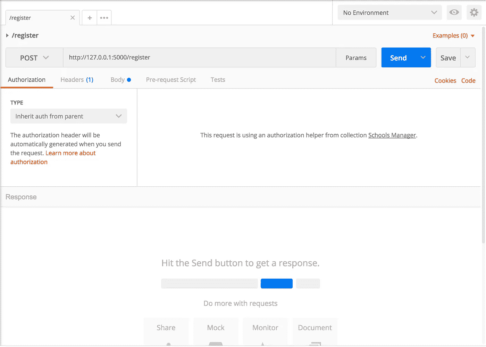

路由是“http://127.0.0.1:5000/register，http 动词是 POST。

按“Headers”选项卡，在标题中，我们为“Content-Type”传递“application/json”，这意味着主体是 json 格式的。

现在点击“Body”选项卡，我们传递“username”和“password”来注册。您可以更改这些数据，但是一定要在“/auth”端点中进行更改。

按“Send”并查看响应，您将得到类似这样的内容(记得让服务器在终端中运行):

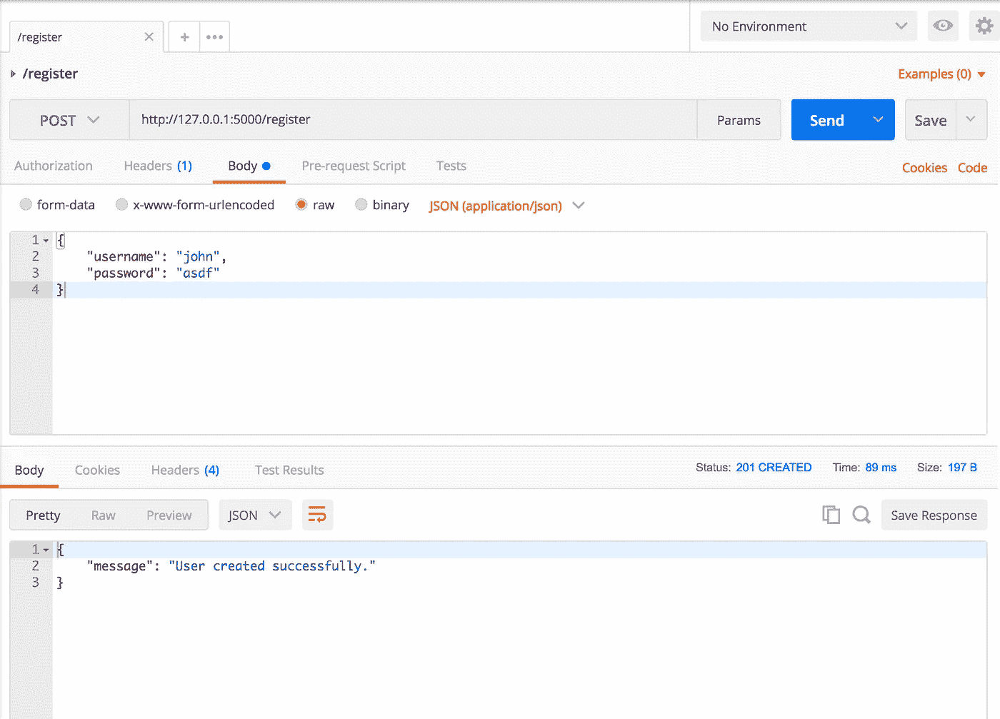

我们知道用户已在数据库中注册，现在转到“/auth”端点。


我们在主体中传递相同的头和相同的信息，以登录我们刚刚创建的同一个用户。

按下“发送”后，您会得到如下内容:


选择“access_token”(不带引号)并复制它(Cmd+C)。

在我们继续其他端点之前，您看到发生了什么吗？

当您第一次调用 API (/register)时，SQLAlchemy 创建了一个名为 data.db 的文件(您可以搜索它，它在“code”文件夹中),原因如下:

```
@app.before_first_request
def create_tables():
    db.create_all()
```

我们在 Postman 中调用了“POST /register”端点，它从 UserRegister 中触发了“POST”方法，如下所示:

```
def post(self):
    data = UserRegister.parser.parse_args() if UserModel.find_by_username(data['username']):
        return {"message": "User already exists"}, 400 user = UserModel(**data)
    user.save_to_db() return {"message": "User created successfully."}, 201
```

然后，我们继续尝试使用/auth 传递相同的用户名和密码登录，这触发了“security.py”中的“authenticate”方法:

```
def authenticate(username, password):
    user = UserModel.find_by_username(username)
    if user and user.password == password:
        return user
```

> 请注意，除了“access_token”之外，您还可以更改“/auth”返回的内容，请查看 flask_jwt 文档。

## 学校

现在我们将移动到“学校”文件夹。一旦进入，点击“岗位/学校/ <name>”端点。</name>

你会得到这个:


将 URL 中的“<name>”替换为您选择的学校名称，我会选择“asd ”,这是一个非常可靠的学校名称。</name>

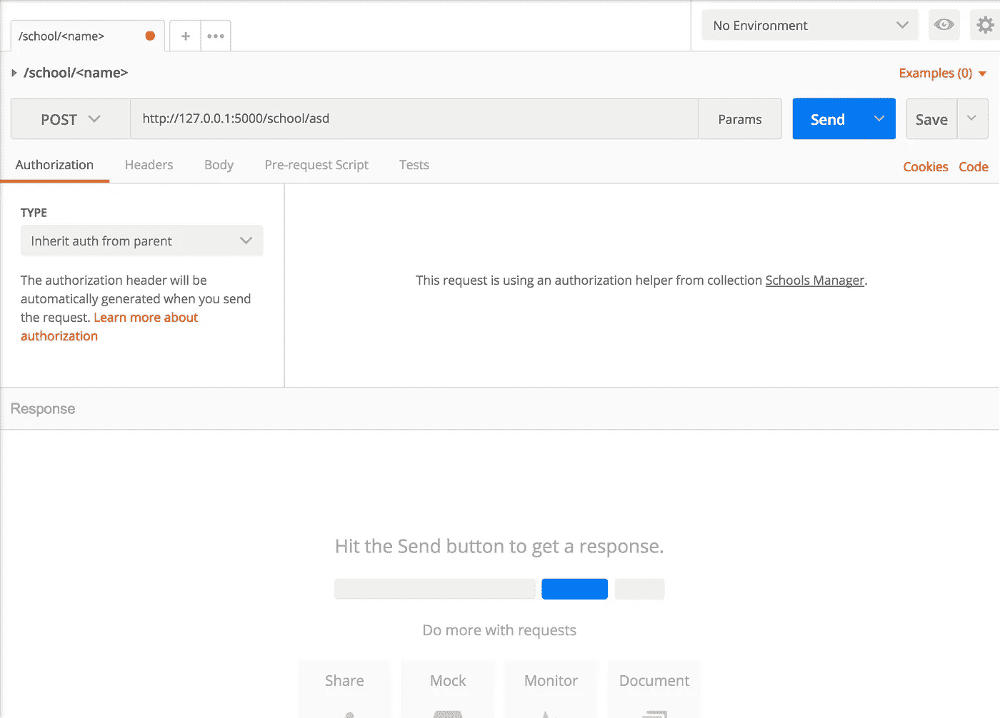

我们没有在头部或主体中传递信息，因为来自学校(资源)的“post”方法只是从 URL 中获取一个参数“<name>”。</name>

按“发送”,看看会有什么回复。我们刚刚创建了一所学校。

可以随便玩玩删，弄弄，弄弄所有学校。

我们有一所学校，现在我们需要学生，否则严格来说他们不是学校，对吗？

## 学生

打开集合中的“Student”文件夹，我们也来测试一下。

我们要创建一个新学生，为此，打开" POST /student/ <name>"端点。</name>

您将获得:

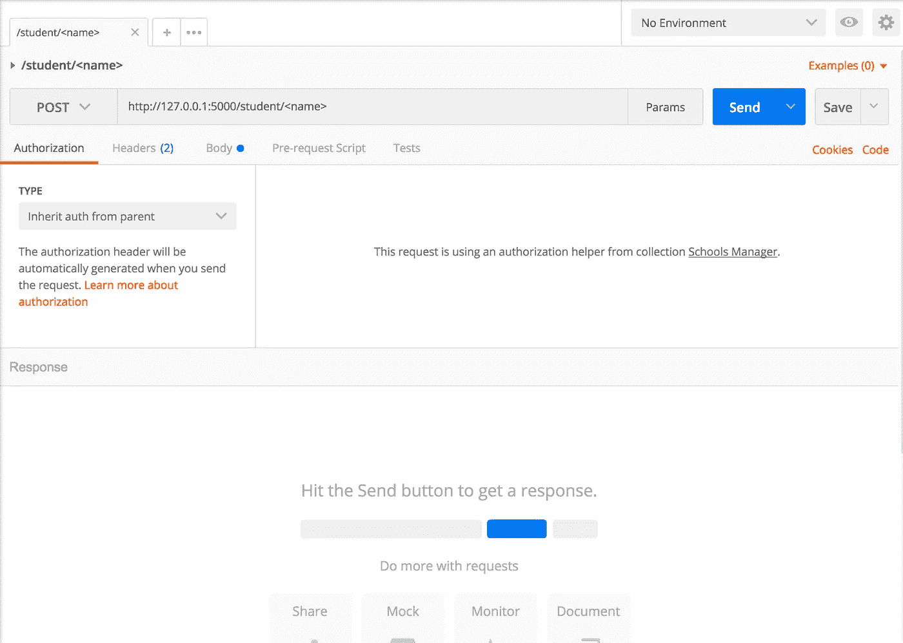

把“<name>”换成你喜欢的任何名字(‘但丁’似乎是个很酷的名字)。</name>


继续按“发送”。

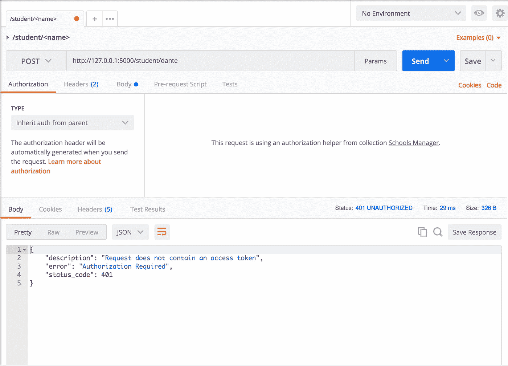

发生了什么事？一个错误？是因为那个名字太牛逼了吗？

别担心，你需要发送你之前得到的“访问令牌”,记得吗？

按下“标题”选项卡，“授权”的值为空。为了解决这个问题，在值中写下(为了更容易理解，我使用了 Swift 语法，假设这是一个 Swift 字符串):“JWT \(access_token)”

> 请注意，如果您没有“access_token”来粘贴它，您可以转到“/auth”端点并再次登录。

那就是:

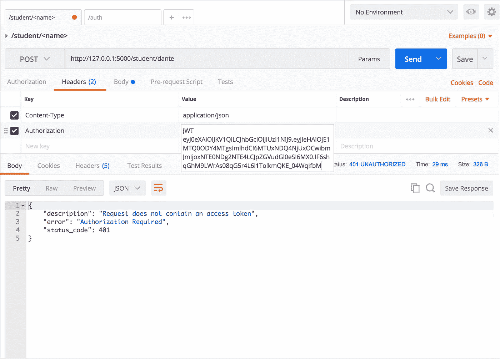

> 请注意，在“JWT”和“访问令牌”之间有一个空格。

我们现在可以再次发送请求，瞧:


它将我们与名为“asd”的学校相匹配，因为它的“school_id”为 1(这是我们创建的第一个学校),我们在正文中为“school_id”传递“1 ”,请按“body”选项卡检查它。

> 质询时间:如果您创建一个带有不存在的“学校 id”的学生，它将创建该学生，但会抛出一个错误，尝试修复该错误，以便根本不会创建该学生，并且端点会返回一条消息“请选择一个有效的学校 id”

要删除数据库并重新开始，只需转到项目中的“code”文件夹并删除名为“data.db”的文件。之后，再次运行服务器。

# 创建 iOS 应用程序

到目前为止，一切看起来都很好，但我们实际上还没有在应用程序中使用该 API。

让我们现在做那件事。

我会指导你完成步骤，但不会给你完成的项目，因为我假设你是一个 iOS 开发人员，将能够自己完成。

首先创建一个单视图项目，命名为“学校管理器”，保存在“学校管理器”文件夹中，安装 CocoaPods 和 Alamofire。

创建一个名为 APIClient 的新文件，并添加以下代码，这是 API 方法所在的位置:

> 注意，我们不是在头中将“Content-Type”作为“application/json”传递，而是用“jsonEncoding”将参数编码为 JSON。两种方式都可以。

我们将“access_token”保存在 UserDefaults 中，以便在我们关闭应用程序并再次打开它时，如果令牌没有过期，我们就不需要再次登录。

大体上。故事板是这样做的:

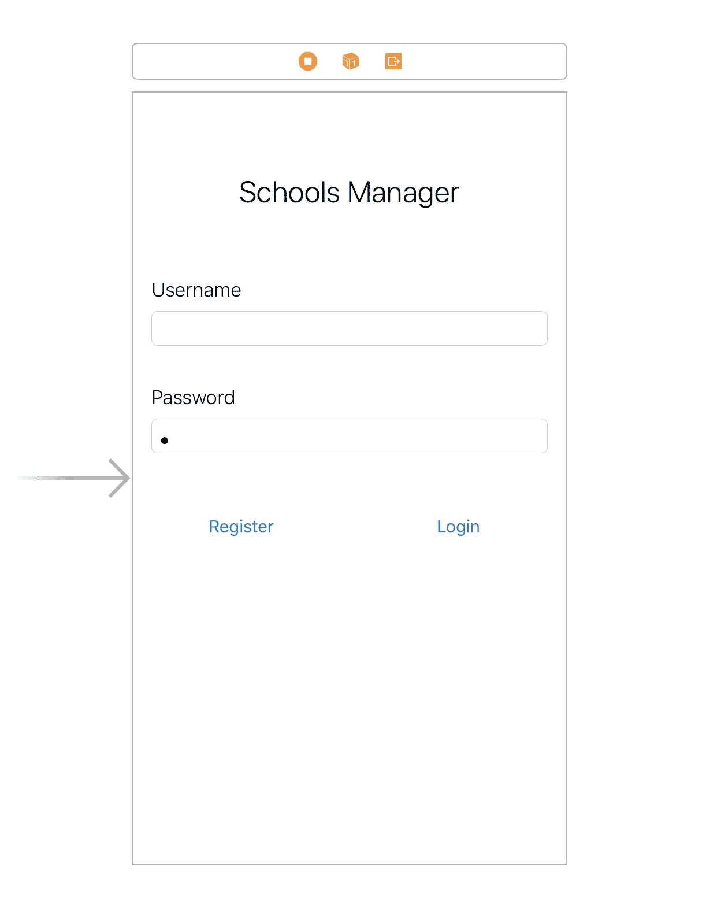

这只是为了测试。

然后转到 ViewController.swift，实现这两个动作，连接到按钮上。不要忘记连接文本字段的出口:

你应该有这样的东西:

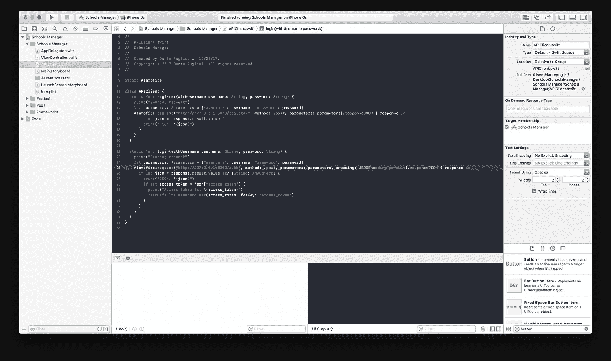

如果您还没有删除 data.db，我们可以更好地进行测试。

现在，在我们运行应用程序之前，请确保您的服务器正在终端中运行，并按下我们都非常喜欢的“播放”按钮。

> 请注意，您应该在模拟器中运行此操作，因为您的手机将无法访问“localhost”(127 . 0 . 0 . 1)。

输入用户名和密码，按下“注册”按钮，看看控制台，你就得到这个:

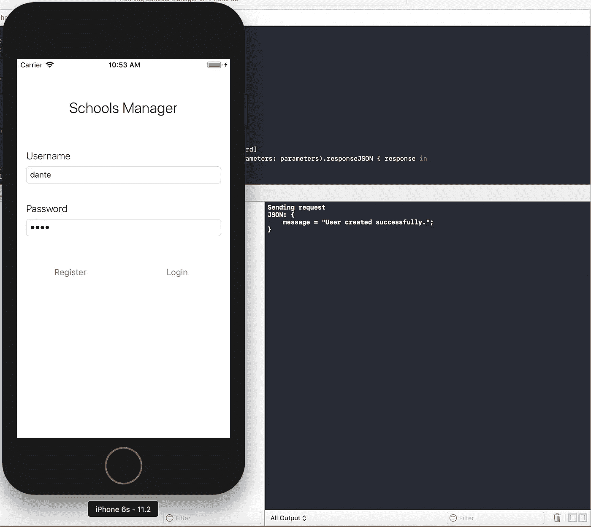

这样，用户就创建好了。

现在按下“登录”按钮，得到这个:

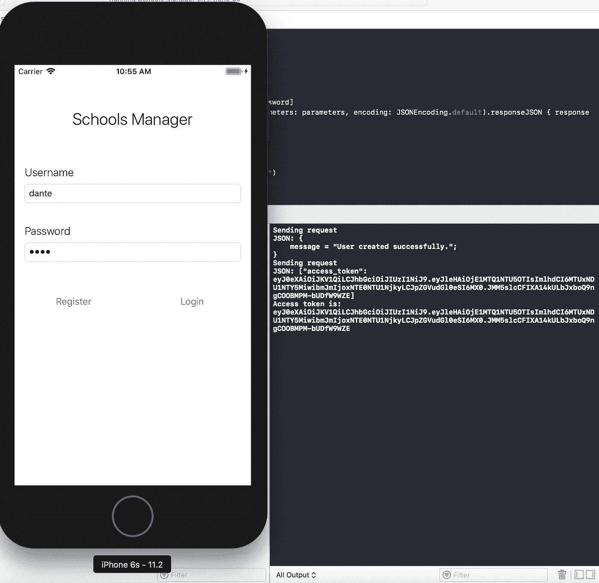

嗯，我们打印了两次“访问令牌”，但这不是问题，问题是，我们有“访问令牌”！

现在我们必须创建第二个屏幕，让用户在正确登录后通过。

第二个屏幕将显示一个 ui table 视图，学校作为部分的标题，学生作为这些部分的行。

这应该很容易做到，所以我们继续吧。

类似这样的事情应该可以做到(不要忘记将 UIViewController 设置为 UITableView 的“委托”和“数据源”):

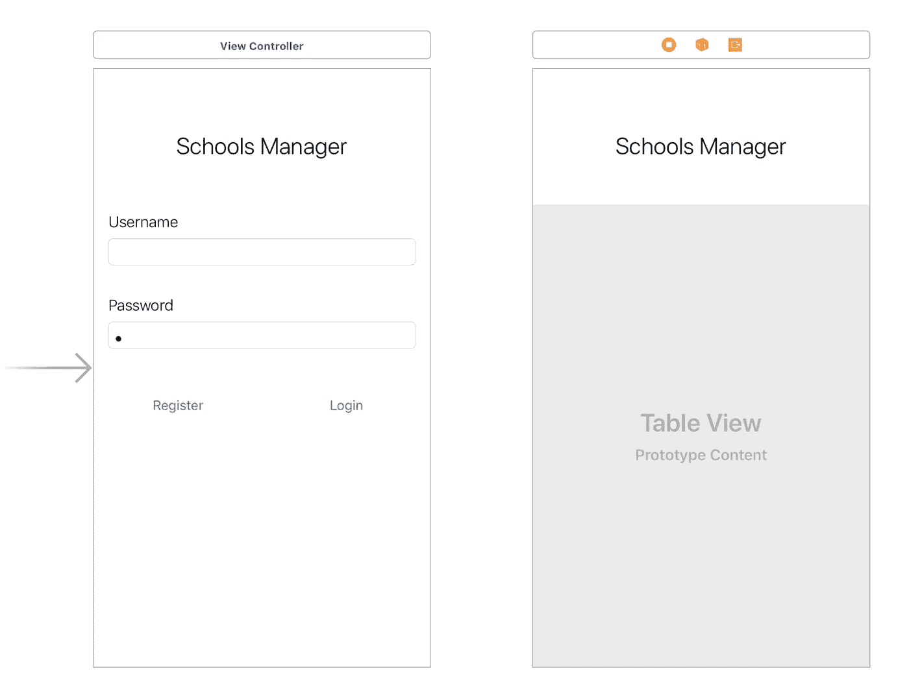

创建一个名为“SchoolsListViewController”的新文件，并将其设置为“storyboard”中新 UIViewController 的类和“Storyboard ID”的类。

我们必须向 API 登录函数添加一个完成处理程序，以知道我们何时拥有可用的“access_token ”,让我们开始吧。将“登录”方法更改为:

以及“登录按钮已按下”动作:

这段代码非常简单明了，所以让我们继续。

我们仍然需要得到学校及其学生的名单，有几种方法可以做到这一点。我们可以发出两个请求，一个 GET /schools 和一个 GET /students，或者我们可以只发出一个调用来 GET /students，然后用我们的方法来分离这些东西。我们将使用第二个方法，所以首先要做的是进入 APIClient.swift 并粘贴这个方法:

我们获取学生(记住他们有各自的学校名称)并在一个元组数组中的完成处理程序中传递它。

这是“schoolslistviewcontroller . swift”代码，我试图使它易于阅读和理解，而不是那么高性能，我希望你不要在看嵌套 for-in 的例子时感到恶心😄：

一开始可能看起来很难，但并不复杂，魔术发生在“addSchools”和“createDiagramArray”中，所以，首先尝试理解这一点，然后再理解其余部分。

在运行之前，请确保您的服务器在终端中运行，并在 Postman 中创建一些学生和学校，因为我们没有在我们的应用程序中实现学生的创建。

运行该应用程序，您应该会看到如下内容:

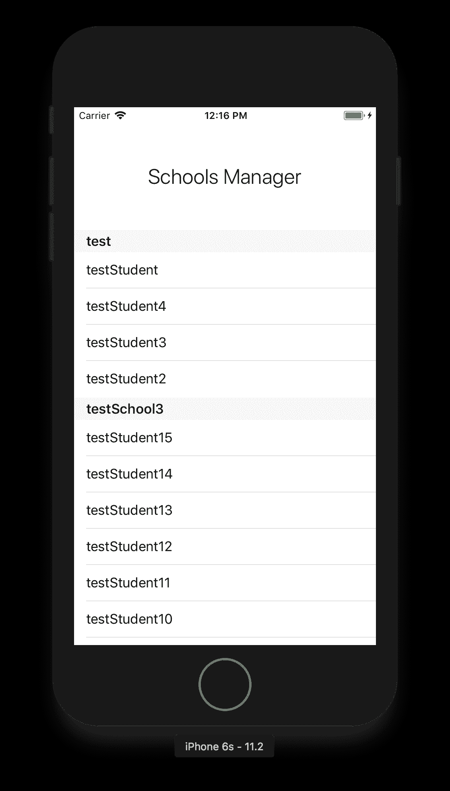

正在“测试”一个学校和“测试学生”、“测试学生 4”、“测试学生 3”等。“测试”学校的学生。

“testStudent15”、“testStudent14”等。是“测试学校 3”的学生，等等。

**挑战时间:添加两个按钮(“添加学校”和“添加学生”)，以便能够从应用程序中创建学校和学生。对于某些请求，您需要“access_token ”,您可以像这样创建头字典:**

```
let headers: HTTPHeaders = [
    "Authorization": "JWT jasgdbjkasbjasjdhasd",
]
```

然后在请求中传递它:

```
"https://127.0.0.1:5000/student/\(name)", headers: headers
```

希望你在将 API 信息导入 iOS 应用程序的过程中玩得开心，我很高兴知道你将来会经常用到它。

# 最后的想法和下一步

很好，现在你有了一个功能性的、经过测试的 REST API，以及一个使用它的 iOS 应用程序。任何服务都可以从您的计算机(或运行服务器的计算机)与这个 API 进行交互。

作为后续步骤，我建议执行以下操作:

*   将服务器部署到云(Heroku 等。)或您自己的服务器
*   将 Git 用于服务器的源代码控制(当然也用于应用程序)

## 希望你喜欢它到目前为止，让我知道你是否有任何问题，评论或建议。您也可以通过 Twitter @ iAmDantePuglisi 联系我。