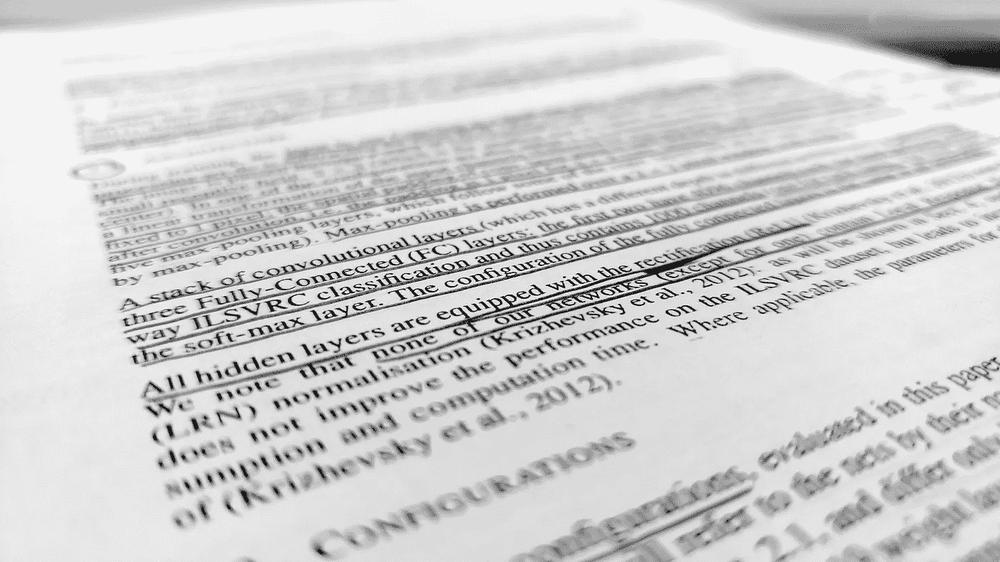

# 阅读 VGG 网络论文并使用 Keras 从头开始实施

> 原文：<https://medium.com/hackernoon/learning-keras-by-implementing-vgg16-from-scratch-d036733f2d5>



Keras 有数百个代码示例。仅仅复制和粘贴代码而不知道实际发生了什么是很常见的。在本教程中，您将实现一些非常简单的东西，但有几个学习好处:您将通过阅读 VGG 的原始论文，从零开始用 Keras 实现 VGG 网络。

我用“VGG”这个词来描述 VGG(牛津大学视觉几何组)为 2014 年国际视觉几何中心设计的建筑。

那么，实现已经实现的东西有什么意义呢？

重点是学习。通过完成本指南，您将:

*   了解更多关于 VGG 的建筑；
*   了解有关卷积神经网络的更多信息；
*   了解有关如何在 Keras 中实现网络的更多信息；
*   通过阅读一篇科学论文并实施其中的一部分来了解更多的科学方法。

## 为什么从 VGG 开始？

*   很容易实现；
*   它在 ILSVRC-2014 (ImageNet 竞赛)上取得了优异的成绩；
*   这纸读起来很好；
*   它有一个 Keras 实现，所以你可以比较你的代码。

# 目标受众

刚接触深度学习并且从未用 Keras 实现过任何网络的人。

# **先决条件**

基本的 Python 和基本的卷积神经网络知识。我推荐你阅读[斯坦福的 CS231n:视觉识别的卷积神经网络笔记](http://cs231n.stanford.edu/)。

# **练习 0**

略读[《VGG》网络论文:*用于大规模图像识别的极深度卷积网络*](https://arxiv.org/abs/1409.1556) 。更好地了解结果和网络架构。根据结果，选择要实施的配置。

# **练习 1**

学习网络架构。考虑以下超参数:卷积滤波器(感受野)大小、步幅和填充。另外，检查使用了哪个激活功能。如果您不确定这些术语的含义，请查阅 CS231n 课堂笔记。不要忘记检查输入数据的大小。

计算每层必须学习的参数数量。将每一层的参数相加，得到可学习参数的总数。【CS231n 的这些卷积网络笔记能帮上大忙。不要忘记对偏见进行总结。另外，计算每层输出的形状(宽度、高度、深度)。用铅笔和纸！在这个练习中，画画很有帮助。

您可以在纸上找到关于参数数量以及如何计算它们的信息。

# **练习 2**

阅读 Keras 文档的[第一页](https://keras.io/)和 [*开始使用 Keras 顺序模型*](https://keras.io/getting-started/sequential-model-guide) 。在首次试用之前，请跳过示例部分*。回到纸上，更加专注地阅读。关注架构配置。开始编写您的网络架构。你需要浏览 Keras 文档的图层部分。

**注意:我只是建议你跳过例子部分，这样你就不会从 VGG 电视网得到“剧透”。我们总是建议您阅读这些示例，因为您可能会从这些示例中学到比其他文档更多的东西。*

提示:

*   阅读论文的第 2 部分(ConvNet 配置)。
*   别忘了 Keras 包括:
    比如你要用`keras.layers.pooling.MaxPooling2D`，导入为:`from keras.layers.pooling import MaxPooling2D`。这将使代码更具可读性。
*   如果遇到困难，可以看看 Keras 文档中的例子。

# **练习 3**

将您的结果与 VGG 的 [Keras 实现进行比较。检查您的网络的参数数量是否与 Keras 的相同。你可以使用`model.summary()`来显示你的网络中每一层的参数数量和输出形状。](https://keras.io/applications/)

# 获得解决方案

对于这一部分，我将更多地关注获得解决方案的过程，而不是解决方案本身。

## 练习 0

对于第一个练习，我做了每次开始阅读论文的第一件事:阅读摘要，阅读结论，然后浏览寻找有趣的结果(通常是表格和图表)。

表 3 和表 4 中显示的结果表明，最佳网络配置是 D 和 e。这些配置的体系结构如表 1 所示。请注意，您不需要阅读整篇文章来查找这些信息，因为您需要的一切(目前)都可以通过快速浏览图像和表格来轻松找到。

我决定实现配置 D，因为它实际上具有与配置 E 相同的性能，但架构更简单(16 个而不是 19 个 convnets)。


## 练习 1

我们想了解网络架构。从我们的第一个练习中，我们知道不同的配置如表 1 所示。在表格描述中，我们可以了解到`conv3–64`是一个卷积层，感受野大小为 3x3，64 个通道(滤波器):

> 卷积层参数被表示为“channels⟩的 conv⟨receptive 场 size⟩-⟨number”

然而，该表没有说明任何关于卷积填充和步幅的信息。为了找到这些，我们再一次浏览论文。


Taking notes on the paper help you organize your ideas better. It does matter if you print the paper and use a pen or if you do it digitally, but always take notes.

现在我们知道了网络架构的一切:

*   输入尺寸:224 x 224
*   感受野大小为 3×3；
*   卷积步距是 1 个像素；
*   填充是 1(对于 3×3 的感受野),所以我们保持相同的空间分辨率；
*   最大池是 2×2，步长为 2 个像素；
*   有两个完全连接的层，每个层有 4096 个单元；
*   最后一层是具有 1000 个单元的 softmax 分类层(代表 1000 个 ImageNet 类)；
*   激活功能是 ReLU

我们现在可以计算可学习参数的数量。

您可以在第 2.3 节(讨论)中找到此信息。

对于第一卷积层，网络必须沿着输入深度(3)学习 64 个大小为 3×3 的滤波器。加上 64 个滤波器每一个都有偏差，所以参数总数是`64*3*3*3 + 64 = 1792`。您可以对其他卷积层应用相同的逻辑。

层输出的深度将是其卷积滤波器的数量。填充被选择为 1 个像素，因此空间分辨率通过卷积层得以保持。因此，空间分辨率将仅在汇集层发生变化。所以，第一个卷积层的输出将是`224 x 224 x 64`。

池层不学习任何东西，所以我们有 0 个可学习的参数。为了计算池层的输出形状，我们必须考虑窗口的大小和步幅。由于窗口为 2 x 2，跨距为 2，因此图层每 2 x 2 个像素输出一个像素，并跳跃 2 个像素进行下一次计算(不会发生重叠)，因此空间分辨率在每个池图层中除以 2。深度保持不变。

为了计算全连接层中的参数数量，我们必须将前一层中的单元数量乘以当前层中的单元数量。按照前面几段介绍的逻辑，可以看到最后一个卷积层的单元数将是`7x7x512`。因此，对于配置 d，第一个全连接层中的参数总数将是`7x7x512x4096 + 4096 = 102764544`

如果可以将参数总数与纸上的结果进行比较(表 2):


## 练习 2

在 Keras 文档的第一页，您会发现您需要创建一个`Sequential`模型:

```
from keras.models import Sequential
model = Sequential()
```

并用`model.add()`添加图层。另一种方法是将一个层列表传递给`Sequential`构造函数(我使用了这种方法)。

最难的部分是为每一层定义精确的参数。这可以通过查看文档来完成:`[Convolutional](https://keras.io/layers/convolutional/)`、`[Pooling](https://keras.io/layers/pooling/)`和`[Core](https://keras.io/layers/core/)`层。

我们首先定义我们将使用哪些层。由于 VGG 网络处理图像，我们将使用`[Conv2D](https://keras.io/layers/convolutional/#conv2d)`和`[MaxPooling2D](https://keras.io/layers/pooling/#maxpooling2d)`。阅读关于这些层类型的全部文档很重要。

对于`Conv2D`层，我们首先要注意的是:

> 当使用该层作为模型中的第一层时，提供关键字参数`input_shape`(整数元组，不包括样本轴)，例如`data_format="channels_last"`中的 128x128 RGB 图片的`input_shape=(128, 128, 3)`。

因此，我们必须定义图像的`input_shape`。从练习 2 中，我们注意到输入大小是`224x224`。我们正在处理彩色图像，所以我们输入的深度是 3。

通过阅读`Conv2D`参数，我们了解了如何定义内核的大小、步幅、填充和激活函数。

需要注意的一个重要参数是`data_format`。它用于定义 Keras 中数据流的顺序。因为我不想为 Keras 中的每个程序设置这个参数，所以我编辑了`~/keras/keras.json`来设置一个默认值:

```
{
    "image_data_format": "channels_last"
    # (...) other configs
}
```

我们需要使用的参数有`filters`、`kernel_size`、`strides`、`padding`和`activation`。如果您打算稍后训练模型，其他一些参数可能是有用的，例如`kernel_initializer`。

设置过滤器，内核大小和步幅是微不足道的。设置激活功能需要您进入[激活文档](https://keras.io/activations/)。

`padding` : `valid`或`same`有两种选择。不清楚它们是什么意思，所以我不得不谷歌一下。我发现[这个](https://github.com/fchollet/keras/issues/1984)和[这个](http://datascience.stackexchange.com/questions/11840/border-mode-for-convolutional-layers-in-keras)。另一种方法是直接查看 [Keras 实现](https://github.com/fchollet/keras/blob/5cef75219abc339b64e35f221775692d3cf04b84/keras/utils/conv_utils.py#L89-L115)。

> 当边界模式为“有效”时，您得到的输出小于输入，因为卷积仅在输入和滤波器完全重叠时计算。
> 
> 使用“相同”边界模式，您将获得与输入“相同”大小的输出。这意味着过滤器必须超出输入范围“过滤器大小/ 2”，输入范围之外的区域通常用零填充。

所以，我们希望填充设置为`same`。

对于`MaxPooling2D`层，我们需要设置步幅、池大小和填充。因为我们想要零填充，所以我们只使用`padding="valid"`。由于`valid`是`padding`的默认值，我们可以省略这个参数(但是请注意，Keras API 变化很大，因此这可能会导致 Keras 未来版本的架构发生变化)。

在我们调用全连接(`Dense`层)之前，我们需要展平最后一个卷积网络的输出。这将会重塑到 1D 的 convnet 的 3D 输出。

最后，对于`Dense`层，我们只需要设置单元数和激活函数。

最后的代码非常简洁:

请注意，我没有包括脱落层，也没有设置权重初始值，因为我们仍然对训练步骤不感兴趣。

你可以在这里找到 Keras 对 VGG 的实现。

## 练习 3

您可以通过运行以下命令来检查 VGG16 或 VGG19 架构:

```
from keras.applications import VGG16, VGG19
VGG16.summary()
VGG19.summary()
```

# 超出

一个有趣的下一步是训练 VGG16。然而，训练 ImageNet 是更复杂的任务。VGG 文件指出:

> 在配备了四个 NVIDIA Titan Black GPUs 的系统上，根据架构的不同，训练单个网络需要 2-3 周的时间。

即使你有几千美元的设备，那也是很长的时间。

尽管如此，一个有趣的练习将是尝试看看你将如何再现训练和测试设置的一些有趣的方面，例如包括丢弃层、设置优化器、编译模型、玩预处理等。

你也可以尝试使用预先训练好的重量在 VGG 顶部进行微调。我打算很快创建一个关于这个主题的教程。

另外，您可以阅读 [Inception network](https://arxiv.org/abs/1409.4842) 并尝试实现它。

[](http://bit.ly/HackernoonFB)[](https://goo.gl/k7XYbx)[](https://goo.gl/4ofytp)

> [黑客中午](http://bit.ly/Hackernoon)是黑客如何开始他们的下午。我们是 [@AMI](http://bit.ly/atAMIatAMI) 家庭的一员。我们现在[接受投稿](http://bit.ly/hackernoonsubmission)并乐意[讨论广告&赞助](mailto:partners@amipublications.com)机会。
> 
> 如果你喜欢这个故事，我们推荐你阅读我们的[最新科技故事](http://bit.ly/hackernoonlatestt)和[趋势科技故事](https://hackernoon.com/trending)。直到下一次，不要把世界的现实想当然！

